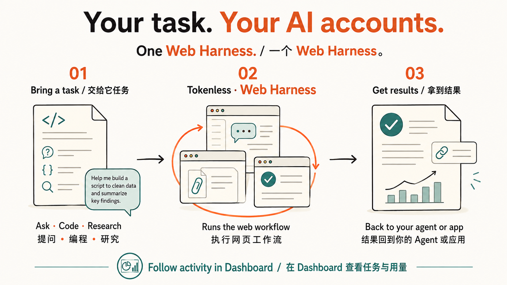

<p align="center">
  
</p>

<h1 align="center">Web Harness</h1>

<p align="center"><strong>Put your existing AI web accounts to work for your agents.</strong></p>

<p align="center">
  <a href="#start-in-three-commands">Quick start</a> · <a href="#what-is-a-web-harness">What is Web Harness?</a> · <a href="docs/capability-matrix.md">Capabilities</a> · <a href="README.md">English</a> · <a href="README.zh-CN.md">简体中文</a>
</p>

<p align="center">
  
</p>

<p align="center"><sub>Local Dashboard captured on 2026-09-06. Values are local job records and output-token estimates, not benchmarks or billing savings.</sub></p>

## From task to result



<sub>AI-generated use-case illustration. Available capabilities depend on the selected provider’s verified support.</sub>

## 13 providers. One local interface.

Five providers are supported today; eight more are experimental. Only verified workflows are advertised.

<table>
  <tr>
    <td align="center" width="20%"><br><strong>ChatGPT</strong><br><sub>Supported</sub></td>
    <td align="center" width="20%"><br><strong>Claude</strong><br><sub>Supported</sub></td>
    <td align="center" width="20%"><br><strong>Gemini</strong><br><sub>Supported</sub></td>
    <td align="center" width="20%"><br><strong>Grok</strong><br><sub>Supported</sub></td>
    <td align="center" width="20%"><br><strong>Qwen / 千问</strong><br><sub>Experimental</sub></td>
  </tr>
  <tr>
    <td align="center" width="20%"><br><strong>DeepSeek</strong><br><sub>Experimental</sub></td>
    <td align="center" width="20%"><br><strong>Perplexity</strong><br><sub>Experimental</sub></td>
    <td align="center" width="20%"><br><strong>Z.ai / GLM</strong><br><sub>Experimental</sub></td>
    <td align="center" width="20%"><br><strong>Doubao / 豆包</strong><br><sub>Experimental</sub></td>
    <td align="center" width="20%"><br><strong>Kimi</strong><br><sub>Experimental</sub></td>
  </tr>
  <tr>
    <td align="center" width="20%"><br><strong>Dola</strong><br><sub>Experimental</sub></td>
    <td align="center" width="20%"><br><strong>Arena</strong><br><sub>Supported</sub></td>
    <td align="center" width="20%"><br><strong>Meta AI</strong><br><sub>Experimental</sub></td>
  </tr>
</table>

See the [Capability Matrix](docs/capability-matrix.md) for the verified workflows behind each provider.

## Start in three commands

Requires Node.js 22.13+. Apple Silicon macOS is the current target; Windows x64 is prerelease.

```bash
npm install --global tokenless@latest
tokenless setup
tokenless run --provider chatgpt --prompt "Review this proposal."
```

Setup opens the local dashboard. Reopen it anytime with `tokenless dashboard`.

<details>
<summary>Browser preparation and updates</summary>

For native mode, use a current Chrome or Brave, enable remote debugging at `chrome://inspect/#remote-debugging` or `brave://inspect/#remote-debugging`, and approve the browser prompt. Setup also offers an [Anti-Detect option](COMMANDS.md#tokenless-setup).

Already installed? Run `tokenless upgrade --check`, then `tokenless upgrade`. See [Updates](docs/updates.md) for CLI and macOS app updates.

</details>

## What is a Web Harness?

We call **the layer that turns AI websites into an agent’s working environment** a **Web Harness**. Tokenless lets agents submit tasks through your existing web accounts, use supported website capabilities, and bring results back into your workflow.

| What you want to do | What Tokenless handles |
| --- | --- |
| Put web AI to work for your agent | Submit prompts, read responses, and continue supported conversations. |
| Work with your own material | Use attachments, citations, and controls verified for the selected provider. |
| Connect an app and follow progress | Run tasks through the CLI or local compatible APIs; view history and usage in Dashboard. |

Web workflows need no separate provider API keys; sign-in stays in your selected browser. Tokenless API provides provider access; Tokenless Harness manages agent tasks and tool continuation.

## Optional setup and integrations

<details>
<summary>Browser mode example: DeepSeek</summary>

Send `tokenless/deepseek` through the visible DeepSeek website using the local OpenAI-compatible interface, then return the response to the caller.

[Watch the 7-second demo](assets/tokenless-deepseek-browser-demo.mp4) · [Configure browser mode](docs/api-proxy-integration.md)

</details>

<details>
<summary>Local Spark X2.5-4B router engine</summary>

On Apple Silicon, the Dashboard can use the official Spark MLX server for the local Spark X2.5-4B model. Ollama is not required; the V1 integration uses the fixed OpenAI-compatible endpoint below.

```bash
git clone https://github.com/XHToken/Spark-MLX-LLM.git
cd Spark-MLX-LLM
python3 -m venv .venv
.venv/bin/python -m pip install -e '.[test]'
.venv/bin/spark-mlx-server --model XHToken/Spark-X2.5-4B --host 127.0.0.1 --port 8080 --allowed-origins http://127.0.0.1:7331
```

In Dashboard → System → Semantic routing, select `Spark X2.5-4B · local MLX` and save. The health endpoint is `http://127.0.0.1:8080/health`; chat completions use `http://127.0.0.1:8080/v1/chat/completions`.

</details>

<details>
<summary>Codex integration</summary>

Install the optional Codex integration:

```bash
tokenless setup --install-codex
```

Restart Codex, open `/hooks`, and trust Tokenless.

</details>

The experimental [Tokenless Harness Browser Extension](docs/harness-browser-extension.md) supports user-approved observation and text input on one selected Chrome tab.

## Go deeper

- [CLI commands](COMMANDS.md)
- [API Proxy Integration](docs/api-proxy-integration.md)
- [Harness Integrations](docs/harness-integrations.md)
- [Capability Matrix](docs/capability-matrix.md)
- [Privacy boundaries](PRIVACY.md)
- [Documentation index](docs/README.md)

Tokenless is in early access: it reduces agent-side token use, but does not eliminate token use or bypass provider account requirements.

<p align="center">
  <a href="https://www.npmjs.com/package/tokenless"></a>
  <a href="https://www.npmjs.com/package/tokenless"></a>
</p>
