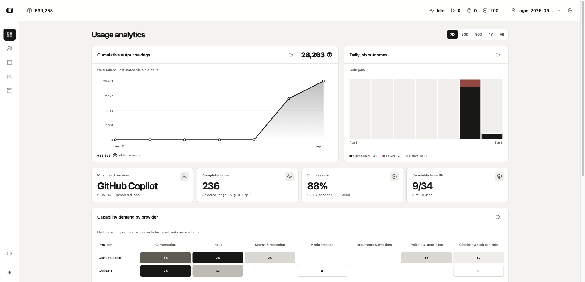
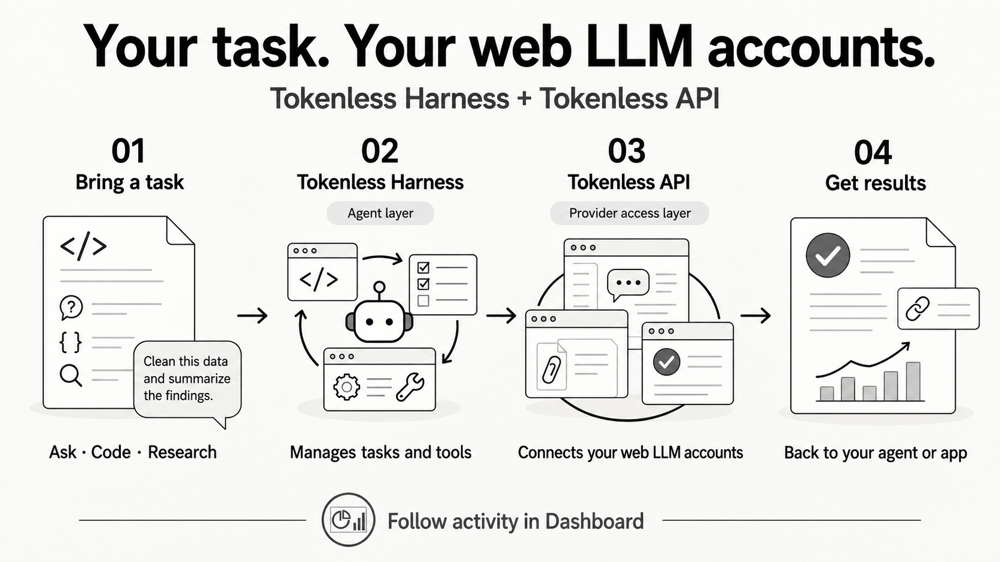
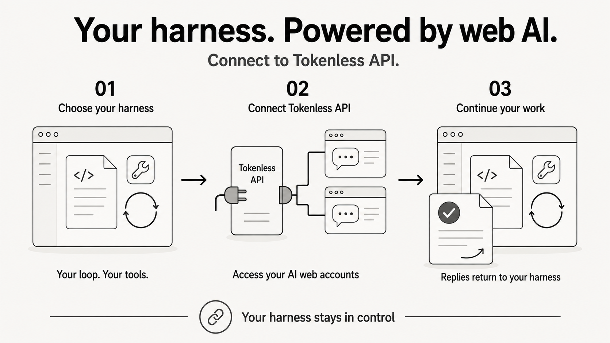
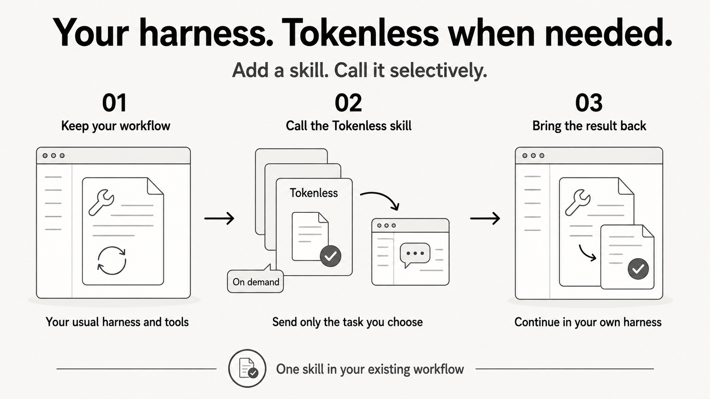

<p align="center">
  
</p>

<h1 align="center">Web Harness</h1>

<p align="center"><strong>Put your existing web LLM accounts to work for your agents.</strong></p>

<p align="center">
  <a href="#start-in-three-commands">Quick start</a> · <a href="#what-is-a-web-harness">What is Web Harness?</a> · <a href="#providers">Providers</a> · <a href="docs/capability-matrix.md">Capabilities</a>
</p>

<p align="center">
  <a href="README.md">English</a> · <a href="README.zh-CN.md">简体中文</a>
</p>

<p align="center">
  
</p>

<p align="center"><sub>Local Dashboard captured on 2026-09-06. Values are local job records and output-token estimates, not benchmarks or billing savings.</sub></p>

## Three ways to use Tokenless

### 1. Tokenless Harness + Tokenless API

Tokenless Harness manages tasks and tool calls; Tokenless API connects your web LLM accounts and returns model responses to the Harness.



### 2. Your own Harness + Tokenless API

Keep your Harness’s agent loop, tools, and sessions; connect its model interface to Tokenless API.



[API setup and compatibility limits](docs/api-proxy-integration.md) · [Harness integration](docs/harness-integrations.md)

### 3. Your own Harness + Tokenless skill

Add the Tokenless skill to your Harness; invoke it for selected tasks and bring the results back into your usual workflow.



`tokenless setup` installs the skill into supported local agent skill directories. [Setup](COMMANDS.md#tokenless-setup) · [Skill instructions](skills/tokenless/SKILL.md)

<sub>AI-generated use-case illustrations. Available capabilities depend on the selected provider’s verified support.</sub>

<a id="providers"></a>

## 40 store providers

18 in Browser mode, 35 in Direct API mode; 13 appear in both. [Inventory audit](docs/provider-capability-census.md#2026-09-12-provider-inventory-audit).

### Browser mode · 18 providers

Interact with provider websites in your signed-in browser.

<table>
  <tr>
    <td align="center" width="20%"><a href="https://chatgpt.com/"><br><strong>ChatGPT</strong></a><br><sub>Supported</sub></td>
    <td align="center" width="20%"><a href="https://claude.ai/new"><br><strong>Claude</strong></a><br><sub>Supported</sub></td>
    <td align="center" width="20%"><a href="https://gemini.google.com/app"><br><strong>Gemini</strong></a><br><sub>Supported</sub></td>
    <td align="center" width="20%"><a href="https://grok.com/"><br><strong>Grok</strong></a><br><sub>Supported</sub></td>
    <td align="center" width="20%"><a href="https://chat.qwen.ai/"><br><strong>Qwen / 千问</strong></a><br><sub>Experimental</sub></td>
  </tr>
  <tr>
    <td align="center" width="20%"><a href="https://chat.deepseek.com/"><br><strong>DeepSeek</strong></a><br><sub>Experimental</sub></td>
    <td align="center" width="20%"><a href="https://www.perplexity.ai/"><br><strong>Perplexity</strong></a><br><sub>Experimental</sub></td>
    <td align="center" width="20%"><a href="https://chat.z.ai/"><br><strong>Z.ai / GLM</strong></a><br><sub>Experimental</sub></td>
    <td align="center" width="20%"><a href="https://www.doubao.com/chat/"><br><strong>Doubao / 豆包</strong></a><br><sub>Experimental</sub></td>
    <td align="center" width="20%"><a href="https://www.kimi.ai/"><br><strong>Kimi</strong></a><br><sub>Experimental</sub></td>
  </tr>
  <tr>
    <td align="center" width="20%"><a href="https://www.dola.com/chat"><br><strong>Dola</strong></a><br><sub>Experimental</sub></td>
    <td align="center" width="20%"><a href="https://arena.ai/text/direct"><br><strong>Arena</strong></a><br><sub>Supported</sub></td>
    <td align="center" width="20%"><a href="https://meta.ai/"><br><strong>Meta AI</strong></a><br><sub>Experimental</sub></td>
    <td align="center" width="20%"><a href="https://copilot.microsoft.com/"><br><strong>Microsoft Copilot</strong></a><br><sub>Awaiting verification</sub></td>
    <td align="center" width="20%"><a href="https://github.com/copilot"><br><strong>GitHub Copilot</strong></a><br><sub>Experimental</sub></td>
  </tr>
  <tr>
    <td align="center" width="20%"><a href="https://lovable.dev/"><strong>Lovable</strong></a><br><sub>Awaiting verification</sub></td>
    <td align="center" width="20%"><a href="https://huggingface.co/chat/"><strong>HuggingChat</strong></a><br><sub>Awaiting verification</sub></td>
    <td align="center" width="20%"><a href="https://monica.im/home/chat"><br><strong>Monica</strong></a><br><sub>Experimental</sub></td>
  </tr>
</table>

### Direct API mode · 35 providers

Call provider endpoints through G4F; ChatGPT and Perplexity also have native backends. Some integrations are experimental; authentication and capabilities vary by provider.

| Provider | Provider | Provider | Provider |
| --- | --- | --- | --- |
| ChatGPT | Claude | Gemini | Grok |
| Qwen / 千问 | DeepSeek | Perplexity | Z.ai / GLM |
| Arena | Meta AI | Microsoft Copilot | GitHub Copilot |
| Black Forest Labs | Cerebras | Cloudflare AI | Cohere |
| DeepInfra | ElevenLabs | Groq | Hugging Face |
| MiniMax | NVIDIA | Ollama | OpenRouter |
| Opera Aria | Phind AI | Pi | Pollinations |
| Replicate | Sber GigaChat | Stability AI | Teach Anything |
| Together AI | WhiteRabbitNeo | YQCloud |  |

[Direct API mode setup and limits](docs/g4f-direct-provider-service.md) · [Verified provider capabilities](docs/capability-matrix.md)

## Start in three commands

Requires Node.js 22.13+. Apple Silicon macOS is the current target; Windows x64 is prerelease.

```bash
npm install --global tokenless@latest
tokenless setup
tokenless run --provider chatgpt --prompt "Review this proposal."
```

Setup opens the local dashboard. Reopen it anytime with `tokenless dashboard`.

<details>
<summary>Browser preparation and updates</summary>

Setup requires `uv` for the G4F runtime and synchronizes matching skills; upgrades sync them too. Use `tokenless skills sync --json` to refresh skills alone. The macOS menu app is a separate optional install and is not installed on Windows.

For native mode, use a current Chrome or Brave, enable remote debugging at `chrome://inspect/#remote-debugging` or `brave://inspect/#remote-debugging`, and approve the browser prompt. Setup also offers an [Anti-Detect option](COMMANDS.md#tokenless-setup).

Already installed? Run `tokenless upgrade --check`, then `tokenless upgrade`. See [Updates](docs/updates.md) for CLI and macOS app updates.

Developing on Windows? The [Windows tray app](apps/windows-menu/README.md) opens Dashboard on left-click and provides a native right-click menu.

</details>

## What is a Web Harness?

We call **the layer that turns web LLMs into an agent’s working environment** a **Web Harness**. Tokenless lets agents submit tasks through your existing web LLM accounts, use supported website capabilities, and bring results back into your workflow.

| What you want to do | What Tokenless handles |
| --- | --- |
| Put web LLMs to work for your agent | Submit prompts, read responses, and continue supported conversations. |
| Work with your own material | Use attachments, citations, and controls verified for the selected provider. |
| Connect an app and follow progress | Run tasks through the CLI or local compatible APIs; view history and usage in Dashboard. |

Web workflows need no separate provider API keys; sign-in stays in your selected browser. Tokenless API provides provider access; Tokenless Harness manages agent tasks and tool continuation.

## Optional setup and integrations

<details>
<summary>Browser mode example: DeepSeek</summary>

Send `tokenless/deepseek` through the visible DeepSeek website using the local OpenAI-compatible interface, then return the response to the caller.

[Watch the 7-second demo](assets/tokenless-deepseek-browser-demo.mp4) · [Configure browser mode](docs/api-proxy-integration.md)

</details>

<details>
<summary>Local Spark X2.5-4B router engine</summary>

On Apple Silicon, the Dashboard can use the official Spark MLX server for the local Spark X2.5-4B model. Ollama is not required; the V1 integration uses the fixed OpenAI-compatible endpoint below.

```bash
git clone https://github.com/XHToken/Spark-MLX-LLM.git
cd Spark-MLX-LLM
python3 -m venv .venv
.venv/bin/python -m pip install -e '.[test]'
.venv/bin/spark-mlx-server --model XHToken/Spark-X2.5-4B --host 127.0.0.1 --port 8080 --allowed-origins http://127.0.0.1:7331
```

In Dashboard → System → Semantic routing, select `Spark X2.5-4B · local MLX` and save. The health endpoint is `http://127.0.0.1:8080/health`; chat completions use `http://127.0.0.1:8080/v1/chat/completions`.

</details>

<details>
<summary>Codex integration</summary>

Install the optional Codex integration:

```bash
tokenless setup --install-codex
```

Restart Codex, open `/hooks`, and trust Tokenless.

</details>

The experimental [Tokenless Harness Browser Extension](docs/harness-browser-extension.md) supports user-approved observation and text input on one selected Chrome tab.

## Go deeper

- [CLI commands](COMMANDS.md)
- [API Proxy Integration](docs/api-proxy-integration.md)
- [Harness Integrations](docs/harness-integrations.md)
- [Capability Matrix](docs/capability-matrix.md)
- [Privacy boundaries](PRIVACY.md)
- [Documentation index](docs/README.md)

Tokenless is in early access: it reduces agent-side token use, but does not eliminate token use or bypass provider account requirements.

<p align="center">
  <a href="https://www.npmjs.com/package/tokenless"></a>
  <a href="https://www.npmjs.com/package/tokenless"></a>
</p>
