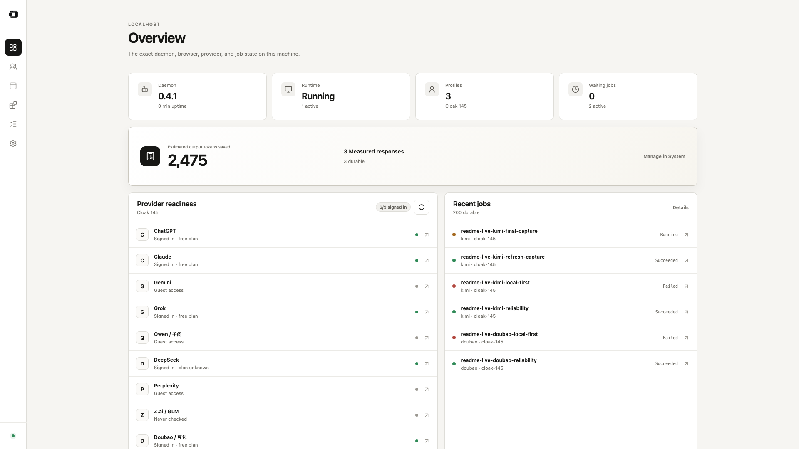

<p align="center">
  
</p>

<p align="center">
  <a href="https://www.npmjs.com/package/tokenless"></a>
  <a href="https://www.npmjs.com/package/tokenless"></a>
</p>

<p align="center">
  <a href="README.md">English</a> · <a href="README.zh-CN.md">简体中文</a>
</p>

<p align="center">
  <strong>Use the AI providers you already have—through the browser, without separate provider API keys.</strong><br>
  Tokenless gives agents one local interface for visible AI workflows while reducing agent-side token use.
</p>

<p align="center">
  <a href="#start-in-three-commands">Quick start</a> · <a href="COMMANDS.md">CLI</a> · <a href="docs/capability-matrix.md">Capabilities</a> · <a href="PRIVACY.md">Privacy</a>
</p>

<p align="center">
  
</p>

<p align="center"><sub>Captured from a real local browser session; token totals and job states are actual local dashboard data, not a benchmark.</sub></p>

## 13 providers. One local interface.

Five providers are supported today; eight more are experimental. Only verified workflows are advertised.

<table>
  <tr>
    <td align="center" width="20%"><br><strong>ChatGPT</strong><br><sub>Supported</sub></td>
    <td align="center" width="20%"><br><strong>Claude</strong><br><sub>Supported</sub></td>
    <td align="center" width="20%"><br><strong>Gemini</strong><br><sub>Supported</sub></td>
    <td align="center" width="20%"><br><strong>Grok</strong><br><sub>Supported</sub></td>
    <td align="center" width="20%"><br><strong>Qwen / 千问</strong><br><sub>Experimental</sub></td>
  </tr>
  <tr>
    <td align="center" width="20%"><br><strong>DeepSeek</strong><br><sub>Experimental</sub></td>
    <td align="center" width="20%"><br><strong>Perplexity</strong><br><sub>Experimental</sub></td>
    <td align="center" width="20%"><br><strong>Z.ai / GLM</strong><br><sub>Experimental</sub></td>
    <td align="center" width="20%"><br><strong>Doubao / 豆包</strong><br><sub>Experimental</sub></td>
    <td align="center" width="20%"><br><strong>Kimi</strong><br><sub>Experimental</sub></td>
  </tr>
  <tr>
    <td align="center" width="20%"><br><strong>Dola</strong><br><sub>Experimental</sub></td>
    <td align="center" width="20%"><br><strong>Arena</strong><br><sub>Supported</sub></td>
    <td align="center" width="20%"><br><strong>Meta AI</strong><br><sub>Experimental</sub></td>
  </tr>
</table>

See the [Capability Matrix](docs/capability-matrix.md) for the verified workflows behind each provider.

## Start in three commands

Requires Node.js 22.13+. Apple Silicon macOS is the current target; Windows x64 is prerelease. For native mode, use a current Chrome or Brave, enable remote debugging at `chrome://inspect/#remote-debugging` or `brave://inspect/#remote-debugging`, and approve the browser prompt. Setup also offers an [Anti-Detect option](COMMANDS.md#tokenless-setup).

```bash
npm install --global tokenless@latest
tokenless setup
tokenless run --provider chatgpt --prompt "Review this proposal."
```

Setup opens the local dashboard. Reopen it anytime with `tokenless dashboard`.

## What agents get

- Send prompts and read visible responses through real provider websites.
- Use uploads, citations, and provider controls where the selected provider supports them.
- Stable provider tabs and continuity for supported tasks.
- Provider sign-in stays in the selected browser profile; job history and token-savings estimates remain local.
- An optional [local API proxy](docs/api-proxy-integration.md) for OpenAI- and Anthropic-shaped clients.

## Optional Codex integration

Install the optional Codex integration:

```bash
tokenless setup --install-codex
```

Restart Codex, open `/hooks`, and trust Tokenless.

## Go deeper

- [CLI commands](COMMANDS.md)
- [API Proxy Integration](docs/api-proxy-integration.md)
- [Capability Matrix](docs/capability-matrix.md)
- [FeatureBench Evaluation](docs/featurebench-evaluation.md)
- [Privacy boundaries](PRIVACY.md)
- [Documentation index](docs/README.md)

Tokenless is in early access: it reduces agent-side token use, but does not eliminate token use or bypass provider account requirements.
