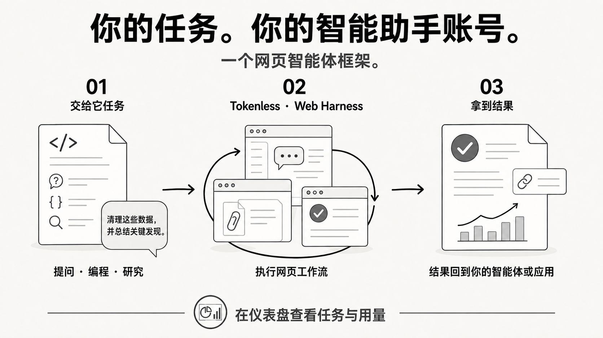
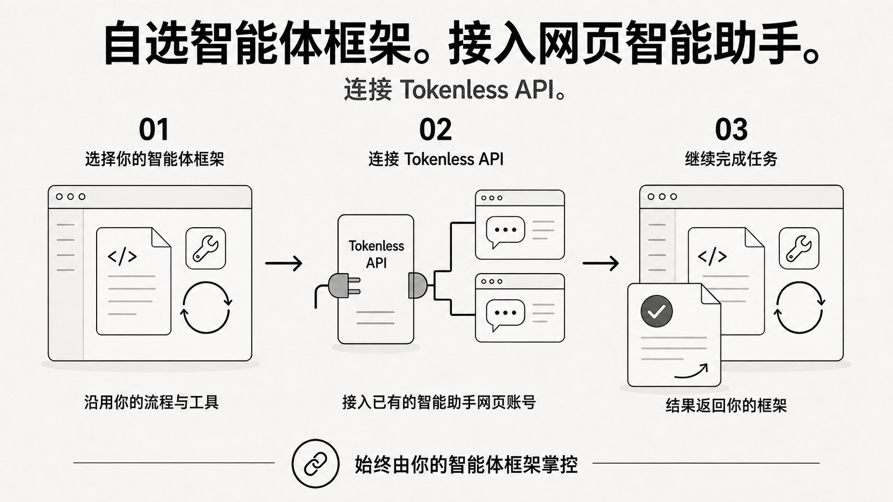
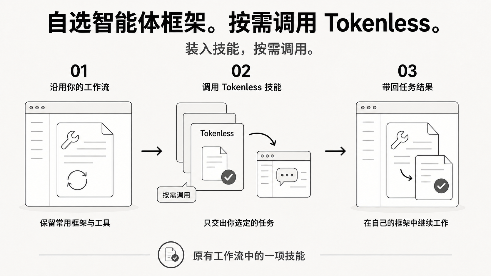

<p align="center">
  
</p>

<h1 align="center">Web Harness</h1>

<p align="center"><strong>让你已有的网页大模型账号，为 Agent 完成任务。</strong></p>

<p align="center">
  <a href="#三条命令开始使用">快速开始</a> · <a href="#什么是-web-harness">什么是 Web Harness</a> · <a href="#providers">Providers</a> · <a href="docs/capability-matrix.zh-CN.md">支持的能力</a>
</p>

<p align="center">
  <a href="README.md">English</a> · <a href="README.zh-CN.md">简体中文</a>
</p>

<p align="center">
  
</p>

<p align="center"><sub>2026-09-06 本地 Dashboard 实拍。数值是本机任务记录与输出 token 估算，不是 benchmark 或账单节省。</sub></p>

## 三种使用方式

### 1. Tokenless Harness + Tokenless API

Tokenless Harness 管理任务与工具调用；Tokenless API 接入你的网页大模型账号，将模型回复交回 Harness。



### 2. 自选 Harness + Tokenless API

保留自己的 Harness、工具和会话，把模型接口接到 Tokenless API；任务流程仍由你的 Harness 管理。



[API 接入与兼容范围](docs/api-proxy-integration.zh-CN.md) · [Harness 集成](docs/harness-integrations.zh-CN.md)

### 3. 自选 Harness + Tokenless Skill

把 Tokenless Skill 装入自己的 Harness，只在需要时调用，交出选定任务，再带回结果继续原有工作流。



`tokenless setup` 会将 Skill 安装到受支持的本地 Agent 技能目录。[安装说明](COMMANDS.zh-CN.md#tokenless-setup) · [Skill 使用指引](skills/tokenless/SKILL.md)

<sub>AI 生成的用途示意图；具体能力以所选 provider 的已验证支持为准。</sub>

<a id="providers"></a>

## 43 个 store providers

Browser mode：15 个；Direct API mode：40 个，其中 12 个两种模式均有。

### Browser mode · 15 个 providers

在已登录的浏览器中操作 provider 网页。

<table>
  <tr>
    <td align="center" width="20%"><a href="https://chatgpt.com/"><br><strong>ChatGPT</strong></a><br><sub>已支持</sub></td>
    <td align="center" width="20%"><a href="https://claude.ai/new"><br><strong>Claude</strong></a><br><sub>已支持</sub></td>
    <td align="center" width="20%"><a href="https://gemini.google.com/app"><br><strong>Gemini</strong></a><br><sub>已支持</sub></td>
    <td align="center" width="20%"><a href="https://grok.com/"><br><strong>Grok</strong></a><br><sub>已支持</sub></td>
    <td align="center" width="20%"><a href="https://chat.qwen.ai/"><br><strong>Qwen / 千问</strong></a><br><sub>实验性</sub></td>
  </tr>
  <tr>
    <td align="center" width="20%"><a href="https://chat.deepseek.com/"><br><strong>DeepSeek</strong></a><br><sub>实验性</sub></td>
    <td align="center" width="20%"><a href="https://www.perplexity.ai/"><br><strong>Perplexity</strong></a><br><sub>实验性</sub></td>
    <td align="center" width="20%"><a href="https://chat.z.ai/"><br><strong>Z.ai / GLM</strong></a><br><sub>实验性</sub></td>
    <td align="center" width="20%"><a href="https://www.doubao.com/chat/"><br><strong>Doubao / 豆包</strong></a><br><sub>实验性</sub></td>
    <td align="center" width="20%"><a href="https://www.kimi.ai/"><br><strong>Kimi</strong></a><br><sub>实验性</sub></td>
  </tr>
  <tr>
    <td align="center" width="20%"><a href="https://www.dola.com/chat"><br><strong>Dola</strong></a><br><sub>实验性</sub></td>
    <td align="center" width="20%"><a href="https://arena.ai/text/direct"><br><strong>Arena</strong></a><br><sub>已支持</sub></td>
    <td align="center" width="20%"><a href="https://meta.ai/"><br><strong>Meta AI</strong></a><br><sub>实验性</sub></td>
    <td align="center" width="20%"><a href="https://copilot.microsoft.com/"><br><strong>Microsoft Copilot</strong></a><br><sub>待验证</sub></td>
    <td align="center" width="20%"><a href="https://github.com/copilot"><br><strong>GitHub Copilot</strong></a><br><sub>实验性</sub></td>
  </tr>
</table>

### Direct API mode · 40 个 providers

直接请求 provider 接口，通过 G4F 接入；ChatGPT 和 Perplexity 另有原生后端。部分接入仍为实验性，认证与能力要求因 provider 而异。

| Provider | Provider | Provider | Provider |
| --- | --- | --- | --- |
| ChatGPT | Claude | Gemini | Grok |
| Qwen / 千问 | DeepSeek | Perplexity | Z.ai / GLM |
| Arena | Meta AI | Microsoft Copilot | GitHub Copilot |
| Black Forest Labs | Blackbox AI | Cerebras | Cloudflare AI |
| Cohere | DeepInfra | ElevenLabs | Fenay AI |
| GLHF | Groq | Hugging Face | MiniMax |
| NVIDIA | Ollama | OpenRouter | Opera Aria |
| Phind AI | Pi | Pollinations | Puter |
| Replicate | Sber GigaChat | Stability AI | Teach Anything |
| TheB.AI | Together AI | WhiteRabbitNeo | YQCloud |

[Direct API mode 接入与限制](docs/g4f-direct-provider-service.zh-CN.md) · [各 provider 已验证的能力](docs/capability-matrix.zh-CN.md)

## 三条命令开始使用

需要 Node.js 22.13+；当前目标平台为 Apple Silicon macOS，Windows x64 处于 prerelease 阶段。

```bash
npm install --global tokenless@latest
tokenless setup
tokenless run --provider chatgpt --prompt "Review this proposal."
```

Setup 会自动打开本地 Dashboard，之后可随时用 `tokenless dashboard` 再次打开。

<details>
<summary>浏览器准备与更新</summary>

Setup 需要 `uv` 来准备 G4F runtime，并会自动同步配套 skills；升级也会同步。仅刷新 skills 可运行 `tokenless skills sync --json`。Windows 不安装 macOS 菜单栏 App，macOS 的菜单栏 App 为独立可选安装。

Native mode 使用当前版本的 Chrome 或 Brave；在 `chrome://inspect/#remote-debugging` 或 `brave://inspect/#remote-debugging` 启用 remote debugging，并确认浏览器提示。Setup 也提供 [Anti-Detect 选项](COMMANDS.zh-CN.md#tokenless-setup)。

已经安装？先运行 `tokenless upgrade --check`，再运行 `tokenless upgrade`。CLI 与 macOS App 更新说明见[更新指南](docs/updates.zh-CN.md)。

在 Windows 上开发？[Windows 托盘应用](apps/windows-menu/README.zh-CN.md) 支持左键打开 Dashboard、右键使用原生菜单。

</details>

## 什么是 Web Harness？

我们把**将网页大模型变成 Agent 工作环境的这一层**称为 **Web Harness**。Tokenless 让 Agent 通过你已有的网页大模型账号提交任务、使用已支持的网页能力，并把结果带回当前工作流。

| 你想做什么 | Tokenless 为你完成什么 |
| --- | --- |
| 让 Agent 使用网页大模型 | 提交 prompt、读取回复，并延续受支持的对话。 |
| 带着材料完成任务 | 使用所选 provider 已支持的附件、引用和控制选项。 |
| 接入应用并查看进度 | 通过 CLI 或本地兼容 API 发起任务，在 Dashboard 查看记录与用量。 |

网页工作流无需单独的 provider API Key；登录保留在所选浏览器中。Tokenless API 提供 provider 接入，Tokenless Harness 管理 Agent 任务与工具续轮。

## 可选配置与集成

<details>
<summary>Browser mode 示例：DeepSeek</summary>

通过本地 OpenAI 兼容接口，把 `tokenless/deepseek` 请求送进可见的 DeepSeek 网页，再将回复返回调用方。

[观看 7 秒演示](assets/tokenless-deepseek-browser-demo.mp4) · [配置 browser mode](docs/api-proxy-integration.zh-CN.md)

</details>

<details>
<summary>本地 Spark X2.5-4B Router Engine</summary>

在 Apple Silicon 上，Dashboard 可以使用官方 Spark MLX server 运行本地 Spark X2.5-4B 模型；不需要 Ollama。V1 使用下面固定的 OpenAI 兼容 endpoint。

```bash
git clone https://github.com/XHToken/Spark-MLX-LLM.git
cd Spark-MLX-LLM
python3 -m venv .venv
.venv/bin/python -m pip install -e '.[test]'
.venv/bin/spark-mlx-server --model XHToken/Spark-X2.5-4B --host 127.0.0.1 --port 8080 --allowed-origins http://127.0.0.1:7331
```

在 Dashboard → System → Semantic routing 中选择 `Spark X2.5-4B · 本地 MLX` 并保存。Health endpoint 是 `http://127.0.0.1:8080/health`；chat completion 使用 `http://127.0.0.1:8080/v1/chat/completions`。

</details>

<details>
<summary>Codex 集成</summary>

安装可选的 Codex integration：

```bash
tokenless setup --install-codex
```

重启 Codex，打开 `/hooks`，然后信任 Tokenless。

</details>

实验性 [Tokenless Harness Browser Extension](docs/harness-browser-extension.zh-CN.md) 支持在用户批准后观察一个选定的 Chrome tab，并填写文本字段。

## 深入了解

- [CLI 命令](COMMANDS.zh-CN.md)
- [API Proxy 接入指南](docs/api-proxy-integration.zh-CN.md)
- [Harness 集成](docs/harness-integrations.zh-CN.md)
- [Capability Matrix](docs/capability-matrix.zh-CN.md)
- [隐私边界](PRIVACY.zh-CN.md)
- [文档索引](docs/README.zh-CN.md)

Tokenless 仍处于内测阶段：它会减少 Agent 侧 token 消耗，但不会完全消除 token 消耗，也不会绕过 provider 的账号要求。

<p align="center">
  <a href="https://www.npmjs.com/package/tokenless"></a>
  <a href="https://www.npmjs.com/package/tokenless"></a>
</p>
