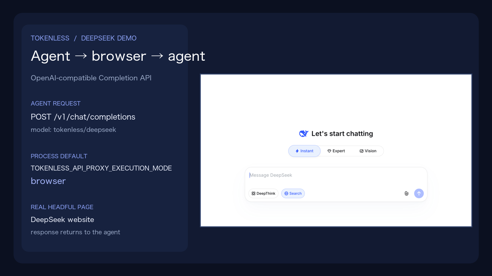

<p align="center">
  
</p>

<p align="center">
  <a href="https://www.npmjs.com/package/tokenless"></a>
  <a href="https://www.npmjs.com/package/tokenless"></a>
</p>

<p align="center">
  <a href="README.md">English</a> · <a href="README.zh-CN.md">简体中文</a>
</p>

<p align="center">
  <strong>通过浏览器使用你已有的 AI provider，无需单独购买 provider API Key。</strong><br>
  Tokenless 为 Agent 提供统一的本地可见 AI 工作流接口，同时减少 Agent 侧 token 消耗。
</p>

<p align="center">
  <a href="#三条命令开始使用">快速开始</a> · <a href="COMMANDS.zh-CN.md">CLI</a> · <a href="docs/capability-matrix.zh-CN.md">Capabilities</a> · <a href="PRIVACY.zh-CN.md">隐私</a>
</p>

<p align="center">
  
</p>

<p align="center"><sub>右侧是真实本地运行中的 DeepSeek headful 浏览器 UI；整张流程卡是说明图，不是 benchmark。</sub></p>

## Agent → browser → agent

本地 OpenAI 兼容的 `POST /v1/chat/completions` 路由可以把 `tokenless/deepseek` 请求送进可见的 DeepSeek 网站。如果 harness 不知道如何声明 mode，只需设置一次进程默认值：

```bash
TOKENLESS_API_PROXY_EXECUTION_MODE=browser tokenless dashboard --no-open --json
```

请求可以省略 `tokenless.execution_mode`：`Agent 请求 → Tokenless daemon → headful DeepSeek 页面 → response 返回 Agent`。显式请求 mode 仍然优先。[观看 7 秒 browser-mode demo](assets/tokenless-deepseek-browser-demo.mp4)。

## 13 家 provider，一个本地接口

目前有 5 家 provider 受支持，另外 8 家处于实验阶段；只展示经过验证的工作流。

<table>
  <tr>
    <td align="center" width="20%"><br><strong>ChatGPT</strong><br><sub>已支持</sub></td>
    <td align="center" width="20%"><br><strong>Claude</strong><br><sub>已支持</sub></td>
    <td align="center" width="20%"><br><strong>Gemini</strong><br><sub>已支持</sub></td>
    <td align="center" width="20%"><br><strong>Grok</strong><br><sub>已支持</sub></td>
    <td align="center" width="20%"><br><strong>Qwen / 千问</strong><br><sub>实验性</sub></td>
  </tr>
  <tr>
    <td align="center" width="20%"><br><strong>DeepSeek</strong><br><sub>实验性</sub></td>
    <td align="center" width="20%"><br><strong>Perplexity</strong><br><sub>实验性</sub></td>
    <td align="center" width="20%"><br><strong>Z.ai / GLM</strong><br><sub>实验性</sub></td>
    <td align="center" width="20%"><br><strong>Doubao / 豆包</strong><br><sub>实验性</sub></td>
    <td align="center" width="20%"><br><strong>Kimi</strong><br><sub>实验性</sub></td>
  </tr>
  <tr>
    <td align="center" width="20%"><br><strong>Dola</strong><br><sub>实验性</sub></td>
    <td align="center" width="20%"><br><strong>Arena</strong><br><sub>已支持</sub></td>
    <td align="center" width="20%"><br><strong>Meta AI</strong><br><sub>实验性</sub></td>
  </tr>
</table>

每家 provider 已验证的工作流见 [Capability Matrix](docs/capability-matrix.zh-CN.md)。

## 三条命令开始使用

需要 Node.js 22.13+。当前目标平台是 Apple Silicon macOS，Windows x64 仍处于 prerelease 阶段。Native mode 使用当前版本的 Chrome 或 Brave；请在 `chrome://inspect/#remote-debugging` 或 `brave://inspect/#remote-debugging` 启用 remote debugging，并确认浏览器提示。Setup 也提供 [Anti-Detect 选项](COMMANDS.zh-CN.md#tokenless-setup)。

```bash
npm install --global tokenless@latest
tokenless setup
tokenless run --provider chatgpt --prompt "Review this proposal."
```

Setup 会自动打开本地控制台，之后可随时用 `tokenless dashboard` 再次打开。

## Agent 可以获得什么

- 通过真实 provider 网站发送 prompt，并读取可见 response。
- 使用本地 OpenAI 与 Anthropic 兼容 API proxy，包括 Chat Completions 与 Responses 路由。
- 在所选 provider 支持时使用 upload、citation 和 provider control。
- 保留稳定的 provider tab，并为受支持的任务维持连续性。
- Provider 登录保留在所选 browser profile 中；job history 与 token 节省估算留在本机。
- 为 OpenAI 与 Anthropic 形态的 client 提供可选的 [本地 API proxy](docs/api-proxy-integration.zh-CN.md)。

## 可选的 Codex 集成

安装可选的 Codex integration：

```bash
tokenless setup --install-codex
```

重启 Codex，打开 `/hooks`，然后信任 Tokenless。

## 深入了解

- [CLI 命令](COMMANDS.zh-CN.md)
- [API Proxy 接入指南](docs/api-proxy-integration.zh-CN.md)
- [Capability Matrix](docs/capability-matrix.zh-CN.md)
- [FeatureBench 评测](docs/featurebench-evaluation.zh-CN.md)
- [隐私边界](PRIVACY.zh-CN.md)
- [文档索引](docs/README.zh-CN.md)

Tokenless 仍处于内测阶段：它会减少 Agent 侧 token 消耗，但不会完全消除 token 消耗，也不会绕过 provider 的账号要求。
