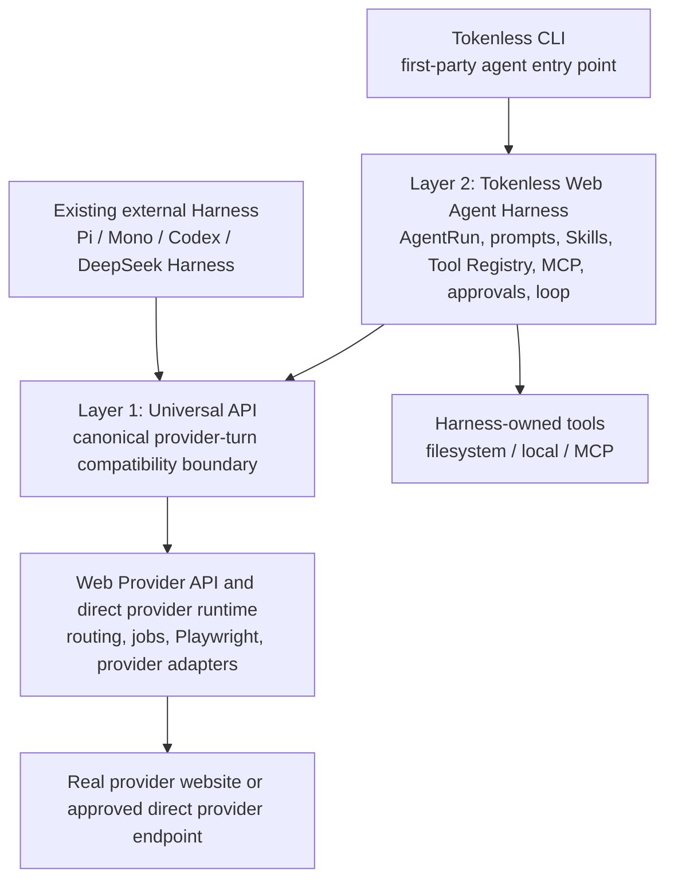

# Tokenless Architecture

This document defines the stable product architecture. It is not a roadmap and does not define delivery order. Roadmaps may describe how a capability is delivered, but they must preserve the ownership and dependency boundaries defined here.

Tokenless exposes visible AI websites through a provider-neutral local CLI, a first-party Web Agent Harness, a Universal API, and a browser-based local control plane. Managed Playwright through the authenticated local daemon remains the primary visible-provider execution path; approved direct provider strategies remain behind the provider runtime boundary.

## Final shape

Tokenless has two product layers above the real provider runtime:



The two layers may use the same provider strategy and low-level protocol primitives, but they are different product surfaces with different tool ownership.

## Layer 1: Universal API

The Universal API is the low-level, provider-facing compatibility boundary. It turns supported visible or direct provider strategies into a stable API that existing external Harnesses can consume.

It owns:

- OpenAI-compatible Chat Completions and Responses request/response contracts;
- canonical provider-turn history, tool-call/result validation, structured output, streaming, and errors;
- provider routing and the provider-turn lifecycle behind the API boundary; and
- low-level correlation, dispatch certainty, attachment identity, and opaque continuation references.

An external Harness sends its temporary tool catalog and conversation history to the Universal API. The API validates the catalog and returns a tool call or final result; it does not resolve, authorize, or execute the external Harness's tools.

The Universal API does not own:

- Tokenless agent-run state, prompt or Skill compilation, or Harness mission queues;
- filesystem roots, local tools, MCP sessions, approvals, or tool execution;
- a second scheduler, general conversation database, or first-party agent loop; or
- the authorization policy of an external caller.

This makes the API directly deployable to an existing Harness. Pi, Mono, Codex, DeepSeek Harness, or another compatible caller can own its tools and call the API without loading the Tokenless Web Agent Harness.

## Layer 2: Web Agent Harness

The Web Agent Harness is Tokenless's first-party agent runtime in `packages/web-agent-harness/`. It is the path used by Tokenless CLI agent runs and Tokenless-owned agent integrations.

It owns:

- `AgentRun` identity, lifecycle, checkpoints, recovery, scaling, and final output;
- system prompts, prompt management, Skills, tool discovery, and the internal Tool Registry;
- filesystem and local tools, MCP clients/servers, authorization, approvals, timeout, cancellation, and user intervention;
- bounded `action_batch` loops, tool-result aggregation, continuation, and failure handling; and
- the provider-turn client that consumes the Universal API without importing provider adapters or Playwright internals.

Harness-owned tools are not external caller tools. The Harness may project its own authorized tools into a provider turn and execute the resulting actions under its own policy. That is a Layer 2 responsibility and must not be moved into the Universal API.

## Access paths and tool ownership

| Caller | Agent owner | Provider path | Tool executor |
| --- | --- | --- | --- |
| Pi, Mono, Codex, DeepSeek Harness, or another external Harness | External Harness | Universal API → Web Provider API / direct provider runtime | External Harness |
| Tokenless CLI agent run | Tokenless Web Agent Harness | Provider-turn client → Universal API → Web Provider API / direct provider runtime | Tokenless Web Agent Harness |
| Provider inspection or administration command | Tokenless CLI/control adapter | Daemon → managed provider runtime | The provider/control adapter, within its command boundary |

```text
External Harness -> Universal API
  API validates caller-owned tools
  API returns tool_call
  External Harness executes the tool
  External Harness sends tool result in the next API request

Tokenless CLI -> Web Agent Harness -> Universal API
  Harness projects its internal Tool Registry into the provider turn
  Harness validates the model action_batch
  Harness authorizes and executes filesystem / local / MCP calls
  Harness sends one bounded aggregate result into the next provider turn
```

Universal API non-execution of external caller tools therefore does not prohibit the first-party Harness from executing its own tools. It prohibits only moving Harness authority into the low-level API or silently treating an external caller's tool catalog as Tokenless authority.

## Shared and separate contracts

The layers may share only low-level, provider-neutral primitives:

- canonical message and tool-call/result blocks;
- JSON Schema validation and bounded JSON values;
- strict framing, correlation, nonce, and opaque provider-turn references;
- attachment identity, dispatch certainty, lifecycle, and stable error shapes; and
- provider capability and turn-state contracts.

Their high-level contracts remain separate:

- Universal API: OpenAI-compatible `tools`, `tool_calls`, `role: tool`, Responses items, `tool_choice`, and structured output;
- Web Agent Harness: `AgentRun`, Skills, `action_batch`, `needs`, approval decisions, MCP outcomes, interventions, and final-output policy.

The API adapter must not call the Harness mission queue, Tool Registry, or MCP runtime. The Harness must not import provider adapters, Playwright, daemon storage, profile management, or CLI implementation modules.

## Runtime components

1. The `tokenless` CLI handles setup, profile management, agent-run submission, state, cancellation, and diagnostics.
2. The Web Agent Harness owns Tokenless's first-party agent-run coordination and provider-turn calls.
3. The local TypeScript daemon stores durable jobs in SQLite and exposes an authenticated loopback control plane.
4. The Playwright worker claims managed-web jobs, connects over CDP to independently launched resident Chromium processes, and uses Playwright browser, page, and locator APIs inside persistent managed profiles.
5. The provider navigation catalog centrally declares each entry URL, automation home, owned origins, known page patterns, and trusted sign-in routes; the provider registry adds access, account-plan, selector, and capability policy.
6. The provider-session state machine turns visible page observations and catalog policy into ready, guest-continuation, handoff, wait, or terminal decisions.
7. Provider adapters translate shared actions into visible provider page operations after the session decision allows them.
8. Shared application services expose redacted config, profile, provider, capability, job, runtime, and diagnostic operations to the local control plane.
9. The bundled TypeScript SPA is served from `/ui/`; its authenticated `/ui-api/v1` surface never exposes the daemon control bearer token to browser JavaScript.

## Provider runtime execution path

The stable agent path is `Tokenless CLI → Web Agent Harness → provider-turn client → Universal API → provider runtime`. Provider inspection, setup, and administration commands may use their direct CLI/control adapter path because they are not agent runs.

| Interface | Execution path | Authentication | Status |
| --- | --- | --- | --- |
| CLI agent run | CLI → Web Agent Harness → provider-turn client → Universal API → daemon/Playwright worker → managed profile → visible provider page | Provider sign-in stored inside the managed profile | First-party agent interface |
| Provider/control command | CLI → daemon → Playwright worker → managed profile → visible provider page | Provider sign-in stored inside the managed profile | Control interface |
| Local dashboard | Browser → `/ui-api/v1` → shared services/daemon → managed profile → visible provider page | Direct loopback opening plus a short-lived UI session; provider sign-in remains inside the managed profile | Local administration interface |
| Machine API | Trusted local caller → bearer API → daemon → Playwright worker | Daemon bearer token plus provider sign-in inside the managed profile | Local scripting interface |

## Managed Playwright flow

```text
request
  → derive the complete task capability set
  → rank compatible providers by live eligibility, evidence maturity, and configured preference
  → validate target, actions, context envelope, files, and limits
  → create an authenticated daemon job
  → Playwright worker claims the job for that profile
  → recheck visible session and task-capability eligibility before mutation
  → provider adapter operates visible page controls
  → verify visible postconditions
  → atomically requeue the same job on the next ranked provider only for a classified safe pre-submit failure
  → complete the daemon job
  → return normalized result and citations
```

Jobs use explicit provider and profile identity. Unsupported controls, ambiguous pages, unexpected navigation, authentication blockers, and selector drift fail closed.

The job contract derives requirements again from visible actions, attachment media types, and native workspace intent. A caller cannot under-declare `file.upload`, media input, chat, or native workspace requirements to manufacture an unsafe fallback route. Every alternative carries the identical implication-complete requirement set. Provider-specific conversation and Project URLs, provider controls, exact continuation, non-reconstructable mutations, and post-submission state suppress automatic fallback with a structured reason.

Before opening a provider page, each attempt also projects known profile-scoped provider capacity from the checked-in official-source catalog and durable submission history. A known exhausted window consumes the next full-capability route when one exists; otherwise the same job is durably deferred until its calculated eligibility time. Unknown or non-numeric limits remain explicit uncertainty and never become invented quotas.

Each routed job carries `tokenless.context-envelope.v1`. It records the task identity, normalized requirements, role-bearing instructions, attachment provenance, output and constraint contracts, upstream agent state, and hashes of the prompt actions that actually deliver the context. Provider changes replay the same validated envelope and action payloads from the start.

## Setup and profiles

`tokenless setup` is the interactive onboarding flow. It crosses the `BrowserRuntimeManager` seam to discover, install when authorized, and verify one exact runtime. It then selects or creates a clean runtime-compatible profile, collects that profile's provider membership, commits the preference, aligns the global skills and daemon with the installed CLI, and checks only the selected providers. Tokenless never copies an existing Chrome, Brave, or Cloak profile or its authentication state; users sign in through the visible clean managed profile and the browser preserves that managed session across jobs.

`tokenless setup --fresh` is the clean-profile path. Add `--json` for non-interactive setup. Ordinary daemon startup uses the Tokenless Daemon API v1 readiness contract, and stale same-home daemons are replaced only after proof-verified coordination. Foreign, different-home, and unverified listeners remain untouched.

Browser selection is system-first. `auto` uses an installed supported browser and lazily installs catalog-pinned Chrome for Testing only when none exists. `managed-chromium` forces that cache-managed runtime; `cloak` explicitly opts into the platform-specific Cloak release. Managed downloads happen only during setup or install and are never performed by npm postinstall, daemon startup, or a job.

Each managed profile stores a runtime binding containing the exact runtime identity, family, browser ID, and creation version. The daemon resolves from this binding and always passes the resulting executable path to Playwright. Existing unbound profiles can migrate only to a compatible system/test runtime; a family change provisions a clean profile.

Managed profiles live under the Tokenless home and use unique directories. Jobs reuse them but never import, reset, clear, or replace them automatically. New profiles always start clean; deletion requires an explicit command and confirmation.

Authentication status is a single visible observation, not an enforced login workflow. A provider-specific account control is authenticated evidence; a visible login surface is unauthenticated evidence. A page that has not stabilized may be reported honestly as `unknown`. Setup does not retry after login or open a handoff.

Successful account observations retain only the visible account display name, subscription evidence, and the normalized tier class. Plan labels remain diagnostic: they never authorize a capability.

## Provider architecture and session state machine

`packages/cli/src/providers/registry.ts` is the single production registration point for providers. Each entry is a concrete `BaseProvider` subclass with one provider-owned definition. Shared CLI, daemon, setup, profile, and Playwright code resolves providers through that registry instead of maintaining provider allowlists or branching on concrete provider IDs.

`BaseProvider` owns the public execution template and the invariant ordering for navigation validation, authentication, blocker checks, prompt operations, response observation, and normalized failures. Its protected TypeScript hooks provide the shared DOM implementation and use normal dynamic dispatch, so a provider subclass overrides only behavior that differs.

Optional behavior is composed through typed structural capability slots. File upload, model and effort selection, workspace handling, diagnostics, conversation continuation, and image generation can be replaced independently without widening the mandatory base-class contract. Provider-specific extensions can register their own typed capability and actions without promoting a provider-only concept into the shared slots.

Adding a provider therefore normally requires:

1. one provider definition backed by real visible-session evidence;
2. one `BaseProvider` subclass, with protected hook overrides only for genuine differences;
3. typed optional capability overrides only when the provider differs from the shared defaults; and
4. one registry entry.

Observation, account classification, decisions, and resolution live under `packages/cli/src/playwright/provider-session/`. The runner consumes normalized decisions; provider-owned code remains the only place for provider-specific visible-page behavior.

The provider-session machine is intentionally separate from the daemon job state machine:

- The provider-session machine handles one page observation cycle: `wait`, `continue_guest`, `ready(guest|account|unknown)`, `handoff`, or `terminal`.
- The daemon state machine owns durable execution: `queued`, `claimed`, `running`, `waiting_for_user`, `succeeded`, `failed`, `canceled`, and `timed_out`.
- A provider `handoff` becomes the daemon's durable `waiting_for_user` state. It does not create a replacement job.
- A plan, quota, rate-limit, maintenance, region, capability-UI, navigation, or surface-readiness failure remains structurally classified and is not collapsed into authentication. A safe pre-submit provider-scoped failure may consume the next capability-compatible fallback route; ambiguous external state and post-submission failures never do.

## Local control plane

The daemon binds to loopback, stores its bearer token beside its SQLite database, and protects job and control endpoints with that token. The daemon home and token use restrictive filesystem permissions on supported systems. User configuration stores a preferred loopback origin. The daemon may scan upward from that port when it is occupied, while a single SQLite runtime-state row records the current actual origin, startup generation, and owner.

The bearer-protected machine endpoints remain an internal runtime control plane. Browser administration uses a separate `/ui-api/v1` surface documented in `api/tokenless-ui-api.openapi.json`. Opening the daemon's loopback root redirects to `/ui/` and establishes a short-lived `HttpOnly`, `SameSite=Strict` session cookie; UI mutations require the exact daemon Origin and a per-session CSRF header. Sessions live only in daemon memory and are invalidated on restart.

All UI routes enforce the daemon's exact loopback `Host`, a restrictive same-origin CSP, `frame-ancestors 'none'`, `nosniff`, and `Referrer-Policy: no-referrer`. Static assets are bundled in the same npm package and load no remote JavaScript, fonts, analytics, or CDN resources. Purpose-built responses redact control tokens, claims, checkpoints, browser storage, raw DOM, legacy source paths, and private file paths.

The dashboard's reserved page key is `tokenless:control-plane:<daemon-home-id>`. It has a separate registry from provider page leases, cannot be selected by provider `pagePolicy: replace`, and is recreated if the user closes it. Closing the tab does not stop the daemon or managed context.

Job creation, claim, lease renewal, completion, cancellation, state queries, and agent replay are daemon-backed. Claims are correlated to one worker and expire safely. CLI cancellation is reported as complete only after the authenticated control endpoint confirms `canceled`.

Jobs may be addressed to an explicit `agent_kind` and `agent_session_id`. SQLite assigns a monotonic outcome revision whenever an externally visible waiting or terminal outcome changes. Full job state remains durable and repeatably queryable. State output omits capability tokens and does not expose raw authentication data.

## Browser boundary

- Each active managed profile owns one browser instance backed by that profile's persistent user-data directory. Providers and conversations use independently keyed tabs inside their profile's browser.
- Tokenless independently launches the exact Chromium executable resolved from the profile's runtime binding with a persistent non-default user-data directory and a profile-scoped loopback DevTools endpoint. The worker attaches with Playwright `connectOverCDP`.
- Automation uses approved provider origins, visible page controls, and visible postconditions.
- Provider credentials and browser sign-in data stay opaque inside the managed profile; only visible account display and subscription labels cross the boundary.
- Sign-in, CAPTCHA, account limits, payment, consent, and confirmation remain user actions.
- Every provider adapter has an explicit action and capability contract. Unverified behavior is unavailable rather than guessed.
- Navigation and target URLs are canonicalized and checked before and after actions.
- The control-plane page is separately reserved and can never be acquired, navigated, or replaced by a provider job.

## Capability and Workspace strategy

The public capability vocabulary, provider mapping rules, evidence ladder, and extension process are defined in the [Capability Matrix](capability-matrix.md). Capability inspection reports `available`, `unavailable`, or `unknown` with visible proof, native resource information, fallback information, and experimental stability for every enabled provider.

Subscription labels are diagnostic evidence, not authorization. Runtime decisions prefer an enabled visible control, then an explicit disabled, upgrade, or plan-limit state, and otherwise report `unknown`. Missing selectors never prove that a subscription lacks a capability.

Native Project creation and reuse are capability-gated runtime behavior. The implementation can use exact visible names, report `created` or `reused`, and persist provider resource identity, but native workspace routing remains gated on complete real-provider evidence.

Conversation fallback is scoped to one provider, managed profile, and task identifier. Before reusing a previous provider URL, the CLI queries the authenticated daemon and accepts only a successful same-scope job result that passes provider URL validation.

## Browser visibility policy

Tokenless stores a global browser visibility fallback and profile-scoped visibility preferences, defaulting omitted values to `auto`. The same policy can be overridden per job, but the runner resolves it into the same managed-browser contract every time. Proxy changes require browser quiescence and cause the persistent context to be recreated.

The persistent config stores the concrete `browser` selected by setup together with `browserExecutablePath`. Managed Chromium and Cloak resolve their catalog-pinned executable under the versioned `$TOKENLESS_HOME/browser/runtimes` tree.

CDP is the only managed browser-control boundary and is not a user-selectable configuration mode. Tokenless detaches from the resident Chromium process when the daemon stops and a later daemon reconnects through Playwright `connectOverCDP`. A launch-signature change—such as visibility, runtime, or proxy—still closes and relaunches the browser because Chromium cannot apply those process-level settings in place.

- `auto` starts headless and switches the same managed profile into headed mode only for a user-resolvable blocker, marking the job `waiting_for_user`.
- `terminal` errors do not trigger a visible window.
- `headless` never opens a visible window; a parked job resumes instead of submitting a replacement job.
- `profiles open` is always headed. `doctor` is read-only. Chromium sandbox stays enabled in both modes.
- The same `jobId`, `taskId`, and profile identity are preserved across a visible handoff.

## File handling

The CLI accepts only intentionally selected regular files. It stages them under the Tokenless home, records bounded metadata and integrity hashes, and passes private staged paths only to the local worker. Provider adapters use provider-specific visible upload controls or generated file inputs. A hidden `FileList` proves only `selected`; only a visible filename, attachment chip, preview, or equivalent postcondition proves `accepted`. Daemon results do not expose raw caller paths.

## Long-running and user-handoff states

Managed jobs transition through daemon states such as `queued`, `claimed`, `running`, `waiting_for_user`, `succeeded`, `failed`, `canceled`, and `timed_out`. When a provider requires visible user action, the existing job and browser profile remain authoritative. Callers must resume or query that job rather than submitting a replacement.

`--long-running` extends the attached wait for provider work that exceeds the normal timeout while keeping machine-readable stdout clean. `--no-wait` is a detached submission option and is not used for flows that require immediate user handoff.

## Trust and persistence boundaries

- Provider credentials and browser objects remain inside the provider runtime.
- Harness state stores bounded identifiers, policy decisions, digests, checkpoints, and results; it does not store raw provider credentials.
- External caller tools remain ephemeral to the API request unless the external Harness persists them itself.
- Harness-owned tools are persisted and resumed only inside the Harness's explicit authorization and `AgentRun` boundary.
- User content, Skill content, model output, and tool results are untrusted data; none can add tools, relax policy, or rewrite protocol framing.
- A provider submission that is ambiguous is handled by the provider-turn and dispatch-certainty contract; the Harness does not silently replay a completed external mutation.

## Relationship to roadmaps

This document is the architecture source of truth. `docs/roadmaps/` documents sequencing, milestones, evidence, and incomplete work. A roadmap may defer or stage MCP, CLI integration, persistence, or provider coverage, but it must not redefine the two-layer ownership above.

The Web Agent Harness roadmap owns the first-party Harness implementation. The Universal API tool-calling roadmap owns the low-level external compatibility contract. The Web AI interaction protocol roadmap owns the provider-turn seam consumed by both.

The managed profile lifecycle, local daemon, Playwright worker, CLI setup flow, readiness reporting, job APIs, and browser-based local control plane are implemented. Provider parity and first-party CLI agent integration remain delivery work and are tracked in the relevant roadmap documents; this architecture document describes the target ownership, not a claim that every path is already complete.
