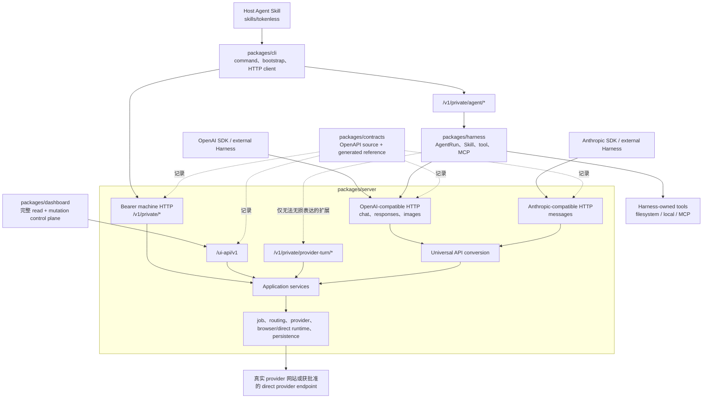

# Tokenless 架构

本文档定义稳定的产品架构，不是 roadmap，也不规定交付顺序。Roadmap 可以描述某项能力如何交付，但必须遵守本文档定义的 ownership 与 dependency boundary。

## 最终形态

Tokenless 在一个 server-owned execution core 之上有多类 caller：



这些 caller 使用不同 HTTP Interface，但共用一份 server implementation。OpenAI-compatible 与 Anthropic-compatible 是平级的 compatibility Interface；OpenAI-compatible chat、Responses 与 images 仍是 first-party Harness 的默认 model/media Interface。Tokenless-only bearer machine control 与无法无损表达的 provider-turn extension 位于 `/v1/private/*`。

## Layer 1：Universal API

Universal API 是底层、面向 provider 的 compatibility boundary，把支持的 visible 或 direct provider strategy 转成已有外部 Harness 可以使用的稳定 API。

它负责：

- OpenAI-compatible Chat Completions 与 Responses request/response contract；
- OpenAI-compatible image-generation request/response contract 与 media result handling；
- canonical message、tool-call、tool-result 与 structured-output 校验；
- provider selection、显式 auto routing、conversation mapping 与 provider-turn state；
- streaming 与 non-streaming framing；
- capability check、stable error、dispatch certainty 与 provider job correlation；
- 在选定 strategy 允许时可重放的 provider-neutral history。

外部 Harness 将本轮临时 tool catalog 与 conversation history 发给 Universal API。API 校验 catalog 并返回 tool call 或 final result；它不解析、授权或执行外部 Harness 的 tools。

Universal API 不拥有：

- Tokenless 内部 Tool Registry；
- MCP client session 或 MCP OAuth state；
- filesystem root 或 local process authority；
- Skill discovery、prompt compilation、approval decision 或 agent-loop state；
- first-party AgentRun database。

因此 API 可以直接部署给已有 Harness 使用。Pi、Mono、Codex、DeepSeek Harness 或其他兼容 caller 可以自己拥有 tools，并在不加载 Tokenless Web Agent Harness 的情况下调用 API。

## Layer 2：Web Agent Harness

Web Agent Harness 是 Tokenless 在 `packages/harness/` 中的 first-party agent runtime。它由 Tokenless-owned agent run 与 integration 使用，并且完全位于 server HTTP boundary 之上。

它负责：

- durable `AgentRun`、turn、action-batch、intervention 与 tool-result state；
- System Prompt compilation 与 precedence；
- Skill registry discovery、selection、content-addressed delivery 与 per-turn manifest；
- internal Tool Registry 与 model-visible tool schema；
- bounded filesystem 与 local tools；
- MCP discovery、transport、authentication、authorization、approval、timeout、cancellation 与 resume；
- 完整 action-batch execution、dependency handling、loop limit、recovery 与 final-output validation；
- 向 CLI 或 caller 呈现 waiting、approval、authentication 与 terminal state。

Harness 不接收 Playwright `Page`、browser profile path、provider cookie、provider session token 或 provider adapter object。普通 model turn 通过 OpenAI-compatible Client Adapter；只有 OpenAI contract 当前无法表达的 attachment、identity、waiting、resume 或 dispatch semantics 才使用 private provider-turn Client Adapter。

## 调用路径

| Caller | 第一 ownership | Provider boundary | Tool executor |
| --- | --- | --- | --- |
| Pi、Mono、Codex、DeepSeek Harness 或其他外部 Harness | Universal API | Web Provider API / direct provider runtime | 外部 Harness |
| Tokenless CLI agent run | Web Agent Harness | `/v1/private/agent/*` → Harness → OpenAI-compatible API，必要时加 `/v1/private/provider-turn/*` extension | Tokenless Web Agent Harness |
| Tokenless provider inspection 或 administration command | CLI control adapter | authenticated daemon control API | 按该 command 定义的 provider runtime 或 control plane |

第三条路径只用于 inspection 与 administration，不是另一套 agent loop。Agent path 不得在 CLI command code 中重复 Harness 的 prompt compilation、Skill resolution、tool authorization 或 loop state。

## Tool ownership

同一个面向 model 的概念可以经过任一 boundary，但 ownership 必须明确：

```text
External Harness -> Universal API
  API 校验 caller-owned tools
  API 返回 tool_call
  External Harness 执行 tool
  External Harness 在下一次 API request 中发送 tool result

Tokenless CLI -> Web Agent Harness -> Universal API
  Harness 将自己的 internal Tool Registry 投影到 provider turn
  Harness 校验 model action_batch
  Harness 授权并执行 filesystem / local / MCP call
  Harness 将一次有界 aggregate result 发送到下一次 provider turn
```

Universal API 不执行外部 caller tools，并不禁止 first-party Harness 执行自己的 tools。它只禁止把 Harness authority 搬进低层 API，或把外部 caller 的 tool catalog 静默当成 Tokenless authority。

## HTTP contract 与 runtime ownership

`packages/contracts/tokenless.openapi.json` 是唯一的 HTTP documentation source。它统一描述所有 compatibility、private machine、Dashboard 与 readiness Interface 的 path、method、authentication、serialized request/response shape、status code 和 example；`npm run api:docs` 将其生成一份 Scalar 汇总 reference。

`packages/contracts` 不是 runtime dependency。Server route 与 request validation 留在 `packages/server`；private provider-turn Client Adapter 及其 defensive response validation 留在 `packages/harness`。`packages/shared` 只保存有多个真实 consumer 的 runtime primitive——Dashboard DTO type、localized error summary 与 strict JSON helper——它不是 HTTP contract source。

高层 runtime Interface 保持分离：

- Universal API：OpenAI-compatible `tools`、`tool_calls`、`role: tool`、Responses item、`tool_choice` 与 structured output；
- Anthropic compatibility：把 Anthropic Messages framing 映射到同一个 Universal execution implementation；
- Web Agent Harness：`AgentRun`、Skill、`action_batch`、`needs`、approval decision、MCP outcome、intervention 与 final-output policy。

API Adapter 不得调用 Harness mission queue、Tool Registry 或 MCP runtime。Harness 不得 import provider Adapter、Playwright、daemon storage、profile management 或 CLI implementation module。

## Runtime components

1. `tokenless` CLI 负责 command parsing、daemon bootstrap、authenticated HTTP call、wait、localization 与 output formatting。
2. Web Agent Harness 负责 Tokenless 自有 agent run、OpenAI-compatible model call 与必要的 private provider-turn extension call。
3. 本地 TypeScript daemon 以 SQLite 持久化 job，并提供 authenticated loopback control plane。
4. Playwright worker 认领 managed-web job，通过 CDP 连接独立启动的 resident Chromium，并在持久化 managed profile 中操作真实 provider 页面。
5. provider navigation catalog 与 provider registry 负责 URL、origin、session、account、selector 与 capability policy。
6. provider-session state machine 负责页面 observation；daemon job state machine 负责 durable execution。
7. provider adapter 在 session decision 允许后，执行 provider-specific visible page operation。
8. Server application services 为不同 HTTP surface 共享同一份 use-case 实现，不复制业务逻辑。
9. `packages/dashboard/` 中的完整 Dashboard SPA 从 `/ui/` 提供，保留全部 read/mutation 能力；`/ui-api/v1` 不向 browser JavaScript 暴露 daemon bearer token。

## Provider runtime execution path

所有正常的跨产品调用都经过 HTTP。目标 first-party agent 路径是：`Tokenless CLI → /v1/private/agent/* → Web Agent Harness → OpenAI-compatible API → provider runtime`；只有无法无损表达的 extension 才走 `/v1/private/provider-turn/*`。Daemon ready 后，job、provider inspection、profile/configuration、capability routing、output-savings 与 administration command 使用 bearer-authenticated `/v1/private/*` machine route。Daemon discovery、daemon install/start、setup-time browser provisioning、upgrade 与 offline diagnostic 是明确的 pre-daemon bootstrap 边界；正常产品命令不得把它们当作 in-process fallback。当不存在已验证 daemon 时，CLI 只可保留 request-local validation 与 read-only fail-fast capability/profile preflight，用于维持“无效请求在创建 daemon、token、SQLite 或 job 之前失败”的现有行为；可执行请求在实际执行前必须由 server 通过 authenticated HTTP 再次解析。

| Interface | Execution path | Tool 或 provider owner |
| --- | --- | --- |
| CLI agent run | CLI → `/v1/private/agent/*` → Web Agent Harness → OpenAI-compatible API/private extension → provider runtime | Web Agent Harness 负责 agent tools |
| Provider/control command | CLI → `/v1/private/*` → daemon → Playwright worker → managed profile → provider page | Private machine Interface 与 provider runtime |
| Local dashboard | Browser → `/ui-api/v1` → daemon/shared services → managed profile → provider page | dashboard/control plane |
| Machine API | Trusted local caller → bearer API → daemon → provider runtime | 调用方负责 API request contract |

当前 package boundary 与 private namespace 已落地；OpenAI-compatible API convergence 是后续独立 roadmap，因为它会改变 execution ownership，而本次结构重构只改变 source ownership、URL namespace 与 dependency direction。

## Managed Playwright flow

```text
request
  → derive complete capability requirements
  → rank compatible provider route
  → validate target, actions, context, files, and limits
  → create authenticated daemon job
  → Playwright worker claims the profile-scoped job
  → recheck visible session and capability before mutation
  → provider adapter performs visible actions
  → verify visible postconditions
  → only a classified safe pre-submit failure may use the next compatible route
  → complete the job and return normalized result
```

Job 必须携带明确的 provider/profile identity。Unsupported control、ambiguous page、unexpected navigation、authentication blocker 与 selector drift 都必须 fail closed；已提交或状态不明确的 provider mutation 不得被静默 replay。

## Setup and profiles

`tokenless setup` 通过 `BrowserRuntimeManager` 选择并验证一个 runtime，再创建或选择兼容的 clean managed profile。Tokenless 不复制现有 Chrome、Brave 或 Cloak profile，也不导入它们的 authentication state；用户在可见的 managed profile 中完成登录。

新建 Profile 保存明确的 runtime binding，包括 canonical browser executable path；job 只能复用同一个 browser executable instance，不能因为 browser family 相同就跨安装复用。没有 executable path 的 legacy binding 仍可读取，但不具备 instance-level pinning；请重新执行 setup 创建新的 exact binding。Profile 不会自动 import、reset、clear 或 replace；Provider authentication 只根据可见页面 observation 判断，login、CAPTCHA、MFA、consent 与 confirmation 仍然是用户动作。

## Provider architecture and session state machine

`packages/server/src/providers/registry.ts` 是 provider 的 production registration point。Provider-specific visible-page behavior 留在 provider-owned adapter；shared runner 只消费 normalized session decision 与 capability contract。

Provider-session state machine 处理单次页面 observation，例如 `wait`、`continue_guest`、`ready`、`handoff` 与 `terminal`。Daemon job state machine 处理 `queued`、`claimed`、`running`、`waiting_for_user`、`succeeded`、`failed`、`canceled` 与 `timed_out`。handoff 进入现有 job 的 `waiting_for_user`，不创建替代 job。

## Local control plane

Daemon 绑定 loopback，以 bearer token 保护 machine endpoint，并用 SQLite 保存 durable job state。除平级 compatibility Interface 外，所有 bearer-authenticated Tokenless machine endpoint 都位于 `/v1/private/*`。Browser Dashboard 使用独立的 `/ui-api/v1` session/CSRF Interface，不把 daemon control bearer token 暴露给 browser JavaScript；两者统一记录在 [`packages/contracts/tokenless.openapi.json`](../packages/contracts/tokenless.openapi.json)。

Control-plane page 有独立的 reserved page key，不能被 provider job acquire、navigate 或 replace。Job claim、lease、completion、cancellation、state query 与 replay 都必须经过 daemon 的 durable boundary。

## Browser boundary

- 每个 managed profile 拥有自己的 persistent browser instance 与 user-data directory。
- Tokenless 使用 profile runtime binding 解析准确的 Chromium executable，通过 CDP 连接；provider automation 仍使用 Playwright 的真实 browser/page/locator boundary。
- Automation 只使用 approved provider origin、visible control 与 visible postcondition。
- Provider credential、cookie、browser storage 与 session object 留在 managed profile/provider runtime 内。
- Sign-in、CAPTCHA、account limit、payment、consent 与 confirmation 不由 Harness 或 provider adapter 越权完成。
- Control-plane page 与 provider page leases 分离，provider job 不得取得或替换它。

## Capability and Workspace strategy

Public capability vocabulary、provider mapping、evidence ladder 与 extension process 由 [Capability Matrix](capability-matrix.zh-CN.md) 定义。Capability 不因缺少 selector 就被推断为 unavailable；subscription label 是 diagnostic evidence，不是 authorization。

Native Project/workspace、file upload、model/effort selection、conversation continuation 与 provider-specific controls 都必须有对应的 real-provider evidence。没有证据的 capability 必须报告为 unavailable 或 unknown，不能靠猜测进入 route table。

## Browser visibility policy

Browser visibility 由 global fallback 与 profile-scoped preference 决定，默认使用 `auto`。Headless job 不能因为 blocker 静默提交替代 job；需要用户处理时，原 job 进入 `waiting_for_user`，保留同一个 `jobId`、`taskId` 与 profile identity。Chromium sandbox 保持开启，CDP 是 managed browser control boundary。

## File handling

CLI 只接受用户明确选择的 regular file，将其 stage 到 Tokenless home 并保存 bounded metadata 与 integrity hash。Hidden `FileList` 只能证明 selected；只有 visible filename、attachment chip、preview 或等价 postcondition 才能证明 accepted。Daemon result 不暴露 raw caller path。

## Long-running and user-handoff states

Provider 需要用户操作时，现有 daemon job 与 browser profile 仍然是 authoritative state。调用方必须 query/resume 同一个 job，不得新建 job 规避 `waiting_for_user` 或重复 provider mutation。长任务、取消、失败与 timeout 都通过 durable job state 反馈。

## Trust 与 persistence boundary

- Provider credential 与 browser object 留在 provider runtime 内。
- Harness state 只保存有界 identifier、policy decision、digest、checkpoint 与 result，不保存 raw provider credential。
- External caller tools 默认只在 API request 范围内有效，除非 external Harness 自己持久化。
- Harness-owned tools 只能在 Harness 明确的 authorization 与 AgentRun boundary 内持久化和 resume。
- User content、Skill content、model output 与 tool result 都是不可信数据；它们不能增加 tools、放宽 policy 或改写 protocol framing。
- provider submission 出现 ambiguity 时，由 provider-turn 与 dispatch-certainty contract 处理；Harness 不会静默重放已经完成的 external mutation。

## Repository package boundary

```text
skills/              Host Agent instructions
packages/cli/        commands, bootstrap, HTTP clients, localization, output
packages/dashboard/  full Local Web Control Plane frontend
packages/harness/    AgentRun, Skills, tools, MCP, approvals, agent loop
packages/contracts/  canonical OpenAPI source、examples、generated API reference
packages/shared/     shared runtime DTO types、localization data、strict JSON helpers
packages/server/     HTTP, application, jobs, providers, browser/direct runtime, persistence
```

主 dependency direction 是 `CLI/Dashboard/Harness/external caller → HTTP → server`。`packages/contracts` 只记录该 Seam，不进入 runtime dependency graph。Server 不 import Harness runtime，Dashboard 只 import browser-safe shared primitive 而不 import backend source，Harness 不 import provider/browser/persistence internals。现有单一 `tokenless` npm distribution 继续 bundle 所需 private artifacts。

## 与 roadmap 的关系

本文档是 architecture source of truth。`docs/roadmaps/` 只描述 sequencing、milestone、evidence 与未完成工作。Roadmap 可以延后或分阶段实现 MCP、CLI integration、persistence 或 provider coverage，但不能重新定义上面的两层 ownership。

Web Agent Harness roadmap 负责 first-party Harness 实现；Universal API tool-calling roadmap 负责 OpenAI-compatible contract；OpenAI-compatible API convergence roadmap 负责 CLI/Harness model call 的迁移，以及删除不再必要的 private provider-turn extension。Runtime package boundary refactor、documentation-only contracts 与 private namespace correction 已完成；execution convergence 不属于该零逻辑变化重构。
