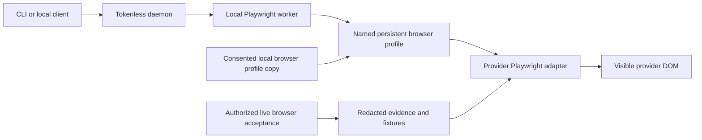
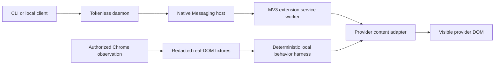

# Visible Provider Web Automation Initiative Handoff

**Status:** P0 architecture handoff; must precede further visible-provider work
**Last updated:** 2026-07-17  
**Working branch at the checkpoint:** `codex/claude-visible-adapter`  
**Scope:** Managed Playwright profiles and visible-provider automation for ChatGPT, Claude, Gemini, and Grok

## P0 decision: managed Playwright profiles

This is the current implementation direction and supersedes the extension-mode
runtime described later in this handoff. The extension material remains as a
record of the adapters, evidence, and behavior that must be migrated; it is not
the target architecture.

Visible mode will replace the Native Messaging host and browser extension with
a daemon-backed Playwright worker. The worker will control visible, persistent
managed Chromium profiles below `~/.tokenless/browser/profiles/`. A named profile
represents one browser identity such as `personal` or `work` and may hold one
session for every supported provider. Multiple accounts for the same provider
use different named profiles.

This work is **P0**. Do not deepen the extension transport, add new
extension-only features, or treat the current extension checkpoint as the
release path before this migration is complete.

### Target architecture



The Rust daemon remains the durable local control plane for jobs, history,
leases, state, and cancellation. Direct mode remains isolated and unchanged.
The Playwright worker replaces only the extension/native transport and owns the
visible browser processes.

### Profile and CLI contract

Add the following profile administration commands:

```text
tokenless profiles add --profile <slug> [--label <text>] [--set-default]
tokenless profiles discover [--browser <chrome|brave>] [--browser-user-data-dir <dir>] --json
tokenless profiles list
tokenless profiles status --profile <slug> [--provider <id>]
tokenless profiles open --profile <slug> [--provider <id>]
tokenless profiles reset [--profile <slug>] [--preferred-providers <list>]
tokenless profiles set-default --profile <slug>
tokenless profiles remove --profile <slug> --confirm-delete
```

Every visible command, including `run`, provider actions, provider controls,
provider status, and `snapshot-dom`, accepts `--profile <slug>`. Selection uses
the explicit profile first and then the configured default. It fails before job
creation when neither resolves to a registered profile.

`tokenless profiles discover --json` is read-only and lists local Chrome or Brave roots
with exact profile directory keys; it does not create a Tokenless profile,
copy profile data, or touch the managed-profile registry. `tokenless setup` is
the canonical interactive onboarding entry: it installs and checks the two
GitHub-backed Tokenless skills, detects installed browsers, asks the user to
select or explicitly re-import a managed profile, records preferred providers,
starts the daemon and worker, opens provider pages, and reports visible
authentication readiness. Noninteractive initial setup must explicitly choose
either `--clean-profile` or both `--import-browser-profile <directory-key>` and
`--consent-local-profile-copy`.

Store bounded profile metadata in `~/.tokenless/browser/profiles.json`, guarded
by the existing cross-process SQLite lock. Public profile slugs never become
filesystem targets: each profile directory is derived from an internal UUID.
Registry records contain identifiers, labels, lifecycle/import state,
timestamps, and bounded last-observed visible authentication status, but no
cookie or storage values.

Profile routing in this P0 is explicit or default. Stable profile identifiers
and daemon job fields must make later project-affinity routing additive rather
than requiring another storage migration.

### Consented profile import

Importing a browser profile is an explicit user setup operation. The
consent UI names the exact source and destination, explains that authentication
state may be copied, and states that the copy remains entirely local and is
never sent to Tokenless or another remote service. Jobs and live tests reuse the
already-imported managed profile indefinitely; they must not re-import, refresh,
copy from the source browser, or remove that managed profile. A later re-import
occurs only when the user explicitly selects it in setup or passes the explicit
re-import flags.

The implementation must:

- use installed Chrome through `playwright-core`, `channel: "chrome"`, or the
  selected Brave executable, always with `headless: false` and a non-default
  persistent user-data directory;
- discover the source root and profile directory from platform-standard browser
  locations and `Local State`, using an exact directory key such as `Default`
  or `Profile 1` rather than an ambiguous display name;
- permit a best-effort read-only copy while the source browser is open; setup
  does not claim source quiescence or snapshot consistency, and an unusable copy
  is reported for explicit user recovery;
- copy into a private staging directory, reject links and path escapes, never
  mutate the source, and atomically promote a complete result;
- copy root encryption metadata and only requested ChatGPT, Claude, or Grok
  cookie rows selected by audited host and partition allowlists, while keeping
  cookie contents opaque;
- never import Gemini/Google authentication, broad X/Twitter sessions, or
  shared Local Storage, IndexedDB, Session Storage, or Service Worker state;
- exclude caches, crash data, downloads, browsing history, bookmarks, saved
  passwords, autofill/payment databases, and installed extensions;
- disable browser sync in the managed clone so it cannot change the user's
  ordinary synced profile; and
- delete incomplete staging data on every failure.

After import, Tokenless verifies only visible provider DOM. It keeps the managed
profile and opens visible sign-in pages for providers that remain logged out.
Copy failure is reported rather than silently switching execution paths or
creating a replacement profile. Reauthentication in the selected managed
profile persists across future runs.

Profile data remains until explicit removal. Removal first stops the exact
managed browser, resolves and verifies its registered UUID directory beneath
Tokenless home, and requires `--confirm-delete` before deleting it.

The revised credential boundary is:

- an explicitly consented, provider-scoped local cookie copy is allowed for
  ChatGPT, Claude, and Grok;
- Tokenless reads host and partition metadata only for allowlist decisions,
  treats cookie contents as opaque, and never prints, logs, returns, diagnoses,
  or transmits copied authentication values;
- Playwright adapters continue to operate through visible provider DOM and do
  not use cookie/storage export APIs, hidden request interception, private
  provider APIs, or a remote debugging TCP endpoint; and
- raw authenticated captures remain ephemeral and only reviewed, reduced,
  redacted evidence may enter the repository.

### Daemon and worker behavior

Add `profile_id` to visible daemon jobs and expose exact profile filtering in
job state. Add authenticated worker operations for claim-by-profile,
mark-running, lease renewal, completion, and cancellation observation. Preserve
historical jobs; any queued pre-cutover visible job fails explicitly with
`legacy_visible_transport_removed` rather than being silently replayed.

Run one detached `tokenless-playwright-runner` per Tokenless home. It maintains
a private PID/session/heartbeat marker and log, lazily launches one persistent
Chrome context per active profile, and keeps its windows open. If the user
closes a browser, the active job fails retryably and the next action relaunches
that profile.

Execution is single-flight inside each profile. Different profiles may run in
parallel, with a fixed initial limit of four active profile browsers; additional
jobs remain queued in the daemon. The worker renews claims while waiting on a
provider, observes daemon cancellation, aborts the corresponding page work, and
cleans staged attachments deterministically.

Move provider configuration, navigation policy, action vocabulary, selectors,
and visible postconditions out of the extension into Playwright adapter
modules. Preserve exact-label model/effort behavior, fail-closed navigation,
CAPTCHA/rate-limit/upgrade handling, response correlation, visible citations,
and sanitized snapshots.

Attachments remain staged as private, regular, non-symlink files with bounded
size and SHA-256 descriptors. The worker resolves the bundle by job id and uses
Playwright `setInputFiles`; raw caller paths remain absent from daemon job JSON.

### Test strategy and P0 acceptance

#### Deterministic coverage

Add unit and integration coverage for:

- Chrome discovery, source-profile enumeration, explicit consent, canonical
  path validation, copy inclusion/exclusion rules, atomic promotion, interrupted
  cleanup, and proof that the source is not modified;
- Chrome-running, unreadable-source, inconsistent-copy, unusable-encryption,
  and zero-authenticated-provider fallbacks;
- clean profiles, partial imports, explicit/default selection, unknown profiles,
  profile deletion, browser closure, worker restart, and relaunch;
- same-profile serialization, cross-profile parallelism, the four-profile cap,
  daemon lease renewal, cancellation, stale completion, and legacy queued jobs;
- every existing ChatGPT, Claude, Gemini, and Grok action driven through the
  real Playwright adapters against retained authenticated DOM fixtures;
- full-chain CLI -> daemon -> worker -> real browser-page flows for prompt
  input, controls, upload, submission, response reading, snapshots, navigation
  drift, cancellation, and cleanup; and
- static contract checks rejecting Playwright cookie/storage export, credential
  logging, private provider routes, source-profile writes, unsanitized traces,
  and remote CDP endpoints.

#### Authorized local Chrome-profile acceptance

Add this separately gated command:

```text
npm run test:e2e:live-managed-playwright
```

It never runs in ordinary CI and requires every explicit gate below:

```text
TOKENLESS_LIVE_MANAGED_PLAYWRIGHT=1
TOKENLESS_LIVE_PROVIDER_MUTATIONS=1
TOKENLESS_LIVE_MANAGED_PLAYWRIGHT_HOME=<existing-tokenless-home>
TOKENLESS_LIVE_MANAGED_PLAYWRIGHT_PROFILE=<managed-profile-slug>
```

The suite resolves the configured user-imported managed profile with `tokenless profiles list`
before provider actions. Expired authentication is reported by normal visible
auth checks. The suite must not call `profiles add`, `profiles remove`, Chrome
profile discovery, or any import/copy path.
It requires authenticated managed sessions for **ChatGPT, Claude, Gemini, and
Grok**. Missing or expired authentication for any provider fails the P0
acceptance run rather than silently reducing coverage.

For every provider, the live suite must:

1. confirm authenticated state through visible DOM;
2. inspect the exact model inventory and selected state;
3. exercise a reversible available model selection and restore the original in
   `finally` (reselect the current choice if no alternate is safely available);
4. inspect and exercise effort where supported, restoring the original, and
   require a truthful unsupported result where effort is provider-coupled;
5. input and clear a visible draft;
6. upload a generated, non-sensitive marker text file through the visible file
   control;
7. submit one unique marker prompt with the attachment and require a visible,
   correlated answer; and
8. verify allowed provider navigation and the absence of login, CAPTCHA,
   upgrade, rate-limit, and selector-drift blockers.

The suite uses bounded timeouts and generated marker data only. It must not use
private user files, existing chats, Projects, history, connectors, or skills.
In `finally`, it writes partial sanitized evidence when needed and leaves the
managed profile intact. It must not delete the managed profile, refresh it from
Chrome, or verify Chrome source hashes because live execution no longer reads a
Chrome source profile. Provider-side smoke conversations may remain and must
carry a unique recognizable test marker.

Retain only sanitized evidence under
`test-results/live-managed-playwright/<timestamp>/`: step results, timings,
Chrome/OS/Playwright versions, a provider/action matrix, cropped screenshots of
the operated control/uploaded filename/marker response, and redacted selector
diagnostics. Do not retain full-page text, account identity, cookies, storage,
private conversation history, or opaque private route identifiers.

Reviewed adapter-relevant DOM from a live run may be promoted into deterministic
fixtures with provenance and hashes. Raw captures are never promoted
automatically. P0 is not complete until the deterministic suite is green and
one successful all-four-provider local acceptance run is recorded in this
handoff.

### Cutover and cleanup

Visible mode becomes Playwright-only immediately; there is no legacy extension
flag. Remove the extension and control-extension packages, native-host binary
and protocol, Chrome Web Store paths, extension ids, bridge marker, manifests,
and extension-specific tests after their reusable adapter behavior has moved.

Keep the platform native packages for the Rust daemon but package only
`tokenless-daemon`. During setup or upgrade, remove only native-host files and
registry values whose resolved targets belong to the active Tokenless home, and
tell users to uninstall the obsolete browser extension manually.

Migrate configuration to preferred providers, daemon URL, and default managed
profile. Update architecture, README, privacy policy, install skill, package
contracts, and release verification to describe the new boundary. Do not
publish any package, extension, or release as part of this implementation.

## Executive summary

The remainder of this document describes the extension implementation at the
2026-07-17 checkpoint. It is migration input and historical evidence beneath
the P0 decision above.

Tokenless is intended to become a local, provider-neutral execution layer over
the AI website sessions that a user already has open in their browser.

The product is not a cookie extractor, a private-API client, or a clone of each
provider frontend. It uses a browser extension to operate the provider's
visible web UI after the user grants host permission. The CLI, daemon, native
host, extension service worker, and content adapters form one end-to-end local
runtime:



ChatGPT remains the reference adapter. The current increment extends the same
approach to Claude, Gemini, and Grok, introduces a unified action vocabulary,
captures authenticated real DOM for all four providers, and brings the five
priority action areas close to a coherent local acceptance boundary:

1. sign-in status;
2. model selection;
3. thinking-effort selection;
4. file upload; and
5. prompt input and submission.

The current work is substantial but not product-complete. The authenticated DOM
corpus and most core adapters exist. Several focused tests passed during
development. The last safety change and the new captured-DOM adapter E2E still
need one clean, serialized regression run. Projects, history, skills, and
connectors remain future product initiatives rather than completed features.

## Product thesis

### User outcome

A local agent should be able to ask Tokenless to perform a provider-web action
without knowing the provider's current DOM, model-menu structure, file-input
implementation, or account-specific entitlement details.

The caller should use one conceptual API. Tokenless should translate that API
into provider-specific visible UI interactions, verify a visible postcondition,
and return a bounded, privacy-safe result.

### Why this product exists

- Reuse a user's existing web subscription or Free web access when appropriate.
- Avoid an unnecessary second paid API request for suitable interactive work.
- Keep provider credentials inside the browser.
- Give local agents a stable interface while provider websites continue to
  change.
- Preserve an honest distinction between a provider feature being documented,
  visible, implemented, locally accepted, and live-provider accepted.

### Product invariants at the extension checkpoint

- Operate only through user-visible browser UI.
- Never extract provider cookies, passwords, browser-storage tokens, hidden
  authorization headers, or private provider API calls.
- Treat the current visible UI and visible entitlement gates as authoritative.
- Use exact visible labels; do not guess model IDs or fuzzy-match partial names.
- Verify a visible postcondition after every mutation.
- Fail closed on selector drift, ambiguous state, login gates, CAPTCHA, limits,
  upgrade prompts, navigation drift, or unsupported semantics.
- Keep raw authenticated captures ephemeral. Store only reduced, redacted DOM
  evidence.
- Do not allow an unrelated later request to inherit a stale visible file.
- Do not publish packages, extensions, or releases without explicit approval.

## Evidence and acceptance model

The project needs a consistent vocabulary because several different kinds of
proof are easy to conflate.

| Level | Meaning | What it does not prove |
| --- | --- | --- |
| Documented | The provider's official documentation describes a feature or Free entry point. | It does not prove the current account, quota, entitlement, DOM, or runtime state. |
| Observed DOM | Relevant markup was visible in an authorized browser session and was reduced into a redacted fixture. | It does not prove that Tokenless can operate it. |
| Implemented | A content adapter or runtime path can inspect or interact with the captured contract. | It does not prove the complete local transport or provider acceptance. |
| Locally accepted | Deterministic local DOM tests verify the action and its visible postcondition. | It does not prove a real provider accepted a live mutation. |
| Full-chain accepted | CLI, daemon, native host, extension, and local provider DOM complete the action. | It is still not a live provider mutation. |
| Live accepted | An explicitly authorized test account completes the action on the provider website. | It does not make the DOM stable forever or guarantee every plan/locale. |
| Released | Builds, tests, privacy review, documentation, feature gating, and release approval are complete. | It does not eliminate ongoing DOM drift. |

The current user requirement deliberately prioritizes **local acceptance using
real captured DOM**, not live prompt submission, live file upload, or live
Project creation. Live mutating smoke tests should be a separate, explicitly
authorized test-account gate.

## Current authenticated DOM corpus

On 2026-07-17, clean provider tabs were inspected through the user's signed-in
Chrome profile. Account identities, emails, history titles, message contents,
private route identifiers, scripts, and styles were not retained.

The fixture corpus is under:

```text
test/fixtures/provider-dom/<provider>/<account-state>/<scenario>.html
```

There are five authenticated scenarios for each of four providers, for a total
of twenty HTML fixtures:

- `session-status`
- `model-menu-open`
- `thinking-effort-menu-open`
- `file-input-ready`
- `composer-idle`

Every HTML fixture has a same-basename `.provenance.json` sidecar containing the
provider, observed account/plan state, sanitized public URL, observation date,
evidence selectors, redaction notes, and the HTML SHA-256.

The fixtures intentionally contain no provider JavaScript and no synthetic
behavior. Deterministic click/state behavior belongs in the test harness so the
repository can distinguish captured evidence from locally modeled transitions.

Existing signed-out, public, and legacy deterministic fixtures remain in the
repository. Authenticated evidence supplements rather than replaces them.

### Observed account state

| Provider | Authenticated observation | Safe conclusion |
| --- | --- | --- |
| ChatGPT | Signed in; Plus was visible. | The captured controls existed on one Plus account. This is not authenticated Free-plan proof. |
| Claude | Signed in; Free plan was visible. | This is direct Free-account DOM evidence for the captured controls. Runtime limits still win. |
| Gemini | Signed in; no reliable plan label was visible. | Authentication is observed; plan remains unknown. A `Pro` model label is not a subscription label. |
| Grok | Signed in; no reliable plan label was visible. | Authentication is observed; plan remains unknown. Fast was the only confirmed executable profile in the captured entitlement state. |

### Published Free baseline

Official documentation confirms that every provider has a Free web entry point,
but this is product documentation rather than current-account evidence:

- [ChatGPT Free Tier](https://help.openai.com/en/articles/9275245-using-chatgpt-s-free-tier)
- [Claude plans](https://support.anthropic.com/en/articles/11049762-choosing-a-claude-ai-plan)
- [Gemini Apps limits](https://support.google.com/gemini/answer/16275805?hl=en-AG)
- [Grok pricing](https://x.ai/pricing)

Only Claude currently has both an official Free route and authenticated Free
DOM evidence in this corpus. Genuine Free-account coverage for ChatGPT, Gemini,
and Grok remains future work.

## Unified provider-web action model

The initial versioned vocabulary is defined in
`packages/extension/extension/shared/visible-provider-actions.ts`.

### Current action vocabulary

- `auth.status`
- `model.inspect`
- `model.select`
- `effort.inspect`
- `effort.select`
- `file.upload`
- `skill.upload`
- `connector.inspect`
- `connector.select`
- `prompt.input`
- `prompt.submit`
- `project.inspect`
- `project.open`
- `history.inspect`
- `history.open`

The current schema gives the nine requested product domains a common home, but
the enrichment domains are not semantically complete. The eventual product API
still needs explicit operations such as `project.find`, `project.create`,
project options/configuration, `history.find`, connector addition, and skill
management. These should not be disguised as generic selector clicks.

### Core action status

| Action area | ChatGPT | Claude | Gemini | Grok |
| --- | --- | --- | --- | --- |
| Auth status | Implemented with privacy-safe visible signals | Implemented; Free plan captured | Implemented; plan deliberately unknown | Implemented; plan deliberately unknown |
| Model inspect/select | Dynamic visible labels and selected-state verification | Model menu plus visible Upgrade gating | Mode menu; nested `.selected` is authoritative | Exact profile rows; visible Upgrade state makes unconfirmed rows unavailable |
| Thinking effort | Dynamic account-dependent labels | Model-dependent Extended/effort/Thinking controls | Independent Extended thinking row | No independent control; explicitly model-coupled/unsupported |
| File upload | Exact `#upload-files` input | Exact authenticated upload input | Dynamic `Filedata` input after visible upload-menu preparation | Exact authenticated `input[name="files"]` |
| Prompt input | Exact visible composer | Exact visible composer | Exact rich-text composer | Exact ProseMirror composer |
| Prompt submit | Local visible-submit harness exists | Local visible-submit harness exists | Local visible-submit harness exists | Local visible-submit and signup-gate harnesses exist |

### Enrichment action status

| Product area | Current checkpoint | Product-complete target |
| --- | --- | --- |
| Skills | Contract vocabulary and some observed menu entry points only. | Inspect, upload/install, enable/disable, manage, and report unsupported semantics per provider. |
| Connectors | Inspect/select vocabulary and observed entry points only. | Inspect existing connectors, add with explicit user approval, handle OAuth handoff, verify final visible connection. |
| Projects | Existing strict target-URL isolation for ChatGPT and Claude; rough inspect/open vocabulary. | Find, create, open, verify identity, inspect/configure options, and prove isolation on every provider that supports it. |
| History | Rough inspect/open vocabulary; some search/history controls observed. | Privacy-bounded search/find/open without harvesting or persisting an account's entire private history. |

## Provider-specific checkpoint

### ChatGPT

Substantially implemented:

- signed-in status through the visible account control;
- dynamic model inventory and exact selection;
- dynamic Intelligence/effort labels without a fixed five-level assumption;
- exact generic file input;
- visible prompt input and submission harnesses;
- existing strict Project URL transition isolation.

Still missing or incomplete:

- authenticated Free-account fixtures;
- current usage/quota inspection;
- Project discovery, creation, picker, and options;
- unified skills/connectors/history behavior;
- locale, responsive layout, experiment, and account-tier variants;
- final clean regression after the current changes.

### Claude

Substantially implemented:

- direct authenticated Free-plan evidence;
- exact model inventory and selection;
- visible Upgrade-row gating;
- model-dependent Extended, effort, and Thinking controls;
- exact file input and composer;
- existing strict Project URL transition isolation.

Still missing or incomplete:

- native Project discovery/create/picker behavior;
- skills and connector workflows beyond observed menus;
- history search/open behavior;
- usage/limit states and broader Free-account variants;
- final clean full-chain regression.

### Gemini

Substantially implemented:

- privacy-safe signed-in detection with plan left unknown;
- exact mode inventory and selection;
- correct use of nested `.selected` rather than keyboard-highlight
  `data-active`;
- Extended thinking handling;
- exact rich-text composer;
- dynamic file-input preparation through the visible Upload and tools menu.

Still missing or incomplete:

- trustworthy plan/usage status;
- broader file-chooser lifecycle and upload-limit cases;
- Gems/Project-equivalent isolation semantics;
- Drive/connector behavior;
- history search/open behavior;
- authenticated Free/no-plan fixture coverage;
- final captured-DOM and full-chain regression.

### Grok

Substantially implemented:

- privacy-safe signed-in detection with plan left unknown;
- exact Fast/Auto/Expert/Heavy inventory;
- visible Upgrade evidence overriding misleading `aria-disabled="false"`;
- Fast confirmed as the executable captured state;
- independent effort correctly rejected as model-coupled;
- exact file input and composer;
- observed Projects, History, Search, Skills, and connector entry points.

Still missing or incomplete:

- authenticated Free-plan evidence;
- reliable paid/Free entitlement variants;
- Project find/create/open/options;
- history search/open behavior;
- skills and connector actions;
- authenticated generation and limit-state fixtures;
- final captured-DOM and full-chain regression.

## Transport and runtime checkpoint

The intended execution chain is present:

```text
provider-action / provider-status / provider-controls / run
    -> loopback daemon job
    -> Native Messaging claimed job
    -> extension bridge request
    -> unified visible-provider runtime
    -> provider content adapter
```

Relevant implementation areas include:

- `packages/cli/src/tokenless.mts`
- `packages/daemon/src/native_host.rs`
- `packages/extension/extension/shared/bridge-protocol.ts`
- `packages/extension/extension/shared/visible-provider-actions.ts`
- `packages/extension/extension/shared/visible-provider-capabilities.ts`
- `packages/extension/extension/background/visible-provider-action-runtime.ts`
- `packages/extension/extension/background/service-worker.ts`
- `packages/extension/extension/content/provider-content.ts`

### File transport

The existing attachment path stages regular non-symlink files in a private
local bundle, computes size and SHA-256, sends path-free descriptors through the
daemon and extension protocols, streams bounded bytes through the native host,
reconstructs browser `File` objects, installs one exact provider `FileList`, and
requires new visible filename evidence.

The current safe semantic boundary is:

- `run --attach-file ... --prompt ...` is the atomic file-plus-prompt operation;
- standalone `provider-action --action file.upload` leaves a file visibly
  attached for manual/local follow-up;
- `prompt.input` may reuse the validated provider tab to draft text;
- an independent later `prompt.submit` must not silently inherit the prior
  upload request's attachment ledger;
- a bare extension-owned runtime envelope cannot upload bytes without an active
  daemon/native claim and must fail closed.

If the product later needs composable standalone upload and submit actions, it
requires an explicit, bounded action-session/correlation design. Provider-wide
implicit affinity is not sufficient because it could submit a stale file from
an unrelated request.

### Runtime work that remains

- MV3 service-worker suspension and restart recovery;
- deterministic multi-tab and multi-window selection;
- explicit action/session correlation;
- navigation and SPA rerender resilience;
- bounded retry, timeout, cancellation, and cleanup semantics per action;
- idempotency and duplicate-request behavior across restarts;
- native framing/backpressure and large-bundle stress coverage;
- privacy-safe action traces and drift diagnostics.

## Verification checkpoint

### Reported green checkpoints during development

- Authenticated fixture integrity/provenance suite: 3/3.
- Focused ChatGPT/Claude auth and control suite: 3/3.
- Extension contract plus focused controls at one checkpoint: 20/20.
- Four-provider attachment-content suite: all reported top-level tests passed.
- Multiple extension lint/build, CLI build/lint, unified action contract,
  runtime, service-worker, and native-route focused runs passed at intermediate
  checkpoints.
- A real local Rust/native/MV3 attachment E2E passed before the final
  stale-attachment safety adjustment.

### Not yet a final green release proof

- `test/provider-dom-adapter.e2e.test.mjs` was added to merge authenticated
  captured scenarios and drive the real content adapter. Its first run occurred
  while another concurrent build had cleaned and only partially regenerated
  `dist`, so the content script did not load. This was not a selector assertion
  failure, but the test still needs a clean rerun.
- The native/file E2E needs to be rerun after removal of unsafe automatic
  attachment-ledger inheritance.
- The final unified focused suite has not been recorded as one clean run after
  all last edits.
- The final extension build, CLI build, Rust formatting/tests, root full suite,
  and `git diff --check` have not been recorded together from the final tree.
- Some documentation still described older Gemini/Claude upload/model evidence
  and the pre-native unified file boundary at the pause point.

The branch therefore represents an advanced implementation checkpoint, not a
merge-ready or release-ready assertion.

## Initiative portfolio

| ID | Initiative | Product outcome | Current status | Major remaining work |
| --- | --- | --- | --- | --- |
| I0 | Visible-session safety foundation | All automation stays in visible, user-authorized UI. | Largely established | Continue privacy review for history, connectors, debugging, and traces. |
| I1 | Authenticated and signed-out DOM lab | Real DOM evidence drives deterministic local acceptance. | Authenticated core corpus captured | Automate capture/redaction, add variants, rerun direct captured-DOM E2E, add drift lifecycle. |
| I2 | Unified provider-web API | Clients use one truthful provider-neutral action model. | Core v1 vocabulary exists | Complete enrichment semantics, session model, errors, usage schema, and acceptance levels. |
| I3 | Priority action parity | Auth, model, effort, file, and prompt work across four providers. | Substantially implemented | Final regression, more entitlement states, failure/recovery cases, clean capability alignment. |
| I4 | Free-plan and entitlement intelligence | Tokenless reports what the current account can actually do. | Documentation baseline plus one authenticated Free provider | Real Free profiles for three providers, visible usage/limit extraction, quota and upgrade-state matrix. |
| I5 | Reliable local execution platform | CLI/native/extension actions survive real browser/runtime conditions. | Main chain exists | MV3 restart, navigation, concurrency, idempotency, cancellation, session affinity, stress tests. |
| I6 | Provider-native Projects | Agents can find/create/open/configure a verified isolated workspace. | Existing URL isolation for ChatGPT/Claude only | Product API, confirmation UX, provider adapters, local fixtures, isolation proofs. |
| I7 | History navigation | Agents can find and reopen a requested chat safely. | Entry points observed; rough vocabulary | Query semantics, bounded metadata, privacy policy, adapters, tests. |
| I8 | Skills | Provider-native reusable skills can be inspected and managed. | Menu evidence and rough upload vocabulary | Define provider-neutral semantics, distinguish from files, implement each provider or return unsupported. |
| I9 | Connectors | Existing connectors can be inspected and selected; new ones use explicit OAuth handoff. | Entry points observed; rough inspect/select vocabulary | Addition flow, consent boundaries, OAuth UX, visible verification, revocation/error states. |
| I10 | Drift, observability, and operations | Failures are diagnosable without leaking private content. | Selector fail-closed behavior exists | Registry/versioning, traces, fixture provenance links, capture tooling, alerts, feature flags, kill switches. |
| I11 | Release readiness | A tested, documented, reversible provider/action matrix can ship safely. | Not reached | Clean full suite, security review, packaging, canary plan, rollback, explicit publication approval. |

## Major initiatives still ahead

### 1. Automated DOM evidence lifecycle

Create a capture tool that can acquire only authorized visible DOM, reduce it to
an adapter-relevant surface, redact identities/private content, scan for PII and
secrets, attach provenance, hash the artifact, and compare it with prior
fixtures. Raw snapshots should remain ephemeral.

The evidence matrix eventually needs:

- signed-out and signed-in states;
- actual Free and paid tiers;
- model/effort menus;
- enabled, disabled, upgrade, quota, and error states;
- file chooser ready, accepted, rejected, and limit states;
- prompt idle, submitting, streaming, complete, and failed states;
- Project, history, skill, and connector workflows;
- locale, viewport, responsive layout, and experiment variants.

### 2. Truthful capability and entitlement model

The capability system should evolve beyond one `verified` bit. It should be able
to express:

- implemented versus locally accepted versus live accepted;
- authenticated requirement;
- currently available versus visible-but-upgrade-gated;
- independent versus coupled controls;
- account/tier/locale uncertainty;
- runtime limits and visible usage;
- reversible versus externally consequential mutations;
- provider/action kill-switch state.

### 3. Explicit action-session and transaction semantics

Standalone actions need a safe way to share one visible provider tab and one
bounded mutation context. The design must answer:

- how a caller obtains and resumes a session;
- when a tab may be reused;
- how a file attachment is correlated with a later prompt;
- how sessions expire or are canceled;
- how service-worker restarts recover or invalidate state;
- how concurrent callers avoid cross-contamination;
- what becomes one atomic transaction.

Until that exists, atomic file-plus-prompt execution should remain a single
`run` request.

### 4. Provider-native Project workflows

Projects need a first-class domain model rather than a generic navigation label.
The API should cover find, create, open, inspect identity, inspect/configure
options, and verify isolation before prompt submission.

Project creation changes provider state and should require an explicit caller
intent and visible confirmation. Cross-Project or ordinary-chat navigation must
fail closed.

### 5. Privacy-bounded history workflows

History search must not become bulk account scraping. Define the minimal query
and result fields, maximum result count, user-visible scope, persistence rules,
and logging policy before implementing adapters.

### 6. Skills and connectors

Provider meanings differ. A Claude skill, a Grok skill, a ChatGPT plugin/tool,
and a Gemini Gem are not automatically equivalent. The unified API should
preserve common intent while returning unsupported or provider-specific
constraints honestly.

Adding a connector may invoke OAuth or grant access to external data. Tokenless
must never silently complete that authorization. It should bring the user to a
visible consent boundary and verify only what the user explicitly approved.

### 7. Browser/runtime hardening

Build a resilience matrix for service-worker suspension, extension reload,
browser restart, stale nodes, SPA transitions, multiple tabs, background tabs,
slow rendering, provider challenges, navigation drift, duplicate jobs,
cancellation, and partial attachment cleanup.

### 8. Observability and maintenance

Add structured, privacy-safe traces that identify the provider, action, adapter
version, failed step, selector contract, and expected visible proof without
recording prompts, file contents, account identities, history titles, or hidden
credentials.

Each provider/action should have a feature flag and kill switch so a provider
DOM rollout can be disabled without shipping unsafe guesses.

## Open product decisions

1. What exactly should capability state mean: implemented, locally accepted,
   full-chain accepted, live accepted, or released?
2. What is the explicit provider action-session/correlation contract?
3. Should the current private v1 vocabulary be expanded before it becomes a
   compatibility promise?
4. What bounded visible usage/quota schema can work across providers?
5. Which real Free/test accounts and browser profiles will maintain the tier
   matrix?
6. What user confirmation is required for Project creation, connector addition,
   skill installation, and other durable mutations?
7. What minimal history metadata may cross the extension boundary, and may any
   of it be persisted?
8. How should localization map exact visible labels without guessing?
9. How frequently should fixtures be recaptured, and what drift blocks a
   release?
10. Which browsers beyond Chromium are in scope, and when?

## Recommended sequencing

### Phase A — Close the current priority-action increment

1. Freeze concurrent writers and inspect the complete working-tree diff.
2. Run one clean extension build so `dist` is not partially regenerated.
3. Rerun authenticated fixture integrity and captured-DOM adapter E2E.
4. Rerun core auth/model/effort/prompt and attachment suites.
5. Rerun unified contract/runtime/service-worker/native-route tests.
6. Rerun the native file E2E after the stale-file inheritance safety change.
7. Run extension and CLI lint/build, Rust format/tests, root full tests, and
   `git diff --check`.
8. Reconcile the capability manifest and documentation with the actual final
   acceptance evidence.
9. Perform a privacy/security diff review.
10. Commit and merge the coherent increment; do not publish.

### Phase B — Harden the core execution platform

- explicit action sessions and transactions;
- MV3 restart and browser navigation resilience;
- multiple-tab/concurrent-caller isolation;
- cancellation, retry, timeout, and cleanup contracts;
- actual Free-account and entitlement-state matrix;
- privacy-safe traces, selector drift diagnostics, flags, and kill switches;
- an explicitly authorized live test-account smoke suite.

### Phase C — Complete the product surface

1. Projects: find/create/open/options/isolation.
2. History: search/find/open with privacy limits.
3. Skills: inspect/upload/manage with provider-specific capability truth.
4. Connectors: inspect/select/add plus visible OAuth handoff.
5. Usage/limits: visible plan, quota, rate-limit, and upgrade-state reporting.

### Phase D — Operate and release

- automated evidence recapture and drift comparison;
- locale, viewport, experiment, and tier variants;
- provider/action quality dashboard;
- canary and rollback strategy;
- troubleshooting and support matrix;
- final package/extension verification;
- explicit publication approval.

## Definition of done for one provider action

An action is release-ready only when all applicable items are true:

- The provider behavior and visible postcondition are specified.
- Signed-out, signed-in, entitlement, and failure states are understood.
- Redacted real DOM plus provenance exists.
- The real content adapter runs against the captured DOM contract.
- Deterministic local mutation behavior verifies the visible postcondition.
- CLI/native/daemon/extension full-chain coverage passes when applicable.
- Selector drift, navigation drift, limits, and ambiguous states fail closed.
- No private browser credential or private provider API is used.
- Returned data is bounded and privacy-reviewed.
- Capability state and documentation match the acceptance evidence.
- Lint, builds, Rust checks, focused tests, and the full suite pass cleanly.
- A kill switch exists for a mutating provider action.
- Publication, if any, has explicit approval.

## Resume checklist

Start by treating the current tree as uncommitted work owned by this initiative.
Do not discard or overwrite it.

Suggested first inspection:

```text
git status --short
git diff --stat
git diff --check
```

Then run a clean, serialized verification sequence. At minimum, include:

```text
npm run lint --workspace tokenless-browser-session-bridge
npm run build --workspace tokenless-browser-session-bridge

node --test test/provider-dom-authenticated-fixtures.test.mjs
node --test test/provider-dom-adapter.e2e.test.mjs
node --test test/claude-chatgpt-visible-controls.test.mjs
node --test test/visible-attachment-content.test.mjs
node --test test/visible-provider-action-contract.test.mjs
node --test test/visible-provider-action-runtime.test.mjs
node --test test/visible-provider-action-service-worker.test.mjs
node --test test/visible-provider-action-native-route.test.mjs
node --test test/visible-provider-controls-cli.test.mjs
node --test test/extension-contract.test.mjs

cargo fmt --manifest-path packages/daemon/Cargo.toml -- --check
cargo test --manifest-path packages/daemon/Cargo.toml
npm test
```

Run the repository's extension/native E2E command as a separate explicit step;
it may have environment prerequisites and should be rerun after all builds are
stable.

After verification:

- update stale README/evidence claims;
- review every capability marked verified;
- scan fixtures and response schemas for private content;
- inspect the final diff for unrelated changes;
- commit and merge only when the checkpoint is coherent;
- wait for explicit approval before publication.

## Important files

### Product and evidence

- `docs/visible-provider-evidence.md`
- `test/fixtures/provider-dom/`
- `test/provider-dom-authenticated-fixtures.test.mjs`
- `test/provider-dom-adapter.e2e.test.mjs`

### Unified contract and capabilities

- `packages/extension/extension/shared/visible-provider-actions.ts`
- `packages/extension/extension/shared/visible-provider-capabilities.ts`
- `packages/extension/extension/shared/bridge-protocol.ts`
- `packages/extension/src/protocol.ts`
- `packages/extension/src/providers.ts`

### Execution runtime

- `packages/extension/extension/background/visible-provider-action-runtime.ts`
- `packages/extension/extension/background/service-worker.ts`
- `packages/extension/extension/content/provider-content.ts`
- `packages/daemon/src/native_host.rs`
- `packages/cli/src/tokenless.mts`

### Focused acceptance

- `test/claude-chatgpt-visible-controls.test.mjs`
- `test/visible-attachment-content.test.mjs`
- `test/visible-provider-action-contract.test.mjs`
- `test/visible-provider-action-runtime.test.mjs`
- `test/visible-provider-action-service-worker.test.mjs`
- `test/visible-provider-action-native-route.test.mjs`
- `test/visible-provider-controls-cli.test.mjs`
- `test/extension-contract.test.mjs`
- `test/daemon-visible-session.e2e.mjs`

## Explicit non-goals

- Exporting or transmitting provider cookies, credentials, browser-storage
  tokens, or hidden authorization material.
- Importing Gemini/Google authentication, broad X/Twitter sessions, or shared
  browser storage into a managed profile.
- Calling undocumented or private provider APIs.
- Bypassing subscriptions, paywalls, rate limits, CAPTCHA, or upgrade gates.
- Rebuilding complete provider websites locally.
- Storing raw authenticated DOM or unrelated private account content.
- Claiming Free-plan support from marketing documentation alone.
- Guessing that every provider has equivalent models, effort, Projects, skills,
  connectors, or history behavior.
- Silently submitting prompts, uploading files, creating Projects, or
  authorizing connectors during evidence capture.
- Replacing official provider APIs for unattended server-side or high-volume
  workloads.
- Publishing artifacts as part of this checkpoint.

## Final handoff state

The project has moved from a ChatGPT-heavy prototype toward a real four-provider
visible-session platform. The most important architectural pieces now exist:
authenticated DOM evidence, a unified action contract, truthful provider
capabilities, provider-specific core adapters, path-free native file transport,
and local deterministic testing.

The next owner should first close and verify this core increment. The larger
product opportunity is then to turn the current action runtime and DOM evidence
lab into a continuously maintained platform: explicit sessions, Project and
history workflows, skills and connectors, Free-tier/usage intelligence, drift
automation, resilient browser execution, privacy-safe observability, and a
release-quality provider/action matrix.
