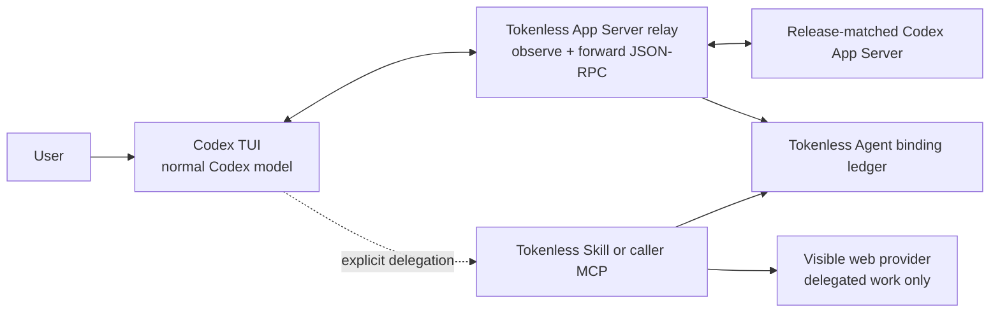

# Codex Guided Delegation and Session Binding

Status: proposed | Priority: P0 | First surface: Tokenless-launched Codex CLI sessions

Depends on: the existing Tokenless routing Skill and packaged CLI/daemon, stable local project identity, and a release-matched Codex App Server adapter

Related: [Agent Session Integrations](P1-agent-session-integrations.md) owns the generic caller MCP interface and later non-Codex adapters; [Web Agent Harness](P0-web-agent-harness.md) owns delegated web-model execution; this roadmap owns always-on Codex guidance plus exact Codex project, thread, and turn binding

Supersedes the previously proposed Codex Intercept Mode as the first Codex delivery. Full custom-model-provider replacement remains a possible future mode, not current implementation scope.

## Outcome

Add an opt-in Codex mode that broadens Tokenless use through durable prompt guidance while leaving Codex's normal model provider and model traffic unchanged. Codex continues to spend its own model tokens, perform local coding work, run tools, and manage approvals. The Codex model may delegate selected work to Tokenless through the existing Skill and later caller MCP surface.

The same opt-in launcher runs Codex through a release-matched App Server control path so Tokenless can bind every observed session to the exact local project, Codex thread/chat, and Codex turn. Provider Project and conversation ids are created and persisted only when that exact Codex thread actually delegates work to Tokenless.

The user-visible invariants are:

> Guided mode changes Codex's durable routing guidance, not its model provider. A normal Codex turn remains a normal Codex turn unless the user or Codex explicitly invokes Tokenless.

> In a Tokenless-launched Codex session, Tokenless knows the exact local project, Codex session tree, thread/chat id, and active turn id before accepting a delegated run. It never guesses identity from display names.

## Progressive Codex Modes

| Mode | Codex model traffic | Tokenless activation | Identity | Status |
| --- | --- | --- | --- | --- |
| `skill` | Unchanged | User or Codex explicitly selects the Tokenless Skill | Explicit invocation metadata; exact App Server binding when launched through Tokenless | Existing baseline |
| `guided` | Unchanged | Always-on `AGENTS.md` policy tells Codex when to invoke the Skill or MCP tool | Exact App Server project, thread, turn, and lineage binding in Tokenless-launched sessions | First new mode |
| `replace` | Tokenless custom model provider | Every supported Codex model request | Full request and model-round correlation | Deferred; not part of this roadmap |

Guided mode begins with one `selective` coverage policy: delegate high-context research, comparison, external-provider, or independently useful reasoning work; keep trivial local inspection, small edits, deterministic commands, and latency-sensitive work in Codex. A later `broad` policy may expand eligible delegation after real usage evidence. Do not introduce several unproven policy presets in V1.

## Why RTK Uses `AGENTS.md` Instead of a Skill

RTK's current Codex integration explicitly describes itself as prompt-level guidance with no programmatic hook. Its behavior must apply to ordinary shell-command decisions across every task and project. That is an always-on working agreement, while a Skill is a reusable task workflow whose activation remains explicit or model-selected.

The repository does not contain a maintainer statement that Skills were evaluated and rejected. The practical explanation is an inference from its implementation and Codex's surfaces:

- RTK needs Codex to consider its command prefix on every relevant tool decision, not only after a Skill is selected;
- global `AGENTS.md` guidance is loaded at the start of every Codex run and therefore provides cross-project awareness;
- a Skill's catalog entry may be present without its full body being loaded for a particular task;
- Codex did not originally expose the input-rewrite semantics RTK needs for a transparent command hook; and
- prompt-level guidance is small and works without replacing Codex's model provider.

This makes RTK's Codex integration broader than a task Skill but weaker than a hook: it relies on the model following instructions and does not guarantee command rewriting.

## What `rtk init --codex` Actually Does

Current RTK source performs persistent filesystem installation rather than runtime system-prompt injection:

1. `rtk init -g --codex` resolves `$CODEX_HOME`, falling back to `~/.codex`.
2. It writes a small embedded awareness document to `$CODEX_HOME/RTK.md`.
3. It appends an absolute `@<CODEX_HOME>/RTK.md` line to `$CODEX_HOME/AGENTS.md`; project-local installation writes `RTK.md` and `AGENTS.md` in the current directory and uses `@RTK.md`.
4. The patch is idempotent, uses atomic writes, migrates an older inline RTK marker block, and preserves unrelated `AGENTS.md` content.
5. Uninstall removes the RTK-owned file and exact reference while preserving other content.
6. A newly launched Codex session discovers the effective global and project `AGENTS.md` files and places their content in the model-visible instruction chain.

The observed system-prompt change comes from step 6. RTK does not call a hidden Codex prompt-injection API.

### Do not copy RTK's fragile parts

Codex's documented `AGENTS.md` discovery loads file contents; it does not document `@other-file.md` as an include directive. Current open-source Codex loaders read the selected global and project files as raw text. RTK also has open reports that `@RTK.md` did not expand and that writing `AGENTS.md` can be ineffective when a non-empty global `AGENTS.override.md` takes precedence.

Tokenless must therefore:

- place a concise Tokenless-owned marker block directly in the effective instruction file;
- patch non-empty `$CODEX_HOME/AGENTS.override.md` when it is the active global source, otherwise patch `$CODEX_HOME/AGENTS.md`;
- never create an override merely to outrank the user's base guidance;
- preserve all unrelated content and refuse malformed Tokenless marker blocks;
- record the exact file, prior digest, installed digest, and marker version;
- verify the installed path appears in App Server `instructionSources`; and
- describe guided behavior as best-effort model policy, never transparent interception.

## Guided Instruction Contract

The installed English instruction block should stay short and stable:

```md
<!-- tokenless-codex-guidance v1 -->
## Tokenless delegation

- Codex remains the primary coding agent and model provider.
- Consider Tokenless for bounded high-context research, comparison, external-provider, or independently useful reasoning tasks.
- Use the installed Tokenless Skill or MCP tools; do not claim that an ordinary Codex turn was routed through Tokenless.
- Keep trivial local inspection, deterministic commands, small edits, and latency-sensitive work in Codex.
- Share only the current bounded goal and explicitly authorized files or context.
- Reuse the current Tokenless project and conversation binding when continuing the same Codex thread.
<!-- /tokenless-codex-guidance -->
```

Localized install, status, repair, and uninstall messages must be available in English and Simplified Chinese. The instruction block remains English because it is internal Agent guidance.

The proposed CLI shape is:

```text
tokenless codex install --mode guided --scope global
tokenless codex status
tokenless codex
tokenless codex uninstall
```

The installer must not replace the `codex` executable, add a shell alias silently, alter Codex authentication, change `model_provider`, or write browser credentials.

## Exact App Server Observation

App Server is the identity and input observation surface, not the model transport. The first supported launcher should use a private local control path:



`tokenless codex` starts a release-matched `codex app-server` on a private Unix socket or another verified local transport, starts a transparent local JSON-RPC relay, then connects the real Codex TUI through `codex --remote`. The relay forwards App Server messages without changing thread, turn, approval, tool, or model semantics and records only the bounded identity events Tokenless owns.

Do not assume a second App Server client receives another client's full thread stream. The relay path makes the observed TUI control connection authoritative and avoids calling `thread/resume` merely to subscribe, which could change session state.

Raw `codex` sessions launched outside this path may still receive global guidance, but Tokenless must report their exact binding as unavailable. Do not scan rollout files or infer the active chat from the most recently modified session.

## Canonical Identity Hierarchy

```text
LocalProjectBinding
└── CodexSessionTree (thread.sessionId)
    ├── CodexThread (thread.id) <-> optional ProviderConversationBinding
    │   └── CodexTurn (turn.id)
    │       └── zero or more explicit Tokenless delegated runs
    └── Child or forked CodexThread <-> separate optional ProviderConversationBinding
```

| Identity | Source | Meaning |
| --- | --- | --- |
| Local project | Canonical `cwd`, repository root, worktree realpath, credential-free Git identity | Exact local project; display name is metadata only |
| Codex session tree | `thread.sessionId` | Root plus descendant grouping; not a chat id |
| Codex chat | `thread.id` | Exact Codex conversation/thread |
| Codex turn | `turn.id` with `threadId` | One user request and the Codex work that follows |
| Lineage | `parentThreadId` and `forkedFromId` | Subagent and fork relationships |
| Provider Project | Provider-native opaque id | Created or resolved only when the local project first delegates to that provider/profile |
| Provider conversation | Provider-native opaque id | One per Codex thread and provider/profile after the first delegation |
| Delegated run | Tokenless job id plus Codex turn id | One explicit Tokenless invocation within the exact Codex turn |

The durable Codex conversation key is `agentKind + thread.id`, not `sessionId`. Descendant threads can share a session tree while remaining different chats.

A Codex-only turn creates no fake provider turn. When delegation occurs, Tokenless appends the delegated request to the provider conversation bound to that Codex thread and records the originating `turn.id`. Poll, resume, and result retrieval remain the same delegated run rather than creating new provider chat turns.

App Server `thread/start`, `thread/resume`, and `thread/fork` responses also return `instructionSources`. Tokenless uses them to prove which guidance file was active for that exact thread. The installed Codex version's generated schema is authoritative; experimental fields remain version-gated.

## Privacy and Failure Semantics

- Observing identity does not authorize uploading the user prompt, transcript, repository files, or App Server item bodies.
- Persist bounded ids, canonical local identity, lineage, versions, timestamps, instruction-source digests, and delegation links by default.
- Share a goal or attachment only through an explicit Skill/MCP invocation and its normal authorization boundary.
- Never inspect Codex authentication, browser secrets, hidden prompts, private reasoning, or macOS Keychain state.
- If App Server compatibility, exact thread identity, or guidance verification fails, guided delegation remains visibly unavailable for that session; Codex itself may continue normally.
- The launcher must never switch Codex's configured model provider or block ordinary Codex work merely because Tokenless is unavailable.

## Delivery Phases

### Phase 0: RTK-Style Guided Installation

- Add `install`, `status`, and `uninstall` for the inline marker block.
- Resolve the effective global `AGENTS.override.md` versus `AGENTS.md` source correctly.
- Preserve unrelated content with atomic, idempotent, reversible edits and a mutation ledger.
- Keep the existing Tokenless Skill as the actual explicit invocation surface.
- Verify behavior through a real built Codex process and a new session, not source-text assertions.

Exit: a fresh Codex session reports the exact installed file in `instructionSources`, summarizes the Tokenless delegation policy correctly, and ordinary prompts still use Codex's configured model provider.

### Phase 1: App Server Launcher and Binding Ledger

- Generate schemas from the installed Codex version.
- Add the private App Server process, transparent relay, and real TUI launch path.
- Record project, worktree, session tree, thread, turn, lineage, source, model provider, and instruction sources.
- Support new, resume, and fork flows without attaching to a guessed latest thread.

Exit: two same-named projects, two Codex threads, a resumed thread, and a fork produce the exact distinct bindings observed through the real App Server boundary.

### Phase 2: Bound Skill and MCP Delegation

- Attach the active project, thread, and turn ids automatically to Tokenless Skill/MCP invocations from a launched session.
- Create or reuse the exact provider Project and provider conversation binding only on delegation.
- Return job, provider Project, provider conversation, and originating Codex turn identity in state output.
- Preserve the same binding across wait, resume, and result retrieval.

Exit: two Codex chats in one project delegate to two distinct provider conversations under one provider Project, while their non-delegated Codex turns remain absent from the provider.

### Phase 3: Bounded Inputs and Capability Awareness

- Observe ordered App Server input items for provenance without treating them as authorization.
- Pass only explicitly selected goals, Skills, attachments, and context references into Tokenless.
- Record stable model, Skill, MCP, hook, and permission capability snapshots needed for diagnostics.
- Keep full model-provider replacement outside this phase.

Exit: each delegated input is attributable to one Codex turn and one explicit authorization decision, and ambient project data is never uploaded.

## Acceptance Criteria

- Guided mode does not configure a Tokenless custom model provider and does not route ordinary Codex model requests through Tokenless.
- The installed marker block is concise, versioned, idempotent, reversible, and preserves all unrelated global or project guidance.
- A non-empty global `AGENTS.override.md` cannot silently hide guidance installed only into `AGENTS.md`.
- Installation does not rely on undocumented `@file.md` expansion.
- App Server `instructionSources` proves the exact guidance source loaded for the current thread.
- Exact binding uses canonical local project identity, `thread.sessionId`, `thread.id`, `turn.id`, and available lineage fields.
- The durable chat key uses `thread.id`; a shared session tree never merges subagent or fork chats.
- Provider Project and conversation ids are absent until delegation and are never guessed from names.
- Two Codex threads in one project reuse the intended provider Project but never share a provider conversation implicitly.
- Sessions not launched through the supported App Server path are reported as unbound rather than matched through recency or transcript scanning.
- Tests exercise the built Tokenless CLI, real filesystem mutations, real Codex App Server/TUI process boundary, and real delegated provider flow without mocks, fixtures, or simulated provider responses.

## Sources Consulted

- [Codex custom instructions with `AGENTS.md`](https://learn.chatgpt.com/docs/agent-configuration/agents-md)
- [Codex App Server](https://learn.chatgpt.com/docs/app-server)
- [OpenAI Codex global instruction loader](https://github.com/openai/codex/blob/main/codex-rs/codex-home/src/instructions/mod.rs)
- [OpenAI Codex project instruction loader](https://github.com/openai/codex/blob/main/codex-rs/core/src/agents_md.rs)
- [RTK Codex integration](https://github.com/rtk-ai/rtk/blob/master/hooks/codex/README.md)
- [RTK Codex installer implementation](https://github.com/rtk-ai/rtk/blob/master/src/hooks/init.rs)
- [RTK report: `@RTK.md` did not resolve](https://github.com/rtk-ai/rtk/issues/842)
- [RTK report: global override precedence](https://github.com/rtk-ai/rtk/issues/1943)
- [RTK discussion: Codex guidance is explicit rather than an implicit hook](https://github.com/rtk-ai/rtk/issues/649)
