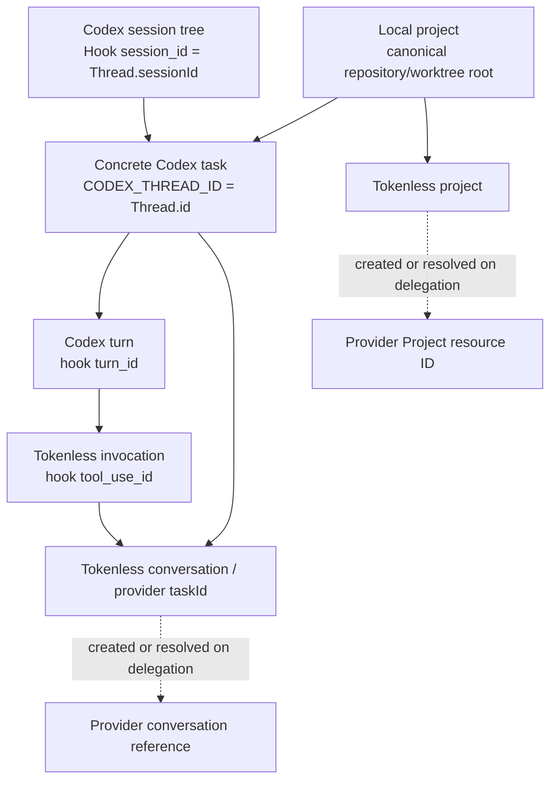

# Codex Guided Delegation and Session Binding

Status: in progress | Priority: P0 | First surface: normally launched Codex sessions

Depends on: the packaged Tokenless CLI, the Web Agent Harness package, durable provider jobs and mappings, Codex `AGENTS.md`, Codex hooks, and a release-compatible Codex App Server

Related: [Web Agent Harness](P0-web-agent-harness.md) owns agent context and delegated web-model execution; [Agent Session Integrations](P1-agent-session-integrations.md) generalizes the adapter contract to agents beyond Codex; the existing Web Provider API owns provider Projects, conversations, jobs, and visible website operations

Supersedes the proposed Tokenless-launched Codex relay and custom-model replacement as the first integration. Tokenless never launches, wraps, proxies, or replaces Codex in this roadmap.

## Outcome

Users start Codex in their normal way. An explicit, reversible Tokenless installation adds two independent capabilities:

1. a concise global instruction block asks Codex to consider Tokenless for bounded delegated work while ordinary Codex work continues to use Codex; and
2. native Codex lifecycle hooks preserve session-tree, turn, and tool-call provenance, while the CLI resolves per-command `CODEX_THREAD_ID` to the concrete chat before provider access.

The integration does not intercept ordinary model traffic, create a Tokenless custom model provider, or try to avoid all Codex token use. Tokenless receives work only when Codex or the user invokes the Tokenless CLI or MCP surface.

The primary invariant is:

> A user-launched Codex session remains a Codex session. When that session explicitly invokes Tokenless, the invocation is correlated to the exact Codex chat, turn, tool call, local project, Tokenless conversation, provider Project, and provider conversation without guessing from names or recency.

## Why RTK Uses `AGENTS.md`

RTK needs guidance to affect ordinary command selection in every task. That is an always-on working agreement, while a Skill is a task workflow that may or may not be selected and loaded for a particular request. RTK therefore installs prompt-level guidance instead of relying on Skill activation.

RTK performs persistent filesystem installation. It writes `RTK.md` and adds an `@.../RTK.md` reference to an `AGENTS.md`; a new Codex session then loads the effective instruction file. There is no hidden runtime system-prompt injection API involved.

Tokenless adopts the useful prompt-level property but not the undocumented include assumption. Codex documents file discovery and precedence, not `@file.md` expansion. Tokenless writes its small marker block directly into the effective global instruction file.

## What `AGENTS.override.md` Actually Overrides

Within one directory, a non-empty `AGENTS.override.md` is selected instead of `AGENTS.md`. It does not erase developer, system, or nearer project instructions, and it is not merged with the same-directory `AGENTS.md` by Codex.

The installer therefore:

- patches an existing non-empty `$CODEX_HOME/AGENTS.override.md` because it is the active global file;
- otherwise patches `$CODEX_HOME/AGENTS.md`;
- never creates `AGENTS.override.md` merely to outrank the user's file;
- preserves all unrelated content;
- applies one versioned inline marker block idempotently; and
- removes only its own marker block during uninstall.

This behavior is verified through the built CLI and real filesystem boundaries.

## Installed Guidance Contract

The installed block is internal English agent guidance:

```md
<!-- tokenless-codex-guidance v1 -->
## Tokenless delegation

- Codex remains the primary coding agent and model provider.
- Consider Tokenless for bounded high-context research, comparison, external-provider, or independently useful reasoning tasks.
- Use the installed Tokenless Skill, CLI, or MCP tools only when delegation is useful.
- Keep trivial local inspection, deterministic commands, small edits, and latency-sensitive work in Codex.
- Share only the current bounded goal and explicitly authorized files or context.
- Reuse the hook-supplied Tokenless project and conversation identity; do not invent or replace it.
- Do not start Codex through Tokenless. The user starts Codex normally.
<!-- /tokenless-codex-guidance -->
```

Guidance is best-effort prompt policy. Exact invocation correlation is a separate programmatic hook capability.

## Native Hook Integration

The public commands are:

```bash
tokenless agents install codex
tokenless agents status codex
tokenless agents inspect codex --chat-id <codex-thread-id>
tokenless agents uninstall codex
```

Installation merges Tokenless-owned groups into `$CODEX_HOME/hooks.json` for:

- `SessionStart`
- `UserPromptSubmit`
- `PreToolUse`
- `PostToolUse`
- `Stop`
- `SessionEnd`

Other hook definitions remain untouched. Codex requires the user to restart and trust the installed hook definition through `/hooks`; Tokenless does not bypass that security decision.

The `PreToolUse` handler reacts only to an actual Tokenless Bash command or Tokenless MCP tool. For Bash, it prepends hook-owned environment variables. For MCP, it adds an equivalent structured `tokenlessContext` object. An explicit conflicting `--task-id` is rejected before provider access, so a caller cannot silently replace the bound conversation.

Hook failures never block ordinary Codex work. They make automatic Tokenless continuity unavailable for that invocation and return a diagnostic system message.

## Exact Identity Hierarchy



| Identity | Authoritative source | Durable meaning |
| --- | --- | --- |
| Local project | Canonical Git/worktree root resolved from hook `cwd` | Stable local project; display name is metadata |
| Codex chat | Per-command `CODEX_THREAD_ID`, optionally confirmed by App Server `thread.id` | One exact concrete Codex conversation, including descendants |
| Codex session tree | Hook `session_id`, confirmed when available by App Server `thread.sessionId` | Immutable Hook provenance and root/descendant grouping; not the concrete chat ID |
| Codex turn | Hook `turn_id` | One user round inside the chat |
| Tool invocation | Hook `tool_use_id` | One explicit Tokenless call inside the turn |
| Tokenless project | Harness deterministic opaque project ID | Local project binding owned by the Harness |
| Tokenless conversation | Harness deterministic opaque conversation ID and stable provider `taskId` | One Tokenless conversation for one Codex chat |
| Provider Project | Web Provider API mapping `resource_id` | Real provider-native Project, when available |
| Provider conversation | Web Provider API mapping `canonical_url` | Real provider conversation used for continuation |

`hook.session_id` is the session-tree/root identity shared by descendants, while `CODEX_THREAD_ID` is the concrete thread identity injected into each shell execution. They are equal for a root task and differ for descendants. Tokenless stores the Hook value as immutable provenance, keys the Tokenless conversation by the concrete thread, and never merges chats merely because they share a session tree.

## App Server Role

Hooks provide authoritative session-tree, turn, and tool-call provenance. On an actual Tokenless CLI execution, `CODEX_THREAD_ID` supplies the concrete thread. The Harness starts a short-lived independent `codex app-server --listen stdio://` client and calls `thread/read` for that concrete ID when available. This enriches the binding with:

- App Server `thread.id` confirmation;
- session tree ID;
- parent/fork lineage when available;
- canonical thread `cwd`, source, and credential-free Git metadata.

This read does not start a Codex TUI, resume the thread, proxy another control connection, or subscribe to model traffic. It is bounded and best-effort because the hook IDs already establish exact live correlation. Failure to enrich does not make the hook invent a replacement ID.

The repository includes an explicit real App Server E2E that starts the installed `codex app-server`, materializes a thread without a model request, and proves that the independently packaged Harness can read the same thread and session tree.

## Harness and Provider Boundaries

The Web Agent Harness owns:

- the separate `harness.sqlite3` agent-context ledger;
- Codex adapter installation and hook handling;
- canonical local project identity;
- agent chat, turn, tool-call, lineage, and invocation records;
- stable Tokenless project/conversation IDs and provider `taskId`; and
- the binding from those IDs to provider mapping results.

The Web Provider API owns:

- managed provider/profile selection;
- real provider Project and conversation discovery/creation;
- durable jobs and provider-visible execution; and
- the authoritative provider mapping records.

The CLI transports an opaque upstream context envelope into a provider job and returns normal `providerContext` mapping fields. A bound CLI records the result directly before printing it; `PostToolUse` remains an idempotent fallback and is the structured completion path for MCP calls. Provider code does not parse Codex hooks or own the agent hierarchy.

## Persistence and Privacy

The Harness database stores bounded identifiers, canonical project paths, hashes, lifecycle timestamps, provider mapping references, and job IDs. It does not store the raw Codex prompt, transcript, assistant message, tool response, repository contents, credentials, browser state, or private reasoning. Prompt and tool input correlation uses SHA-256 digests.

Provider Project and conversation mappings remain absent until the exact Codex chat delegates to Tokenless and the Web Provider API observes them. A Codex-only turn creates no fake provider turn.

## Implemented Slice

- Built CLI install, status, inspect, and uninstall commands.
- Correct `AGENTS.override.md` precedence and reversible inline guidance.
- Idempotent merging of six native hook lifecycle events.
- Exact hook binding for chat, turn, tool call, project, and Tokenless conversation.
- App Server thread/session-tree enrichment through the real stdio protocol.
- Hook-supplied context enforcement at the CLI boundary.
- Concrete CLI task rebinding through `CODEX_THREAD_ID` with immutable Hook provenance and fail-closed stale-binding/project checks.
- Opaque upstream context in provider job envelopes.
- Provider Project/conversation result capture and next-turn provider/profile reuse.
- Separate Harness-owned SQLite storage with raw prompt exclusion.
- Real built-CLI/filesystem integration coverage and an explicit real App Server E2E.

## Release Evidence and Remaining Gate

The focused built CLI/filesystem integration suite and explicit real Codex App Server matrix pass on Windows, including concrete task rebinding, Hook provenance completion, multiple workspaces, forks, Luna, and `xhigh`. The full default repository suite and the manually gated Cloak real-provider Project/conversation matrix remain release gates.

Custom-model replacement, complete Codex request interception, and Tokenless-launched Codex remain out of scope.

## Acceptance Criteria

- Users launch Codex normally; Tokenless installs no wrapper, alias, relay, or custom model provider.
- Ordinary Codex turns remain ordinary Codex turns until an explicit Tokenless tool call occurs.
- A non-empty global `AGENTS.override.md` cannot hide guidance installed only into `AGENTS.md`.
- Guidance and hooks are idempotent, reversible, atomic, and preserve unrelated user content.
- The user explicitly trusts hooks in Codex; Tokenless never bypasses hook trust.
- Hook `session_id`, `turn_id`, and `tool_use_id` preserve the exact session-tree, round, and invocation provenance.
- `CODEX_THREAD_ID` is the concrete CLI/shell chat identity; App Server `thread.id` may confirm it, and `thread.sessionId` never substitutes for it.
- `PostToolUse` can complete the same binding after it has been rebound from the Hook root to a concrete descendant.
- One Codex chat reuses one Tokenless conversation and provider `taskId`; a different chat gets a different conversation.
- Provider Project and conversation IDs come only from the Web Provider API's observed mappings.
- The agent-context ledger contains no raw prompt or transcript text.
- Tests cross the built CLI, real filesystem, packaged Harness, real SQLite, and real Codex App Server boundaries without mocks or fake provider claims.

## Sources Consulted

- [Codex custom instructions with `AGENTS.md`](https://developers.openai.com/codex/guides/agents-md)
- [Codex hooks](https://developers.openai.com/codex/config/hooks)
- [Codex App Server](https://developers.openai.com/codex/app-server)
- [OpenAI Codex global instruction loader](https://github.com/openai/codex/blob/main/codex-rs/codex-home/src/instructions/mod.rs)
- [OpenAI Codex project instruction loader](https://github.com/openai/codex/blob/main/codex-rs/core/src/agents_md.rs)
- [RTK Codex integration](https://github.com/rtk-ai/rtk/blob/master/hooks/codex/README.md)
- [RTK installer implementation](https://github.com/rtk-ai/rtk/blob/master/src/hooks/init.rs)
