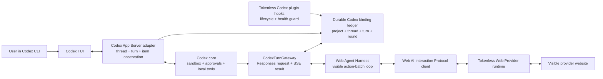

# Codex Intercept Mode

Status: proposed | Priority: P0 | First surface: Tokenless-launched Codex CLI sessions

Depends on: [Web AI Interaction Protocol](P0-web-ai-interaction-protocol.md), [Web Agent Harness](P0-web-agent-harness.md), durable provider workspace and conversation identity, and the existing authenticated local daemon

Related: [Agent Session Integrations](P1-agent-session-integrations.md) owns the explicit caller MCP mode and generic Agent bindings; this roadmap owns the opt-in Codex mode in which Codex model traffic, identity, turn lineage, and supported input items are routed through Tokenless

## Outcome

Add an opt-in Codex integration mode that makes Tokenless the selected Codex model provider for every model request in a Tokenless-launched session. Codex remains the local coding harness: it owns its UI, sandbox, approvals, local tools, file edits, and thread history. Tokenless owns the Responses-compatible model transport, exact mapping to provider Projects and conversations, Web Agent Harness execution, and durable correlation across Codex turns and provider-side work.

The user-visible invariant is:

> In a healthy Tokenless-launched Codex intercept session, every supported Codex model request is accepted by the local Tokenless Responses gateway and is completed through the selected visible provider workflow. Tokenless never silently falls back to the built-in OpenAI provider.

This is an execution mode, not a security boundary over arbitrary Codex processes. A user can launch Codex without Tokenless, disable an unmanaged hook, or override local configuration. Tokenless therefore guarantees interception only for sessions started through its verified launcher or another explicitly supported managed integration.

## Two Codex Integration Modes

| Mode | Codex model provider | How Tokenless is invoked | Identity fidelity | Intended use |
| --- | --- | --- | --- | --- |
| `explicit` | Normal Codex provider | Codex calls Tokenless through the caller MCP interface or CLI | Exact identity when supplied by the adapter; no claim that unrelated Codex turns use Tokenless | Individual delegated web-provider tasks |
| `intercept` | Local Tokenless Responses gateway | Every supported Codex model request is routed to Tokenless automatically | Codex session-tree, thread, turn, request-kind, lineage, and supported input-item correlation | Running Codex itself on top of Tokenless and the Web Agent Harness |

Do not overload the existing provider or task `--mode` vocabulary. The eventual CLI should place this choice under an Agent integration surface, with a shape such as `tokenless codex install --mode intercept` and `tokenless codex`, subject to CLI naming review before implementation.

## Research Findings and Decision

### Hooks are necessary but not the model transport

Current Codex hooks expose `SessionStart`, `UserPromptSubmit`, `PreToolUse`, `PostToolUse`, `Stop`, `SessionEnd`, compaction, permission, and subagent lifecycle events. They carry a Codex thread identity, turn identity on turn-scoped events, `cwd`, model, prompt text, tool inputs and outputs, and selected final-message fields.

They are not sufficient for full interception:

- `UserPromptSubmit` can add context or block a prompt, but it cannot replace the model response stream;
- the hook prompt field is text-only and does not preserve the complete App Server `UserInput` union;
- hosted tools do not use the local function-tool hook path;
- specialized tool paths may opt out of the default hook path;
- hooks can be disabled or remain untrusted unless installed through a managed policy; and
- the transcript path is explicitly unstable and must not become the primary integration contract.

Hooks remain useful for lifecycle reconciliation, health warnings, and fail-closed verification that a purported intercept session is registered with the daemon.

### The Codex custom model provider is the interception seam

Codex supports custom model providers through `model_provider` and `[model_providers.<id>]`. Current Codex accepts the Responses wire format. A Tokenless integration can therefore configure a local provider whose `base_url` targets an authenticated loopback Responses gateway.

This is the only documented Codex seam that naturally receives every model request and returns streamed assistant messages and tool calls without replacing Codex's local coding harness.

### App Server is the authoritative Agent-observation seam

Codex App Server exposes the durable `Thread -> Turn -> Item` hierarchy, full `UserInput` items, thread lineage, working directory, model provider, skills, hooks, MCP server status, model input modalities, permission profiles, and provider capability bounds.

For the locally generated Codex 0.146.0 schema:

- a `Thread` has `id`, session-tree `sessionId`, `parentThreadId`, `forkedFromId`, `cwd`, `gitInfo`, `modelProvider`, source, and turns;
- a `Turn` has its own id, status, timestamps, and items;
- `UserInput` includes text, remote and local image, remote and local audio, skill, and mention variants; and
- a user message item retains the ordered `UserInput` array.

The first production integration must generate bindings from the installed Codex version. Checked-in assumptions about App Server experimental fields are not a compatibility guarantee.

### Comparable projects prove different slices

- CC Switch proves that Codex can be pointed at a loopback Responses gateway and that a production bridge must preserve SSE, reasoning, tool calls, model catalogs, request correlation, and rollback-safe configuration. Its upstream is normally an HTTP model provider; Tokenless must instead terminate the request in the Web Agent Harness and a visible provider website.
- Oh My Codex proves Codex plugin packaging, plugin-scoped lifecycle hooks, trust handling, session-scoped runtime state, and bounded hook input processing. It does not replace the Codex model transport.
- RTK's current Codex integration is prompt-level `AGENTS.md` plus `RTK.md` guidance and explicitly states that it has no programmatic Codex hook. RTK's transparent rewrite architecture is relevant to other agents, but it is not evidence that current Codex conversations are fully intercepted by RTK.

## Deep Module and Seams

The external runtime seam should be one deep module:

```ts
interface CodexTurnGateway {
  accept(request: CodexResponsesRequest): AsyncIterable<CodexResponsesEvent>;
}
```

The caller supplies a valid Codex Responses request. The module hides:

- version-specific Codex metadata parsing;
- hook and App Server observation reconciliation;
- project, workspace, conversation, turn, and request-round resolution;
- attachment and selected-Skill manifests;
- Web Agent Harness invocation;
- Responses SSE encoding;
- function/custom tool-call translation;
- idempotency, recovery, cancellation, and ambiguous-dispatch handling; and
- provider capability and model-catalog projection.

Installer, launcher, status, and uninstall commands are adapters around this module. Hooks and App Server are internal observation adapters, not separate caller-facing interfaces.



The App Server adapter may initially be implemented through a Tokenless-launched App Server and verified local control connection. If multi-client observation does not expose the exact required input items without side effects, use a transparent local App Server transport adapter. Do not parse rollout files as the primary solution.

## Canonical Identity Hierarchy

Names are never identity. Persist opaque source ids and explicit lineage:

```text
LocalProjectRef
└── ProviderWorkspaceBinding (one per provider + profile)
    └── CodexSessionTree (sessionId; root plus descendant threads)
        ├── CodexThread (threadId) <-> ProviderConversationBinding
        │   └── CodexTurn (turnId) <-> TokenlessLogicalTurn
        │       ├── ModelRound 0..N
        │       │   ├── Codex Responses request/result
        │       │   └── Provider message exchange(s)
        │       └── InputItem / ToolItem / ArtifactRef
        └── Descendant CodexThread (parentThreadId) <-> separate ProviderConversationBinding
```

| Identity | Durable key and meaning | Provider mapping |
| --- | --- | --- |
| Local project | Canonical project root, worktree identity, and credential-free repository identity | One exact native provider Project/workspace per provider and profile when supported |
| Codex session tree | `sessionId`, shared by a root thread and its descendants | Grouping and lineage only; never a provider conversation id |
| Codex thread | `threadId`, with optional `parentThreadId` and `forkedFromId` | One exact provider conversation/chat |
| Codex turn | `turnId` within one thread | One Tokenless logical turn in that provider conversation |
| Model round | Monotonic round index within one turn plus request digest | One or more provider message exchanges needed to obtain an action batch or final answer |
| Item | Codex/App Server item id or a Tokenless content-addressed input reference | Attachment, tool call, tool result, citation, or artifact evidence |

One Codex turn can contain multiple model requests because Codex may execute a tool and send its result back to the model. Those requests must remain under one logical turn; pretending that every model request is a new user turn would corrupt the hierarchy the user expects.

Root and descendant threads share the provider Project but use separate provider conversations by default. A subagent must never inherit the parent provider conversation merely because it shares `sessionId`. A fork creates a new provider conversation with recorded source lineage; it is exact continuation only if the selected provider and Harness can prove that semantic outcome.

Compaction, prewarm, memory, review, and other non-normal request kinds must be classified explicitly. Auxiliary model work must not pollute the user's main provider conversation. Unsupported request kinds fail before provider mutation rather than silently weakening the interception guarantee.

## Codex Request Correlation

Current Codex source constructs Responses client metadata containing separate values for:

- `session_id`;
- `thread_id`;
- `turn_id`;
- window id and request kind;
- fork and parent thread lineage;
- parent turn and subagent kind where applicable; and
- bounded workspace and Git state.

The gateway should prefer the canonical `client_metadata["x-codex-turn-metadata"]` snapshot when present, cross-check its flat projections, and reject conflicting reserved fields. The exact accepted shape is versioned by a Codex adapter.

`previous_response_id` is a response cursor, not a durable Codex thread identity. It must never be used as the provider Project or conversation key.

For each request, persist intent before visible provider mutation. Deduplicate by the exact Codex hierarchy plus a canonical request digest. If the provider send action becomes ambiguous, preserve `ambiguous` dispatch certainty and do not replay automatically.

## Attachments, Skills, and Agent Capabilities

### Turn input manifest

The App Server adapter produces an ordered, versioned manifest for each user message:

- text fragments and UI text elements;
- remote or local images with requested detail;
- remote or local audio;
- explicitly selected Skill name and path;
- explicit file mentions and paths; and
- a content digest, local authorization decision, size/media type, and delivery result for every shareable item.

Do not treat every file Codex reads during repository work as an attachment. Only explicit user/Agent input items and separately authorized context exports may be staged or uploaded. Local paths remain local metadata and must not be exposed to the provider when a content-addressed display name is sufficient.

The Responses request remains the transport authority for what the model actually received. The App Server manifest supplies source provenance and fidelity checks. If they disagree, intercept mode fails before a provider mutation.

### Capability snapshot

At session start and when invalidated, record a bounded `CodexCapabilitySnapshot` from stable App Server methods where available:

- `model/list`, including input modalities and reasoning-effort options;
- `modelProvider/capabilities/read`, including namespace tools, image generation, and web search bounds;
- `skills/list` and selected Skill input items;
- `hooks/list`;
- `mcpServerStatus/list`, including tool and authentication availability; and
- `permissionProfile/list` and effective sandbox/approval settings.

Under-development plugin methods may inform diagnostics but must not become a production prerequisite until Codex documents them as stable.

The Tokenless model catalog advertises only capabilities the complete Codex -> Tokenless -> Harness -> visible-provider path can satisfy. Disable hosted web search, image generation, audio, namespace tools, or another surface until the route is implemented and verified. UI availability must never exceed transport truth.

## Responses Compatibility Profile

The gateway is an adapter at the Codex model-provider seam, not a replacement for the canonical Web AI Interaction Protocol.

The first supported slice must include:

- authenticated loopback `POST /v1/responses`;
- Responses streaming SSE with correct creation, item, delta, completion, and error ordering;
- text input and assistant output;
- Codex function tools and the active patch/shell tool profile required by the selected model catalog;
- tool-call ids and tool-result correlation across multiple model rounds in one Codex turn;
- cancellation and client disconnect handling;
- explicit request-kind classification;
- stable usage fields where Codex requires them, without inventing provider token counts; and
- a precise unsupported-feature error before any provider mutation.

The Web Agent Harness translates a visible provider action batch into Codex-compatible tool-call output. Codex executes the tool under its existing sandbox and approval policy. The next Responses request carries the result; the gateway appends that result to the same provider conversation and resumes the same logical turn.

The gateway must not claim OpenAI-compatible parity for semantics it cannot represent, including exact provider Project identity, visible attachment acceptance, waiting for user intervention, or ambiguous dispatch. Those remain native Tokenless protocol and durable-state concepts behind the adapter.

## Installation, Launch, and Uninstall

The installer must be reversible and additive:

1. detect the installed Codex version and generate or select its adapter schema;
2. create a Tokenless-specific Codex profile or scoped runtime configuration instead of replacing unrelated user configuration;
3. configure a `tokenless` custom model provider with `wire_api = "responses"` and a loopback base URL;
4. use command-backed bearer authentication or another non-logged local credential handoff rather than storing a raw daemon token in checked-in or broadly readable config;
5. install the Tokenless plugin hooks and require normal Codex hook review unless an administrator supplies managed policy;
6. install a Tokenless-owned model catalog that exposes only verified capabilities;
7. preserve unrelated MCP servers, plugins, hooks, profiles, model providers, and official authentication; and
8. record an exact mutation ledger so uninstall removes only Tokenless-owned entries and restores any replaced values safely.

The launcher verifies daemon health, gateway authentication, App Server compatibility, plugin-hook state, active `modelProvider`, and model catalog before allowing the first prompt. A failed check stops launch with repair instructions. It must not fall back to a non-Tokenless model provider.

Never modify `auth.json`, inspect Codex or browser credentials, call macOS Keychain tooling, or weaken browser Keychain behavior. Provider website authentication remains inside the user-controlled managed browser profile.

## Failure and Privacy Semantics

- Intercept mode fails closed when identity metadata is missing, contradictory, stale, or from an unsupported Codex version.
- Provider unavailability, user login, CAPTCHA, MFA, consent, and ambiguous dispatch become durable Tokenless waiting/failure states and a valid Responses error or bounded user-input flow.
- A daemon crash after provider dispatch must resume from the durable ledger rather than submitting a duplicate message.
- Hooks never upload prompts, transcripts, attachments, or repository files by themselves.
- Transcript reading remains optional, consented, version-detected, bounded, and unnecessary for the primary flow.
- Do not store hidden reasoning. Store only the Codex and provider outputs that their supported interfaces intentionally expose.
- Do not log bearer credentials, hidden provider headers, raw browser state, full DOM, or unrelated account content.

## Delivery Phases

### Phase 0: Release-Matched Feasibility Proof

- Generate App Server TypeScript and JSON schemas from the installed Codex version.
- Record the exact custom-provider request, client metadata, request-kind, SSE, tool, image, Skill, mention, fork, and subagent shapes through a built Codex client and a real Tokenless/provider execution boundary.
- Prove whether the App Server control connection can observe exact input items without mutating or resuming the wrong thread; choose multi-client observation or a transparent local transport adapter from evidence.
- Verify CLI, resume, fork, compaction, and one subagent request path.
- Confirm that a Tokenless-owned model catalog can disable unsupported hosted capabilities.

Exit: one evidence record establishes a release-matched identity matrix and identifies every model request that must be supported before the mode can claim complete interception.

### Phase 1: Durable Codex Binding Ledger and Reversible Installer

- Add versioned local-project, Codex session-tree, thread, turn, model-round, item, and lineage records.
- Correlate Responses metadata, App Server observations, and hook events without using transcript parsing as the primary source.
- Add additive profile/config/plugin installation, health inspection, exact mutation ledger, and uninstall.
- Add an authenticated loopback gateway with request persistence before execution.

Exit: two same-named projects in different worktrees, two threads in one project, a resumed thread, a fork, and a subagent all resolve to distinct expected bindings before any provider mutation.

### Phase 2: Root-Thread Text and Tool-Loop Vertical Slice

- Route a normal root-thread text turn through the Web Agent Harness and a real ChatGPT visible session.
- Convert one visible action batch into a Codex tool call, accept the real Codex tool result on the next model round, and return a final assistant message through valid Responses SSE.
- Preserve one provider Project, one provider conversation, one logical Codex turn, and multiple model rounds.
- Prove cancellation, daemon restart, provider wait, ambiguous dispatch, and no silent fallback.

Exit: the built Tokenless launcher runs one real Codex coding turn whose model traffic is served entirely by Tokenless, whose local command remains governed by Codex, and whose provider conversation can be resumed exactly.

### Phase 3: Exact Inputs and Capability Projection

- Add the complete supported App Server `UserInput` manifest and explicit file authorization.
- Support and verify local/remote images, audio only where the full route supports it, selected Skills, and file mentions.
- Project the exact Tokenless capability set into the Codex model catalog and App Server capability reads.
- Reject unsupported input modalities and hosted capabilities before provider mutation.

Exit: each advertised input type and selected Skill is correlated to one Codex turn, visibly accepted by the exact provider conversation, retained across continuation where required, and never inferred from ambient file access.

### Phase 4: Lineage and Auxiliary Request Kinds

- Give each subagent and fork its own provider conversation under the correct provider Project.
- Preserve `sessionId`, `threadId`, parent, fork, parent-turn, agent kind, and model-round lineage.
- Add isolated handling for prewarm, compaction, memory, review, and other observed request kinds without polluting the main provider conversation.
- Support resume across Codex, daemon, browser, and provider restarts.

Exit: root, fork, and descendant threads remain isolated and resumable, and every observed model request kind is either fully served through Tokenless or blocks launch with an explicit unsupported-version/capability result.

### Phase 5: Additional Codex Surfaces

- Evaluate VS Code and Codex desktop/app sessions against the same generated schemas and interception conformance suite.
- Add a surface only when Tokenless can verify model-provider selection, observe exact input items, preserve approvals, and uninstall cleanly.
- Keep surface-specific behavior in Codex adapters behind the same `CodexTurnGateway` interface.

Exit: each advertised Codex surface passes the same hierarchy, input, tool-loop, restart, failure, privacy, and no-fallback acceptance matrix.

## Acceptance Criteria

- Every supported model request in a Tokenless-launched intercept session reaches the authenticated local gateway with exact session-tree, thread, turn, model-round, and request-kind correlation.
- The active App Server thread reports `modelProvider: "tokenless"`; a conflicting provider blocks the session before the first prompt.
- Two local projects with the same display name never share a provider Project unless the user explicitly binds them.
- Two Codex threads in one project use separate provider conversations; resuming either thread continues its exact conversation.
- A Codex turn with multiple tool rounds remains one logical turn and does not create duplicate provider conversations or user turns.
- Root and subagent threads share only the intended project context and never share a provider conversation implicitly.
- Explicit images, audio, Skills, and mentions retain ordered provenance and delivery evidence; ambient files and transcripts are not uploaded.
- Fork and compaction behavior is represented honestly and cannot be mistaken for exact continuation when the provider cannot prove it.
- Missing daemon state, unsupported Codex versions, unsupported capabilities, auth blockers, and ambiguous provider dispatch fail closed without switching to OpenAI or another provider.
- Install and uninstall preserve official Codex authentication and every unrelated config, hook, plugin, MCP server, and model provider entry.
- Verification uses the built Codex client, packaged Tokenless daemon and Harness, real filesystem and local process boundaries, a setup-managed browser profile, and the real provider website without mocks, fixture routes, interception, or simulated provider responses.

## Sources Consulted

- [Codex hooks](https://learn.chatgpt.com/docs/hooks)
- [Codex App Server](https://learn.chatgpt.com/docs/app-server)
- [Codex custom model providers](https://learn.chatgpt.com/docs/config-file/config-advanced#custom-model-providers)
- [OpenAI Codex Responses metadata implementation](https://github.com/openai/codex/blob/main/codex-rs/core/src/responses_metadata.rs)
- [CC Switch Codex provider bridge](https://github.com/farion1231/cc-switch/tree/main/src-tauri/src/proxy/providers)
- [Oh My Codex plugin hooks](https://github.com/Yeachan-Heo/oh-my-codex/tree/main/plugins/oh-my-codex/hooks)
- [RTK Codex integration](https://github.com/rtk-ai/rtk/blob/master/hooks/codex/README.md)
