# Context Delivery and Workspace Alignment

Status: in progress | Priority: P0

Depends on: provider capability inspection, conversation continuation, file staging, and workspace handling

## Outcome

Tokenless can carry the right authorized context into the exact provider Project or conversation, including a completely new chat. The receiving web agent should understand the task, repository rules, relevant files, prior decisions, and completion criteria without relying on a guessed project name or an unstructured prompt dump.

This roadmap concerns how Tokenless represents, filters, transports, verifies, and refreshes context. It does not attempt to reproduce every provider-specific feature.

The first provider-neutral transport contract is implemented as `tokenless.context-envelope.v1` on every managed Playwright job. It binds task identity and the implication-complete capability set to role-bearing instructions, caller-selected attachment provenance, output language/format, token/deadline constraints, optional upstream agent state, and SHA-256 delivery receipts for the exact prompt actions. The job validator proves that instructions are present in delivered prompt actions and that references exactly match staged attachments; automatic provider fallback revalidates and replays the same envelope. Context transport planning, visible per-source acceptance receipts, native workspace mapping, incremental refresh, and source-level budgeting remain the broader phases below.

## Core Contract: Context Envelope

Introduce a versioned provider-neutral `ContextEnvelope`. It should preserve semantic roles even when the destination provider cannot.

| Layer | Examples | Required metadata |
| --- | --- | --- |
| Identity | agent session, task, project root, worktree, provider workspace | origin, stable id, scope |
| Goal | requested outcome and done conditions | author, timestamp, priority |
| Instructions | repository rules, user constraints, explicitly exported agent instructions | origin, precedence, share policy |
| Working state | plan, decisions, open questions, changed files, test status | freshness and producing session |
| Sources | selected files, generated summaries, architecture and graph artifacts | path label, digest, size, provenance |
| Provider intent | target Project/conversation, desired model or mode, continuation policy | requested and resolved values |
| Limits | file count, byte budget, context budget, expiry | enforced values and omissions |

The envelope is stored locally as structured data. Provider adapters receive a bounded transport plan, not unrestricted access to the repository or agent transcript.

## Instruction and System-Prompt Policy

Tokenless should preserve an instruction's role and precedence, but it may only transmit material the caller is authorized to share.

Allowed sources include:

- repository-owned instructions such as `AGENTS.md`;
- user prompts and user-approved task context;
- Tokenless's public task wrapper;
- an agent's explicit export of shareable system or workflow instructions; and
- generated project summaries whose sources and digests are recorded.

Tokenless must not scrape or reconstruct concealed host, platform, developer, safety, or provider system prompts. Secrets, credentials, private chain-of-thought, and unrelated transcript content are excluded.

Destination mapping is capability-based:

1. Native Project or workspace instructions, when visible creation and update are proven.
2. A provider-supported instruction or preset surface, when the scope and success postcondition are proven.
3. A generated instruction artifact attached to the Project or conversation.
4. A clearly delimited prompt preamble for conversation-scoped fallback.

The result reports the actual mapping, such as `native_project_instructions`, `attached_instruction_artifact`, or `conversation_preamble`. A fallback must never be reported as native system-prompt delivery.

## Context Resolution Pipeline

```mermaid
flowchart LR
  Sources["Authorized sources"]
  Resolve["Resolve scope and precedence"]
  Policy["Redact and apply share policy"]
  Budget["Select, summarize, and shard"]
  Map["Map to provider capabilities"]
  Deliver["Deliver through visible controls"]
  Verify["Verify visible acceptance"]
  Receipt["Store context receipt"]

  Sources --> Resolve --> Policy --> Budget --> Map --> Deliver --> Verify --> Receipt
```

A context receipt records:

- envelope revision and source digests;
- provider, managed profile, and exact workspace or conversation identity;
- each delivered artifact and visible acceptance state;
- instruction mapping and any semantic degradation;
- omitted sources and reasons;
- delivery timestamp and expiry; and
- the job that produced the proof.

## Delivery Phases

### Phase 0: Contract and Threat Model

- Define `ContextEnvelope`, `ContextTransportPlan`, and `ContextReceipt` schemas.
- Define instruction precedence, shareability labels, expiry, provenance, and redaction.
- Establish deterministic size and file-count budgeting.
- Keep raw paths private in daemon and provider-visible results.

Exit: the same input envelope resolves deterministically without provider-specific conditionals in the context core.

### Phase 1: Conversation Bootstrap

- Render a stable, delimited context preamble for a new conversation.
- Attach selected files with existing integrity and project-root containment checks.
- Include goal, constraints, done conditions, repository guidance, and omission notices.
- Capture the exact conversation URL only after visible submission succeeds.

Exit: a new conversation can receive a bounded context package and return a receipt that states what was accepted.

### Phase 2: Native Workspace Alignment

- Use `workspace.ensure` only when native creation or selection is fully proven.
- Resolve provider workspace identity to a stable provider resource id or canonical URL.
- Upload or update instruction artifacts before the task prompt.
- Keep conversation fallback explicit when native workspace support is unavailable.

Exit: Tokenless can distinguish native Project alignment from same-conversation continuity and can prove the selected destination.

### Phase 3: Incremental Context Refresh

- Compare source digests with the last receipt.
- Upload changed shards only.
- Retire superseded artifacts when the provider visibly supports safe replacement; otherwise add a versioned manifest that identifies the active revision.
- Invalidate receipts when the project root, worktree, provider profile, workspace identity, or sharing policy changes.

Exit: repeated tasks avoid re-sending unchanged context while never silently reusing stale or cross-scope material.

### Phase 4: Agent-Aware Context

- Accept exact agent session identity and working directory from the Agent Session Integration roadmap.
- Import explicitly shareable plan, decision, and task-state exports.
- Produce a compact continuation capsule for handoff between the local agent and web agent.
- Return the web result with enough identity and context-revision information for the originating agent to reconcile it.

Exit: context round-trips remain attributable to one agent session, one project/worktree, and one provider workspace.

## Acceptance Criteria

- A new provider chat receives repository guidance and task constraints without depending on earlier conversation history.
- Every delivered instruction and file has provenance and an explicit sharing decision.
- The result distinguishes requested context from visibly accepted context.
- Native workspace, instruction-artifact, and conversation-preamble outcomes are distinguishable in JSON.
- Context from one project, worktree, profile, or agent session cannot be reused in another scope.
- A changed source digest invalidates or refreshes the corresponding receipt.
- Sensitive paths, credentials, hidden prompts, and unrelated transcript content are not transmitted.
- Real integration or browser E2E tests prove the built CLI, local daemon, filesystem staging, provider page, and visible acceptance outcome.

## Risks and Responses

| Risk | Response |
| --- | --- |
| Prompt injection inside repository files | Preserve source boundaries, label untrusted content, and keep authoritative instructions separate |
| Provider cannot represent instruction roles | Use an explicit artifact or preamble and report semantic degradation |
| Context package exceeds provider limits | Deterministic budgeting, summaries with provenance, shards, and omission reporting |
| Stale context remains in a provider Project | Versioned manifests, digests, expiry, and an active-revision marker |
| A broad transcript leaks unrelated data | Default-deny source selection and explicit agent export instead of ambient transcript scraping |
| Workspace selected by name is ambiguous | Bind to exact resource identity or fail closed |

## Non-Goals

- Cloning an agent's hidden system prompt
- Uploading an entire repository or transcript by default
- Claiming that a prompt preamble is equivalent to a provider-native system role
- Guessing a Project from its display name
- Bypassing provider-visible file and workspace controls
