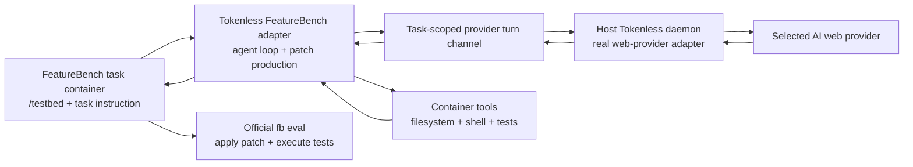

# FeatureBench Agent Runtime 评测

Status: active planning | Priority: P0 | Benchmark: FeatureBench full

## 决策

本 roadmap 完整替代原 `P0-code-benchmark-prompt-collection.md`。不再建设由多个 coding benchmark 拼成的 prompt collection，也不再以 SWE-bench Verified 为目标。

唯一正式 benchmark 是 [FeatureBench](https://github.com/LiberCoders/FeatureBench) `full` split。Tokenless 自己实现 agent runtime、provider 接口和 tool loop，FeatureBench 负责提供真实 feature-level 任务、隔离环境与最终 evaluator。

[OpenAI Tool Calling、Structured Output 与可移植 Provider Context](P0-openai-tool-calling-structured-output-and-portable-context.md) 另有一条本机 DSH → Tokenless universal API 的小型 SWE-rebench interoperability cohort。它验证外部 Harness 的长链 tool protocol，不是 Tokenless 自有 scaffold 的正式 benchmark，不汇入本 roadmap 的 FeatureBench 分数或 leaderboard claim。

`lite` 和 `fast` 只可用于接线与故障定位，不能作为 full 成绩或主要产品宣称。

选择它不是因为 GitHub stars，而是因为它与产品边界直接匹配：任务要求 agent 在真实 repository 中完成完整 feature，论文提供 200 个任务和 3,825 个可执行环境，上游又已经提供 Codex、Claude Code、OpenHands、Gemini CLI 等 inference adapter。成绩最终由 tests 执行判定，而不是比较回复文字。

## 目标

让 Tokenless 作为一个正式 FeatureBench agent scaffold，完整运行 200 个 `full` task，并由官方 `fb eval` 产出结果。最终证据要同时证明：

- web provider 能理解未经简化的真实 feature request；
- Tokenless 能把 provider 的结构化行动转换为真实 filesystem、shell 和 test tool calls；
- agent 能在 FeatureBench 的 `/testbed` repository 中形成 patch；
- patch 能通过 FeatureBench 官方 execution-based evaluator；
- 在相同 benchmark revision、split 和运行约束下，Tokenless 可以和 Codex、Claude Code、OpenHands、Gemini CLI 等 scaffold 做可解释比较。

## 固定基线

首轮实现固定以下上游版本，升级必须作为一次显式 benchmark revision 变更：

| 项目 | 固定值 |
| --- | --- |
| FeatureBench code | [commit `445dcbaec0b2e136061b0acb54e753c0a9f1888e`](https://github.com/LiberCoders/FeatureBench/tree/445dcbaec0b2e136061b0acb54e753c0a9f1888e) |
| FeatureBench dataset | [Hugging Face revision `e99d6efdfe511ea832c1b5735c536129561ec96a`](https://huggingface.co/datasets/LiberCoders/FeatureBench/tree/e99d6efdfe511ea832c1b5735c536129561ec96a) |
| 正式 split | `full`：200 tasks、24 repository images |
| 接线 split | `fast`：100 个 `full` 子集任务、18 images、无需 GPU |
| 尝试次数 | 每个 task 一次；不做 best-of-N，不自动重试 agent |
| 判分器 | 上游 `fb eval`；Tokenless 不复制或重写 evaluator |
| 主要指标 | 官方 `%PASSED`、`%RESOLVED`，外加完成 task 数与基础设施失败数 |

正式运行保存 code commit、dataset revision、image digest、Tokenless commit、provider、model、execution mode、agent 配置和运行时间限制。未完成或环境失败的 task 必须保留在报告中，不能静默排除。

## 系统边界



边界分工：

- **Tokenless agent harness**：拥有 prompt 交付、provider turn、结构化 action 校验、tool dispatch、观察结果回传、停止条件和最终 patch。
- **FeatureBench inference runner**：创建官方 task container，将 `problem_statement` 交给 Tokenless adapter，并收集 `output.jsonl`。
- **FeatureBench evaluation harness**：应用 patch、执行官方 tests、计算报告；它是唯一成绩边界。
- **AI web provider**：只接收任务与 agent 运行中允许公开的 observations，不接收 gold patch、`test_patch`、hidden tests 或 provider session secrets。

首版不建设 scheduler、结果数据库、断点恢复或 leaderboard 服务。手动串行跑通一个 task 是合法 v1；批量执行复用 FeatureBench 已有 runner。

## Prompt 规则

所有由本 FeatureBench roadmap 拥有、用于 Tokenless 自有 scaffold 的 provider 开发、local test、integration 和 real-provider E2E coding prompt，都直接来自固定 revision 的 FeatureBench `problem_statement`。不得改写成 `reply with exactly <marker>`、token 回显、Hello World 或自行缩短的玩具需求。其他 roadmap 明确拥有且不汇入 FeatureBench score 的 external-Harness interoperability evidence使用其自己固定的上游 task contract。

- prompt 必须按 upstream `instance_id` 选择并原样交付；本地 metadata 承担 job correlation。
- repository context 通过 `/testbed` 和真实 tools 提供，不能把 repository task 降格成孤立问答。
- 测试代码只保存 task ID、revision 与运行配置；不在 Tokenless 仓库复制 gold patch 或 hidden evaluator 内容。
- transport 层可以断言 job lifecycle、schema 与 completion，但 provider 能力成功必须由真实 tool execution 和官方 tests 证明。

## 第一批接线任务

以下任务全部来自固定 dataset revision。前五题属于 `fast`，用于从窄到宽验证接口；第六题进入 `full` 的 level-2 路径。它们不是独立 leaderboard，也不替代 200 题正式运行。

| 顺序 | Instance ID | Repository | 主要能力 |
| ---: | --- | --- | --- |
| 1 | `pypa__packaging.013f3b03.test_metadata.e00b5801.lv1` | `pypa/packaging` | Python package metadata processing and validation |
| 2 | `python__mypy.8e2ce962.testconstraints.db380fe7.lv1` | `python/mypy` | type constraint equality and hashing |
| 3 | `fastapi__fastapi.02e108d1.test_compat.71e8518f.lv1` | `fastapi/fastapi` | cross-version Pydantic compatibility layer |
| 4 | `pytest-dev__pytest.68016f0e.test_local.40fb2f1f.lv1` | `pytest-dev/pytest` | filesystem path manipulation and error handling |
| 5 | `mesonbuild__meson.f5d81d07.cargotests.8e49c2d0.lv1` | `mesonbuild/meson` | Cargo-to-Meson build integration |
| 6 | `fastapi__fastapi.02e108d1.test_compat.71e8518f.lv2` | `fastapi/fastapi` | 同一 feature 的更完整 level-2 要求 |

## 实施计划

### Phase 1：锁定官方环境并证明 evaluator

- 在 repository-local `.env` 之外单独记录 FeatureBench code 与 dataset revision，不保存 provider credential。
- 使用上游 CLI 拉取所需 images，并先运行一个接线任务的 gold evaluation。
- 再运行 `fb eval -p gold --split full`，确认 200 个任务的官方环境在目标机器上可执行。
- 记录 image digest、磁盘占用、实际通过数与每个失败 task；环境未通过时先修复真实阻塞，不开始建设通用恢复系统。

Exit：官方 gold patch 能在固定 full split 上得到完整、可重复的 evaluation report。

### Phase 2：实现最小 Tokenless adapter

- 为固定 FeatureBench checkout 增加薄的 `TokenlessAgent(BaseAgent)` adapter，安装并调用 built Tokenless CLI；不 fork evaluator。
- adapter 在 `/testbed` 启动 Tokenless agent runtime，传入 upstream instruction，并让 FeatureBench 按原生流程收集 repository diff 到 `output.jsonl`。
- provider browser/session 保留在 host daemon。task container 只获得一次运行有效、只允许 provider turn 的 scoped channel，不获得 daemon admin token、provider cookie 或 web session value。
- filesystem、shell 与 test tools 在 task container 内执行；模型只能看到经过大小限制和 secret redaction 的 tool observations。
- 首次只跑 `pypa__packaging...lv1`，通过 built CLI、packaged daemon、真实 provider 和官方 evaluator 完成一次端到端结果。

Exit：一个真实 FeatureBench task 产生合法 `output.jsonl`，并由 `fb eval` 给出确定 verdict；证据中可看到真实 tool calls，而不是回复文本自报成功。

### Phase 3：接线矩阵与 fast 验证

- 依次跑完第一批五个 `fast` task，覆盖读取、搜索、编辑、shell、targeted tests 和多文件 patch。
- 对每个当前支持的 provider execution mode 至少跑一个 task；失败必须归因到 provider turn、action validation、tool execution、patch extraction 或 evaluator。
- 删除现有 provider 测试中的 marker-only prompt，改为固定 task ID，并在可行时复用相同官方 verdict。
- 接线稳定后运行完整 `fast` split，目的仅是找 adapter/runtime 缺口，不发布成 full benchmark 成绩。

Exit：`fast` 100/100 tasks 都有结果记录；任何未完成项显式标为 agent failure 或 infrastructure failure。

### Phase 4：完整运行 FeatureBench full

- 先跑第一批 level-2 task，确认长 prompt、更多步骤与更大 patch 不破坏 tool loop。
- 对选定的 provider/model/config 运行 `full` 全部 200 tasks，单次尝试、固定限额、无内部 retry。
- 使用原始 `output.jsonl` 调用固定版本 `fb eval --split full`。
- 报告覆盖全部 instance ID，分别呈现 `%PASSED`、`%RESOLVED`、agent failure、infrastructure failure、运行时间和可获得的 provider usage。

Exit：Tokenless 有一份覆盖 200/200 task、可由固定官方 evaluator 复算的 full report。

### Phase 5：同条件 scaffold 对比与 showcase

- 在相同 FeatureBench revision、full split、attempt count、time/step limits 和可比 model 条件下，运行 FeatureBench 官方支持的 Codex、Claude Code、OpenHands、Gemini CLI 参考 scaffold。
- 页面和文档把 `model`、`scaffold`、`provider route` 分列，不能把 Tokenless runtime 成绩宣传成裸模型成绩。
- 展示少量经过脱敏的代表性 task timeline：provider turn、tool call、tool result、patch、official verdict；不保存 screenshot、full DOM、session value 或无关账号内容。
- 若引用 FeatureBench 官方 leaderboard，只比较相同 split 和可核验配置；`lite` leaderboard 不与 Tokenless `full` 结果混排。

Exit：showcase 能说明 Tokenless 在相同 evaluator 下完成了哪些 feature tasks、调用了哪些真实工具，以及与参考 scaffold 的差异。

## 结果格式

每次正式 run 至少发布或保存以下非敏感信息：

```json
{
  "benchmark": "FeatureBench",
  "benchmarkCommit": "445dcbaec0b2e136061b0acb54e753c0a9f1888e",
  "datasetRevision": "e99d6efdfe511ea832c1b5735c536129561ec96a",
  "split": "full",
  "attemptsPerTask": 1,
  "scaffold": "tokenless",
  "tokenlessCommit": "<git-sha>",
  "provider": "<provider>",
  "model": "<model>",
  "executionMode": "visible-browser | direct-protocol",
  "completedTasks": 200,
  "totalTasks": 200,
  "passedPercent": "<official report>",
  "resolvedPercent": "<official report>"
}
```

原始 `output.jsonl`、官方 evaluation report 与运行配置必须可以相互对应。任何结果重跑都创建新的 run identity，不覆盖旧报告。

## 验收标准

- 唯一正式 benchmark 是 FeatureBench `full`，报告覆盖固定 revision 的 200/200 tasks。
- Tokenless 以独立 scaffold 名称进入 FeatureBench inference 流程，并输出官方兼容 `output.jsonl`。
- 所有由本 roadmap 拥有的 provider coding 测试使用真实 FeatureBench task，不存在 marker-only 或玩具 prompt。
- 每个成功 task 都有真实 repository patch 和官方 execution verdict；不使用 LLM-as-a-judge。
- tool-call showcase 来自真实 container execution，并且 provider/session credentials 从未进入 task container、model context、日志或报告。
- 成绩完整标注 model、provider、execution mode、scaffold、revisions、attempts 和 limits。
- `fast`、单题接线和部分 provider 结果均明确标注，不能冒充 `full`。

## 非目标

- 本 roadmap 不维护第二套 benchmark collection，也不把 DSH interoperability cohort、SWE-bench、Terminal-Bench、HumanEval 或 multilingual 数据集混入 FeatureBench 成绩。
- 不重新实现 FeatureBench evaluator、container images 或 leaderboard。
- 不为首轮运行增加 durable queue、自动恢复、结果数据库或分布式调度。
- 不把 FeatureBench 成绩泛化为所有软件工程能力，也不以 GitHub stars 证明 benchmark 质量。

## 官方资料

- [FeatureBench repository and CLI](https://github.com/LiberCoders/FeatureBench)
- [FeatureBench dataset](https://huggingface.co/datasets/LiberCoders/FeatureBench)
- [FeatureBench paper](https://arxiv.org/abs/2602.10975)
