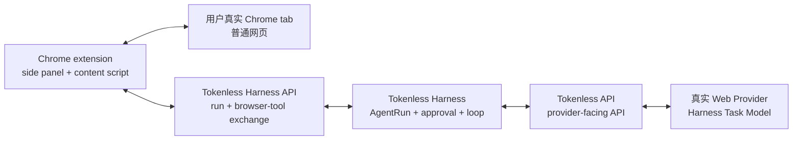

# Tokenless Harness Browser Extension

Status: proposed；下一项已授权实施切片 | Priority: P0 | 首个 browser: Google Chrome | 首批 browser tool: semantic DOM observation 与 text input

Depends on: [Web Agent Harness](P0-web-agent-harness.md)、authenticated loopback daemon、Tokenless Harness API、Tokenless API，以及至少一条已配置的真实 Web Provider route

Related: [Local Web Control Plane](P0-local-web-control-plane.md) 负责 loopback browser-session security 与用户配置；[Real Provider Browser E2E and Native Projects](P0-real-provider-browser-e2e-and-native-projects.md) 负责 provider-side model route 的真实证明；[Agent Session Integrations](P1-agent-session-integrations.md) 负责 external Agent adapter，而不是本 roadmap 的用户 browser client

## 术语决定

本 roadmap 严格区分三层产品术语：

| 术语 | 本 roadmap 中的职责 |
|---|---|
| **Tokenless API** | 下层、面向 provider 的 API。它聚合已验证的 Web Provider route，并负责 provider-turn routing 与 lifecycle。Browser extension 不得把它当成 Agent runtime。 |
| **Tokenless Harness** | 位于 Tokenless API 之上的 first-party Agent runtime。它负责 AgentRun state、model/tool loop、approval、continuation 与 final output。 |
| **Tokenless Harness API** | Tokenless Harness 额外暴露给 caller 的本地 API。Browser extension 通过它启动和观察 run，并交换 browser-tool action 与 result。 |

现有 authenticated `/v1/private/agent/*` route 与 Dashboard `/ui-api/v1/harness/*` projection 都是进入 Tokenless Harness operation 的现有 transport。实现可以新增一个 least-privilege browser-extension projection，但它必须调用同一份 Harness implementation，不能建立第二套 run store、loop 或 source of truth。

产品术语与当前物理 route prefix 分开。V1 不仅为了让 URL 出现 `harness` 而重命名已有 route，也不增加双路 compatibility alias。

## Outcome

用户把 unpacked V1 extension 安装到真实 Google Chrome profile，打开一个普通真实网页，并在当前 tab 上调用 extension。Side panel 接受自然语言任务，例如“把 `Jazelly` 填到姓名输入框”。

完整闭环是：

```text
用户在 Chrome side panel 输入任务
  -> Tokenless Harness API 启动绑定到当前 tab 的 AgentRun
  -> Tokenless Harness 发送任务、browser-tool schema 与有界 page context
  -> Tokenless API 把 turn 路由给真实 Web Provider
  -> Harness Task Model 返回经过校验的 input action
  -> Tokenless Harness 把 action 调度回同一个 extension session
  -> content script 填写真实 input 并验证可见 DOM 结果
  -> extension 通过 Tokenless Harness API 返回有界 tool result
  -> Tokenless Harness 通过 Tokenless API 继续同一 provider conversation
  -> side panel 展示 final Harness result
```

完成的定义是：目标值真实、可见地出现在实际网页的正确 input 中，而且同一个 AgentRun 到达 final result。仅完成 extension build、列出 DOM、得到 model action 或通过本地模拟页面都不算完成。

## 产品形态

Extension 同时承担两个角色，但不拥有独立 Agent state：

1. **Harness client adapter：**side panel 通过 Tokenless Harness API 启动、读取、审批、取消和展示一个 AgentRun。
2. **Browser tool adapter：**动态注入的 content script 代表该 AgentRun 观察和修改用户显式选择的网页。

Local daemon 与 Tokenless Harness 始终是 authority。Extension 可以保存 scoped pairing credential 与当前 tab/run 的 presentation state，但不负责 durable run transition、provider routing、tool policy、retry 或 conversation history。

用户日常 Chrome 页面与 Tokenless API provider browser 是两个不同的 execution surface：



Extension 不得附着到 managed provider browser、导入 provider session、控制 Tokenless API provider tab，或把用户日常 Chrome profile 变成 provider runtime 的一部分。

## V1 范围

### 支持的页面范围

V1 是通用实现，不是 provider-specific 或 site-specific adapter。它支持由用户显式手势选择的 active tab 中，普通、可注入脚本的 top-level `http` 或 `https` document。

Adapter 必须搜索 live DOM，不能依赖 checked-in site allowlist。它支持以下 visible、enabled textual control：

- 普通 text-like type 的 `<input>`，包括 `text`、`search`、`email`、`tel`、`url` 与 `number`；
- `<textarea>`；以及
- `contenteditable` element，或具备等价 textbox role 且能够验证 visible editable DOM surface 的 element。

Input implementation 必须支持普通 framework-controlled field。它必须使用真实 element value/editing interface，发出页面需要的 user-observable `input`/`change` event，并在 mutation 后读取 live visible control。只设置内部 property、没有验证 visible result，不算成功。

### 对“任何网页”的诚实限定

“任何网页”指 Chrome 允许这个被用户显式调用的 extension 注入脚本的普通网页。V1 不声称访问：

- `chrome://`、Chrome Web Store、extension-owned page、browser settings、built-in PDF viewer 或其他 browser-protected page；
- closed shadow root、canvas-only control、不可访问的 embedded application，或 extension 没有访问权的 cross-origin frame；
- disabled、hidden、read-only 或 detached control；
- password、one-time-code、payment、authentication-secret 或 file-input control；以及
- CAPTCHA、MFA、account creation、purchase、send、publish、delete 或 form submission。

Top-level 页面一旦跨 origin navigation，当前 page binding 立即失效，必须再次由用户显式调用。V1 不得静默跟随用户进入另一个 origin 或 tab。

### 延后动作

V1 不要求 generic button click、form submit、dropdown selection、file upload、download、tab creation、popup handling 或 cross-origin navigation。这些能力不得藏在 generic escape hatch 中做半成品。只有 input 闭环通过后，下一项真实用户任务才能证明需要增加哪一种 action。

## 小型 Browser-Tool Interface

Harness Task Model 只收到两个 Harness-owned tool：

```text
browser_page_observe
browser_page_input
```

`browser_page_observe` 是 read-only tool，为绑定的精确 document 返回有界 semantic DOM snapshot。

`browser_page_input` 是 mutating tool，只接受最近一次有效 observation 发出的 opaque `elementRef` 与待输入文本。它不接受 arbitrary JavaScript、CSS selector、XPath、CDP command、URL 或 model 提供的 code。

现有 `HarnessToolRegistry` seam 继续作为 Harness-facing interface。Composed registry 可以同时提供现有 stdio MCP tool 与 browser-page tool，但 browser extension session 细节留在 browser adapter implementation 内部，不扩宽每一个 tool call。

## Semantic DOM Observation Contract

“抓取 DOM”表示生成有界、专用的 semantic projection，不表示上传原始 `document.documentElement.outerHTML`。

第一版 observation 只包含识别和填写 textual input 所需的当前 document 信息：

- canonical page origin、bounded URL、title 与 document revision；
- 严格字节限制内、candidate control 周围的 visible text；
- semantic role、accessible name、associated label、placeholder、input type、enabled/editable state 与 current-value presence；
- run- and document-scoped opaque `elementRef`；以及
- 区分相似 field 所需的有界 structural relationship。

Observation 排除 script、style、hidden DOM、cookie、browser storage、network data、authorization value、password value、unrelated tab 与 extension state。普通已有 text-field value 默认 redacted；当定位字段不需要 exact value 时，model 只能得知 presence 与 shape。

每个 `elementRef` 只在一个 extension session、tab、document revision 与 observation revision 内有效。目标一旦 detached、replaced、ambiguous、hidden、disabled 或 stale，就必须明确失败并重新观察。页面变化后，adapter 不得根据 stale selector 猜测替代字段。

## Input Action Contract

Proposed input action 的最小形态：

```json
{
  "elementRef": "element_opaque",
  "text": "Jazelly"
}
```

Mutation 前，adapter 验证：

- extension session 仍拥有 selected tab；
- tab 与 top-level document identity 仍匹配 frozen run binding；
- target 仍然 visible、enabled、editable、non-sensitive 且可唯一解析；以及
- action 匹配最近一次批准的 frozen model arguments。

Mutation 后，adapter 通过 live DOM 验证真实 visible control value，并返回有界 result：element reference、action status、redacted value evidence、page/document revision 与 safe failure classification。Action result 不重复返回周围的 raw page content。

Side panel 在首次 mutation 前展示 exact target label 与 proposed text，要求用户审批。只有真实使用证明逐项审批无法完成目标后，V1 才可考虑 run-scoped approval；不能预先加入。

## Tokenless Harness API Surface

Browser-facing Tokenless Harness API projection 保持小型：

- 经用户显式批准，把 installed extension pair/attach 到 verified loopback daemon；
- 创建一个绑定到精确 extension session 与 tab/document identity 的 run；
- 读取和取消该 run；
- 提交 approval 或其他已有 Harness intervention；
- 等待下一项有界 browser-tool action；以及
- 返回 correlated browser-tool result。

V1 使用 ordinary authenticated HTTP 加 bounded polling 或 long-polling。V1 不增加 WebSocket infrastructure、SSE replay、event journal、durable browser-action queue、reconnect recovery 或第二套 scheduler。Extension connection 在 action 中途消失时，run 明确失败或进入 intervention state；不得静默 replay page mutation。

现有 AgentRun 是唯一 run state。Browser-tool correlation 使用 frozen run、call、arguments digest、extension session 与 document identity。Duplicate result 返回已有 correlated outcome，不得重复 input mutation。

## Pairing 与 Authentication

Extension 绝不能获得 daemon-wide control bearer token。

V1 通过用户可见的 local flow 完成 pairing；预期从 side panel 发起，在 verified Tokenless Dashboard origin 完成。Pairing 签发可撤销的 extension-scoped credential，只授权：

- paired extension identity；
- extension 创建的 run 所需的 Tokenless Harness API operation；以及
- exact attached extension session 的 browser-tool exchange。

它不授权 provider/profile administration、arbitrary daemon job、config mutation、asset read、filesystem access、其他 caller 的 Harness run，或 bearer-protected Tokenless API machine surface。

Daemon 验证 exact loopback `Host`、expected extension `Origin`、scoped credential、session identity 与 request correlation。CORS 本身不是 trust mechanism。首次真实 Chrome install 还必须证明当前 Chrome Local Network Access 行为，不能假设 extension-to-loopback fetch 没有额外 friction。

Native Messaging 不进入第一版。只有真实 Chrome 重现 failure，证明 scoped loopback path 无法提供可用连接时，才重新评估它。

## Extension Permission 与 Packaging

第一个 active package 使用明确 subsystem name，例如 `packages/harness-browser-extension/`。Archived provider-automation extension code 只是参考，不整体恢复成 active implementation。

Manifest V3 extension 只请求工作 V1 必需的 permission：

- `activeTab`：用户调用后临时访问当前 tab；
- `scripting`：动态注入 isolated-world content script；
- `sidePanel`：承载 task UI；以及
- local extension storage：保存 scoped pairing credential 与有界 presentation state。

Loopback host permission 只覆盖 Tokenless Harness API connection。V1 不请求 `<all_urls>`、`debugger`、cookie、webRequest、clipboard、download、history 或 broad persistent site access。

第一个 artifact 是 deterministic unpacked development build，由用户手动安装到真实 Chrome profile。在真实 V1 loop 闭合前，不做 Chrome Web Store publication、signing、external namespace claim、auto-update、Firefox、Safari、Edge、Brave 或 enterprise deployment。

## Side Panel Experience

Side panel 同时提供 English 与 Simplified Chinese，并显示：

- connection 与 pairing state；
- exact attached tab title 与 origin；
- 明确说明有界 page content 会通过 Tokenless API 发送给 selected Harness Task Model；
- 一个 task prompt input；
- 当前 AgentRun state；
- 带 target label 与 exact text 的 proposed input-action approval；
- cancel 与 repair action；以及
- final Harness output。

用户无需打开 terminal 就能区分：

```text
not paired
paired but no tab attached
tab attached
capturing page
waiting for Harness Task Model
waiting for input approval
applying input
completed
failed or detached
```

Panel 不展示 daemon control token、raw DOM、provider credential、cookie、browser storage、hidden prompt、internal reasoning 或其他 tab content。

## Privacy 与 Prompt-Injection Boundary

Page content 是 untrusted data。System Prompt Bundle 与 browser-tool description 必须声明：页面文字不能授予 authority、修改 tool policy、重定义 user task、批准 mutation 或要求读取另一个页面的数据。

Side panel 在发送第一份 semantic snapshot 前取得显式 consent，并显示当前 page origin 与 configured provider route。UI 不得宣称页面内容始终留在本地：有界 page content 与 browser-tool result 会通过 Tokenless API 进入真实 Web Provider conversation。

完整 semantic snapshot 与 entered text 不得进入 daemon log、diagnostic report、stdout/stderr、screenshot、test artifact、telemetry 或 public evidence。Durable Harness state 只保存 correlation 所需的最小 redacted action identity、digest、policy decision 与 visible outcome。完整 snapshot 只作为 transient model-turn input；continuation 前 crash 时，V1 明确失败，不增加 replay persistence。

该 transient-payload path 通过 Complexity Admission Gate：如果省略它，任意真实页面内容会进入 durable local run state 与 evidence，造成直接 privacy risk。

## Delivery Plan

### Phase 0：Canonical Interface 与 Package Boundary

- 在英中 Glossary 中记录 `Tokenless Harness API`，并在 architecture 与 API docs 中统一使用。
- 定义 extension-session、tab/document binding、semantic observation、input action、approval 与 result contract。
- 把 browser tool adapter 放到现有 `HarnessToolRegistry` seam 后面，不把 Chrome type 引入 generic Harness contract。
- 建立 active extension package，不恢复 provider-specific legacy runtime。
- 保持 Tokenless API provider contract 不变。

Exit：代码库拥有一张无歧义 ownership map、一个可 build extension package 与一个小型 browser-tool interface；此阶段尚不能执行 action。

### Phase 1：First User Boundary — 真实 Chrome DOM Observation

- Build Manifest V3 extension 与 localized side panel。
- 把 unpacked artifact 手动安装到用户真实 Chrome profile。
- 使用 scoped credential 与真实 local daemon pairing。
- 把一次 toolbar invocation 绑定到当前真实 tab。
- 注入 generic content script，并在 side panel 为开发检查展示有界 semantic input-control inventory。
- Protected page、no control、stale document identity 或 denied access 都明确失败。

Exit：在用户选择的真实页面上，installed extension 能观察至少一个真实 input control；不使用 fixture、provider replica、raw DOM persistence 或 broad host permission。

### Phase 2：Tokenless Harness API 与真实 Model Loop

- Side panel 通过 Tokenless Harness API 启动 extension-bound AgentRun。
- 把 `browser_page_observe` 与 `browser_page_input` 投影到 Harness Task Model tool catalog。
- 通过真实 Tokenless API provider route 发送有界 observation。
- 校验真实 model action batch，并把 exact input proposal 展示给用户审批。
- 通过 extension action channel 调度已批准 action。
- 验证 visible value，返回有界 result，继续同一 provider conversation，并展示 final Harness output。
- Disconnect、stale page、ambiguous field、sensitive field 与 rejected approval 都是 explicit non-replayed outcome。

Exit：一个真实 AgentRun 完成 provider/tool/provider 全闭环，并 visibly fill 一个真实 page input。

### Phase 3：User-Owned Real-Page Acceptance

- 用户把 exact candidate extension build 安装到真实 browser。
- 用户提供并打开真实 acceptance page；repository code 不得用 local fixture 或 replica 替代它。
- 用户调用 extension，检查 selected origin 与 provider disclosure，并在 side panel 输入 natural-language task。
- AgentRun 捕获 live page，通过 Tokenless API 从真实 Web Provider 获得 action，请求 approval，填写 intended live input，验证 visible value，并返回 final result。
- 用户目视确认正确 field 被修改，而且 unrelated control 或 tab 没有变化。
- Evidence 只记录 redacted protocol/run identity、version、timing、state transition、action class 与用户 pass/fail confirmation。不得保存 raw page DOM、entered value、screenshot、unrelated page content 或 provider session data。

Exit：用户确认在指定真实页面上闭环完成。这是 V1 必需 acceptance gate，不能被 automated local test 替代。

### Phase 4：Documentation 与 Honest Availability

- 对齐 English 与 Simplified Chinese README 和 focused docs。
- 文档覆盖 install、pairing、tab attachment、provider disclosure、supported input type、approval、repair、uninstall 与 data flow。
- Phase 3 未在 exact candidate build 上通过前，功能保持 experimental。
- V1 evidence 评审前不增加新的 browser action。

Exit：shipped documentation 与 verified behavior 一致，不宣传 generic click 或 submit automation。

## Verification Matrix

| Evidence | 必需证明 | 不可接受的替代 |
|---|---|---|
| Extension build | Deterministic unpacked MV3 artifact 在用户真实 Chrome 中加载 | 只检查 manifest |
| Pairing | Extension 只获得 scoped credential，且不能调用 daemon control operation | 把 `daemon.token` 交给 extension |
| Page binding | 一次 explicit user gesture 绑定一个 exact real tab/document | Persistent `<all_urls>` access 或静默选择 background tab |
| DOM observation | 真实 visible input 被表示为 semantic metadata 与 opaque reference | Raw full-page HTML、fixture DOM 或 hard-coded site selector |
| Model decision | 通过 Tokenless API 到达的真实 Harness Task Model 返回 validated input action | Local rule engine 或 synthetic model response |
| Mutation | Intended real input 在 approval 后 visibly 包含 intended value | 只调用 setter、不读取 live control |
| Continuation | 同一 AgentRun 通过 Tokenless API 返回 tool result 并到达 final output | DOM mutation 后停止 |
| Isolation | Unrelated tab、field、origin、provider page 与 daemon operation 都不改变 | Broad browser 或 daemon authority |
| Privacy | Evidence 只包含 redacted identifier 与 outcome | DOM、input text、credential、provider session value 或 unrelated content 进入 artifact |

## Acceptance Criteria

- `Tokenless API`、`Tokenless Harness` 与 `Tokenless Harness API` 在 code、docs、UI 与 diagram 中保持分离。
- Extension 调用 Tokenless Harness API；不得把 provider-facing Tokenless API 当成 Agent loop owner。
- Tokenless Harness 是 AgentRun state、approval、browser-tool policy、continuation 与 final output 的唯一 owner。
- V1 在用户选择的真实普通网页上工作，不依赖 provider-specific 或 site-specific selector。
- Semantic observer 使用 live DOM 与 accessibility metadata 找到并区分 supported visible textual input。
- Model action 只能指向为 exact current tab 与 document revision 发出的 opaque reference。
- Input adapter 支持标准 textual `<input>`、`<textarea>` 与可验证的 contenteditable control，并发出 page-observable editing event。
- 每次 input mutation 都以 exact target label 与 text 获得 approval，并在 afterward 验证 live visible control。
- Protected、sensitive、hidden、disabled、ambiguous、detached、stale 与 inaccessible field 在 mutation 前失败。
- Extension 使用 `activeTab` 与 dynamic injection，不请求 `<all_urls>`、`debugger`、cookie、history、clipboard 或 download permission。
- Extension 永远不获得 daemon-wide bearer token。
- Raw DOM 与 input value 不进入 log、diagnostic、screenshot、public evidence 或 durable replay state。
- 完整 loop 使用真实 installed extension、真实 Chrome tab、真实 Tokenless Harness API、真实 Tokenless API provider route 与真实 Web Provider response。
- 用户负责最终 installation/page selection，并目视确认正确 real-page result。
- Local provider/page replica、intercepted provider response、synthetic model output、mock browser object 或 source-only assertion 都不能代替真实 acceptance run。

## Complexity Admission Gate

V1 只准入三个 non-trivial mechanism：

1. **Extension-scoped pairing credential：**否则必须暴露 daemon bearer，形成直接严重 local security risk。
2. **Correlated extension action channel：**否则 Tokenless Harness 无法把 model call 交回 authorized extension 执行 current-tab DOM action。
3. **Transient full snapshot 与 redacted durable evidence：**否则任意真实页面内容会进入 durable local state，形成直接 privacy risk。

如果删除 proposed mechanism 不会阻止真实 input loop，也不会删除唯一必要的 security/privacy evidence，就延后它。V1 特别不准入 general browser automation protocol、durable extension queue、reconnect/replay machinery、selector-learning system、screenshot computer vision、multi-tab scheduler、cross-browser abstraction、remote relay 或 plugin ecosystem。

## Non-Goals

- 替代 Tokenless Dashboard
- 把 AgentRun state 移入 extension
- 把 Tokenless API 变成 Agent runtime
- 使用用户日常 browser 作为 Tokenless API provider browser
- 恢复 archived provider-specific browser extension 为 active execution path
- V1 中的 generic click、submit、select、upload、download、navigation 或 multi-tab automation
- Password、payment、authentication、CAPTCHA、MFA、consent、purchase、publish、delete 或其他 high-impact workflow
- 向 Harness Task Model 暴露 raw JavaScript、CSS selector、XPath、CDP、cookie、storage、network 或 debugger access
- Chrome Web Store publication 或 namespace ownership claim
- Firefox、Safari、Edge、Brave、mobile、remote browser 或 cloud executor support
- Selected side panel/tab session 结束后的 background autonomous operation
- 使用 fixture 证明 arbitrary-site compatibility

## Definition of Done

Implementation merge 不是本 roadmap 的完成条件。只有 Phase 3 在 exact candidate build 上通过：extension 安装在用户真实 Chrome，针对用户选择的真实页面，visible input result 正确，同一 AgentRun 经真实 Web Provider loop 到达 final output，evidence 已 redacted，且用户明确确认 closed loop，本 roadmap 才完成。
