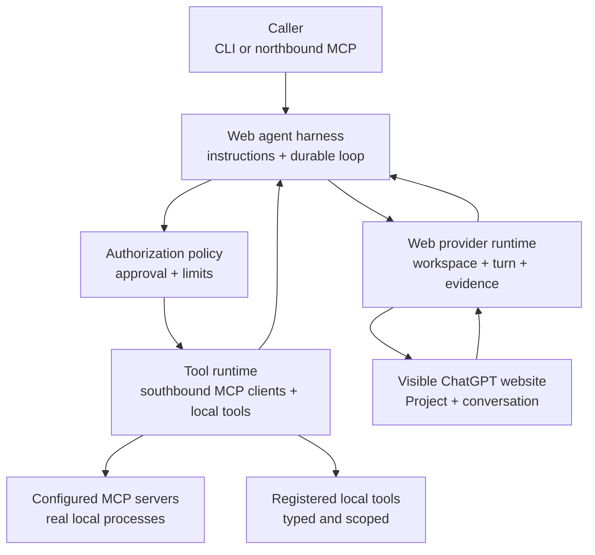
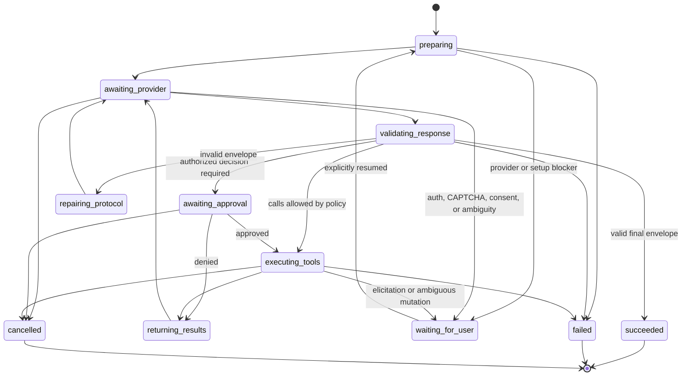

# Web Agent Harness and Tool Runtime

Status: proposed | Priority: P0 | First provider: ChatGPT

Depends on: the typed visible-provider capability seam, durable daemon jobs and conversation lanes, the Context Envelope contract, and real ChatGPT Project, instruction, upload, and continuation evidence

Related: [Agent Session Integrations](P1-agent-session-integrations.md) owns the northbound local MCP server and exact caller-session binding; this roadmap owns the southbound MCP client and the web-model tool loop

Packaging direction: independently buildable workspace package first; separate Harness project only after the provider-turn interface and real agent loop are stable

## Outcome

Tokenless treats visible AI websites as model providers, not as the agent harness itself. A caller can start one durable agent run whose model turns happen through a real provider website while the harness owns instruction delivery, tool discovery, authorization, execution, result return, loop limits, recovery, and the final run result.

The current repository remains the Provider Integration and API project, including thin CLI, northbound MCP, and caller-skill adapters. It converts evidence-backed visible website workflows into durable, provider-neutral jobs and results. The new harness is not added to the provider runtime as another provider capability implementation; it begins as a separate package that consumes the provider-turn interface exactly as a future external project would.

The first complete path is ChatGPT because it is the current strategic target for persistent Projects, instructions, files, exact conversation continuation, and tool-loop instruction following. This is a sequencing decision, not a permanent claim that other providers cannot support agent runs.

V1 proves one bounded loop:

1. create or resolve an exact ChatGPT Project and a fresh conversation;
2. deliver an explicit, versioned harness instruction set and the task context through visible provider surfaces;
3. submit the user goal through the existing provider runtime;
4. parse a schema-valid tool request from the complete visible response;
5. authorize and execute configured local MCP tools;
6. return bounded structured tool results to the same conversation; and
7. repeat until ChatGPT returns a schema-valid final result or the run reaches a waiting or terminal state.

## AI Turn Versus Agent Run

A normal AI turn is one request followed by one generated response. It may use provider-native features, but Tokenless treats the completed provider response as the output.

An agent run adds a host-controlled loop around those turns:

```text
goal
  -> model turn
  -> inspect result
  -> authorize tool calls
  -> execute tools
  -> append tool results
  -> next model turn
  -> final result
```

The model proposes actions. The harness decides whether they are valid and authorized, executes them outside the provider page, and controls whether another turn is allowed. Agency therefore belongs to the Tokenless harness even when ChatGPT supplies the planning and text generation.

Provider-native Agent, Research, apps, connectors, or other modes remain visible provider capabilities. They are not silently treated as Tokenless tool executions and do not bypass local policy.

## Two-Layer Architecture



The seam is deliberately above DOM operations. The harness never receives a Playwright `Page`, selector, browser profile path, provider credential, or raw provider action menu. The provider runtime never receives an MCP client, tool approval policy, or agent-loop state.

## Product and Package Direction

The intended end state contains two independently useful projects:

| Project | Owns | Does not own |
| --- | --- | --- |
| Provider Integration and API | Visible provider adapters, managed browser execution, Projects, files, conversations, capability routing, durable provider jobs, scheduling, scaling, evidence, the versioned provider-turn interface, and thin caller CLI, northbound MCP, or integration-skill adapters | Web-model prompts, southbound MCP tool execution, harness skills, approvals, or the agent loop |
| Agent Harness | Agent runs, instruction compilation, tool protocol, southbound MCP clients, registered local tools, harness skills, approvals, loop policy, and harness-owned run state | Provider DOM, browser profiles, selectors, provider credentials, provider-specific workspace logic, or caller-side Provider Integration skills |

The repository is not split while both interfaces are still moving. The delivery sequence is:

1. keep the existing provider implementation in this repository;
2. add the harness as an independently buildable workspace package, provisionally `packages/web-agent-harness/`;
3. make that package depend only on a versioned provider-turn client and shared wire schemas;
4. prove the complete ChatGPT tool loop and stabilize the cross-package interface; and
5. extract the harness package into its own project only when doing so is a mechanical repository move rather than an architectural rewrite.

No external package scope, registry namespace, or final package name is assumed by this roadmap. Those names require separate ownership verification before publication.

### Package Dependency Rule

The allowed dependency direction is:

```text
web-agent-harness package
  -> provider-turn client + versioned wire schemas
  -> authenticated daemon HTTP interface
  -> Provider Integration implementation
  -> Playwright and visible provider website
```

The harness package must not import from provider adapters, Playwright, daemon job-store implementation, profile management, DOM locators, or CLI command modules. The Provider Integration implementation must not import harness prompt, MCP, skill, approval, or loop modules.

The provider-turn client is an adapter over the durable daemon interface, not a wrapper that exposes internal classes. Opaque provider job, workspace, conversation, and evidence identifiers cross the seam; database handles, tables, browser objects, and internal state-machine values do not.

The harness owns its AgentRun persistence schema and migrations behind its own module. It may initially be hosted in the same installation or process topology, but the provider implementation never reads harness tables and the harness never reads provider tables. Correlation happens through public opaque identifiers.

### Skill Directionality

The two projects may both use the word `skill`, but they refer to different instruction flows:

| Skill role | Consumer | Owner |
| --- | --- | --- |
| Provider Integration skill | Codex or another external agent that needs instructions for calling Tokenless provider operations | Provider Integration project and the P1 integration roadmap |
| Harness skill | The web model inside an AgentRun; contributes bounded instructions and required tool references | Agent Harness package |

The Provider Integration skill remains a thin caller adapter and contains no agent loop. A Harness skill cannot call the provider implementation directly, add executable authority, or replace the provider-turn client.

### Extractability Tests

The package shape is correct when all of these deletion and replacement checks hold:

- deleting the harness package leaves current CLI and daemon provider jobs working;
- running the Provider Integration project without the harness does not load MCP clients, skills, or agent-loop state;
- replacing the web provider implementation with another conforming provider-turn adapter does not change harness code;
- moving the harness package to another repository requires dependency and release wiring, not source reorganization; and
- provider and harness release versions can advance independently under explicit protocol compatibility rules.

## Layer 1: Web Provider Runtime

The existing provider architecture becomes a deep model-turn module. Its interface exposes provider outcomes rather than general browser automation.

The provider runtime owns:

- resolving the exact provider, managed profile, native Project or conversation workspace, and conversation;
- visibly creating, selecting, and verifying Projects and conversations;
- delivering approved instructions and files through provider-supported visible controls;
- applying provider-owned model, effort, mode, and attachment strategies;
- submitting one correlated message and waiting for one complete response;
- reading bounded response text, citations, artifacts, and visible completion evidence;
- continuing the exact conversation on the next harness turn; and
- classifying authentication, CAPTCHA, plan, availability, navigation, and selector blockers.

The conceptual external interface stays small and preserves the provider runtime's asynchronous job semantics:

```ts
type ProviderTurnRequest = {
  route: CapabilityRoute
  workspace: ProviderWorkspaceRef
  conversation: ProviderConversationIntent
  instructions: InstructionDeliveryPlan
  message: AgentMessage
  attachments: ContextArtifactRef[]
  correlation: TurnCorrelation
}

type ProviderTurnRef = {
  jobId: string
}

type ProviderTurnState =
  | { status: 'queued' | 'running' | 'waiting_for_user' }
  | { status: 'succeeded'; result: VisibleProviderResponse }
  | { status: 'failed' | 'cancelled'; error: ProviderTurnError }

interface ProviderTurnClient {
  submit(request: ProviderTurnRequest): Promise<ProviderTurnRef>
  read(ref: ProviderTurnRef): Promise<ProviderTurnState>
  resume(ref: ProviderTurnRef): Promise<ProviderTurnState>
  cancel(ref: ProviderTurnRef): Promise<ProviderTurnState>
}
```

This is a design target, not a commitment to those exact TypeScript names. The important constraint is that callers ask for one verified provider turn and do not orchestrate individual clicks.

Raw visible actions remain internal interfaces used by provider adapters. They are not part of the public Web Provider interface, are not MCP tools, and are not made available to the web model.

The provider runtime does not own:

- agent instructions or skill precedence;
- tool discovery, schema projection, or tool-call parsing;
- approval, filesystem, network, or side-effect policy;
- MCP server processes, credentials, or protocol sessions;
- loop termination, turn budgets, or final agent-run semantics; or
- automatic application of provider-generated artifacts to the local project.

## Layer 2: Web Agent Harness

The harness is a deep module at the caller-to-model seam. Its external interface accepts one `AgentRunSpec` and returns a durable run handle or terminal `AgentRunResult`.

An `AgentRunSpec` contains:

- the user goal and optional structured output requirement;
- an exact caller/session/project binding when available;
- a Context Envelope and selected attachments;
- activated instruction and skill revisions;
- an explicit tool-set reference, not an ambient global tool dump;
- approval policy and local resource scopes;
- provider/profile constraints and required provider capabilities; and
- hard limits for turns, tool calls, wall time, input and output bytes, and parallelism.

The harness implementation owns:

- compiling instruction layers with explicit precedence and provenance;
- freezing a bounded tool-catalog snapshot for the run;
- creating a fresh provider conversation for each new run;
- driving provider turns through the provider runtime interface;
- parsing and validating the visible control protocol;
- authorizing and dispatching tool calls;
- delimiting, truncating, storing, and returning tool results;
- persisting checkpoints before every external mutation;
- stopping on final, denial, limit, cancellation, ambiguity, or unrecoverable failure; and
- returning final text, artifacts, citations, provider identity, and a bounded audit trail without private reasoning.

The harness does not know provider selectors, daemon internals, or MCP transport internals. It depends on the provider-turn client and tool-runtime interfaces.

## Provider Eligibility for Agent Runs

Normal chat support does not imply agent-harness support. The runtime catalog should distinguish at least:

| Level | Minimum proven behavior |
| --- | --- |
| `qa` | Submit one prompt and return one correlated complete response |
| `continuable` | Reopen and continue the exact durable conversation without identity ambiguity |
| `harness_agent` | Deliver the required instruction fidelity, follow the control protocol, complete tool-result round trips, and reach a bounded final result through real browser E2E |

An `agent.run` route requires every capability needed by that run, including normal chat, exact continuation, the selected instruction-delivery mode, attachments or native workspace when requested, and a real-E2E-closed harness protocol route.

ChatGPT is the only initial `harness_agent` candidate. Claude, Gemini, Grok, Qwen, DeepSeek, and future providers remain `qa` or `continuable` until the same real-boundary criteria close independently. Similar UI labels or one successful demonstration do not establish parity.

Once the first provider turn mutates a conversation, the run is pinned to that provider, profile, workspace, conversation, instruction revision, and tool-catalog revision. Mid-run provider fallback is not allowed because model state, tool decisions, and prior mutations are not portable.

## Instruction Delivery, Not Hidden Prompt Injection

Tokenless must not claim a native `system` role when a provider website does not expose one. It records the actual visible delivery method:

| Fidelity | Meaning |
| --- | --- |
| `project_instruction` | Versioned harness instructions are installed in a Tokenless-owned Project or merged into another Project with explicit approval and visible verification |
| `conversation_bootstrap` | Instructions are delivered as a visible first conversation message and verified through the resulting conversation |
| `unsupported` | The required instruction semantics cannot be delivered or verified safely |

Project instructions are preferred for the stable harness contract when the exact Project is Tokenless-owned or the user explicitly approved the update. Tokenless never overwrites unrelated user instructions. Dynamic task context, tool schemas, run nonce, and limits belong in the fresh conversation bootstrap so Project instructions do not churn on every run.

Instruction compilation uses this precedence:

1. immutable Tokenless safety and control-protocol contract;
2. explicit user and organization policy;
3. activated skill instructions;
4. tool catalog and per-tool usage guidance;
5. task goal and Context Envelope; and
6. prior tool results, which are always marked as untrusted data.

Lower layers cannot grant permissions, add tools, or rewrite higher-layer policy. Instructions are source-attributed and content-addressed. A run stores the exact instruction revision that was visibly delivered.

## Visible Web-Agent Control Protocol

Tokenless's visible-site interface does not receive the native function-call events available through model APIs, and it does not inspect private provider traffic to obtain them. V1 therefore uses one explicit visible text protocol. Every complete model response must contain exactly one envelope of one of these kinds:

- `tool_calls`: one or more requested calls; or
- `final`: the final Markdown result and declared artifacts.

The conceptual envelope is:

```json
{
  "protocol": "tokenless.web-agent/v1",
  "kind": "tool_calls",
  "runId": "run_opaque",
  "turn": 2,
  "nonce": "per_turn_opaque_nonce",
  "calls": [
    {
      "id": "call_opaque",
      "tool": "mcp.filesystem.read_text_file",
      "arguments": {
        "path": "README.md"
      }
    }
  ]
}
```

The actual framing must be unambiguous in rendered page text and survive provider Markdown rendering. The parser accepts only the declared protocol version, current run and turn, current nonce, unique call ids, registered tool names, and arguments valid against the frozen JSON Schema.

The nonce detects stale or replayed envelopes; it is not authorization. Valid model output is still untrusted input.

Malformed output receives at most one bounded protocol-repair turn containing validation errors but no new authority. A second malformed response fails the run. Unknown tools, invalid arguments, denied calls, and tool execution errors return structured results to the model so it may recover within the remaining turn budget.

Tool results use the same versioned framing and preserve the original call ids. Large or binary results are stored as local artifacts and represented by bounded metadata or approved excerpts. Tool output is delimited as untrusted data and cannot modify the tool catalog, instruction precedence, or authorization policy.

## Durable Agent Loop



Hard limits are correctness controls, not optional tuning. V1 has finite defaults for provider turns, total tool calls, calls per turn, tool-result bytes, wall time, and approval wait. Repeating the same invalid or denied call consumes the budget and eventually terminates clearly.

Read-only calls in one model response may execute concurrently only when their locally verified policy and resource scopes do not conflict. Mutating calls execute serially by default. The model cannot increase concurrency.

## Tool Runtime

The tool runtime is a separate deep module with at least two real adapters: MCP tools and registered local tools. Its interface accepts an already parsed call plus authorization context and returns a bounded `ToolOutcome`.

Every tool descriptor records:

- a stable, collision-free canonical name;
- source kind and exact server or local adapter identity;
- input and optional output JSON Schemas;
- locally assigned read/write, network, destructive, and credential effects;
- allowed filesystem roots, network destinations, or resource scopes;
- timeout, result-size, and concurrency limits;
- idempotency, resumability, and cancellation behavior; and
- provenance for descriptions and annotations.

Tool descriptions help the model choose a tool. They do not grant authority. MCP annotations are treated as untrusted unless local configuration explicitly trusts that server and independently constrains the tool.

### MCP Directionality

Tokenless participates in MCP in two different directions:

| Direction | Tokenless role | Owner |
| --- | --- | --- |
| Northbound | MCP server exposing `tokenless_run`, job reads, resume, and cancel to Codex or another caller | [Agent Session Integrations](P1-agent-session-integrations.md) |
| Southbound | MCP host/client discovering and calling tools requested by the web model | This roadmap |

The two directions share durable run identity and policy types but not transport sessions, credentials, tools, or approval decisions. A northbound caller invoking Tokenless never becomes trusted to approve arbitrary southbound actions implicitly.

### Southbound MCP V1

V1 supports explicitly configured local `stdio` servers:

- Tokenless launches each server with a minimal allowlisted environment and an explicit working directory;
- each server receives one isolated MCP client session;
- initialization and capability negotiation must complete before its tools enter the catalog;
- `tools/list` is snapshotted and namespaced by a stable local server alias;
- `tools/call` arguments and structured results are schema-validated and size-bounded;
- server stderr is bounded diagnostic data and never becomes model context automatically;
- roots and other client capabilities expose only explicitly approved resources;
- server-initiated sampling is disabled in V1 to prevent a recursive model loop; and
- elicitation becomes `waiting_for_user`; the web model never supplies credentials or sensitive answers on the user's behalf.

MCP prompts and resources are not automatically exposed as tools. A later phase may map selected resources into the Context Envelope and selected prompts into skill instructions with explicit provenance.

Remote Streamable HTTP is deferred until Tokenless has a concrete remote-server use case and can implement the current MCP authorization requirements, OAuth discovery, PKCE, resource/audience binding, secure token storage, consent, and origin protections without leaking credentials to the provider page.

### Registered Local Tools

Local tools use the same `ToolDescriptor`, authorization, execution, and result contracts as MCP tools. They are typed adapters over a narrow operation, not arbitrary shell text returned by the model.

Each local tool must declare exact resource scopes and side effects. Filesystem operations are rooted and symlink-safe. Process and network tools require explicit allowlists. V1 does not provide a generic unrestricted shell tool.

### Skills

A skill is an instruction package, not an executable authority. Activating a skill may:

- add versioned instructions and examples to the instruction compiler;
- request named tools already present in the configured tool registry;
- narrow recommended usage or default limits; and
- contribute output validation or artifact-handling guidance.

A skill cannot launch a process, add an MCP server, widen a filesystem root, approve a tool call, or bypass a higher-priority policy merely by being installed or mentioned. Missing required tools fail skill activation with a repair instruction.

## Authorization and Containment

Tool arguments are proposed by an untrusted web model, even when the user trusts the provider and MCP server.

Authorization is evaluated inside Tokenless immediately before execution against the frozen run policy and the current resource state:

- read-only, locally scoped calls may be pre-authorized by explicit policy;
- local writes, network mutations, external messages, purchases, credential flows, destructive operations, and scope expansion require explicit approval unless a prior reviewed rule covers that exact operation;
- approvals bind the run id, call id, tool identity, argument digest, target scope, and expiry;
- any argument change invalidates the approval;
- denial is returned to the model as a normal structured tool result;
- headless operation never converts missing approval into approval; and
- server or model descriptions, annotations, and claims cannot downgrade the locally assigned risk.

The local web control plane should display pending calls, exact targets, redacted sensitive fields, why approval is required, the requesting provider conversation, and the effect of allow-once, deny, or cancel. CLI and northbound MCP callers may observe and resolve approvals through the same durable application contract.

Tokenless never requests, reads, logs, or sends browser credentials, cookies, storage secrets, Keychain items, MCP OAuth tokens, or the daemon bearer token to the web model. MCP authentication occurs out of band through user-controlled flows.

## Durability, Idempotency, and Recovery

One durable `AgentRun` owns ordered child records:

- `AgentTurn` for each provider request and correlated response;
- `InstructionRevision` and `ToolCatalogRevision` frozen for the run;
- `ToolCall` for the model proposal and validation outcome;
- `ApprovalDecision` bound to the exact call digest;
- `ToolExecution` for dispatch, completion, error, or ambiguity; and
- final artifacts, citations, provider identity, and completion evidence.

Persist intent before every provider or tool mutation. A tool call id is unique within a run and cannot produce a second execution record accidentally.

Recovery follows explicit evidence:

- a read-only call may be repeated only when its locally declared semantics and observed state make that safe;
- a mutating call with proven non-dispatch may be retried;
- a mutating call with ambiguous dispatch waits for user resolution and is never replayed automatically;
- a completed tool result may be returned to the same provider conversation again only when the prior visible submission is proven absent;
- an ambiguous provider submission uses the existing at-most-once replay policy; and
- resume reuses the same provider conversation, instruction revision, catalog revision, and limits.

Cancellation stops future turns and requests MCP cancellation where supported. It does not claim to reverse an external side effect or guarantee that a server lacking cancellation stopped its work.

## Delivery Phases

### Phase 0: Seams, Contracts, and Package Skeleton

- Define `AgentRunSpec`, `AgentRun`, `AgentTurn`, `ProviderTurnRequest`, `ProviderTurnRef`, `ProviderTurnState`, `ProviderTurnClient`, `InstructionDeliveryPlan`, `ToolDescriptor`, `ToolCall`, `ToolOutcome`, and approval-policy schemas.
- Keep visible browser actions behind provider adapters and expose one provider-turn interface to the harness.
- Add an independently buildable harness workspace package with no imports from provider, Playwright, daemon-storage, profile, DOM, or CLI implementation modules.
- Add a provider-turn client adapter over the authenticated durable daemon interface and version the wire schemas it consumes.
- Give the harness ownership of its AgentRun state and migrations; correlate provider jobs only through opaque public identifiers.
- Define `qa`, `continuable`, and `harness_agent` evidence without enabling a route from product reconnaissance alone.
- Define parent/child durable identity, limits, checkpoints, and failure codes.
- Document northbound and southbound MCP directionality in public diagnostics.

Exit: the built CLI can execute today's normal ChatGPT QA flow through the provider-turn interface with unchanged visible behavior; removing the harness package leaves that flow intact; and the independently built harness can persist a no-tool AgentRun using only the provider-turn client.

### Phase 1: ChatGPT Instruction and Control Protocol

- Create or resolve an exact ChatGPT Project and a fresh conversation per run.
- Add explicit Project-instruction merge, preview, revision, and rollback behavior without overwriting unrelated instructions.
- Implement the versioned visible response envelope, per-turn nonce, strict parser, final result, and one bounded repair turn.
- Freeze and report instruction and Context Envelope revisions.
- Prove exact continuation in the same conversation.

Exit: real ChatGPT returns a schema-valid final envelope and can complete a two-turn protocol repair through the built CLI, packaged daemon, managed profile, and visible website.

### Phase 2: Southbound MCP V1 and Approval

- Implement the MCP host/client module for configured local `stdio` servers.
- Negotiate capabilities, snapshot and namespace tool schemas, and expose only the selected bounded tool set to ChatGPT.
- Add locally assigned effects, scopes, limits, allow, deny, and approval-wait behavior.
- Execute schema-valid calls, preserve call ids, and return bounded structured results to the same ChatGPT conversation.
- Disable server sampling and surface elicitation as user input required.

Exit: ChatGPT requests a real read-only MCP filesystem operation inside an approved root, receives the real result, and produces a correlated final answer; a real mutating tool pauses before execution and proceeds only after exact approval.

### Phase 3: Durable Loop, Failure, and Recovery

- Persist every turn, call, approval, execution, result, and evidence transition.
- Enforce turn, call, byte, wall-time, and concurrency limits.
- Handle unknown tools, invalid arguments, denial, timeout, server failure, provider blocker, cancellation, and ambiguous mutation.
- Resume the same run and conversation after daemon, runner, browser, or MCP process restart when evidence makes continuation safe.
- Return structured state through CLI, daemon, local control plane, and the northbound MCP adapter.

Exit: focused real-process restart checks prove no duplicate provider submission or tool mutation, and every ambiguous external mutation stops for user resolution.

### Phase 4: Registered Local Tools and Skills

- Add the local tool adapter with the same schemas, policy, audit, and result contracts as MCP.
- Support explicitly activated, content-addressed skill instruction bundles.
- Validate skill-required tool references before provider mutation.
- Keep arbitrary shell execution, implicit process launch, and permission widening out of the skill interface.
- Add artifact references for large local and MCP outputs.

Exit: one ChatGPT run uses both an MCP tool and a registered local tool under one policy, while an activated skill changes instructions without changing executable authority.

### Phase 5: Caller Integrations and Approval UX

- Add `agent.run` to the canonical caller capability catalog only after the ChatGPT route is E2E-closed.
- Expose agent-run creation, state, pending approvals, resume, cancel, final result, and audit summary through the CLI and northbound local MCP server.
- Add approval and recovery surfaces to the local web control plane without exposing the daemon bearer token to browser JavaScript.
- Bind Codex and later callers through exact `AgentSessionBinding` records from the related roadmap.

Exit: a Codex session can explicitly start a Tokenless web-agent run, resolve a pending tool approval, and receive the final result in the same originating session without gaining direct browser or southbound MCP authority.

### Phase 6: Additional Providers and Remote MCP

- Evaluate each provider independently for instruction fidelity, exact continuation, protocol adherence, and bounded real tool loops.
- Add provider routes only after real browser E2E closes all required outcomes.
- Add authenticated Streamable HTTP MCP only with complete authorization, consent, token handling, and transport-security behavior.
- Add selected MCP resources, prompts, tasks, or tool-search behavior only after their semantics fit the same policy and durability model.

Exit: a second provider or remote MCP transport satisfies the same interface and evidence contracts without ChatGPT, transport, or provider fields leaking into the harness interface.

## Real-Boundary Verification

All support and release claims use the built CLI, packaged TypeScript daemon, real SQLite state, managed browser, explicitly selected setup-managed profile, real ChatGPT website, provider network, and real MCP server processes.

The initial acceptance flow must prove:

- visible instruction installation or conversation bootstrap with exact revision evidence;
- fresh conversation creation and exact continuation;
- a schema-valid read-only tool request, real MCP execution, result return, and final answer that uses a unique canary from the tool result;
- a mutating tool request that cannot execute before exact approval;
- denial, invalid arguments, unknown tool, timeout, and bounded protocol repair;
- prompt-injection text inside tool output cannot widen policy or execute an unapproved tool;
- daemon and MCP process restart does not duplicate a provider submission or tool mutation;
- final text, artifacts, citations, conversation identity, calls, approvals, and execution outcomes are durably correlated; and
- the profile test target retains keychain-neutral flags, production Chromium sandboxing remains enabled, processes are cleaned up, and no Keychain prompt appears.

No provider fixtures, route interception, simulated responses, invented DOM, fake runtime, synthetic fetch, or source-regex test can close `harness_agent` support. Redacted real DOM fixtures may still support focused selector or parser maintenance under the repository fixture policy, but they are not agent-loop acceptance evidence.

Real E2E does not automate login, CAPTCHA, MFA, consent, or Keychain approval and does not collect screenshots, full DOM, storage, credentials, or unrelated account content.

## Acceptance Criteria

- The harness and provider runtime communicate only through the provider-turn interface; harness code contains no provider selectors or page operations.
- The harness is an independently buildable workspace package and imports no provider adapter, Playwright, daemon storage, profile, DOM, or CLI implementation module.
- Provider Integration and Harness own separate persistence schemas and correlate only through versioned public identifiers.
- Removing the harness package leaves all normal provider CLI, daemon, and browser execution behavior working.
- Extracting the harness to another repository requires no provider source move and no harness source reorganization.
- The provider runtime can still execute a normal one-turn QA job without loading MCP or agent-harness modules.
- ChatGPT is the only initial `harness_agent` route, and its support is backed by a complete real visible tool loop.
- Every new agent run uses a fresh conversation and freezes exact instruction, context, tool-catalog, provider, profile, workspace, and limit revisions.
- Project instructions are changed only in a Tokenless-owned Project or after explicit preview and approval; unrelated instructions are never overwritten.
- Visible instruction delivery is reported honestly and is never mislabeled as a native system role.
- Every model response is validated against one versioned control envelope before any tool action.
- Tool names and arguments must match the frozen schema snapshot; parser success never implies authorization.
- MCP annotations and model claims never override locally assigned effects or approval policy.
- V1 launches only explicitly configured local `stdio` MCP servers with bounded environment, roots, processes, logs, and results.
- Skills contribute instructions and tool requirements but cannot execute or authorize operations.
- No mutating call executes without a matching explicit policy rule or exact approval digest.
- Every provider and tool mutation has durable pre-dispatch intent and unambiguous completion or waiting state.
- Ambiguous external mutations are never retried automatically.
- Turn, call, time, byte, and parallelism limits prevent infinite or unbounded loops.
- Mid-run provider fallback, arbitrary shell execution, secret delivery, and implicit approval are absent from V1.
- Final results contain bounded user-facing output and evidence, not hidden chain-of-thought or unrelated provider content.

## Risks and Responses

| Risk | Response |
| --- | --- |
| A provider follows the control protocol inconsistently | Provider-specific real E2E, strict validation, one repair turn, finite limits, and honest `qa` fallback |
| Visible instructions are weaker than a native system role | Record fidelity, prefer approved Project instructions, enforce safety in the local runtime, and never claim semantic parity |
| Tool output injects instructions into the model | Delimit it as untrusted data and make local policy authoritative even if the next model turn is compromised |
| The model invents a tool or malformed arguments | Frozen schema snapshot, strict validation, structured error result, and bounded recovery |
| MCP tool annotations understate side effects | Treat annotations as hints and assign effects and scopes through reviewed local policy |
| A crash duplicates an external mutation | Persist intent first, use call ids and evidence, and stop on ambiguous dispatch |
| Tool catalogs are too large for a web prompt | Require an explicit selected tool set and byte budget; add tool search only after V1 evidence |
| Project instructions collide with user content | Use Tokenless-owned Projects by default and require previewed merge or conversation bootstrap elsewhere |
| Provider state changes during a long loop | Pin exact identity, re-check visible preconditions each turn, and wait rather than switch providers |
| A local MCP server receives excessive ambient authority | Explicit configuration, minimal environment, scoped roots, bounded processes, and per-call policy |
| Remote MCP leaks or misuses credentials | Defer it until full authorization and secure token lifecycle support exists; never pass credentials through the web model |
| Skills become an authority bypass | Keep skills instruction-only and resolve every executable action through the same tool registry and policy |

## Non-Goals

- Exposing general browser RPA, selectors, raw DOM, or low-level provider actions to the web model
- Depending on provider private APIs, hidden function-call events, response streaming, or network interception
- Claiming that a visible user or Project instruction is a native system message
- Extracting or cloning provider, caller, or agent hidden prompts or private reasoning
- Letting ChatGPT approve its own tool calls or answer MCP credential prompts
- Automating login, CAPTCHA, MFA, Keychain approval, purchases, or external consent
- Providing unrestricted shell execution or converting arbitrary generated text into a command
- Treating installed skills as trusted executable code or ambient permission
- Multi-agent handoffs, delegation, autonomous planning graphs, or cross-provider continuation in V1
- Automatically applying generated code, patches, messages, or destructive changes without the applicable local review and approval
- Advertising Claude, Gemini, Grok, Qwen, DeepSeek, or another provider as agent-harness capable before its independent real-browser loop closes
- Splitting repositories or publishing the harness package before the provider-turn interface and first real agent loop are stable
- Assuming ownership of an npm scope, package name, organization, or other external namespace for the future extracted project

## Primary References

- [OpenAI Agents SDK runner lifecycle and tool loop](https://openai.github.io/openai-agents-js/guides/running-agents/)
- [ChatGPT Projects, files, and Project instructions](https://help.openai.com/en/articles/10169521-using-projects-in-chatgpt)
- [MCP architecture and host authorization responsibilities](https://modelcontextprotocol.io/specification/2025-06-18/architecture/index)
- [MCP tools, schemas, results, annotations, and trust guidance](https://modelcontextprotocol.io/specification/2025-11-25/server/tools)
- [MCP stdio and Streamable HTTP transports](https://modelcontextprotocol.io/specification/2025-11-25/basic/transports)
- [MCP authorization](https://modelcontextprotocol.io/specification/2025-11-25/basic/authorization)
- [MCP security best practices](https://modelcontextprotocol.io/docs/tutorials/security/security_best_practices)
