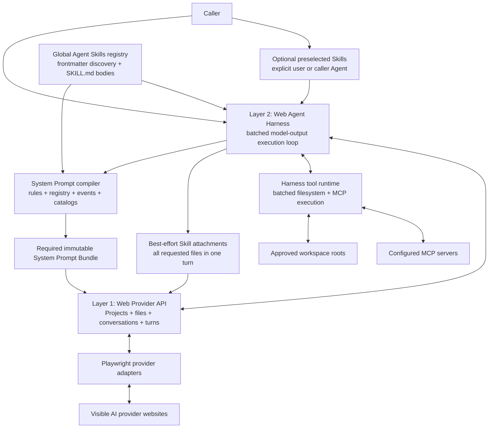
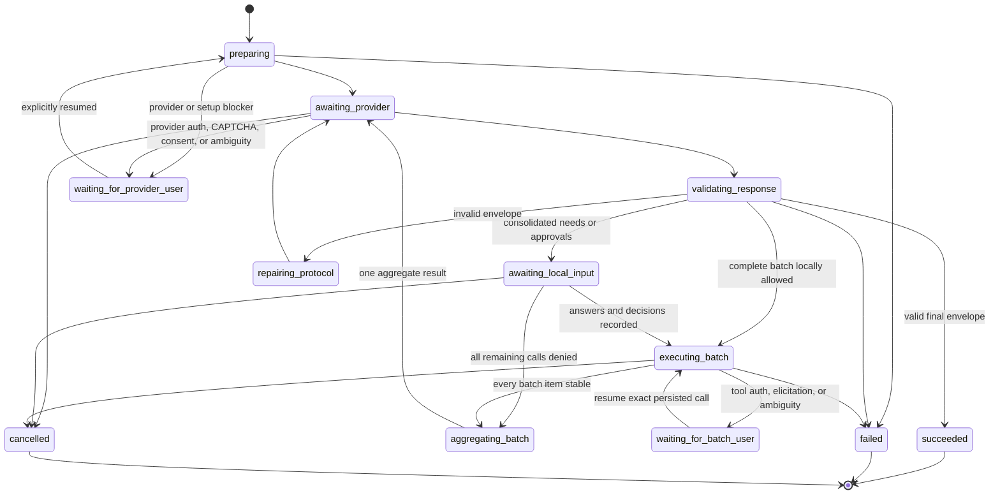

# Web Agent Harness

Status: in progress | Priority: P0 | First provider: ChatGPT | First harness capabilities: Codex context adapter, uploaded System Prompt Bundle, and Skill Registry

Depends on: the typed visible-provider capability seam, durable daemon jobs and conversation lanes, the Context Envelope contract, and real ChatGPT Markdown file upload and chat evidence

Related: [Agent Session Integrations](P1-agent-session-integrations.md) owns the caller-facing local MCP server and the conformance contract for future Agent adapters; [Codex Guided Delegation and Session Binding](P0-codex-guided-delegation-and-session-binding.md) defines Codex behavior; this roadmap owns the installed Codex adapter implementation, Harness context ledger, uploaded System Prompt Bundle, Skill registry and loading protocol, output validation, and execution of MCP tool calls proposed by the web model

Packaging direction: one independently buildable workspace package as the implementation owner, exposed through authenticated daemon HTTP and CLI in the same first usable slice; separate Harness project only after the provider-turn interface and real agent loop are stable

## Outcome

Tokenless treats visible AI websites as model providers, not as the agent harness itself. A caller can start one durable agent run whose model turns happen through a real provider website while the Harness owns System Prompt compilation, Skill discovery and delivery, tool discovery, output validation, authorization, execution, result return, loop limits, recovery, and the final run result.

This repository contains two strictly separated modules. The existing Web Provider API converts evidence-backed visible website workflows into durable, provider-neutral jobs and results. The independently buildable Harness package owns agent adapters, agent identity, System Prompt and Skill delivery, and eventually the agent loop. The Harness consumes opaque Provider API results; provider adapters never parse Codex hooks or read Harness persistence.

## Current Implementation Slice

The first packaged Harness slice now includes:

- a Codex integration installer that preserves unrelated global instructions and hooks;
- a native hook handler for exact chat, turn, and tool-call correlation;
- a bounded Codex App Server client for thread, session-tree, and lineage enrichment;
- a separate Harness SQLite ledger for local projects, agent conversations, turns, invocations, and provider bindings;
- deterministic Tokenless project, conversation, and provider task identities;
- opaque upstream context passed through the existing Provider job Context Envelope;
- Provider Project and conversation mapping references consumed from normal Provider API results; and
- the System Prompt Bundle and Skill-registry preparation/validation slice described below.

The Provider API continues to own provider Projects, conversations, profiles, durable jobs, and website execution. It receives only versioned opaque upstream correlation metadata and returns its ordinary observed resource mappings. It does not own the Codex session hierarchy or the Harness database.

The first complete path is ChatGPT. Harness routing requires only the existing `conversation.chat` and `file.upload` capabilities: chat supplies the model turns and file upload carries the required System Prompt Bundle plus later instruction and result files. This is a sequencing decision, not a permanent claim that other providers cannot support agent runs.

Web turns are materially slower and more expensive than local tool execution. The Harness therefore optimizes for fewer provider round trips rather than imitating an API-native one-tool-call-at-a-time loop. Every non-final web response must describe one complete current action batch: all executable actions the model can determine now, plus all user inputs or other prerequisites it already knows are missing. It cannot defer an independent known action or ask for one known missing item at a time.

V1 proves the required uploaded control plane, OpenCode-style Skill discovery, on-demand Skill delivery, and one bounded batch-control loop before adding general filesystem or MCP authority:

1. accept one `AgentRunSpec` through the package interface, authenticated daemon HTTP interface, or CLI, including the current caller turn and any Skills already selected explicitly by the user or automatically by the caller Agent;
2. discover the V1 global Agent Skills registry, read only each `SKILL.md` frontmatter needed for selection, and freeze an ordered content-addressed registry revision;
3. compile one immutable `HarnessSystemPromptBundle` Markdown file containing the Harness rules, full available-Skill metadata registry, current event schemas, batched-output requirement, tool and MCP catalog, limits, and final-output contract;
4. select a Provider route that exposes both existing capabilities, `conversation.chat` and `file.upload`, and upload that required bundle before submitting the first task Prompt; failure to deliver the bundle prevents the run from entering the model loop;
5. upload any valid caller-preselected `SKILL.md` files in the same first attachment action, while treating failure of an individual Skill file as a soft omission rather than failure of the required System Prompt Bundle;
6. parse either a schema-valid `action_batch` listing every currently needed Skill, executable call, and missing input, or a schema-valid final result;
7. resolve every name in `skillLoads` and any later caller selection, then batch-upload all successfully staged `SKILL.md` files before the next Prompt; individual missing, invalid, over-limit, or failed Skill files remain soft omissions;
8. validate and persist each whole batch, collect every required local user decision in one request, and return one ordered aggregate result to the same conversation; and
9. repeat only when newly delivered Skill instructions or prior results reveal a genuinely new dependency, until the Provider returns a schema-valid final result or the run reaches a waiting or terminal state.

This first slice has no Skill resource read, Skill asset upload, Skill script execution, workspace write, arbitrary file read, process execution, network tool, or MCP server. It proves the hard web-specific parts—required System Prompt file delivery, metadata-only registry exposure, initial and later-turn `SKILL.md` delivery, complete-batch output framing, correlation, validation, consolidated user input, aggregate result return, and durable looping. Filesystem and MCP event definitions enter the same System Prompt compiler and batched tool-runtime seam instead of creating separate agent loops.

## User-Visible Batch Stories

| User input | Expected Harness behavior | User-visible result |
| --- | --- | --- |
| The user explicitly selects two Skills in the caller Agent | The caller passes both selections to Tokenless; the Harness uploads both exact `SKILL.md` revisions alongside the required System Prompt Bundle before submitting the first task Prompt | The web model can use both Skills immediately; no web-side selection round trip is spent on already known choices |
| The caller Agent automatically selects three Skills from its current interaction | The caller adapter sends all three selected identities and their selection provenance in the initial run request | All successfully staged Skill files are uploaded together in the first attachment action and referenced by one manifest |
| The caller supplies no Skill selection | Build the System Prompt Bundle with the metadata registry for every valid V1 global Skill | The web model can choose Skills from their names and descriptions without receiving every full Skill body |
| The web model needs three Skills that were not preselected | Return all three names together in the `skillLoads` list of one `action_batch`; the Harness resolves and uploads all successfully staged files before the next Prompt | One extra web turn loads the complete known Skill set instead of requesting one Skill per slow turn |
| The caller or web model selects another Skill after the run has started | Resolve and attach the new `SKILL.md` before the next Prompt, then append a new manifest revision | The same chat can use the additional Skill without restarting the run or freezing Skill choice at run start |
| A Skill is missing, too large, exceeds the attachment count, or cannot be uploaded | Skip that Skill, keep a bounded internal delivery diagnostic, and continue the chat | Skill delivery remains a soft enhancement and does not block the user's task |
| A Provider supports chat but not file upload | Exclude that route from Harness selection before creating the run | Normal Provider chat may still work, but this Provider cannot host the file-based Harness |
| The required System Prompt Bundle cannot be uploaded | Do not submit the task Prompt and return a pre-loop delivery failure | The user never receives a falsely labeled Harness run that lacks its control protocol |
| “Compare these three project files” | Return all three independent reads in one action batch and execute them concurrently when safe | One reading phase, one aggregate result submission, then the answer |
| The task is missing audience, jurisdiction, and output language | Return all three missing-input items together | The user receives one form or question list and answers once |
| A batch contains two safe reads and one write | Run the reads, show the write in the same consolidated review, and preserve a decision for each call | The user reviews all known work at once; denied calls are reported alongside successful calls |
| A Google Drive MCP call needs login while a GitHub read is ready | Persist both calls, finish the GitHub read, pause the Drive call for local login, then resume its exact arguments | The user logs in once; the model does not repeat or change the Drive request; both outcomes return together |
| One later action needs an id produced by an earlier call | Execute the known call first and return its result | A second action batch is allowed because the later arguments were genuinely unknowable, not merely deferred |

The user may inspect batch progress and individual outcomes, but the default experience emphasizes the task result rather than raw MCP or filesystem protocol details.

## AI Turn Versus Agent Run

A normal AI turn is one request followed by one generated response. It may use provider-native features, but Tokenless treats the completed provider response as the output.

An agent run adds a host-controlled loop around those turns:

```text
goal
  -> model turn
  -> validate complete action batch
  -> collect consolidated approval, auth, or user input
  -> execute every ready action
  -> append one aggregate result
  -> next model turn
  -> final result
```

The model proposes the complete set of actions and missing inputs it can currently identify. The harness decides whether the batch is valid and authorized, persists it, executes ready actions outside the provider page, pauses and resumes exact blocked actions without replanning, and controls whether another expensive provider turn is justified. Agency therefore belongs to the Tokenless harness even when ChatGPT supplies the planning and text generation.

Provider-native Agent, Research, apps, connectors, or other modes remain visible provider capabilities. They are not silently treated as Tokenless tool executions and do not bypass local policy.

## Two-Layer Architecture



The seam is deliberately above DOM operations. The harness never receives a Playwright `Page`, selector, browser profile path, provider credential, or raw provider action menu. The provider runtime never receives an MCP client, tool approval policy, or agent-loop state.

Authorization, local tools, MCP clients, instruction compilation, and loop persistence are internal modules of Layer 2. They are not additional product layers.

## The Two Modules and Eventual Projects

The intended end state contains two independently useful projects:

| Module and eventual project | Owns | Does not own |
| --- | --- | --- |
| Web Provider API | Playwright provider adapters, managed browser execution, provider Projects, files, provider conversations, visible model controls, durable provider turns, routing, scheduling, scaling, evidence, provider resource mappings, and the versioned Web Provider interface | Agent hooks, agent project/chat/turn identity, Skill selection or instruction semantics, MCP tool execution, approvals, or an agent loop |
| Web Agent Harness | Agent adapters and hooks, local project/chat/turn/tool-call bindings, Harness persistence, Agent runs, System Prompt Bundle compilation, Skill registry and on-demand Skill resolution, web-specific high-payload instruction delivery, complete action batches, bounded filesystem tools, MCP tool execution, consolidated approvals and input, aggregate results, output validation, and loop policy | Provider DOM, browser profiles, selectors, credentials, direct Playwright operations, or authoritative provider resource creation |

The repository is not split while both interfaces are still moving. The delivery sequence is:

1. keep the existing Web Provider API implementation in this repository;
2. add the harness as an independently buildable workspace package, provisionally `packages/web-agent-harness/`;
3. make that package depend only on a versioned provider-turn client and shared wire schemas;
4. prove required System Prompt Bundle delivery, registry-driven `SKILL.md` loading, then the first external-tool loop, and stabilize the cross-package interface; and
5. extract the harness package into its own project only when doing so is a mechanical repository move rather than an architectural rewrite.

No external package scope, registry namespace, or final package name is assumed by this roadmap. Those names require separate ownership verification before publication.

### Package Dependency Rule

The allowed dependency direction is:

```text
web-agent-harness package
  -> provider-turn client + versioned wire schemas
  -> authenticated daemon HTTP interface
  -> Web Provider API implementation
  -> Playwright and visible provider website
```

The harness package must not import from provider adapters, Playwright, daemon job-store implementation, profile management, DOM locators, or CLI command modules. The Web Provider API implementation must not import harness prompt, MCP, skill, approval, or loop modules.

The provider-turn client is an adapter over the durable daemon interface, not a wrapper that exposes internal classes. Opaque provider job, workspace, conversation, and evidence identifiers cross the seam; database handles, tables, browser objects, and internal state-machine values do not.

The harness owns its AgentRun persistence schema and migrations behind its own module. It may initially be hosted in the same installation or process topology, but the Web Provider implementation never reads harness tables and the harness never reads provider tables. Correlation happens through public opaque identifiers.

### Initial Package Shape

The first implementation belongs at `packages/web-agent-harness/`. That location makes the dependency rule mechanically enforceable while both sides of the Provider interface are still changing. It is not a claim on an external package name or a commitment to keep the Harness in this repository permanently.

```text
packages/web-agent-harness/
  package.json
  src/
    index.ts                  # the only public package surface
    agent-contracts.ts        # versioned agent identity and inspection contracts
    agent-context-store.ts    # Harness-owned agent context and provider-binding ledger
    codex-integration.ts      # reversible guidance/hooks and exact invocation binding
    codex-app-server.ts       # bounded read-only App Server enrichment adapter
    harness.ts                # durable run entry points
    internal/
      control/                # visible envelope schemas, framing, and validation
      instructions/           # System Prompt Bundle compilation, precedence, schemas, and rendering
      skills/                 # registry discovery, skillLoads resolution, SKILL.md staging, and manifests
      tools/                  # registry, policy, execution, and bounded outcomes
        filesystem/           # rooted read, search, patch, and artifact materialization
        mcp/                  # MCP tool execution, authentication, and resume
      artifacts/              # content-addressed results and provider artifacts
      persistence/            # harness-owned AgentRun records and migrations
```

Only `src/index.ts` is an exported package path. Internal directories express ownership and locality, not public extension points. The public Harness interface remains small:

```ts
interface WebAgentHarness {
  start(spec: AgentRunSpec): Promise<AgentRunRef>
  read(ref: AgentRunRef): Promise<AgentRunState>
  resume(ref: AgentRunRef, input?: AgentRunIntervention): Promise<AgentRunState>
  cancel(ref: AgentRunRef): Promise<AgentRunState>
}
```

Preselected Skills may be part of the initial `AgentRunSpec` or a later `AgentRunIntervention`. The System Prompt Bundle also exposes the available Skill metadata registry so the web model can return `skillLoads` control requests for Skills not already selected. Callers do not invoke `readFile`, `writeFile`, or `callMcpTool` directly through this interface. Those operations originate in validated web-model action batches handled inside one run.

`AgentRunIntervention` may carry the next caller turn plus another `selectedSkills` list. A later web-model `skillLoads` batch has the same delivery effect. Either path adds a Skill manifest revision for the next turn; neither restarts the run nor invalidates previously delivered Skills.

### Entry Points: One Module, Three Access Paths

Package, daemon HTTP, and CLI are all required in the first usable Harness slice. They are not competing implementations or separate behavior owners:

| Access path | Role | Required behavior |
| --- | --- | --- |
| Package interface | Canonical in-process Harness interface and implementation seam | Own `start`, `read`, `resume`, and `cancel`, System Prompt compilation, validation, persistence, Skill file delivery, batching, and final results |
| Authenticated daemon HTTP | Durable process interface over the same Harness module | Expose the same run lifecycle and schemas without leaking package internals or daemon storage |
| CLI | Human, scripting, diagnostics, and recovery adapter | Submit the same `AgentRunSpec`, including optional preselected Skills and caller-turn context, then read or resume the same durable run through the daemon client |

The CLI must not implement a second instruction compiler, Skill resolver, validation loop, or state machine. In-process callers may use the package interface directly; normal local CLI and future caller adapters use the authenticated daemon interface. The same request must produce the same durable run semantics through every access path.

### Web-Harness Specificity

This is not a generic model-API harness with a Web Provider adapter added afterward. Its loop is designed around the actual Web Provider interface:

- model output arrives as a slow, complete visible webpage response rather than a native function-call event stream, so the Harness contract maximizes useful work per turn;
- the complete Harness control contract must be compiled into one visible Markdown attachment, while selected or requested `SKILL.md` bodies use additional visible Markdown attachments;
- the current tool catalog and per-turn nonce must fit provider message and file limits;
- every currently executable filesystem and MCP request plus every known missing input must be parsed from one complete action batch;
- locally independent actions execute without additional provider turns, and their ordered aggregate results return as one next message in the exact same provider conversation;
- Projects, attachments, citations, provider blockers, slow turns, and conversation recovery remain part of the loop; and
- each provider becomes harness-capable only after its complete real website loop is proven.

The harness is therefore Web-Provider-aware but DOM-agnostic. It understands Web Provider semantics and limitations while all selectors, clicks, browser profiles, and provider-specific visible operations remain below the Web Provider interface.

### Extractability Tests

The package shape is correct when all of these deletion and replacement checks hold:

- deleting the harness package leaves current CLI and daemon provider jobs working;
- running the Web Provider API project without the harness does not load MCP clients, skills, or agent-loop state;
- changing Playwright or provider-adapter implementation behind the Web Provider interface does not change harness code;
- moving the harness package to another repository requires dependency and release wiring, not source reorganization; and
- provider and harness release versions can advance independently under explicit protocol compatibility rules.

## Layer 1: Web Provider API

The existing provider architecture becomes a deep model-turn module. Its interface exposes provider outcomes rather than general browser automation.

All currently exposed operations belong to this layer: they are structured wrappers around supported, real-E2E-verified web workflows. P1 may expose those operations through MCP and bind them to an external session, but that still does not make P1 an Agent Harness.

The provider runtime owns:

- resolving the exact provider, managed profile, native Project or conversation workspace, and conversation;
- visibly creating, selecting, and verifying Projects and conversations;
- delivering approved instructions and files through provider-supported visible controls;
- applying provider-owned model, effort, mode, and attachment strategies;
- submitting one correlated message and waiting for one complete response;
- reading bounded response text, citations, artifacts, and visible completion evidence;
- continuing the exact conversation on the next harness turn; and
- classifying authentication, CAPTCHA, plan, availability, navigation, and selector blockers.

The conceptual external interface stays small and preserves the provider runtime's asynchronous job semantics:

```ts
type ProviderTurnRequest = {
  route: CapabilityRoute
  workspace: ProviderWorkspaceRef
  conversation: ProviderConversationIntent
  message: AgentMessage
  attachments: ContextArtifactRef[]
  correlation: TurnCorrelation
}

type ProviderTurnRef = {
  jobId: string
}

type ProviderTurnState =
  | { status: 'queued' | 'running' | 'waiting_for_user' }
  | { status: 'succeeded'; result: VisibleProviderResponse }
  | { status: 'failed' | 'cancelled'; error: ProviderTurnError }

interface ProviderTurnClient {
  submit(request: ProviderTurnRequest): Promise<ProviderTurnRef>
  read(ref: ProviderTurnRef): Promise<ProviderTurnState>
  resume(ref: ProviderTurnRef): Promise<ProviderTurnState>
  cancel(ref: ProviderTurnRef): Promise<ProviderTurnState>
}
```

This is a design target, not a commitment to those exact TypeScript names. The important constraint is that callers ask for one verified provider turn and do not orchestrate individual clicks.

Raw visible actions remain internal interfaces used by provider adapters. They are not part of the public Web Provider interface, are not MCP tools, and are not made available to the web model.

The provider runtime does not own:

- agent instructions or skill precedence;
- tool discovery, schema projection, or tool-call parsing;
- approval, filesystem, network, or side-effect policy;
- MCP server processes, credentials, or protocol sessions;
- loop termination, turn budgets, or final agent-run semantics; or
- automatic application of provider-generated artifacts to the local project.

## Layer 2: Web Agent Harness

The harness is a deep module at the caller-to-model seam. Its external interface accepts one `AgentRunSpec` and returns a durable run handle or terminal `AgentRunResult`.

An `AgentRunSpec` contains:

- the user goal and optional structured output requirement;
- an exact caller/session/project/turn binding and bounded caller-turn context when available;
- a Context Envelope and selected attachments;
- the V1 global Skill registry root and access rules plus an optional ordered initial `SkillSelection[]` supplied by the caller, with each selection attributed to `explicit_user` or `caller_agent`;
- an explicit tool-set reference, not an ambient global tool dump;
- approval policy and local resource scopes;
- provider/profile constraints and required provider capabilities; and
- hard limits for provider turns, action batches, calls per batch, total calls, consolidated user-input items, wall time, input and output bytes, and parallelism.

The conceptual caller-supplied selection is deliberately small:

```json
{
  "selectedSkills": [
    {
      "name": "legal-writing",
      "selectedBy": "explicit_user",
      "expectedRevision": "sha256:optional"
    },
    {
      "name": "pdf-processing",
      "selectedBy": "caller_agent"
    }
  ]
}
```

`name` resolves only within the run's approved registry. `expectedRevision`, when present, must match the locally resolved `SKILL.md` or that selection is skipped. The request never embeds the Skill body. The same `selectedSkills` shape may appear in a later turn intervention; each newly accepted selection is considered for attachment before that next Prompt. Caller selection is an optimization and an explicit-control path, not the only way to load a Skill.

The harness implementation owns:

- discovering and freezing a metadata-only Skill registry revision;
- compiling the required System Prompt Bundle with explicit precedence, event schemas, catalogs, limits, and provenance;
- resolving caller-preselected and web-model-requested Skills against that registry, validating their `SKILL.md` files, and recording ordered per-turn selection and delivery revisions;
- freezing a bounded tool-catalog snapshot for the run;
- creating a fresh provider conversation for each new run;
- driving provider turns through the provider runtime interface;
- parsing and validating complete action batches and the requested final-output contract;
- authorizing and dispatching validated batches without asking the model to re-emit blocked calls;
- consolidating local approvals, authentication handoffs, and user-input requests;
- delimiting, truncating, storing, and returning one aggregate result per completed batch;
- persisting checkpoints before every external mutation;
- stopping on final, denial, limit, cancellation, ambiguity, or unrecoverable failure; and
- returning final text, artifacts, citations, provider identity, and a bounded audit trail without private reasoning.

The harness does not know provider selectors, daemon internals, or MCP transport internals. It depends on the provider-turn client and tool-runtime interfaces.

## Provider Requirements for the File-Based Harness

V1 introduces no new Provider capability names or eligibility levels. A Harness run requests both existing capabilities, `conversation.chat` and `file.upload`. A route missing either capability is not eligible for the Harness, although it may remain eligible for ordinary non-Harness chat.

The required file is the immutable `HarnessSystemPromptBundle`. It must be visibly uploaded before the first task Prompt. Failure to stage, upload, or visibly accept this bundle is a pre-loop Harness failure because the model would otherwise lack the output protocol and event definitions that make Harness responses interpretable.

Individual `SKILL.md` bodies are deliberately softer. A missing, invalid, over-limit, unavailable, or failed Skill attachment is recorded and omitted without failing an otherwise bootstrapped run. The Prompt manifest names only successfully delivered Skill files, and skipped delivery stays out of the normal user Prompt and final answer unless diagnostics are requested.

ChatGPT remains the first implementation target. Other Providers can use the same two existing capabilities without entering a separate Harness tier and without proving invented capabilities such as semantic Skill consumption.

Once the first provider turn mutates a conversation, the run is pinned to that provider, profile, workspace, conversation, instruction revision, and tool-catalog revision. Mid-run provider fallback is not allowed because model state, tool decisions, and prior mutations are not portable.

## Uploaded System Prompt Bundle

`HarnessSystemPromptBundle` is the first Harness artifact, not an optional enhancement. Tokenless calls it a System Prompt because it contains the Harness's highest-priority model instructions, but reports its real transport honestly: on a website it is a visible uploaded Markdown file, not a native API `system` role.

The compiler builds one immutable, content-addressed file before the first task Prompt. Its V1 sections are ordered and versioned:

1. Harness identity, instruction precedence, untrusted-data boundaries, and the rule that local execution and authorization remain outside the web model;
2. the complete visible response protocol, including `action_batch`, `skillLoads`, tool calls, missing-input events, `final`, nonce and correlation fields, validation rules, and one-repair limit;
3. the web-turn batching rule requiring every currently known Skill request, tool or MCP call, and missing input in the same response;
4. `<available_skills>` containing every valid V1 registry entry's `name` and `description`, plus a non-sensitive logical identity when needed for disambiguation;
5. the frozen filesystem, registered-local, and MCP tool schemas that are actually executable for this run, or explicit empty catalogs when those phases are unavailable;
6. run limits, result-artifact conventions, and the final Markdown or JSON Schema output contract; and
7. a generated manifest containing protocol, registry, tool-catalog, and bundle revisions.

The bundle does not contain full Skill bodies, absolute local paths, Skill resources, or caller secrets. V1 discovers `~/.agents/skills/**/SKILL.md`, validates enough frontmatter to obtain selection metadata, sorts entries deterministically, and freezes a `SkillRegistryRevision`. This follows OpenCode's product behavior: expose selection metadata in the system prompt, then load the full instructions by exact Skill name only when selected. Invalid or individually over-budget entries may be omitted from the registry with a diagnostic; they do not corrupt the base protocol file.

The first provider submission uploads the System Prompt Bundle and every successfully staged caller-preselected `SKILL.md` in one attachment action, then sends one short bootstrap message with the actual task and attachment manifest. The Harness does not spend a separate acknowledgement turn merely to upload the bundle.

Later selected or requested Skills are conversation-scoped additions. The Harness uploads their exact `SKILL.md` revisions together before the next Prompt and includes a manifest delta. A Skill may therefore be added at any turn; run start does not freeze the loaded-Skill set.

Instruction compilation uses this precedence:

1. immutable Tokenless safety and visible control-protocol contract in the System Prompt Bundle;
2. explicit user and organization policy;
3. successfully delivered Skill instructions in the order recorded by successive manifest revisions;
4. frozen tool catalog and per-tool usage guidance;
5. task goal and Context Envelope; and
6. prior filesystem, MCP, and other external tool results, always marked as untrusted data.

Lower layers cannot grant permissions, add tools, or rewrite higher-layer policy. Instructions are source-attributed and content-addressed. A run stores the exact bundle and delivery revisions that were visibly submitted.

### Web-Turn Payload Policy

The Harness optimizes provider turns before optimizing prompt bytes. Each task turn should contain enough bounded information for the model to make every decision that does not depend on an unknown future tool result:

- upload the required System Prompt Bundle plus all successfully staged caller-preselected Skills before the first task Prompt;
- expose every valid V1 Skill's bounded selection metadata in the bundle and require the model to return all currently needed unloaded Skill names together;
- for later turns, stage every newly requested or caller-selected `SKILL.md` that resolves within the soft limits and attach the successful set before the next Prompt;
- include a bounded manifest entry only for successfully delivered Skill files, with each Skill name, collision-free attachment name, full digest, selection provenance, and instruction order; do not duplicate the Skill bodies inline;
- include the complete selected tool schemas, effects, and usage guidance when they fit the run budget; never advertise a tool that the Harness cannot validate and dispatch;
- include every result from the preceding batch in one ordered aggregate provider turn; when bounded text does not fit comfortably in the message, attach one or more indexed, content-addressed result artifacts in that same turn and include their manifest in the prompt;
- include every locally collected answer, denial, authentication completion, and approval outcome together when resuming the model.

This is not a requirement to predict unknowable later work. If the arguments for action B depend on the unknown result of action A, B belongs in the next batch. If A and B are both already well-defined, returning only A violates the Harness contract and triggers the bounded repair path.

## Visible Web-Agent Control Protocol

Visible-browser execution does not receive the native function-call events available through model APIs. A separately selected direct provider-protocol mode may parse provider protocol responses, but the Harness consumes only the same normalized provider result and never receives provider session credentials. V1 therefore uses one explicit text protocol optimized around slow provider turns. Every complete model response must contain exactly one envelope of one of these kinds:

- `action_batch`: all actions whose arguments are currently known plus all known missing user inputs; or
- `final`: the final Markdown or structured result and declared artifacts.

An `action_batch` may contain many Skill-load requests, filesystem, registered-local, and MCP calls, plus many missing-input items. `skillLoads` is a Harness control list rather than executable authority: it asks Tokenless to attach exact registered `SKILL.md` files before the next Prompt. At least one list must be non-empty. The model must not use empty batches, prose promises, one-Skill-at-a-time requests, serial one-call responses, or one-question-at-a-time responses to defer work it can already specify.

When an executable call depends on instructions inside an unloaded Skill, the model lists that Skill now and defers only the dependent call until the file arrives. Calls independent of the unloaded Skill may remain in the same batch. This is a genuine information dependency, not permission to request one known Skill at a time.

The conceptual envelope is:

```json
{
  "protocol": "tokenless.web-agent/v1",
  "kind": "action_batch",
  "runId": "run_opaque",
  "turn": 2,
  "nonce": "per_turn_opaque_nonce",
  "skillLoads": [
    { "name": "legal-writing" },
    { "name": "pdf-processing" }
  ],
  "calls": [
    {
      "id": "call_file_a",
      "tool": "fs.read_text",
      "arguments": {
        "path": "docs/a.md"
      }
    },
    {
      "id": "call_file_b",
      "tool": "fs.read_text",
      "arguments": {
        "path": "docs/b.md"
      }
    }
  ],
  "needs": [
    {
      "id": "need_jurisdiction",
      "kind": "user_input",
      "prompt": "Which jurisdiction applies?",
      "inputSchema": {
        "type": "string",
        "minLength": 2,
        "maxLength": 120
      }
    }
  ]
}
```

The actual framing must be unambiguous in rendered page text and survive provider Markdown rendering. The parser accepts only the declared protocol version, current run and turn, current nonce, unique Skill names, unique call and need ids, registered tool names, arguments valid against the frozen JSON Schema, supported missing-input kinds, bounded user-facing prompts, and optional acyclic `dependsOn` references between calls. A requested Skill that is already delivered is idempotently ignored. An unavailable Skill is recorded as a soft omission rather than treated as executable failure.

The nonce detects stale or replayed envelopes; it is not authorization. Valid model output is still untrusted input.

The Harness validates and persists the entire batch before dispatching any external call. One unknown tool, invalid argument, duplicate call id, impossible dependency, or malformed need rejects the whole executable batch, preventing partial execution followed by an ambiguous repair. Skill requests are resolved separately under the soft delivery policy. Malformed output receives at most one bounded protocol-repair turn containing all validation errors but no new authority. A second malformed response fails the run.

After validation, the Harness stages all requested Skills in one set, executes every ready call concurrently only where local policy proves that safe, and consolidates model-requested user inputs with Harness-discovered approvals, authentication handoffs, and elicitations into one local interaction. A blocked call keeps its exact validated arguments and resumes after the local requirement is satisfied; the model does not regenerate it. Independent calls may finish while another waits. The next provider continuation contains the aggregate call and need results plus one Skill-delivery manifest delta, with every successful Skill file attached in the same upload action.

The aggregate result uses versioned framing, preserves every original call and need id, and reports a stable outcome for each item. Filesystem, MCP, and other external tool results are delimited as untrusted data. Large or binary results are stored as local artifacts and represented by bounded metadata or approved excerpts. No result can modify the frozen catalog, higher-priority instruction layers, or authorization policy.

The Harness-to-model continuation is one `action_batch_result`, conceptually:

```json
{
  "protocol": "tokenless.web-agent/v1",
  "kind": "action_batch_result",
  "runId": "run_opaque",
  "batchId": "batch_opaque",
  "callResults": [
    {
      "id": "call_github_read",
      "status": "succeeded",
      "content": "bounded untrusted result"
    },
    {
      "id": "call_drive_create",
      "status": "succeeded",
      "artifact": {
        "id": "artifact_opaque",
        "mediaType": "application/vnd.google-apps.document",
        "digest": "sha256:opaque"
      }
    }
  ],
  "needResults": [
    {
      "id": "need_jurisdiction",
      "status": "answered",
      "value": "South Australia"
    }
  ]
}
```

This envelope is input compiled by the Harness, not model output and not an authorization surface. It is sent only after every call and need in the original batch is stable: calls are `succeeded`, `denied`, `failed`, or `cancelled`, and needs are answered, denied, or cancelled. Authentication completion is reported without credentials. If the bounded inline representation is too large, the same continuation contains an ordered artifact manifest instead of splitting the batch across provider turns.

Batch completeness is partly a model behavior rather than something a JSON validator can prove. Real-browser checks should observe whether a Provider groups multiple independent actions and missing inputs, but V1 does not encode that observation as a separate Provider capability or eligibility tier.

### Model Output Validation Pipeline

Validation is a staged gate. No tool dispatch, file mutation, approval request, or terminal success occurs until every applicable stage passes:

1. **Framing:** extract exactly one bounded control envelope from the complete correlated visible response; reject missing, duplicate, nested, or trailing executable envelopes.
2. **Syntax:** parse strict JSON with duplicate-key rejection plus configured depth, property-count, string, and byte limits; never evaluate code or repair JSON locally.
3. **Schema:** validate the declared protocol version and exact `action_batch` or `final` shape against canonical JSON Schema.
4. **Correlation:** require the current run id, turn number, nonce, unique call and need ids, valid dependency references, and a response belonging to the exact provider conversation.
5. **Capability:** for `action_batch`, resolve each requested Skill against the frozen registry under the soft delivery policy, require every canonical tool name and argument to match the frozen catalog and input schema, and require every missing-input item to use an allowed kind and schema; for `final`, require every declared artifact to resolve to a provider result or Harness artifact already owned by this run.
6. **Authority:** evaluate the complete valid batch against local policy and current resource state before dispatch, then bind every approval to its exact call. Schema validity and model assertions never imply permission.
7. **Output contract:** validate the terminal value as bounded Markdown by default or against the caller's frozen JSON Schema when structured output was requested. Reject undeclared files, unknown artifact ids, media-type or digest mismatches, and output that exceeds the run budget.

Protocol errors return one bounded repair turn with machine-readable validation issues and the same authority. A repair cannot add a tool, change a root, relax a schema, or increase a limit. A second invalid response fails clearly.

Provider-native generated images, files, citations, and other multimodal results remain Layer 1 result artifacts. The Harness may correlate and return those artifact references after validation. It never treats assistant prose such as “I wrote `x.png`” as filesystem evidence, and it materializes an artifact into the local workspace only through an explicit authorized filesystem tool call.

## Durable Agent Loop



Hard limits are correctness controls, not optional tuning. V1 has finite defaults for provider turns, action batches, total calls, calls per batch, missing-input items, aggregate-result bytes, wall time, and local-intervention wait. Repeating the same invalid or denied call consumes the budget and eventually terminates clearly.

All ready read-only calls in one batch may execute concurrently only when their locally verified policy, dependency graph, and resource scopes do not conflict. Mutating calls execute serially by default. The model may describe dependencies but cannot increase concurrency or weaken ordering chosen by the Harness.

## Tool Runtime

The tool runtime is an internal deep module with concrete adapter families for bounded filesystem operations, MCP tools, and any later explicitly registered local tools. Skills do not enter this runtime because V1 Skill activation is instruction compilation, not execution. The runtime's one execution interface accepts a fully validated call batch plus execution context and returns one bounded batch outcome. Adapter-specific lifecycle, transport, authentication, path handling, per-call execution, and result conversion stay behind that seam.

```ts
interface ToolRuntime {
  executeBatch(batch: ValidatedCallBatch, context: BatchExecutionContext): Promise<ToolBatchOutcome>
}
```

Every tool descriptor records:

- a stable, collision-free canonical name;
- source kind and exact server or local adapter identity;
- input and optional output JSON Schemas;
- locally assigned read/write, network, destructive, and credential effects;
- allowed filesystem roots, network destinations, or resource scopes;
- timeout, result-size, and concurrency limits;
- idempotency, resumability, and cancellation behavior; and
- provenance for descriptions and annotations.

Tool descriptions help the model choose a tool. They do not grant authority. MCP annotations are treated as untrusted unless local configuration explicitly trusts that server and independently constrains the tool.

### Distinct MCP Roles

Tokenless uses MCP in two separate roles, named by behavior rather than by network direction:

| Role | Tokenless behavior | Owner |
| --- | --- | --- |
| Caller MCP interface | Tokenless is an MCP server exposing run creation, job reads, resume, and cancel to Codex or another caller | [Agent Session Integrations](P1-agent-session-integrations.md) |
| MCP tool execution | The Harness is an MCP host/client executing calls that came from a validated web-model action batch | This roadmap |

These roles share durable run identity and policy types but not transport sessions, credentials, tools, or approval decisions. Invoking Tokenless through its caller MCP interface never grants authority to execute a web-model-proposed MCP call.

### MCP Tool Execution, Authentication, and Resume

The first MCP phase supports explicitly configured local `stdio` servers through the official MCP TypeScript SDK v2, with an explicit legacy, pinned modern `2026-07-28`, or opt-in auto-negotiation mode:

- Tokenless launches each server with a minimal allowlisted environment and an explicit working directory;
- each server receives one isolated MCP client and transport binding;
- modern discovery or the configured legacy initialization and capability negotiation must complete before its tools enter the catalog;
- `tools/list` is snapshotted and namespaced by a stable local server alias;
- `tools/call` arguments and structured results are schema-validated and size-bounded;
- server stderr is bounded diagnostic data and never becomes model context automatically;
- deprecated MCP Roots are not used as an access-control mechanism; local resource scope is enforced by Harness policy and the concrete tool adapter;
- server-initiated sampling is disabled in the first MCP phase to prevent a recursive model loop; and
- elicitation becomes `waiting_for_user`; the web model never supplies credentials or sensitive answers on the user's behalf.

Every MCP invocation originates in a validated and durably persisted web-model action batch. If execution discovers that a configured server or external account requires login, the Harness retains the exact server, tool, arguments, call id, dependencies, and authorization decision; moves that call to `waiting_for_auth`; allows unrelated safe calls in the same batch to finish; and exposes one local login handoff. After the user completes login, the Harness resumes the same persisted call rather than asking the model to propose it again. Only after all calls in the batch have stable outcomes does it return one aggregate result to the provider conversation.

MCP prompts and resources are not automatically exposed as tools. A later phase may map selected resources into the Context Envelope and selected prompts into skill instructions with explicit provenance.

Remote Streamable HTTP is deferred until Tokenless has a concrete remote-server use case and can implement the current MCP authorization requirements, OAuth discovery, PKCE, resource/audience binding, secure token storage, consent, and origin protections without leaking credentials to the provider page.

### Filesystem Adapter

Filesystem support is a first-party adapter, not a requirement to install an MCP filesystem server. That keeps core coding behavior deterministic and lets Tokenless enforce scope before any third-party process sees a path.

The first read-only catalog is intentionally small: `fs.list`, `fs.read_text`, and `fs.search`. A later mutating catalog adds `fs.apply_patch`, `fs.write_file`, `fs.create_directory`, and `fs.materialize_artifact` only when their real-boundary approval and recovery behavior is proven. There is no generic shell command.

Every filesystem call:

- resolves from a logical workspace-relative path under one frozen run root;
- canonicalizes existing ancestors and rejects symlink or mount escapes before access;
- rejects browser profiles, Tokenless state, VCS credential stores, SSH directories, broad home-directory access, and any path outside the approved roots;
- applies per-call file-count, byte, depth, search-result, and binary-media limits;
- records the preimage identity before mutation and the resulting digest, diff, or artifact identity after completion; and
- returns bounded content or an artifact reference rather than silently placing arbitrary provider output on disk.

Writes are proposed only through a schema-valid tool call. They execute serially, require an exact approval or pre-reviewed policy rule, and fail on stale preimage rather than overwriting a concurrently changed file. A `final` response, Markdown fence, provider-generated patch, or image declaration can never write by itself.

### Registered Local Tools

Local tools use the same `ToolDescriptor`, authorization, execution, and result contracts as MCP tools. They are typed adapters over a narrow operation, not arbitrary shell text returned by the model.

Each local tool must declare exact resource scopes and side effects. Filesystem operations are rooted and symlink-safe. Process and network tools require explicit allowlists. V1 does not provide a generic unrestricted shell tool.

### Skills

A Skill is an Agent Skills-compatible instruction package, not executable authority. V1 has three explicit stages: registry discovery, selection, and file delivery.

At run preparation, the registry builder scans the user-approved global `~/.agents/skills/**/SKILL.md` tree. It parses only the selection metadata needed by the model, initially `name` and `description`, validates unique names and containment, sorts the entries deterministically, and emits the complete bounded `<available_skills>` list into the System Prompt Bundle. It does not put full Skill bodies or absolute local paths into that registry.

Selection has two valid sources:

- a user or deeply integrated caller Agent may preselect Skills in the initial `AgentRunSpec` or a later `AgentRunIntervention`; and
- the web model may select from `<available_skills>` by returning every currently needed unloaded name in the `skillLoads` list of one `action_batch`.

Preselected Skills are attached before the corresponding task Prompt, so known choices cost no extra web round trip. Model-selected Skills require one continuation because the full instructions were intentionally not placed in the registry file. The Harness must accept another selection at any later turn and attach it before the next Prompt; the loaded set is not frozen at run start.

For every selection source, the Harness resolves the name through the frozen registry, reads the exact local `SKILL.md`, validates size and containment, content-addresses it, and stages it under a collision-free display name such as `tokenless-skill--<name>--<digest-prefix>.md`. All successfully staged additions for that turn are uploaded together. The Prompt carries one manifest naming only successfully delivered files and never duplicates their bodies inline.

Individual Skill delivery remains best-effort. Missing, changed, invalid, over-count, over-byte, or upload-failed files are recorded as omitted and do not terminate the bootstrapped chat. The required System Prompt Bundle is different: without that file there is no Harness protocol, so the first task Prompt is not submitted.

V1 reads and uploads only `SKILL.md`. It does not read, enumerate, upload, or expose `references/`, `assets/`, or `scripts/`; it does not follow remote Skill URLs, download packages, install dependencies, or execute anything from a Skill directory. Those resource types require a later explicit, bounded, provenance-preserving design.

The Harness records one `SkillRegistryRevision` for the initial metadata snapshot and an ordered `SkillDeliveryRevision` per turn containing selection source, resolved identity, content digest, validation outcome, staged attachment identity, visible acceptance outcome, omission reason, and instruction order. Skill files can influence the web model but cannot influence local authorization.

Delivering a Skill may:

- add versioned instructions and examples to the next model turn;
- request named tools already present in the configured tool registry;
- narrow recommended usage or default limits; and
- contribute output validation or artifact-handling guidance.

A Skill cannot launch a process, add an MCP server, widen a filesystem root, approve a tool call, or bypass a higher-priority policy merely by being installed, selected, or mentioned. Missing required tools or preparation failures produce a soft Skill-delivery diagnostic and do not fail the chat run.

## Authorization and Containment

Tool arguments are proposed by an untrusted web model, even when the user trusts the provider and MCP server.

Authorization is evaluated inside Tokenless immediately before execution against the frozen run policy and the current resource state:

- read-only, locally scoped calls may be pre-authorized by explicit policy;
- local writes, network mutations, external messages, purchases, credential flows, destructive operations, and scope expansion require explicit approval unless a prior reviewed rule covers that exact operation;
- approvals bind the run id, call id, tool identity, argument digest, target scope, and expiry;
- any argument change invalidates the approval;
- denial is returned to the model as a normal structured tool result;
- headless operation never converts missing approval into approval; and
- server or model descriptions, annotations, and claims cannot downgrade the locally assigned risk.

The local web control plane should consolidate every currently known pending call and missing input into one review surface while preserving per-call decisions. It displays exact targets, dependencies, redacted sensitive fields, why each approval or login is required, the requesting provider conversation, and the effect of allow-once, deny, or cancel. CLI and caller MCP integrations may observe and resolve the same durable batch through the same application contract.

Tokenless never sends browser credentials, cookies, storage secrets, Keychain items, MCP OAuth tokens, or the daemon bearer token to the web model. A selected direct provider-protocol adapter may read the provider session values it requires inside the provider runtime; MCP authentication remains out of band through user-controlled flows.

## Durability, Idempotency, and Recovery

One durable `AgentRun` owns ordered child records:

- `AgentTurn` for each provider request and correlated response;
- `HarnessSystemPromptBundle`, `SkillRegistryRevision`, and `ToolCatalogRevision` frozen for the run plus ordered `SkillDeliveryRevision` records added by individual turns;
- `ActionBatch` for each complete model proposal, including its dependency graph and validation outcome;
- `RunNeed` for every model-requested input and Harness-discovered approval, authentication, elicitation, or ambiguity;
- `SkillDelivery` for each selected Skill's resolved, staged, delivered, or skipped outcome before the corresponding task turn;
- `ToolCall` for the model proposal and validation outcome;
- `ApprovalDecision` bound to the exact call digest;
- `ToolExecution` for dispatch, completion, error, or ambiguity;
- `ActionBatchResult` containing the ordered stable outcome for every call and need returned in one provider continuation; and
- the final output-validation result, artifacts, citations, provider identity, and completion evidence.

Persist intent before every provider or tool mutation. A tool call id is unique within a run and cannot produce a second execution record accidentally.

Recovery follows explicit evidence:

- a read-only call may be repeated only when its locally declared semantics and observed state make that safe;
- a mutating call with proven non-dispatch may be retried;
- a mutating call with ambiguous dispatch waits for user resolution and is never replayed automatically;
- a completed tool result may be returned to the same provider conversation again only when the prior visible submission is proven absent;
- an ambiguous provider submission uses the existing at-most-once replay policy; and
- resume reuses the same provider conversation, System Prompt Bundle revision, Skill registry revision, Skill-delivery revisions, staged Skill attachment identities, catalog revision, limits, batch, call ids, arguments, dependencies, and already completed outcomes.

Cancellation stops future turns and requests MCP cancellation where supported. It does not claim to reverse an external side effect or guarantee that a server lacking cancellation stopped its work.

## Delivery Phases

### Phase 0: Seams, Contracts, Package, HTTP, and CLI

- Define the four-operation `WebAgentHarness` interface plus `AgentRunSpec`, `AgentTurnContext`, `HarnessSystemPromptBundle`, `SkillDescriptor`, `SkillRegistryRevision`, `SkillSelection`, `SkillDeliveryRevision`, `SkillAttachment`, `SkillAttachmentManifest`, `AgentRun`, `AgentTurn`, `ActionBatch`, `ValidatedCallBatch`, `RunNeed`, `ActionBatchResult`, `BatchExecutionContext`, `ToolBatchOutcome`, `ProviderTurnRequest`, `ProviderTurnRef`, `ProviderTurnState`, `ProviderTurnClient`, `ToolDescriptor`, `ToolCall`, `ToolOutcome`, and approval-policy schemas.
- Keep visible browser actions behind provider adapters and expose one provider-turn interface to the harness.
- Add an independently buildable harness workspace package with no imports from provider, Playwright, daemon-storage, profile, DOM, or CLI implementation modules.
- Add authenticated daemon HTTP and CLI adapters for the same four durable Harness operations and request/result schemas; do not duplicate Harness logic in either adapter.
- Add a provider-turn client adapter over the authenticated durable daemon interface and version the wire schemas it consumes.
- Give the harness ownership of its AgentRun state and migrations; correlate provider jobs only through opaque public identifiers.
- Reuse the existing `conversation.chat` and `file.upload` capability definitions without adding a Harness-specific Provider capability or eligibility tier.
- Persist parent/child identity, turn intent, limits, checkpoints, dispatch certainty, and failure codes before any later tool mutation exists.
- Document the caller MCP interface and web-model-driven MCP tool-execution roles without directional terminology.

Exit: the same no-tool `AgentRunSpec` can be started, read, resumed, and cancelled through the package interface, authenticated daemon HTTP, and built CLI with one durable identity and equivalent observable behavior; Harness route selection requires both `conversation.chat` and `file.upload`, while today's normal ChatGPT QA flow remains unchanged when the Harness package is removed.

### Phase 1: System Prompt Bundle, Skill Registry, and Batch Protocol

- Discover every valid V1 global `~/.agents/skills/**/SKILL.md`, extract bounded `name` and `description` metadata, and freeze one deterministic `SkillRegistryRevision` without reading Skill resources.
- Compile one immutable Markdown `HarnessSystemPromptBundle` containing instruction precedence, the complete metadata registry, `action_batch`, `skillLoads`, tool-call, MCP-call, missing-input, aggregate-result, and `final` definitions, the all-known-items batching rule, catalogs, limits, and revision manifest.
- Require a route with both `conversation.chat` and `file.upload`; visibly upload the bundle before the first task Prompt and fail before submission if the required file is not accepted.
- Attach the bundle and task in the same first provider submission so bootstrap does not consume a separate acknowledgement turn.
- Implement strict visible-envelope parsing, per-turn nonce, whole-batch validation before dispatch, consolidated missing-input requests, aggregate batch results, Markdown and JSON Schema final-output contracts, and one bounded repair turn.
- Freeze and report the bundle, registry, tool catalog, and Context Envelope revisions.
- Prove that the Harness can submit the next turn to the same active chat used by the run.

Exit: through the built CLI, packaged daemon, managed profile, and visible website, real ChatGPT receives the required System Prompt Bundle before the first task, returns one schema-valid `action_batch` containing multiple known Skill names and missing inputs, accepts one aggregate continuation in the same chat, returns a schema-valid final envelope, and can complete one bounded protocol repair.

### Phase 2: Best-Effort On-Demand `SKILL.md` File Delivery

- Accept ordered preselected Skill additions from the initial request and later turn interventions through package, daemon HTTP, and CLI, including `explicit_user` or `caller_agent` provenance for each item.
- Accept all currently needed unloaded Skill names together from the web model's `skillLoads` list and resolve them only through the frozen global registry.
- Validate exact `SKILL.md` identity, containment, duplicate handling, access policy, and byte limits; content-address accepted revisions and record omission reasons for the rest.
- Reuse the existing private visible-attachment staging implementation to snapshot each accepted `SKILL.md` under one run-owned bundle, assign a collision-free Markdown display name, and create one ordered per-turn `SkillDeliveryRevision` and manifest.
- Upload every successfully staged addition in one visible file action before the next Prompt. Keep failure of an individual Skill file non-terminal, but never relax the hard requirement that the initial System Prompt Bundle was delivered.
- Name only successfully delivered files in that turn's manifest and do not inline their bodies.
- Permit caller or web-model Skill additions at any turn without restarting the run.
- Do not read, enumerate, upload, or execute `references/`, `assets/`, or `scripts/` in V1.

Exit: the same run submitted through package, authenticated daemon HTTP, and built CLI can upload preselected Skill files alongside the initial bundle, receive at least two model-selected Skill names in one `skillLoads` list, upload all successful files together before the next Prompt, and add another Skill on a later turn. Missing, invalid, changed, over-count, over-byte, and failed-upload cases are recorded as omitted while the bootstrapped chat continues, and no Skill resource or script is read.

### Phase 3: Rooted Filesystem and Approval

- Add the first-party rooted filesystem adapter with `fs.list`, `fs.read_text`, and `fs.search` before any write operation.
- Add stale-preimage-safe `fs.apply_patch`, bounded `fs.write_file`, and `fs.materialize_artifact` only after exact path, policy, approval, and journal checks pass.
- Prevent the filesystem adapter from treating a selected Skill directory as ambient workspace authority or bypassing the V1 exclusion of Skill resources and assets.
- Validate and persist each complete filesystem batch before mutation, consolidate its approvals, return one ordered set of bounded diffs and digests, and stop on ambiguous completion or concurrent file change.
- Prove denial, symlink escape, broad-root, secret-path, binary, size-limit, and cancellation behavior through the real filesystem.

Exit: ChatGPT requests at least three independent real reads in one batch, receives their results in one continuation, and produces a correlated final answer; a batch of proposed real patches is presented for one consolidated review, cannot execute before exact per-call approval, cannot escape the worktree, and is not duplicated across a process restart.

### Phase 4: MCP Tool Execution, Authentication, and Resume

- Implement the MCP host/client adapter for explicitly configured local `stdio` servers.
- Negotiate the configured protocol mode, snapshot and namespace valid tool schemas, and expose only the selected bounded tool set to ChatGPT.
- Apply the same local effects, scopes, limits, allow, deny, approval, artifact, and audit contracts as the filesystem adapter.
- Execute every ready MCP call from one validated batch, disable server sampling, treat tool annotations as untrusted, and consolidate elicitation or Multi Round-Trip input requirements as `waiting_for_user`.
- Persist an exact call when its server or external account needs login, expose one local authentication handoff, resume that same call after login, and never ask the web model to regenerate it.
- Validate skill-required MCP tool references before the first provider mutation without letting a skill add or configure a server.

Exit: one real ChatGPT run uses a delivered Skill and multiple real local MCP calls in one batch under one frozen policy; an unauthenticated call waits for local login and resumes with the same id and arguments, unrelated calls are not lost, all results return in one aggregate continuation, and a mutating call pauses before exact approval.

### Phase 5: Recovery and Failure Hardening

- Persist every turn, action batch, need, Skill selection, staging, upload and skip outcomes, call, approval, authentication handoff, execution, aggregate result, artifact, output-validation result, and evidence transition.
- Enforce turn, call, byte, wall-time, concurrency, and catalog limits across mixed skill, filesystem, and MCP runs.
- Handle unknown tools, invalid arguments, denial, timeout, server failure, provider blocker, cancellation, and ambiguous mutation.
- Resume the same run and conversation after daemon, runner, browser, or MCP process restart when evidence makes continuation safe.
- Return structured state through CLI, daemon, local control plane, and the caller MCP adapter.

Exit: focused real-process restart checks prove no duplicate provider submission, filesystem mutation, or MCP mutation, and every ambiguous external mutation stops for user resolution.

### Phase 6: Caller Integrations and Approval UX

- Add `agent.run` to the canonical caller capability catalog only after the ChatGPT route is E2E-closed.
- Extend the existing Harness CLI adapter with consolidated pending-input, approval, final-result, and audit views, and add the caller-facing local MCP adapter over the same durable operations.
- Add approval and recovery surfaces to the local web control plane without exposing the daemon bearer token to browser JavaScript.
- Bind Codex and later callers through exact `AgentSessionBinding` records from the related roadmap.

Exit: a Codex session can explicitly start a Tokenless web-agent run, resolve one consolidated set of pending inputs and tool approvals, and receive the final result in the same originating session without gaining direct browser or web-model MCP execution authority.

### Phase 7: Additional Providers and Remote MCP

- Evaluate each provider independently for instruction fidelity, exact continuation, protocol adherence, and bounded real tool loops.
- Add provider routes only after real browser E2E closes all required outcomes.
- Add authenticated Streamable HTTP MCP only with complete authorization, consent, token handling, and transport-security behavior.
- Add selected MCP resources, prompts, tasks, or tool-search behavior only after their semantics fit the same policy and durability model.

Exit: a second provider or remote MCP transport satisfies the same interface and evidence contracts without ChatGPT, transport, or provider fields leaking into the harness interface.

## Real-Boundary Verification

All support and release claims use the built CLI, packaged TypeScript daemon, real SQLite state, real filesystem, managed browser, explicitly selected setup-managed profile, real ChatGPT website and provider network, plus real MCP server processes where the claimed capability involves MCP.

The initial acceptance flow must prove:

- discovery of the valid global Skill metadata registry without reading any Skill resource directory;
- deterministic compilation and visible acceptance of the exact `HarnessSystemPromptBundle` before the first task Prompt;
- pre-loop failure when the Provider route lacks `file.upload` or the required bundle is not visibly accepted;
- fresh conversation creation and another Harness turn in the same active chat;
- the same ordered caller-preselected Skill set and provenance crossing package, authenticated daemon HTTP, and CLI access paths;
- one schema-valid `action_batch` containing multiple model-selected Skill names and multiple known missing inputs rather than serial requests;
- private immutable staging of accepted `SKILL.md` selections, followed by one best-effort visible batch upload before the corresponding Prompt;
- an initial Skill manifest and later-turn manifest revisions that reference only successfully delivered collision-free attachments without inlining the bodies;
- a missing, invalid, over-limit, or failed-upload Skill that is recorded as omitted while the bootstrapped chat continues normally;
- one consolidated local request and one aggregate provider continuation for the same batch;
- no read, enumeration, upload, or execution of Skill `references/`, `assets/`, or `scripts/`;
- structured final-output validation, artifact-reference validation, invalid arguments, unknown tools, duplicate envelopes, stale nonce, size limits, and bounded protocol repair;
- no workspace write, arbitrary file read, process execution, network call, or MCP server during the initial skill slice;
- in later filesystem and MCP phases, multiple independent calls execute from one batch and return through one aggregate continuation, while mutating calls cannot execute before exact approval;
- prompt-injection text inside tool output cannot widen policy or execute an unapproved tool;
- daemon and, where applicable, MCP process restart does not duplicate a provider submission or tool mutation;
- final text, artifacts, citations, conversation identity, calls, approvals, and execution outcomes are durably correlated; and
- the profile test target retains keychain-neutral flags, production Chromium sandboxing remains enabled, processes are cleaned up, and no Keychain prompt appears.

No provider fixtures, intercepted response fixtures, simulated responses, invented DOM, fake runtime, synthetic fetch, or source-regex test may be used for Harness provider development or support claims. Visible-browser selectors, parsers, transitions, and outcomes are developed and verified on the real provider website; a direct-protocol adapter is verified against the real selected provider endpoint and session.

Real E2E does not automate login, CAPTCHA, MFA, Keychain approval, purchases, or external authorization. It may prove an exact provider-owned onboarding Terms/Privacy action implemented by the selected provider adapter, and its evidence does not persist screenshots, full DOM, provider session values, credentials, or unrelated account content.

## Acceptance Criteria

- The harness and provider runtime communicate only through the provider-turn interface; harness code contains no provider selectors or page operations.
- The harness is an independently buildable workspace package, exports only its declared root interface, and imports no provider adapter, Playwright, daemon storage, profile, DOM, or CLI implementation module.
- Provider Integration and Harness own separate persistence schemas and correlate only through versioned public identifiers.
- Removing the harness package leaves all normal provider CLI, daemon, and browser execution behavior working.
- Extracting the harness to another repository requires no provider source move and no harness source reorganization.
- The provider runtime can still execute a normal one-turn QA job without loading MCP or agent-harness modules.
- ChatGPT is the first Harness implementation target, and every Harness route requires both existing Provider capabilities: `conversation.chat` and `file.upload`.
- Every new agent run uses a fresh conversation and freezes exact initial caller-turn, System Prompt Bundle, Skill registry, context, tool-catalog, provider, profile, workspace, and limit revisions while allowing ordered Skill-delivery revisions on later turns.
- The required System Prompt Bundle is visibly accepted before the first task Prompt; failure prevents the model loop from starting.
- Visible file delivery is reported honestly and is never mislabeled as a native API `system` role.
- Every model response is exactly one complete `action_batch` or `final` envelope and passes framing, syntax, schema, correlation, capability, authority, and output-contract validation as applicable before any tool action or terminal success.
- One invalid item rejects the entire undispatched batch; partial execution never precedes a protocol repair.
- A valid batch lists all currently needed unloaded Skills, all currently well-defined actions, and all known missing user inputs; batching remains a Harness protocol behavior rather than a Provider capability tier.
- The Harness persists blocked calls and resumes their exact ids and arguments after approval, authentication, or elicitation instead of asking the model to replan.
- All stable outcomes from one batch return to the provider in one ordered aggregate continuation.
- Tool names and arguments must match the frozen schema snapshot; parser success never implies authorization.
- MCP annotations and model claims never override locally assigned effects or approval policy.
- The first skill slice launches no MCP server, executes no process, and has no general workspace read or write authority.
- The first MCP phase launches only explicitly configured local `stdio` servers with bounded environment, resource policy, processes, logs, and results.
- The System Prompt Bundle exposes the complete bounded V1 global Skill registry as selection metadata, never full Skill bodies or absolute paths.
- Skills may be preselected upstream or requested by the web model on the initial or any later turn, resolved only through the frozen registry, and staged and uploaded by exact `SKILL.md` revision on a best-effort basis before the corresponding Prompt.
- Individual Skill resolution, limit, or upload failure remains non-terminal after the required System Prompt Bundle has succeeded.
- Package, authenticated daemon HTTP, and CLI expose the same four durable Harness operations and do not contain competing Harness implementations.
- Filesystem writes occur only through schema-valid, rooted, stale-preimage-safe tool calls; final prose and artifact declarations never write implicitly.
- No mutating call executes without a matching explicit policy rule or exact approval digest.
- Every provider and tool mutation has durable pre-dispatch intent and unambiguous completion or waiting state.
- Ambiguous external mutations are never retried automatically.
- Provider-turn, batch, call, missing-input, time, byte, dependency-depth, and parallelism limits prevent infinite or unbounded loops.
- Mid-run provider fallback, arbitrary shell execution, secret delivery, and implicit approval are absent from V1.
- Final results satisfy the frozen Markdown or JSON Schema contract, contain only valid run-owned artifact references and bounded user-facing evidence, and exclude hidden chain-of-thought or unrelated provider content.

## Risks and Responses

| Risk | Response |
| --- | --- |
| A provider follows the control protocol inconsistently | Provider-specific real E2E, strict validation, one repair turn, finite limits, and a clear run error when valid agent output cannot be obtained |
| A provider returns one Skill, independent call, or missing question per slow turn | Put the all-known-items rule in the required System Prompt Bundle, reject intentionally incomplete framing through the bounded repair path where detectable, and observe behavior without inventing another Provider capability tier |
| One batch is too large to validate, execute, or return safely | Bound calls, needs, dependencies, schemas, results, and artifacts; reject over-limit batches and require task or tool selection to narrow the run |
| One call in a batch needs login or approval | Persist every call first, finish unrelated safe work, consolidate local interaction, resume the exact blocked call, and send one aggregate result only after all outcomes are stable |
| An uploaded System Prompt is weaker than a native API system role | Report the visible attachment transport honestly, validate every output locally, enforce safety in the local runtime, and never claim semantic parity |
| Tool output injects instructions into the model | Delimit it as untrusted data and make local policy authoritative even if the next model turn is compromised |
| The model invents a tool or malformed arguments | Frozen schema snapshot, strict validation, structured error result, and bounded recovery |
| The caller Agent or web model selects the wrong Skill | Preserve selection provenance, expose the selected and delivered lists in run state, allow later additions, and keep every Skill instruction-only |
| Duplicate or conflicting Skills change model behavior unpredictably | Require unique registry names, ignore already delivered revisions idempotently, apply access policy, and record exact content-addressed revisions and order per turn |
| A Provider accepts the Skill file visibly but ignores its contents | Accept that Skill delivery is best-effort in V1; do not turn semantic use into another capability or terminal condition |
| Skill files collide by filename or change during upload | Stage immutable digest-bound copies with collision-free display names and skip any source identity change |
| Requested Skills exceed Provider attachment count or byte limits | Upload the bounded subset that fits, record the remaining selections as omitted, and continue without an inline fallback |
| A selected Skill contains references, assets, or scripts | V1 reads only `SKILL.md`; all other Skill-directory content remains untouched until a later explicit resource-delivery design |
| MCP tool annotations understate side effects | Treat annotations as hints and assign effects and scopes through reviewed local policy |
| A crash duplicates an external mutation | Persist intent first, use call ids and evidence, and stop on ambiguous dispatch |
| Tool catalogs are too large for a web prompt | Require an explicit selected tool set and byte budget; add tool search only after real full-catalog evidence |
| The System Prompt Bundle collides with caller instructions | Compile explicit precedence and provenance, keep caller content in lower layers, and never let an attachment widen local authority |
| Provider state changes during a long loop | Pin exact identity, re-check visible preconditions each turn, and wait rather than switch providers |
| A local MCP server receives excessive ambient authority | Explicit configuration, minimal environment, scoped roots, bounded processes, and per-call policy |
| Remote MCP leaks or misuses credentials | Defer it until full authorization and secure token lifecycle support exists; never pass credentials through the web model |
| Skills become an authority bypass | Keep skills instruction-only and resolve every executable action through the same tool registry and policy |

## Non-Goals

- Exposing general browser RPA, selectors, raw DOM, or low-level provider actions to the web model
- Making the Harness depend on one provider's private protocol shape or exposing raw provider protocol events across the provider-turn interface
- Claiming that a visible user or Project instruction is a native system message
- Extracting or cloning provider, caller, or agent hidden prompts or private reasoning
- Letting ChatGPT approve its own tool calls or answer MCP credential prompts
- Automating login, CAPTCHA, MFA, Keychain approval, purchases, ambiguous consent, or external authorization
- Providing unrestricted shell execution or converting arbitrary generated text into a command
- Treating installed skills as trusted executable code or ambient permission
- Treating the web model's Skill choice as executable authority rather than a request to attach an instruction file
- Reading, uploading, or executing Skill `references/`, `assets/`, or `scripts/` in V1
- Inlining selected `SKILL.md` bodies into the task Prompt or silently switching the required System Prompt Bundle to an inline fallback when file upload is unavailable in V1
- Treating missing, skipped, or failed Skill delivery as a terminal chat error in V1
- Reproducing an OpenAI-compatible one-tool-call-at-a-time loop when multiple actions or missing inputs are already knowable
- Multi-agent handoffs, delegation, autonomous planning graphs, or cross-provider continuation in V1
- Automatically applying generated code, patches, messages, or destructive changes without the applicable local review and approval
- Advertising Claude, Gemini, Grok, Qwen, DeepSeek, or another provider as agent-harness capable before its independent real-browser loop closes
- Splitting repositories or publishing the harness package before the provider-turn interface and first real agent loop are stable
- Assuming ownership of an npm scope, package name, organization, or other external namespace for the future extracted project

## Primary References

- [OpenAI Agents SDK runner lifecycle and tool loop](https://openai.github.io/openai-agents-js/guides/running-agents/)
- [ChatGPT Projects, files, and Project instructions](https://help.openai.com/en/articles/10169521-using-projects-in-chatgpt)
- [Agent Skills format](https://agentskills.io/specification)
- [OpenCode Agent Skills behavior](https://opencode.ai/docs/skills/)
- [OpenCode skill discovery implementation](https://github.com/anomalyco/opencode/blob/16caaa222955ae10406d054f2fa84cd78985c09f/packages/opencode/src/skill/index.ts)
- [MCP 2026-07-28 release changes](https://blog.modelcontextprotocol.io/posts/2026-07-28/)
- [MCP versioning and modern/legacy compatibility](https://modelcontextprotocol.io/specification/2026-07-28/basic/versioning)
- [MCP tools, schemas, results, annotations, and trust guidance](https://modelcontextprotocol.io/specification/2026-07-28/server/tools)
- [MCP stdio and Streamable HTTP transports](https://modelcontextprotocol.io/specification/2026-07-28/basic/transports)
- [MCP elicitation and input-required behavior](https://modelcontextprotocol.io/specification/2026-07-28/client/elicitation)
- [MCP security best practices](https://modelcontextprotocol.io/docs/tutorials/security/security_best_practices)
