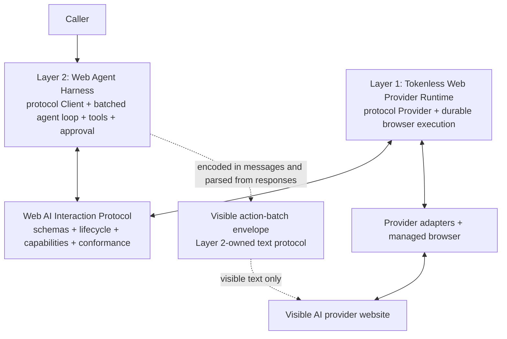

# Web AI Interaction Protocol

Status: proposed | Priority: P0 | Working title: Web AI Interaction Protocol

Depends on: the typed visible-provider capability seam, durable daemon job and conversation identity, real-provider evidence rules, and the existing visible browser execution boundary

Blocks: the stable cross-project seam required by [Web Agent Harness](P0-web-agent-harness.md); protocol discovery and specification precede the Harness package's dependency on a provider-turn client

Related: [Real Provider Browser E2E and Native Projects](P0-real-provider-browser-e2e-and-native-projects.md) supplies provider-side evidence; [Agent Session Integrations](P1-agent-session-integrations.md) is a caller interface, not this protocol; [Codex Guided Delegation and Session Binding](P0-codex-guided-delegation-and-session-binding.md) supplies exact Codex identity to explicitly delegated Harness runs, not a replacement for this protocol; the visible model-control envelope remains owned by the Harness roadmap

Packaging direction: one independently buildable, language-neutral protocol package in this repository first; external repository, package scope, final name, and governance only after the contract is stable and namespace ownership is verified

## Outcome

Define an independent, open, versioned protocol for reliably driving a stateful AI provider implemented through a visible website. The protocol standardizes externally observable provider behavior rather than Tokenless internals.

The current Tokenless repository adopts the Provider side of the protocol as its intended public cross-project boundary. The Web Agent Harness adopts the Client side. Layer 2 therefore depends on the protocol, not on private Layer 1 classes, daemon tables, provider adapters, or browser objects.

The first version is an open protocol developed and exercised inside this repository. It is not described as an industry standard. That claim requires at least one genuinely independent implementation that does not depend on Tokenless implementation code and passes the same conformance requirements.

The canonical problem statement is:

> How can an external caller reliably drive a stateful, recoverable, and verifiable AI interaction whose provider implementation operates through a visible website?

The protocol covers capabilities, workspace and conversation identity, instruction delivery, turn submission, durable lifecycle, waiting and recovery, dispatch certainty, results, artifacts, citations, and evidence. It does not standardize an agent loop, tool execution, MCP, browser automation, or provider DOM.

## Relationship to the Existing Plans

| Component or roadmap | Protocol relationship | Owns | Must not depend on or absorb |
| --- | --- | --- | --- |
| This protocol | Normative contract and shared compatibility boundary | Semantics, wire schemas, lifecycle, capability negotiation, errors, versioning, conformance rules, and language bindings | Tokenless storage, daemon routes, Playwright, provider selectors, MCP, tools, approvals, or agent policy |
| Tokenless Layer 1 / current repository | First Provider Runtime and reference Provider implementation | Visible browser execution, provider adapters, durable provider turns, exact provider-side resources, and evidence-backed outcomes | Harness prompts, action-batch parsing, MCP clients, approval policy, or agent-loop state |
| [Web Agent Harness](P0-web-agent-harness.md) / Layer 2 | First Client implementation and primary design consumer | Agent adapters and identity, Harness context/run persistence, uploaded System Prompt Bundle, Skill registry and `SKILL.md` staging, attachment manifests, visible action-batch and final envelopes, tools, consolidated user input, approvals, MCP execution, aggregate results, and limits | Provider DOM, browser profiles, selectors, Provider database tables, or private daemon modules |
| Visible Web-Agent Control Protocol | A separate Layer 2-to-model text contract carried inside protocol messages | Tool-request and final-result envelopes visible in model text | Provider runtime semantics or Layer 1 parsing |
| [Agent Session Integrations](P1-agent-session-integrations.md) | Caller integration that may invoke Layer 1 or the Harness | Caller-session binding and local MCP exposure | Replacing the Client/Provider protocol or inheriting web-model tool-execution authority |
| OpenAI-compatible mapping profile | Optional, explicitly lossy compatibility adapter | Simple stateless request/result mappings | Defining the canonical resource, lifecycle, identity, waiting, resume, or evidence model |

The sequencing contract is explicit:

1. specify the protocol boundary and vocabulary;
2. publish versioned schemas and conformance rules inside the repository;
3. adapt the current Tokenless Web Provider runtime to implement the Provider side;
4. build the Web Agent Harness against the protocol Client side; and
5. seek a second independent implementation before proposing broader standardization.

Layer 1 implementation work and Layer 2 research may continue where they discover requirements, but no Layer 2 cross-package dependency is considered stable until its required protocol slice exists.

## Architecture



The diagram shows an implementation relationship, not a network topology. The protocol may initially be bound to the authenticated local daemon HTTP interface, but its canonical semantics and schemas must not require a particular transport, process layout, or repository.

## Protocol Boundary

The protocol standardizes one Provider's externally observable ability to:

- report supported protocol versions and semantic capabilities;
- create, resolve, or reject a workspace intent;
- create or continue an exact provider-side conversation;
- deliver instructions using an explicit supported mode and report what was actually applied;
- submit one correlated turn with bounded attachments and constraints;
- expose a durable state that can be read, resumed, or cancelled when supported;
- distinguish proven non-dispatch, proven dispatch, and ambiguous dispatch;
- return complete visible output, citations, artifacts, resource identity, and bounded evidence; and
- classify failures and user-intervention requirements without exposing secrets or implementation details.

It does not standardize how the Provider achieves those outcomes. A compliant Provider may use a browser runtime, extension, remote service, or another implementation, provided its declared capabilities and observable behavior satisfy the protocol.

### Upstream Agent Correlation

A Client may attach a versioned opaque correlation object to a provider turn, such as a Harness project, conversation, turn, or invocation ID. The Provider preserves and returns that object for correlation but does not interpret its agent-specific hierarchy or make it provider resource identity.

Provider workspace, conversation, and turn references remain Provider-owned results. The Client binds those results to its own agent records after completion. This permits exact Codex-to-provider continuity without moving hook parsing, Codex IDs, or Harness persistence into the Web Provider API.

### Explicit Exclusions

The canonical spec and core schemas must not contain:

- Playwright `Page`, browser contexts, selectors, locators, or DOM snapshots;
- Chrome profile paths, cookies, storage, credentials, hidden headers, or private provider traffic;
- SQLite rows, daemon table names, leases, worker ids, or process topology;
- ChatGPT, Claude, Gemini, Grok, Qwen, or another provider's URL or menu shape;
- MCP clients, MCP transports, tool registries, tool approvals, skills, or agent-loop policy; or
- the Harness's visible control codec, nonce framing, action-batch envelope, aggregate-result envelope, or repair policy.

Provider-specific metadata may appear only in a namespaced extension container. A Client must be able to complete core behavior without reading it.

## Canonical Resource Model

The protocol is language-neutral. TypeScript bindings may expose types similar to the examples below, but the specification and JSON Schemas are normative; TypeScript interfaces alone are never the protocol.

### Provider Capabilities

A capability document declares protocol versions and fine-grained behavior instead of treating every web provider as equivalent. At minimum it covers:

- conversation creation, exact continuation, and identity strength;
- workspace support and supported workspace kinds;
- project instruction, conversation bootstrap, and native system-role fidelity;
- attachment media types and byte limits;
- asynchronous, resumable, and cancellable execution;
- citations, artifacts, structured visible text, and evidence; and
- transport-profile and extension support.

Capability negotiation fails closed. A Client requests semantic outcomes; a Provider selects only a route whose real-provider evidence satisfies every required capability. UI resemblance or a selector's presence does not establish support.

### Workspace and Conversation

`WorkspaceRef` and `ConversationRef` are opaque, durable protocol identifiers. Human-readable names and provider URLs are metadata, not identity.

A conversation continuation claim means the Provider can prove that the next turn targets the same provider-side conversation. Replaying prior text into a new conversation is not exact continuation and must not be represented as such.

The protocol permits providers without native workspaces. It reports the actual applied workspace mode rather than manufacturing parity with Project-like features.

### Instruction Delivery

Instruction delivery is an explicit request and evidence pair. Initial modes include:

- `project_instruction`;
- `conversation_bootstrap`; and
- `native_system_role` only where the real provider surface genuinely offers and verifies that semantic role.

The Provider returns the requested mode, applied mode, content revision, verification status, and bounded evidence. A normal user message fallback must never be reported as a native system instruction.

### Turn

A turn request references or declares:

- required capabilities and selected protocol version;
- workspace and conversation intent;
- instruction deliveries and revisions;
- one visible message and bounded attachment references;
- correlation and idempotency identifiers; and
- optional time, byte, and output limits supported by the selected profile.

Starting a turn returns an opaque `TurnRef`. Reading the turn returns its current lifecycle state and, only after success, its complete visible result.

### Durable Lifecycle and Waiting

The initial lifecycle is:

```text
queued
running
waiting_for_user
succeeded
failed
cancelled
```

Initial waiting reasons include `authentication`, `mfa`, `captcha`, `consent`, `provider_blocker`, `ambiguous_submission`, and `manual_intervention`. The exact vocabulary is versioned in the protocol error and state registries.

`waiting_for_user` is durable and inspectable. It does not authorize automation of login, CAPTCHA, MFA, Keychain approval, purchases, external authorization, or another user-controlled security boundary. A provider adapter may automatically accept an exact, known onboarding Terms/Privacy dialog for the provider and profile the user already selected; ambiguous consent remains `waiting_for_user`.

### Dispatch Certainty and Idempotency

Every externally mutating submission reports one of:

```text
not_dispatched
dispatched
ambiguous
```

`ambiguous` is a first-class outcome. If a browser or process fails after the visible send action but before confirmation, a Client must not blindly replay the turn. Resume and retry rules are defined against dispatch evidence and idempotency identity, not process-local exceptions.

The Provider persists intent before mutation and preserves stable correlation across retries, recovery, and results. Protocol idempotency does not falsely promise that an arbitrary website supports transactional exactly-once execution.

### Result, Artifact, Citation, and Evidence

A successful result contains bounded visible text plus exact workspace, conversation, and turn identity. It may also contain citations, artifact references, instruction-delivery evidence, and provider evidence references.

Evidence proves the semantic outcome needed by the protocol without exposing full DOM, screenshots, browser storage, credentials, unrelated account content, or hidden reasoning. Provider metadata is optional, namespaced, bounded, and never required for core Client logic.

### Errors

The error taxonomy separates at least:

- unsupported capability or protocol version;
- invalid request or schema;
- resource not found, identity mismatch, or stale reference;
- authentication or user-intervention requirement;
- provider availability, plan, or rate limitation;
- visible navigation, selection, upload, submission, or response failure;
- timeout, cancellation, and recovery failure; and
- ambiguous external mutation.

Errors include stable machine codes, retry and intervention guidance, dispatch certainty where relevant, and a bounded user-facing message. They do not leak selectors, raw DOM, secrets, or internal stack traces as protocol fields.

## Specification and Package Shape

The initial repository shape is provisional:

```text
packages/web-ai-interaction-protocol/
  package.json
  src/
    version.ts
    capabilities.ts
    workspace.ts
    conversation.ts
    instructions.ts
    turn.ts
    state.ts
    errors.ts
    artifacts.ts
    evidence.ts
    transport.ts
  schemas/
    v0/
  spec/
    protocol.md
    lifecycle.md
    versioning.md
    security.md
  conformance/
```

The directory name is a local working name, not a claim on an npm package, scope, domain, organization, acronym, or external project name. Before any external publication, verify namespace ownership and conflicts explicitly.

The first package contains:

- the language-neutral semantic specification;
- canonical JSON Schemas with stable ids;
- a reference TypeScript binding generated from or mechanically checked against those schemas;
- transport-profile definitions;
- machine-readable capability and error registries;
- black-box conformance commands and result format; and
- minimal valid examples whose status is clearly distinct from provider acceptance evidence.

Examples help explain schemas but cannot prove runtime support. No fixture, simulated response, source regex, mock Provider, or synthetic fetch can establish protocol conformance for Tokenless or another Provider.

## Initial Transport Profile

The canonical protocol is transport-neutral. V0 defines one local asynchronous HTTP profile that can be implemented over the authenticated Tokenless daemon boundary:

- capability discovery;
- create/start turn;
- read turn state and result;
- resume a waiting turn where supported; and
- request cancellation.

Exact paths and status codes belong to the transport profile, not the core semantic model. A later stdio, MCP, remote HTTP, or in-process binding must preserve the same resource identity, lifecycle, error, and evidence semantics.

Authentication is profile-specific and out of scope for core messages. Credentials and bearer tokens must never be embedded in protocol resources, evidence, examples, or provider metadata.

## Versioning and Extensions

V0 uses explicit negotiation and may change while the first two implementations are being built. Every message identifies its schema and protocol version through the transport profile; silent shape guessing is forbidden.

Versioning rules must define:

- compatible additive fields and capability additions;
- breaking semantic, enum, required-field, and lifecycle changes;
- unknown-field preservation or rejection policy per message class;
- deprecation and minimum-supported-version windows;
- schema id stability and reproducible binding generation; and
- namespaced extension registration without claiming external namespace ownership.

Core behavior cannot require a Tokenless extension. An extension that becomes necessary for both initial implementations is evidence that the core protocol is incomplete and should be revised during V0.

## OpenAI-Compatible Mapping Profile

An optional compatibility profile may map simple, stateless calls to or from OpenAI Responses or Chat Completions shapes. It is not the canonical protocol.

The profile must label information loss for workspace identity, exact conversation continuation, verified instruction delivery, waiting, resume, dispatch ambiguity, and evidence. It must reject a requested semantic outcome rather than silently weakening it.

## Conformance and Evidence

Conformance has three distinct levels:

| Level | Required proof |
| --- | --- |
| Schema | Built package validates real serialized messages against the selected canonical schemas and version rules |
| Client | A built Client negotiates capabilities, drives lifecycle and recovery, and consumes results through the public transport profile without Provider-private imports |
| Provider | A built Provider exposes the profile and proves every advertised semantic capability through its real execution boundary |

For Tokenless, Provider conformance uses the built CLI, packaged TypeScript daemon, real SQLite state, managed browser, explicitly selected setup-managed profile, real provider website, and provider network. Required cases never skip except where the repository's declared live-provider exception allows it.

Conformance results record protocol version, implementation identity, requested capabilities, case ids, outcomes, and bounded evidence references. They never collect screenshots, full DOM, browser storage, credentials, hidden headers, unrelated account content, or private reasoning.

The reference TypeScript binding and Tokenless adapter are not independent implementations. A second implementation counts only when it can implement the spec without importing Tokenless private code and pass the applicable black-box conformance suite through a real boundary.

## Delivery Phases

### Phase 0: Charter, Vocabulary, and Decision Records

- Freeze the problem statement, scope, exclusions, security model, and relation to the Harness visible control protocol.
- Inventory the current Tokenless job, capability, workspace, conversation, instruction, attachment, result, evidence, and recovery semantics.
- Resolve mismatches through protocol concepts rather than copying daemon endpoints or database states.
- Record open decisions for transport, resource identity, version negotiation, extensions, and evidence.
- Choose only a provisional internal package and protocol name; perform namespace due diligence before any external naming commitment.

Exit: the protocol charter and semantic inventory are reviewed, every current Layer 1/Layer 2 cross-boundary concept has an owner, and no private implementation concept is required by the proposed core.

### Phase 1: V0 Specification, Schemas, and TypeScript Binding

- Write the language-neutral core specification, lifecycle, versioning, and security documents.
- Add canonical JSON Schemas for capabilities, resources, instructions, turns, states, results, evidence, and errors.
- Add the reference TypeScript binding and reproducible schema/binding consistency check.
- Define the local asynchronous HTTP transport profile and black-box conformance result format.
- Publish minimal valid examples while clearly separating them from live capability evidence.

Exit: an independently buildable protocol package can validate a complete serialized turn lifecycle without importing CLI, daemon, provider, Playwright, profile, Harness, MCP, or storage modules.

### Phase 2: Tokenless Provider Runtime Adoption

- Add a protocol Provider adapter over the current durable daemon and visible-provider execution services.
- Map internal job states and errors to protocol states without exposing tables, leases, workers, selectors, or raw actions.
- Expose capability negotiation based only on the existing evidence-backed provider capability catalog.
- Route the normal ChatGPT one-turn QA path through the protocol boundary before using it for an agent loop.
- Prove exact conversation continuation, instruction-delivery evidence, result correlation, cancellation, waiting, recovery, and dispatch ambiguity where applicable.

Exit: the built Tokenless CLI and packaged daemon complete the representative real ChatGPT flow through the V0 Provider interface with unchanged visible behavior, and removing all Harness code leaves that path working.

### Phase 3: Web Agent Harness Client Adoption

- Generate or consume the protocol Client binding from the same canonical schemas.
- Make the Harness package depend only on the protocol package and its selected transport adapter.
- Replace any provisional private provider-turn types with protocol resources or Harness-owned composition types.
- Prove a no-tool AgentRun and then the bounded visible tool loop without importing Provider, Playwright, daemon-storage, profile, DOM, or CLI implementation modules.
- Add a compatibility matrix binding Harness releases to supported protocol versions rather than Tokenless implementation versions.

Exit: the [Web Agent Harness](P0-web-agent-harness.md) completes its first real ChatGPT loop through the protocol Client, and replacing the Tokenless Provider with another conforming Provider requires configuration and transport wiring rather than Harness source reorganization.

### Phase 4: Independent Implementation and Externalization Decision

- Invite or build one second Provider or Client implementation that does not depend on Tokenless private code.
- Run the same applicable black-box conformance suite and document any Tokenless assumptions it reveals.
- Stabilize compatibility policy, change proposals, security review, extension registration, and multi-party maintenance expectations.
- Decide whether to extract the protocol to an independent repository and whether any verified external namespace is appropriate.
- Describe the work as a standard candidate only if independent implementation and governance evidence support that claim.

Exit: a second independent implementation passes conformance, or the protocol remains honestly labeled a Tokenless-originated open protocol with the discovered portability gaps documented.

## Acceptance Criteria

- The protocol has a language-neutral semantic specification, canonical JSON Schemas, lifecycle, version rules, error taxonomy, capability negotiation, conformance rules, and a reference TypeScript binding.
- The protocol standardizes observable Web AI Provider behavior and contains no Tokenless database, daemon implementation, Playwright, profile, selector, provider-URL, MCP, skill, approval, or agent-loop types.
- Tokenless implements the Provider side through a public adapter over real durable browser execution; it does not make internal classes the protocol.
- The Web Agent Harness implements the Client side and has no private source dependency on Layer 1.
- The visible Web-Agent Control Protocol remains a Layer 2-to-model text contract and is never parsed or interpreted by Layer 1.
- Capability claims are fine-grained, negotiated, evidence-backed, and fail closed.
- Exact workspace and conversation identity use opaque durable references; replayed history is never mislabeled as exact continuation.
- Instruction evidence records the actual applied mode and never labels a visible user message as a native system instruction.
- Dispatch ambiguity is represented explicitly and never converted into an automatic replay.
- Provider metadata and extensions remain optional to core Client behavior.
- The initial Tokenless conformance path uses built artifacts and a real visible provider boundary without fixtures, interception, simulated responses, mocks, or synthetic fetches.
- Package and protocol names remain provisional until external namespace ownership and conflicts are verified.
- No industry-standard claim is made before a second independent implementation passes the applicable conformance suite.

## Risks and Responses

| Risk | Response |
| --- | --- |
| The protocol merely renames current daemon endpoints | Start from semantic resources and observable outcomes; reject tables, routes, worker states, and internal classes from the core model |
| Layer 2 needs a private Layer 1 escape hatch | Treat the missing capability as protocol design evidence; add a generic negotiated semantic or fail the route rather than import internals |
| The protocol absorbs the agent loop | Keep MCP, tools, approval, skills, control-envelope parsing, and loop policy exclusively in the Harness |
| Provider differences are flattened dishonestly | Use fine-grained capabilities, actual-applied evidence, and explicit unsupported outcomes |
| A retry duplicates a visible submission | Make dispatch certainty and durable correlation normative; stop on ambiguity |
| TypeScript types drift from wire schemas | Make schemas and spec normative and require reproducible binding consistency checks |
| Conformance becomes fixture-based self-certification | Require built black-box implementations and real Provider boundaries for advertised behavior |
| Tokenless is called a standard without adoption | Use “open protocol” during V0 and require an independent implementation before broader claims |
| A package name assumes external ownership | Keep internal names provisional and verify scope, registry, organization, domain, and acronym conflicts before publication |
| OpenAI compatibility weakens stateful semantics silently | Keep it an optional lossy profile that reports or rejects semantic loss |

## Non-Goals

- Standardizing a complete agent architecture, planner, memory system, tool runtime, MCP host, approval system, or skill format
- Exposing browser automation, raw DOM, selectors, profiles, credentials, storage, or private provider traffic
- Making every provider appear to support Projects, system instructions, continuation, attachments, cancellation, or resume
- Defining the Harness visible action-batch or aggregate-result envelope, or teaching Layer 1 to interpret model tool requests
- Replacing Tokenless's internal durable scheduler, provider adapters, or evidence collection design
- Publishing a package, splitting a repository, claiming an external namespace, or creating a standards body in the first phase
- Claiming compatibility solely from schema parsing without real behavioral proof
- Treating OpenAI-compatible shapes as the canonical protocol
- Promising transactional exactly-once behavior from third-party websites

## Primary References

- [Web Agent Harness](P0-web-agent-harness.md)
- [Real Provider Browser E2E and Native Projects](P0-real-provider-browser-e2e-and-native-projects.md)
- [Provider Architecture and Registry](archived/P0-provider-architecture-and-registry.md)
- [Context Delivery and Workspace Alignment](P0-context-delivery-and-workspace-alignment.md)
- [Concurrency and Session Scheduling](P0-concurrency-and-session-scheduling.md)
