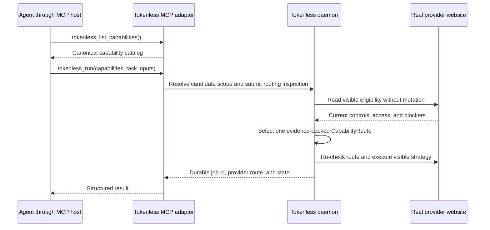

# Agent Session Integrations

Status: proposed | Priority: P1 | First integration: northbound local MCP server, then Codex

Depends on: stable local job identity, typed provider capabilities, and the Context Envelope contract

Related: [Web Agent Harness](P0-web-agent-harness.md) owns the independently buildable harness package, skill injection, southbound MCP client, tool authorization, and web-model tool loop

## Outcome

Tokenless binds work to the exact conversation and filesystem scope of the local agent that requested it. Provider routing no longer guesses a project from names or the process's incidental current directory.

The product surface is an agent-neutral, capability-first routing protocol with a local MCP server as its primary explicit agent tool surface. Callers state the outcome they require; Tokenless selects a provider and provider-specific strategy. A Codex plugin is the first deep lifecycle integration, not a Codex-only architecture.

## Current Implementation State

As of 2026-07-31, the first CLI routing slice is complete:

- `tokenless capabilities list --json` returns the versioned canonical catalog, parameter schemas, lifecycle and evidence contracts, stability, and declared provider routes without opening a browser;
- `tokenless run --capability <capability>` accepts repeatable canonical requirements;
- normal runs infer `conversation.chat`, attachments infer `file.upload` plus their media-specific input capability, and native Workspace intent infers `workspace.native`;
- explicit and inferred requirements are merged before any daemon submission or browser mutation;
- implicit selection filters the configured provider scope by the complete requirement set and cached profile eligibility;
- explicit provider constraints fail rather than switching when the provider lacks an E2E-closed route; and
- the selected capability route is persisted with the daemon job and returned by `tokenless state`; and
- implicit normal runs persist compatible alternatives and the daemon can atomically requeue the same logical job after a provider-scoped visible blocker while preserving durable attempt history;
- `conversation.chat`, `file.upload`, and `workspace.native` are the only currently routeable task outcomes.

Candidate catalog entries remain non-routeable. The complete Deep Research lifecycle, required-citation postcondition, explicit continuation contract, generated artifact lifecycles, structured capability parameters, MCP transport, and scheduler-aware route selection remain planned work.

## Capability-First Routing

A provider-neutral `--mode` flag would unify spelling without unifying meaning. Qwen composer modes, provider reasoning controls, research variants, image creation surfaces, and future provider-specific controls do not share one stable semantic type. A raw string flag would still let an agent pass a valid Qwen label to the wrong provider, use a disabled account-tier option, or reuse a stale label after the provider DOM changes.

The caller-facing interface should instead accept canonical task capabilities such as:

| Capability | Caller intent |
| --- | --- |
| `conversation.chat` | Submit a normal chat request and read the correlated response |
| `research.deep` | Produce a provider-native deep research result that meets the documented evidence contract |
| `image.generation` | Produce an image result through a proven visible provider flow |
| `file.upload` | Deliver caller-selected files and prove visible provider acceptance |
| `workspace.native` | Use a proven native provider Project or equivalent named workspace |
| `conversation.continue` | Continue the exact durable provider conversation |
| `response.citations` | Require visible citation evidence in the provider response |

This initial list is illustrative, not an automatic support declaration. A capability enters the public catalog only after its minimum semantics, inputs, success evidence, composability, and failure behavior are defined.

`qwen.mode`, `model.choice`, and provider DOM selectors remain provider strategy details. A future `research.deep` route may use a Qwen strategy that selects the visible Deep Research mode, but the current implementation rejects that capability because Qwen's final-report lifecycle is not closed. If Qwen or another provider later proves the same canonical outcome, it can satisfy the task capability through a different adapter without changing the caller interface.

Do not claim equivalence merely because two providers use similar labels. A canonical capability represents a minimum externally observable outcome, not the presence of a menu item.

## Capability Catalog and Provider Matrix

Maintain two related but distinct product records:

The maintained [Provider Capability Census](../provider-capability-census.md) supplies current product reconnaissance and the candidate vocabulary. It does not grant runtime support.

### Canonical Capability Catalog

The catalog defines what callers may request:

| Field | Purpose |
| --- | --- |
| `id` | Stable canonical capability identifier |
| `title` and `description` | Agent- and human-readable intent |
| `inputSchema` | Capability-specific structured inputs |
| `sideEffects` | Whether the capability reads, uploads, submits, creates, or persists provider state |
| `composesWith` and `conflictsWith` | Valid multi-capability requests |
| `requiredEvidence` | Minimum visible and durable outcomes needed for success |
| `stability` | Experimental or supported |

### Provider Capability Matrix

The provider matrix defines how, and whether, each provider satisfies each canonical capability:

| Field | Purpose |
| --- | --- |
| `provider` and `capability` | Matrix key |
| `strategy` | Provider-owned implementation, such as the Qwen Deep Research mode strategy |
| `support` | `supported`, `experimental`, `unavailable`, or `unknown` |
| `accountConstraints` | Known tier or authentication constraints without treating labels as authorization |
| `runtimeInspection` | Visible controls and blockers that must be checked for the selected profile |
| `evidence` | Real-provider E2E closure required before routing is advertised |
| `reason` | Structured explanation when unavailable or unknown |

The checked-in live E2E matrix remains an acceptance and evidence plan; it is not imported as runtime product configuration. Runtime declarations live with the typed provider and capability registry. Built-interface checks should verify that the externally listed capability routes and the real-provider acceptance matrix do not drift.

## Router Module

The router is a deep module at the caller-to-provider seam. Its small interface accepts:

- one or more required canonical capabilities;
- the selected managed profile;
- an optional explicit provider constraint when the user actually requested one; and
- structured task inputs such as prompt, files, workspace intent, and output requirements.

Its implementation owns:

- the canonical catalog;
- provider strategy mappings;
- provider stage and support evidence;
- configured provider preferences;
- cached profile access observations;
- fresh read-only capability inspection when needed; and
- deterministic failure explanations.

The router returns one `CapabilityRoute` containing the selected provider, profile, matched strategies, route reason, evidence status, and any blocker. Execution uses that exact route and re-checks visible preconditions before the first mutation.

### Deterministic Routing Policy

1. Validate the requested capability set and infer structurally required capabilities. Attachments imply `file.upload`; native workspace intent implies `workspace.native`.
2. If the caller supplied an explicit provider constraint, evaluate only that provider and fail rather than silently switching.
3. Otherwise, if `preferredProviders` is configured, use membership in that list as the complete provider filter.
4. Otherwise, use every enabled provider in stable setup order.
5. Remove providers without implemented and real-E2E-closed mappings for every required capability.
6. Evaluate current profile access, visible availability, blockers, subscription-aware capacity, and plan limits through read-only inspection and the scheduler capacity policy.
7. Select an eligible provider through the general capacity, fairness, and route-selection algorithm.
8. If no single provider satisfies the complete request, fail with every evaluated provider and structured reasons.

V1 never splits one successful execution across multiple providers and never submits trial prompts while routing. Runtime fallback replays the authorized request from the beginning only before submission and only when completed mutations are reconstructable; it does not treat provider-local partial work as portable completion. `preferredProviders` filters candidate membership only: list position does not override capability eligibility, rate-limit capacity, fairness, profile health, or the rest of route selection. Fallback never escapes the configured provider set.

The existing `preferredProviders` name is weaker than this behavior because “preferred” often implies ordered ranking or fallback outside the list. Before making capability routing a public contract, either document its filter semantics explicitly or migrate to an unambiguous name such as `providerRoutingScope`.

For example, if `research.deep` is currently closed only for Qwen:

- preferences `[chatgpt, qwen]` route to Qwen;
- preferences `[chatgpt, claude]` fail without escaping the configured scope;
- no preferences route to Qwen if the selected profile can use the proven strategy; and
- an explicit `provider=chatgpt` constraint fails rather than switching to Qwen.

Provider-specific tuning remains secondary. A canonical capability uses a documented default provider strategy. Add cross-provider parameters only when their semantics can be defined honestly. Advanced low-level CLI controls may remain for diagnostics and explicit human use, but agents should not need them for the primary flow.

The planned CLI interface is deliberately small:

```bash
tokenless capabilities list --json

tokenless run \
  --capability research.deep \
  "Research this topic"

tokenless run \
  --capability research.deep \
  --attach-file evidence.pdf \
  "Research this topic using the attached evidence"
```

`--capability` is repeatable. A run without the flag infers `conversation.chat`; attachments additionally infer `file.upload`. Explicit and inferred requirements are merged before routing, so the caller does not repeat information already present in structured task inputs.

## Why MCP

The CLI remains the human, scripting, diagnostics, and recovery interface. MCP becomes the preferred agent interface because it provides:

- typed capability identifiers and structured inputs instead of shell quoting and flag routing;
- a discoverable capability catalog;
- structured route decisions, results, and repair instructions;
- durable job identifiers for polling, resume, and cancellation; and
- a place to enforce provider, profile, capability, evidence, and freshness constraints before browser actions start.

MCP does not make provider-specific semantics generic. It lets the router hide them behind a capability-first interface.

This roadmap uses MCP only as a northbound transport: Tokenless is an MCP server called by Codex or another agent host. It does not own the separate southbound role in which the Web Agent Harness is the MCP host/client executing tools requested by a web model. That role, its credentials, approvals, tool schemas, and durable loop belong to [Web Agent Harness](P0-web-agent-harness.md).

This roadmap is therefore an integration interface, not an early Agent Harness. Its tools expose the Web Provider layer's durable web operations and bind them to an external session. It does not inject skills into the web model, teach the web model an MCP calling protocol, execute the requested MCP tools, return their results to the provider conversation, or own the agent loop. When the separate harness package is available, an agent-run interface calls that package; harness logic does not move into this P1 adapter.

## Minimal MCP Tool Surface

The first MCP version should expose a small stable tool list instead of one tool per provider or per visible mode:

| Tool | Mutation | Purpose |
| --- | --- | --- |
| `tokenless_list_capabilities` | No | Return the canonical catalog, schemas, and current declared provider coverage |
| `tokenless_run` | Yes | Accept required capabilities and task inputs, resolve one route, and submit one durable job |
| `tokenless_get_job` | No | Read durable state, structured visible-action evidence, response text, and repair instructions |
| `tokenless_resume_job` | Yes | Resume the same waiting job after user-resolvable auth, CAPTCHA, consent, or confirmation |
| `tokenless_cancel_job` | Yes | Cancel one exact durable job |

Do not expose a generic arbitrary `provider-action` or raw provider-mode MCP tool in v1. It would reproduce the CLI's low-level action vocabulary without making common agent workflows safer. Add narrowly scoped advanced tools later only when an agent workflow cannot be represented by catalog, run, state, resume, and cancel.

The MCP server is a thin trusted local adapter over the same daemon job and provider capability contracts. It does not own another browser, attach through CDP, automate login, or receive provider credentials. The daemon remains the only Playwright actor.

Keep the MCP tool schemas stable across account state. The canonical capability identifiers may be a schema enum for a published product version, while runtime provider eligibility belongs in route results rather than a connection-specific tool list. Tool-list change notifications are reserved for actual product tool additions or removals. This avoids depending on every MCP host refreshing dynamic schemas correctly and remains compatible with stateless transports.

Tool results use structured output schemas and also provide concise text fallbacks for compatible hosts. Tool annotations identify read-only and mutating operations, but are hints rather than authorization; user approval policy remains the MCP host's responsibility.



The adapter should call internal typed APIs or the authenticated daemon contract directly, not spawn CLI subprocesses and parse their output. Package the first `stdio` server with the existing CLI distribution rather than creating a new package namespace.

Official MCP references:

- [MCP tools, input schemas, structured output, annotations, and errors](https://modelcontextprotocol.io/specification/2025-11-25/server/tools)
- [MCP transports](https://modelcontextprotocol.io/specification/2025-11-25/basic/transports)

## MCP Trust Boundary

- Start with local `stdio` transport launched by the MCP host. Consider authenticated loopback transport only after a concrete multi-process need exists.
- Never return the daemon bearer token, browser profile paths, cookies, storage, raw DOM, or unrelated account data to the model.
- Resolve file inputs against declared MCP roots or explicit absolute paths and apply the existing regular-file, size, count, staging, and provenance rules.
- Bind calls to explicit agent session metadata when the host supplies it. Missing binding may reduce routing features but must not silently guess another session.
- Treat tool descriptions, annotations, and client-provided metadata as untrusted inputs at the daemon boundary.
- Preserve existing manual-user handoff for sign-in, CAPTCHA, MFA, plan upgrade, consent, and confirmation.

## Stable Agent Session Binding

Introduce a versioned `AgentSessionBinding`:

| Field | Purpose |
| --- | --- |
| `agentKind` | Identifies the producer, initially `codex` |
| `sessionId` | Stable conversation or thread identity supplied by the agent |
| `turnId` | Optional turn identity for request/result correlation |
| `cwd` | Exact working directory reported by the agent |
| `projectRoot` | Canonical project root resolved from `cwd` |
| `worktreeId` | Canonical realpath plus repository/worktree identity |
| `repository` | Optional VCS remote identity with credentials removed |
| `branch` and `head` | Optional source-state evidence, not project identity |
| `transcriptRef` | Optional local reference with explicit access policy |
| `startedAt` and `observedAt` | Freshness and lifecycle evidence |
| `producerVersion` | Adapter and schema compatibility |

The durable lookup key is `agentKind + sessionId`. Project, worktree, and provider-workspace bindings are associated records and can change over a session's lifetime.

## Why Codex First

Current Codex lifecycle hooks provide the fields needed for exact first-party binding:

- `session_id`;
- `cwd`;
- an optional `transcript_path`;
- lifecycle events such as `SessionStart`, `UserPromptSubmit`, `Stop`, and `SessionEnd`; and
- plugin-local writable data through `PLUGIN_DATA`.

Codex also defines `CODEX_HOME` as its state root, with `~/.codex` as the default. Directly scanning that directory is not the primary integration path. Hook metadata is narrower, more explicit, and better aligned with the active conversation.

The transcript path is a convenience reference, but its format is not a stable hook interface. Transcript reading must therefore be optional, consented, version-detected, and replaceable.

Official references:

- [Codex hooks](https://learn.chatgpt.com/docs/hooks)
- [Codex configuration and state locations](https://learn.chatgpt.com/docs/config-file/config-advanced#config-and-state-locations)
- [Codex plugins](https://developers.openai.com/plugins)

## Codex Integration Shape

The installable Codex plugin should bundle:

- a Tokenless routing skill for explicit user or agent invocation;
- trusted lifecycle hooks that register and refresh session binding;
- configuration for the local Tokenless MCP server;
- schemas for context export and Tokenless result import; and
- clear permission, privacy, and uninstall behavior.

The primary flow is:

1. `SessionStart` sends `session_id`, `cwd`, and adapter version to the local Tokenless control plane.
2. Tokenless canonicalizes the working directory, resolves the project root and worktree, and persists the binding.
3. An explicit Tokenless invocation includes the same session id and optional turn id.
4. Tokenless resolves the provider workspace from the exact session/project binding.
5. The web result returns to the requesting session with job id, context revision, provider conversation identity, and artifacts.
6. `SessionEnd` marks the binding inactive without deleting retained user-approved history.

Hooks register identity; they do not submit prompts or upload files implicitly.

## Delivery Phases

### Phase 0: Capability Catalog and Routing Protocol

- Define the canonical capability catalog, provider capability matrix, `CapabilityRoute`, `AgentSessionBinding`, lifecycle events, and schema versioning.
- Separate agent identity, filesystem identity, provider workspace identity, and task identity.
- Define collision, resume, fork, worktree-change, and stale-session behavior.
- Define capability composition, conflicts, provider preference scope, explicit provider constraints, stale observations, account blockers, and route failure behavior.
- Add built CLI commands to list canonical capabilities and submit repeated required capability identifiers.

Exit: the built CLI can list the catalog and deterministically route a multi-capability request to one eligible provider without caller-supplied provider details.

### Phase 1: Local MCP Server

- Add a local `stdio` MCP entry point backed by the packaged Tokenless daemon and existing durable jobs.
- Expose only list-capabilities, run, get-job, resume-job, and cancel-job.
- Publish strict input and structured output schemas generated from or checked against the internal contracts.
- Accept canonical required capabilities and keep provider-specific controls behind the router module.
- Return the chosen provider route, typed blockers, candidate rejection reasons, and retry or repair instructions.
- Add MCP protocol conformance and real daemon-bound integration coverage without provider simulations.

Exit: an MCP client can request `research.deep` without naming Qwen, observe an evidence-backed Qwen route, poll the durable result, and receive a pre-mutation error when no provider in the configured scope is eligible.

### Phase 2: Explicit Codex Binding

- Add a Tokenless command that accepts Codex `session_id` and `cwd`.
- Resolve realpath, repository root, worktree, branch, and current revision.
- Persist the binding in the local daemon.
- Route jobs by exact binding and expose the resolved identity in state output without leaking raw private paths.

Exit: two Codex sessions in different worktrees or directories resolve to different bindings even when project names are identical.

### Phase 3: Codex Plugin and Lifecycle Hooks

- Package the routing skill and minimal hook definitions as a plugin.
- Configure the local MCP server as the explicit Tokenless tool surface.
- Register on `SessionStart` and refresh only on meaningful lifecycle changes.
- Require the user to review and trust plugin hooks.
- Keep prompt submission explicit and observable.

Exit: starting or resuming a Codex session creates or refreshes the exact binding with no project-name guess.

### Phase 4: Authorized Context Export

- Add an explicit action that exports the current goal, user prompt, plan, relevant repository guidance, and selected files into a Context Envelope.
- Treat `transcript_path` as optional and unstable.
- When transcript import is enabled, use versioned readers, bounded selection, and a preview or manifest before sharing.
- Never import authentication state, hidden prompts, private reasoning, or unrelated sessions.

Exit: the user can inspect what session context will be sent, and Tokenless works correctly when no transcript is available.

### Phase 5: Additional Agent Adapters

- Publish the protocol and adapter conformance suite.
- Add other mainstream coding agents through their stable lifecycle, extension, or invocation surfaces.
- Keep product-specific logic in adapters while preserving shared identity and context contracts.

Exit: a second agent can complete the same exact-binding and context-handoff workflow without Codex-specific fields leaking into core contracts.

## Acceptance Criteria

- Session matching uses an agent-supplied stable id, never chat title or project display name.
- Callers request canonical task capabilities; provider-specific actions and mode labels stay inside provider strategy adapters.
- Routing honors an explicit provider constraint, otherwise filters candidates by the configured preferred-provider set, otherwise considers all enabled providers; the normal capability, capacity, fairness, and health algorithms run after that filter.
- One V1 route must satisfy the complete requested capability set through one provider.
- Runtime presence alone never makes a route supported; provider mapping and real-provider E2E closure are both required.
- MCP mutation tools reject unknown, conflicting, unsupported, unavailable, and blocked capability requests before browser mutation.
- MCP tool schemas and structured outputs are versioned and validated against the internal daemon contracts.
- The first MCP release has no arbitrary low-level provider-action escape hatch.
- Working directory and project root are canonicalized and checked for changes.
- Worktrees and concurrent sessions are distinct.
- Session resume preserves identity; session fork creates a distinct identity with explicit lineage when available.
- A missing or stale binding fails with a repair instruction instead of falling back to name guessing.
- Hook registration is local, bounded, reviewable, and idempotent.
- Transcript access is off by default and the core workflow does not depend on its file format.
- Plugin removal or binding revocation stops future integration without deleting unrelated Tokenless state.
- Integration tests exercise the built CLI/daemon and a real Codex hook payload or supported Codex process boundary; no fake agent implementation is treated as product proof.

## Risks and Responses

| Risk | Response |
| --- | --- |
| Codex internal storage format changes | Prefer stable hook fields; isolate optional transcript readers by detected version |
| Session id is accidentally exposed to providers | Keep it local and use a separate opaque provider-facing correlation id |
| Hooks become surprising background automation | Limit hooks to identity registration and require explicit task submission |
| Same repository has multiple worktrees or subdirectory sessions | Bind canonical `cwd`, project root, and worktree identity separately |
| Agent lacks lifecycle hooks | Use explicit invocation metadata and report reduced lifecycle capability |
| Plugin surface changes | Keep the agent-neutral local protocol independently usable |
| MCP host caches tools or ignores list-change notifications | Keep the v1 tool list stable and return runtime provider eligibility in route results |
| Agent invents or edits a provider option label | Accept canonical capability identifiers and keep provider labels out of the primary MCP interface |
| Preferred providers cannot satisfy the request | Fail with candidate reasons; do not silently escape the configured scope |
| Provider availability changes during routing | Re-check visible route preconditions before the first mutation |
| Similar provider features do not have equivalent outcomes | Define capability semantics by required evidence and keep non-equivalent strategies provider-specific |
| Tool annotations are treated as authorization | Enforce authorization and mutation policy inside Tokenless; annotations remain hints |

## Non-Goals

- Parsing all files under `CODEX_HOME` as a stable public database
- Reading Codex authentication material, logs, or unrelated sessions
- Uploading a Codex transcript by default
- Making provider project names the source of identity
- Requiring every supported agent to install the same plugin format
- Flattening provider-specific controls into one universal mode taxonomy
- Generating one MCP tool for every provider mode or visible menu item
- Splitting one V1 request across several providers
- Silently routing outside the user's configured preferred-provider scope
- Exposing the daemon bearer token or browser debugging access to the MCP client
