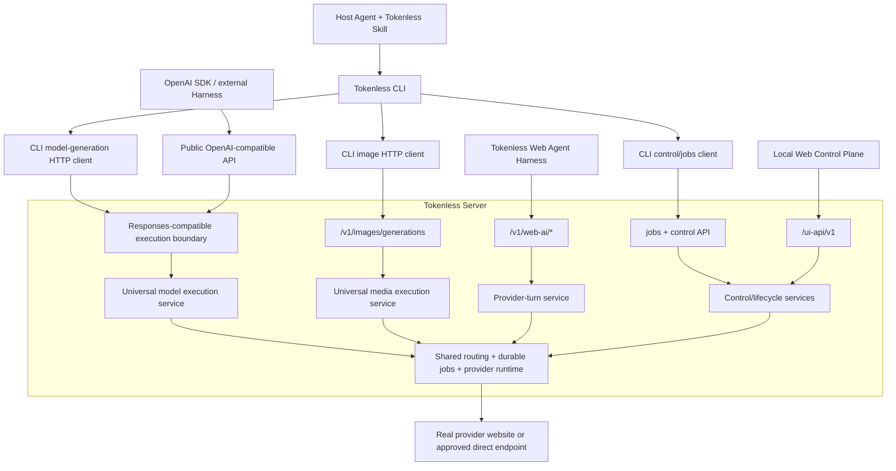

# CLI Universal API 收敛

Status: active, proposed | Priority: P1

Depends on: [Runtime Package 边界重构](archived/P0-runtime-package-boundary-refactor.md) 完成、[OpenAI Tool Calling、Structured Output 与可移植 Provider Context](P0-openai-tool-calling-structured-output-and-portable-context.md) 的稳定 Responses contract、现有 authenticated local daemon HTTP boundary

Related: [Tokenless Architecture](../architecture.zh-CN.md)、[API Proxy Integration](../api-proxy-integration.zh-CN.md)、[Downloaded Image Assets](P0-downloaded-image-assets.md)、[Web AI Interaction Protocol](P0-web-ai-interaction-protocol.md)、[Web Agent Harness](P0-web-agent-harness.md)

## Outcome

让 Tokenless CLI 的 model-generation 路径尽可能复用 Universal API，而不把所有 CLI 能力错误地塞进 OpenAI-compatible schema：

- 普通 language/model generation 在 contract 能无损表达时，通过 OpenAI Responses-compatible HTTP boundary 执行；
- image generation 与 image edit 继续通过统一的 `POST /v1/images/generations` media boundary 执行；
- job state、detached execution、waiting、resume、cancel、provider inspection、provider-specific visible actions、setup 与 administration 继续通过 Tokenless control/jobs HTTP API；
- Web Agent Harness 继续通过 `/v1/web-ai/*` provider-turn API 工作，不成为 CLI 或 image API 的中转层；
- CLI 只负责参数映射、daemon bootstrap、HTTP 调用、等待/恢复与输出展示，不再拥有另一套 model execution implementation；
- Universal API、control API 与 provider-turn API 共用同一 server application/provider runtime，但保持不同的 caller contract 和 authority。

本 roadmap 不属于零逻辑变化的 package 重构。已归档的 [Runtime Package 边界重构](archived/P0-runtime-package-boundary-refactor.md) 已完成零回归验收；本计划仍须单独实施、单独验证，不能回混入已完成的目录迁移。

## Decision

### 整个 CLI 不能只依赖 OpenAI-compatible API

OpenAI-compatible API 是 model API，不是完整 Tokenless control plane。当前 CLI 还拥有以下不能无损表示为 Chat Completions 或 Responses request 的能力：

- daemon bootstrap、setup、config 与 profile administration；
- detached `--no-wait` submission、durable state、replay、waiting、resume 与 cancel；
- provider readiness、account inspection、model/effort inspection 与 provider-specific controls；
- low-level visible actions、approved target URL、page identity 与 sanitized snapshot；
- native/conversation workspace selection、provider Project identity 与 exact continuation；
- browser runtime、dashboard、output savings、diagnostics 与 maintenance。

把这些能力包装成大量 `tokenless.*` OpenAI extension，会把 Universal API 变成另一份 Tokenless control API，同时削弱 OpenAI compatibility。因此目标不是“整个 CLI 只调用 `/v1/responses`”，而是：

> CLI 的 model-generation lane 使用 Universal API；CLI 的 control and lifecycle lanes 使用 Tokenless control/jobs API。

### Image generation 属于 Universal API

Image generation 不是 CLI-owned capability，也不是 Harness provider-turn capability。它是 Universal API 中与 language endpoints 平级的 media endpoint：

```text
Universal API
├── Language
│   ├── POST /v1/chat/completions
│   └── POST /v1/responses
├── Media
│   └── POST /v1/images/generations
└── Assets
    └── GET /v1/asset/...
```

CLI 是 `/v1/images/generations` 的一个 caller。External SDK 或其他 authorized local caller 也可以直接调用同一 endpoint。Harness 如果未来把 image generation 暴露为 Harness-owned tool，也应由该 tool 调用 media endpoint；`/v1/web-ai/*` 本身不拥有 image generation implementation。

当前实现已经遵守这个方向：`tokenless run` 检测到 `image.generation` 后调用 `generateImage()`，后者通过 authenticated HTTP 请求 `POST /v1/images/generations`。本 roadmap 保留并强化这条路径，不把它搬回 CLI 或 provider-turn API。

## Current Behavior Audit

| CLI/product path | Current HTTP/execution path | Target |
| --- | --- | --- |
| Default `tokenless run` | CLI 组装 `ManagedPlaywrightJobRequest`，通过 `POST /jobs` 创建 provider job | 对可无损表示的 model-generation subset，改为 Universal Responses path |
| `run` with `image.generation` | `POST /v1/images/generations` | 保持，作为 canonical media path |
| Image edit with `reference_image` | `POST /v1/images/generations` Tokenless extension | 保持；不为目录整洁新增另一套 implementation |
| `state` / `replay` / `resume` / `cancel` | Durable jobs/control API | 保持 |
| Provider inspection/configuration/actions | Managed job/control API | 保持 |
| Setup/profile/browser/dashboard/maintenance | Control API 与 local bootstrap | 保持 |
| External OpenAI callers | `/v1/chat/completions`、`/v1/responses` | 保持并与 CLI model lane 共享 Universal execution service |
| Web Agent Harness | `/v1/web-ai/*` bindings、attachments、turn lifecycle | 保持独立 |

当前 default `run` 与 OpenAI API 最终都会建立 durable provider job，但它们在不同 adapter 中分别完成 request normalization、routing、job creation、waiting 与 output mapping。这是本 roadmap 要消除的 model-execution duplication；它不授权合并 control、Harness 或 media contract。

## Target Architecture



`Universal model execution service` 与 `Universal media execution service` 表示不同 request/result contract 共享同一低层 runtime，不要求建立通用 service framework 或 plugin system。

## CLI HTTP Routing Rule

| CLI behavior | HTTP owner | Reason |
| --- | --- | --- |
| Prompt → completed text/tool/structured model result | Responses-compatible Universal API | 标准 model turn 语义 |
| Image prompt → persisted image asset | `/v1/images/generations` | 标准 media outcome，与 text turn 不同 |
| Reference image → edited persisted asset | `/v1/images/generations` media extension | 当前 canonical Tokenless media contract |
| Read/list/cancel/resume durable job | `/jobs` control API | OpenAI response body不是 Tokenless job control contract |
| Detached submission | Jobs/control API until a proved async Responses contract exists | 必须立即返回 durable job identity |
| Waiting for sign-in/CAPTCHA/user handoff | Jobs/control API | 必须保留同一 job、profile 与 resume identity |
| Provider status/controls/raw visible action | Control/jobs API | Provider operation，不是 model API |
| Harness turn with attachment acceptance and opaque turn refs | `/v1/web-ai/*` | Harness/provider lifecycle contract，不是 CLI model call |

## Why Immediate Full Migration Is Unsafe

当前 Responses-compatible request 只接受有限的 `tokenless` options：`execution_mode`、`provider_backend` 与 `auth_context_id`。当前 CLI `run` 还需要表达或返回：

- explicit profile；
- task/idempotency/page identity；
- browser visibility 与 CLI timeout policy；
- agent kind/session correlation；
- context envelope、attachments 与 workspace intent；
- provider-specific model/effort/mode controls；
- implicit plain-text auto routing；
- no-wait、waiting、resume/cancel 与 detailed status log；
- provider Project/conversation mapping 与 current CLI JSON payload。

另有一个当前 behavior conflict：public OpenAI-compatible routes 在 `api-proxy disabled` 时返回 `api_proxy_disabled`，但 `tokenless run` 不要求用户先启用 API proxy。直接把 CLI 切到现有 public route 会让一个当前可用命令开始失败。

因此在完成 contract parity 和 enable-policy 决策之前，不得把 default CLI path 直接改成 `/v1/responses`，也不得靠自动启用 API proxy、隐藏 fallback 到 `/jobs` 或双提交来伪装完成。

## Safe Scope

### Candidate Universal API subset

最先评估的 subset：

- exact `tokenless/<provider>` model；
- one user prompt assembled from现有 `--prompt`、`--prompt-file`、`--file` 与 `--context` inputs；
- browser 或 direct execution mode；
- synchronous `submit_and_read`；
- no attachment、workspace、target URL、page reuse 或 provider-specific visible control；
- completed text result、citations、provider、job id、execution mode 与 provider attempts。

只有当同一 built CLI command 的 current `/jobs` path 与 candidate Universal path 在真实边界产生等价 observable behavior 时，才迁移该 subset。

### Paths intentionally outside the subset

- `--no-wait`、waiting/resume/cancel；
- file upload 与 media inputs；
- native/conversation workspace；
- explicit page/target/provider conversation continuation；
- provider-specific model、effort、mode、plugin、Skill 或 search controls；
- provider inspection、configuration 与 low-level action；
- snapshot、setup、profiles、runtime、dashboard、diagnostics 与 maintenance。

这些路径继续通过 control/jobs API，不是失败或临时 fallback，而是正确的 contract ownership。

## API Enable Policy Gate

在 CLI model lane 使用 exact public `/v1/responses` 之前，必须解决以下同时存在的 current contracts：

1. `tokenless run` 在 API proxy disabled 时仍可工作；
2. `tokenless api-proxy disable` 目前要求 public compatibility routes 拒绝 traffic。

首选顺序：

1. 先让 public `/v1/responses` 与 CLI candidate path 共享一个 Universal execution service，消除业务逻辑重复；
2. 保持 CLI 使用现有 jobs/control path，直到产品明确决定 proxy enable semantics；
3. 只有在不破坏上述两个 current contracts时，才让 CLI 调用 exact public route；
4. 如果两个 contract 无法同时成立，停止迁移并提出一个单独的用户可见 API lifecycle 变更，不在本 roadmap 中静默改变 `api-proxy enable/disable`。

本 roadmap 不通过 caller header、可伪造的“CLI mode”、自动写 config、临时开关 proxy 或额外 scoped credential 绕过这个 gate。

## Contract Parity Matrix

在实现前建立以下逐项矩阵：

| Dimension | Current CLI `/jobs` | Current `/v1/responses` | Migration requirement |
| --- | --- | --- | --- |
| Provider selection | exact + implicit capability routing | exact；auto 仅 structured-control scope | 同一 CLI input 不能改变 provider semantics |
| Profile | explicit selected profile | current default profile resolution | 必须保留 explicit profile behavior |
| Task identity | task/idempotency/page/agent context | response id + local response ledger | 必须保留 CLI public task/job identity |
| Continuation | task/page/provider mappings | `previous_response_id` rules | 不得混淆或静默改会话 |
| Attachments | staged visible provider upload | current text-only model history | 不迁移直到 API contract 真正支持 |
| Workspace | native/conversation strategies | 不支持 | 继续 control/jobs path |
| Provider controls | visible exact labels/modes | model string + limited options | 继续 control/jobs path |
| Auto fallback | plain submit-and-read capability routing | structured-control-only auto | 语义不等价时不得迁移 |
| Async lifecycle | no-wait/state/waiting/resume/cancel | synchronous completion/error | 继续 jobs control |
| Output | rich CLI payload and status log | OpenAI response + `tokenless` metadata | CLI output必须保持兼容 |
| Proxy enable | CLI run independent | public route gated | 必须先通过 enable-policy gate |

## Image Generation Contract

### Ownership

- Request normalization、provider selection、browser/direct routing、job creation、asset persistence 与 response mapping 属于 server Universal media layer。
- CLI 只把现有 flags 映射为 image request，并展示 `data[]` 与 `tokenless` metadata。
- Provider adapters 只执行 provider-specific image actions；它们不拥有 public image route。
- Harness provider-turn 只拥有 conversation turn semantics；它不解析 image API request。

### Required invariants

- `POST /v1/images/generations` 继续是 browser/direct 的 canonical endpoint；
- browser auto 只选择同时满足 `image.generation` 与 `artifact.download` 的 evidence-backed route；
- reference image 继续要求完整 `image.edit`、`image.input`、`file.upload` 与 `artifact.download` route；
- returned URL 继续指向 authenticated `/v1/asset/...`，不暴露 provider URL、credential 或 private path；
- CLI、external caller 与未来 Harness image tool 消费同一 response contract；
- 不为 CLI 另建 image service，也不把 image bytes 放进 provider-turn state。

## E2E Strategy

继续遵守仓库真实边界政策：不新增 unit test、mock、fake provider、provider DOM fixture、synthetic response 或 source regex test。

### Local real-boundary evidence

- built CLI argument/output validation through the packaged binary；
- authenticated daemon HTTP requests through the real server；
- OpenAI Responses request/response schema and stable error envelope；
- image generation HTTP, persisted asset bytes and authenticated asset download；
- jobs state/resume/cancel semantics for paths that remain on control API；
- `api-proxy disabled` while normal CLI behavior remains unchanged until the enable-policy gate is explicitly resolved。

### Real provider evidence

- one exact-provider prompt through current CLI `/jobs` baseline；
- the same bounded semantic task through candidate Universal path；
- output assertions based on required meaning, job/provider identity and persisted state, not exact model wording；
- one real browser image generation and authenticated downloaded asset；
- one direct image generation where that route is currently supported；
- no duplicate provider mutation during differential verification。

Comparison evidence must not persist provider DOM、session values、full private prompt、unrelated response content 或 credential。

## Delivery Phases

### Phase 0：Audit and freeze current behavior

- [ ] 完成 CLI command/flag → HTTP owner matrix。
- [ ] 记录 default run、explicit provider、implicit routing、image generation、image edit、no-wait、waiting/resume/cancel 与 provider-control baseline。
- [ ] 固定 current API proxy enable/disable behavior 与 CLI independence。
- [ ] 确认 package-boundary roadmap 已完成，不再同时移动源文件。

Exit: 每个 CLI behavior 已被归类为 Universal language、Universal media、control/jobs 或 provider-turn；没有模糊 owner。

### Phase 1：One Universal model execution service

- [ ] 抽出当前 `/v1/responses` 与 candidate CLI model path 共享的 request-neutral application use case。
- [ ] 保持 OpenAI serializer、CLI presenter、control/job lifecycle 各自位于 adapter boundary。
- [ ] 让 `/v1/responses` 与现有 CLI path 创建相同底层 durable provider job semantics，不复制 routing/provider logic。
- [ ] 保持 public API proxy enable gate 与所有 current CLI behavior。

Exit: 两条 HTTP adapter 共享一个 model execution owner，但 CLI 尚未切换 public route。

### Phase 2：Close the lossless Responses subset

- [ ] 为 candidate subset补齐必要的 namespaced Tokenless metadata，只增加当前 CLI parity 所需字段。
- [ ] 保留 explicit profile、task/job identity、execution mode、citations、provider attempts 与 CLI output mapping。
- [ ] 证明 exact-provider synchronous prompt 的 built CLI 与 direct Responses call 语义等价。
- [ ] 不加入 attachment、workspace、provider-control 或 async machinery。

Exit: candidate subset 可以通过 Responses-compatible contract 无损完成。

### Phase 3：Resolve API enable policy

- [ ] 评估 exact `/v1/responses` 是否能在保留 `api-proxy disable` 与 normal CLI availability 的同时成为 CLI route。
- [ ] 如果可以，记录单一清晰 contract 并增加真实边界 evidence。
- [ ] 如果不可以，CLI 保持调用 control/jobs adapter，同时复用 Phase 1 Universal service；把 API lifecycle 产品变更另立 roadmap。
- [ ] 不实现 hidden bypass、automatic enable 或 dual submission。

Exit: 路径选择不会破坏当前 CLI 或 API proxy behavior。

### Phase 4：Switch only the proved CLI subset

- [ ] 只迁移 Phase 2/3 已证明无损的 exact-provider synchronous model-generation subset。
- [ ] 保持所有 excluded paths 在 control/jobs API。
- [ ] CLI JSON/human output、exit codes、status handling 与 localization 不变。
- [ ] 删除已迁移 subset 的 duplicate request/routing logic。

Exit: migrated model lane 只有一个 execution owner；非 model/control paths 没有被错误迁移。

### Phase 5：Reaffirm Universal media and final verification

- [ ] 保持 image generation/edit 通过 `/v1/images/generations`。
- [ ] 运行 browser image、direct image、asset download 与 CLI output E2E。
- [ ] 运行 candidate Responses、control/jobs、Harness provider-turn 与 Dashboard regression gates。
- [ ] 更新 architecture、CLI/API docs、OpenAPI 与 roadmap index，明确四种 HTTP ownership。

Exit: CLI model、media、control 与 Harness turn lanes 清晰，所有 applicable real-boundary gates 通过。

## Acceptance Criteria

- [ ] CLI model-generation candidate subset 通过一个 Universal model execution owner，不重复 routing/provider/job implementation。
- [ ] CLI 不是“OpenAI-only client”；control、lifecycle 与 administration 正确保留在 control/jobs API。
- [ ] Image generation/edit 继续属于 Universal media API，并由 CLI 与 authorized external callers复用。
- [ ] Harness provider-turn API 不吸收 CLI control 或 image generation ownership。
- [ ] `api-proxy enable/disable` 与 normal CLI availability 未被静默改变；无法兼容时不强行切换 exact public route。
- [ ] Existing CLI commands、flags、outputs、job identity、persistence、provider behavior 与 security boundary 保持兼容。
- [ ] No-wait、waiting、resume/cancel、attachments、workspace 与 provider-specific controls 没有被伪装成不完整 OpenAI extensions。
- [ ] Built CLI、real HTTP、persistent jobs/assets、configured browser 与 applicable real provider E2E 全部通过。
- [ ] 没有新增 unit test、mock、fake provider、fixture、synthetic provider response 或 source regex test。

## Non-Goals

- 把所有 Tokenless HTTP API 重命名成 OpenAI API；
- 把 setup、profiles、jobs、browser、Dashboard 或 provider controls 塞进 Responses schema；
- 让 Harness provider-turn 成为 CLI 或 image generation 的中转层；
- 新建 CLI-only image implementation 或复制 Universal image adapter；
- 为追求单一路径而删除 `api-proxy enable/disable`、`--no-wait`、resume/cancel、provider controls 或其他当前功能；
- 在本 roadmap 中扩展新的 attachment、workspace、async Responses 或 hosted API 产品；
- 同时执行 package boundary 源码移动与 model execution logic migration。

## Risks and Responses

| Risk | Response |
| --- | --- |
| “复用 OpenAI API”被理解为所有 CLI command 都走 Responses | 用 routing table 固定 model、media、control 与 provider-turn 四个 lane |
| 为追求 parity 无限增加 `tokenless` extensions | 只接纳 candidate subset 当前必须字段；无法无损表达的行为留在 control/jobs |
| Public proxy disabled 导致 CLI regression | 设独立 enable-policy gate；未解决前不切 exact public route |
| 两条 adapter 长期复制 routing/job logic | Phase 1 先统一 application owner，再决定 HTTP caller path |
| A/B 测试导致两次真实 provider mutation | 每个 run 只走一条路径，使用独立 bounded task 比较语义证据 |
| Image generation 被并入 Harness turn | 保持 `/v1/images/generations` 为独立 Universal media endpoint |

## Completion Definition

本 roadmap 只有在 CLI HTTP owner matrix 完成、candidate model subset 经真实边界证明后收敛到一个 Universal execution owner、image generation 保持统一 media boundary、control/jobs 与 Harness provider-turn authority 不被混淆、所有 current CLI behavior 无回退时才能归档。

如果最终证明 exact public `/v1/responses` 与 current `api-proxy disable` 语义无法兼容，CLI 继续通过 control/jobs HTTP adapter调用同一 Universal application service也是本 roadmap 的有效完成态；“统一 ownership”优先于“强行统一 URL”。
