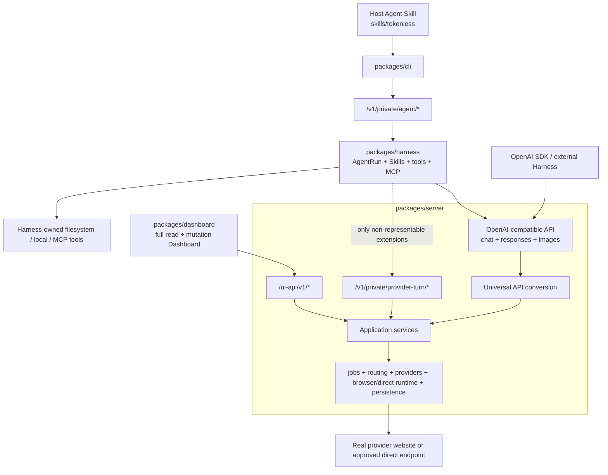

# OpenAI-compatible API 收敛

Status: active, proposed | Priority: P1

Depends on: [Runtime Package 边界重构](archived/P0-runtime-package-boundary-refactor.md) 完成、[OpenAI Tool Calling、Structured Output 与可移植 Provider Context](P0-openai-tool-calling-structured-output-and-portable-context.md) 的稳定 Responses contract、现有 authenticated local daemon HTTP boundary

Related: [Tokenless Architecture](../architecture.zh-CN.md)、[API Proxy Integration](../api-proxy-integration.zh-CN.md)、[Downloaded Image Assets](P0-downloaded-image-assets.md)、[Web Agent Harness](P0-web-agent-harness.md)

Supersedes: [Web AI Interaction Protocol](archived/P0-web-ai-interaction-protocol.md) 作为独立 public/canonical protocol 的方向；保留其中已经实现的 provider-turn contract 作为 Tokenless private extension。

## Outcome

CLI 与 Tokenless Web Agent Harness 都优先复用同一套 OpenAI-compatible API：

- language、tool calling 与 structured output 在能够无损表达时使用 `POST /v1/responses` 或 `POST /v1/chat/completions`；
- image generation 与 image edit 使用 `POST /v1/images/generations`；
- Harness 只有在 OpenAI contract 无法表达当前必需语义时，才使用 `/v1/private/provider-turn/*`；
- CLI 的 agent-run control 使用 `/v1/private/agent/*`，普通 jobs、setup、provider inspection 与 administration 继续使用既有 control/jobs API；
- Dashboard 保留现有全部 read 与 mutation 能力，通过 `/ui-api/v1/*` 使用 shared application services；
- CLI 与 Harness 不各自维护另一套 provider execution implementation。

本 roadmap 会改变 execution ownership，因此与已经完成的零逻辑 package 重构分开实施。任何迁移都必须保证当前 CLI、Dashboard、Harness、provider 与 persistence 行为不回退。

## 已完成的 namespace 与 source boundary

2026-08-19 已完成命名和目录收口，不改变 provider-turn payload、lifecycle 或 provider behavior：

| Before | Now | Ownership |
| --- | --- | --- |
| `packages/protocol/` | `packages/contracts/` | Cross-package contract，不是 HTTP server layer |
| package root protocol export | `private/provider-turn` | Tokenless private provider-turn schema、type 与 validation |
| `local-http` | `private/provider-turn-http` | Thin loopback HTTP Client Adapter |
| `server/http/web-ai/` | `server/http/private/provider-turn/` | Private HTTP route Adapter |
| `/v1/web-ai/*` | `/v1/private/provider-turn/*` | Private provider-turn extensions |
| `/v1/agent/*` | `/v1/private/agent/*` | Private first-party Harness run control |
| `/v1/featurebench/*` | `/v1/private/featurebench/*` | Private benchmark channel |
| `/v1/asset/*` | `/v1/private/assets/*` | Authenticated Tokenless asset readback |

`packages/contracts/` 目前还包含 Dashboard DTO、localized error summary 与 shared structured-JSON helpers。它只定义跨 package 的 Interface 和 thin Client Adapter；真正的 HTTP implementation 在 `packages/server/src/http/`。

OpenAI-compatible request/response 不在 `packages/contracts/` 重新定义。它们由 compatibility route、OpenAPI contract 与 Universal API adapter 直接拥有。

## Target Architecture



OpenAI API 是默认 model/media Interface。Private provider-turn 不是第二套平级 model API，而是迁移期间和确有必要时的 extension Interface。

## HTTP ownership rule

| Observable behavior | Canonical Interface | Notes |
| --- | --- | --- |
| Prompt → text/tool/structured result | `/v1/responses` or `/v1/chat/completions` | CLI、Harness 与 external caller 共享 |
| Image prompt/edit → persisted image result | `/v1/images/generations` | 不属于 CLI 或 provider-turn |
| First-party Harness run create/read/resume/cancel | `/v1/private/agent/*` | Tokenless AgentRun control |
| Attachment acceptance、opaque turn refs、waiting/resume 或其他无法无损映射的 turn control | `/v1/private/provider-turn/*` | 只保留必要 extension |
| Jobs、detached execution、setup、provider inspection、administration | Existing control/jobs API | 不伪装成 OpenAI model API |
| Dashboard read/mutation | `/ui-api/v1/*` | 保留全部现有能力 |

任何 private provider-turn 字段都必须通过 deletion test：删掉后，如果当前 Harness 仍能用 OpenAI API 完成同一 observable behavior，该字段或 route 就不应继续保留。

## Image generation

Image generation 属于 OpenAI-compatible media layer：

```text
OpenAI-compatible API
├── POST /v1/chat/completions
├── POST /v1/responses
└── POST /v1/images/generations
     └── GET /v1/private/assets/...
```

CLI、external caller 与未来 Harness image tool 都消费同一 `images/generations` Interface。Harness 可以把它作为 Harness-owned tool 调用，但不得把 image implementation 或 image bytes 搬进 private provider-turn state。

## Current behavior audit

| Caller/path | Current implementation | Target |
| --- | --- | --- |
| Default `tokenless run` | CLI 通过 `/jobs` 创建 provider job | Lossless model subset 收敛到 Universal execution owner |
| CLI image generation/edit | `/v1/images/generations` | 保持 |
| CLI agent run control | `/v1/private/agent/*` | 保持 |
| External OpenAI caller | `/v1/chat/completions`、`/v1/responses`、`/v1/images/generations` | 保持 |
| Tokenless Harness model turn | 当前仍通过 `/v1/private/provider-turn/*` | Lossless subset 迁到 OpenAI-compatible API |
| Harness attachment/lifecycle extensions | `/v1/private/provider-turn/*` | 逐项评估，只保留不可无损表达部分 |
| Dashboard | `/ui-api/v1/*` | 行为不变 |

namespace 迁移没有宣称 Harness 已经完成 OpenAI convergence。当前 private route 仍承载现有 turn，直到后续 phase 的真实边界 parity 证明完成。

## Contract parity gates

### CLI

- explicit provider 与 profile selection；
- task/job identity、citations、provider attempts 与 output mapping；
- `api-proxy enable/disable` 与 normal CLI availability；
- no-wait、waiting、resume/cancel、workspace、attachments 与 provider-specific controls。

无法无损表示的 CLI control behavior 保留在 control/jobs API，不增加大量 `tokenless.*` OpenAI extensions。

### Harness

- system prompt 与 Skill attachment delivery；
- exact conversation continuation；
- tool call/result correlation、parallel tool calls 与 structured final output；
- waiting-for-user、resume、cancel 与 ambiguous dispatch；
- opaque provider identity、attachment acceptance 与 durable turn state。

每一项先判断现有 Responses contract 是否已经能表达。能表达的直接 consolidate；不能表达且当前 Harness 确实依赖的，才留在 private provider-turn。

## API enable-policy gate

当前 public OpenAI-compatible routes 受 `api-proxy enable/disable` 控制，而正常 CLI/Harness 运行不能因为 proxy disabled 发生回退。

实施顺序：

1. 先让 public OpenAI routes 与 current CLI/Harness adapters 共享一个 Universal execution owner；
2. 保持现有 caller path，直到 enable semantics 被明确；
3. 只在不改变当前 availability 时切换 exact public route；
4. 如果无法兼容，保留 private/control Adapter 调用同一 application service，不使用 hidden header、automatic enable、fallback 或 dual submission。

## E2E strategy

不新增 unit test、mock、fake provider、provider fixture、synthetic response 或 source-regex test。

### Namespace slice

- built packages 和 packed CLI install；
- authenticated loopback HTTP through new private paths；
- existing Harness run、provider-turn、image asset 与 FeatureBench flows；
- legacy private paths 不再作为 route 暴露；
- full repository check 与代表性 configured-browser E2E。

### Convergence slices

- 同一 bounded task 只走一条 execution path，避免 duplicate provider mutation；
- current CLI/Harness path 先建立 baseline；
- candidate OpenAI path 通过 built CLI/packaged daemon/real provider boundary 证明 semantic parity；
- assertions 基于 observable result、identity、state 与 tool semantics，不依赖 exact model wording；
- credentials、provider DOM、session values 与 unrelated account content 不进入 evidence。

## Delivery phases

### Phase 0: Namespace and contract boundary

- [x] 将 private versioned routes 收口到 `/v1/private/*`。
- [x] 将 `packages/protocol/` 改为 `packages/contracts/`。
- [x] 分开 provider-turn Contract、HTTP Client Adapter 与 server HTTP Adapter。
- [x] 保持 OpenAI-compatible routes 和 Dashboard behavior 不变。
- [x] 用 package、loopback HTTP 与 existing E2E 验证迁移。

### Phase 1: Behavior-to-interface matrix

- [ ] 建立 CLI 和 Harness current behavior → OpenAI/private/control Interface matrix。
- [ ] 标出每个 private provider-turn 字段的当前 caller 和 deletion consequence。
- [ ] 固定 current API enable behavior 和 real-provider baseline。

Exit: 每个 behavior 只有一个明确 owner，没有“以后可能需要”字段。

### Phase 2: One Universal execution owner

- [ ] 让 OpenAI routes、candidate CLI adapter 与 candidate Harness adapter 共享同一 application use case。
- [ ] Serializer、presenter、AgentRun 与 private lifecycle 留在各自 Adapter。
- [ ] 不复制 routing、provider selection、job creation 或 result normalization。

Exit: 多个 Interface Adapter 后面只有一个 model execution implementation。

### Phase 3: Migrate the lossless Harness subset

- [ ] 先迁移 text/tool/structured turn 的最小 lossless subset。
- [ ] 保留当前 Skills、tool authorization、action batch、MCP 与 AgentRun behavior。
- [ ] 删除被 OpenAI API 完整替代的 private request/result fields 和 route usage。
- [ ] 不能无损表达的 attachment/lifecycle extension 继续走 private provider-turn。

### Phase 4: Migrate the lossless CLI subset

- [ ] 迁移 exact-provider synchronous model generation subset。
- [ ] 保持 control/jobs、setup、inspection、no-wait 与 resume/cancel lane。
- [ ] 保持 CLI JSON/human output、exit code、localization 与 persisted identity。

### Phase 5: Final consolidation

- [ ] 删除无 caller 的 private provider-turn fields、client methods 与 routes。
- [ ] 保持 image generation/edit 只由 Universal media layer 拥有。
- [ ] 运行 full local checks、configured-browser E2E 与 applicable real-provider gates。
- [ ] 更新 architecture、OpenAPI 与 roadmap lifecycle。

## Acceptance criteria

- [ ] CLI 与 Harness 的 lossless model subset 共用一个 Universal execution owner。
- [ ] Harness 默认 model turn 使用 OpenAI-compatible API；private provider-turn 只保留已证明必要的 extension。
- [ ] Image generation/edit 继续通过 `/v1/images/generations`，asset readback 位于 `/v1/private/assets/*`。
- [ ] Dashboard 所有现有 read/mutation 行为保持不变。
- [ ] CLI、Harness、provider、persistence、security boundary 与 observable output 无功能回退。
- [ ] `api-proxy enable/disable` 没有被 hidden bypass、automatic enable 或 fallback 改写。
- [ ] 没有新增 unit test、mock、fake、fixture 或 synthetic provider evidence。

## Non-goals

- 把 jobs、setup、profiles、browser、Dashboard 或 provider administration 塞进 OpenAI schema；
- 维护一套与 OpenAI 平级的 Tokenless model protocol；
- 为 future requirement 保留无 current caller 的 private extension；
- 同时执行无关 provider feature、storage migration 或 control API redesign；
- 通过 compatibility alias 长期保留旧 `/v1/web-ai/*` 或 `/v1/agent/*`。

## Completion definition

本 roadmap 只有在 CLI 与 Harness 的 lossless model behavior 已收敛到一个 Universal execution owner、private provider-turn 只剩当前必要 extension、image/media ownership 不变、Dashboard 和全部现有功能无回退、适用真实边界 gate 全部通过后才能归档。
