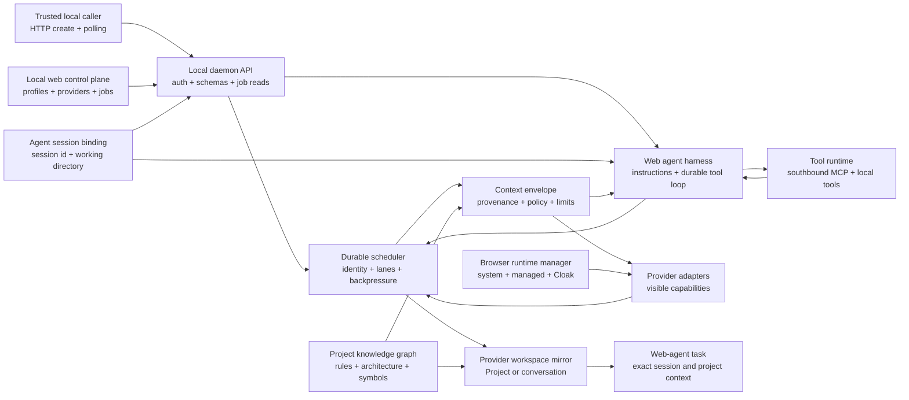

# Tokenless Roadmaps

Status: active product direction | Last reviewed: 2026-08-01

This directory contains long-horizon product and engineering roadmaps. It is separate from `plans/`, which contains bounded implementation plans for individual pieces of work.

Roadmaps describe intended outcomes, sequencing, evidence, and acceptance criteria. They are not release promises, fixed dates, or compatibility guarantees. A capability becomes supported only after the implementation and real-boundary verification required by the relevant roadmap are complete.

## Lifecycle and Directory Structure

The roadmap's directory is the source of truth for its lifecycle:

```text
docs/roadmaps/
├── README.md             # Index and lifecycle rules
├── P[0-3]-*.md           # Active roadmaps
├── backlog/
│   ├── README.md         # Backlog index
│   └── P[0-3]-*.md       # Accepted but intentionally inactive roadmaps
└── archived/
    ├── README.md         # Archive index
    └── P[0-3]-*.md       # Completed, superseded, cancelled, or retired roadmaps
```

There is intentionally no `active/` directory. Every root-level Markdown file other than this index is active. An active roadmap can still have an internal delivery status such as `proposed`; lifecycle placement describes whether the direction is currently active, while the document status describes its delivery maturity.

Move a roadmap to:

- [`backlog/`](backlog/README.md) when the direction is accepted but intentionally not being pursued;
- [`archived/`](archived/README.md) when it is completed, superseded, cancelled, or no longer planned; or
- this directory's root when it becomes active.

Every roadmap filename must begin with its product priority (`P0-`, `P1-`, `P2-`, or `P3-`), and that prefix must match the priority declared in the document. A priority change therefore requires a rename. Every addition, rename, move, priority change, or lifecycle change must update this index, all repository links, and the roadmap's lifecycle or disposition note. A superseded roadmap must link to its replacement. Archived roadmaps retain their historical content.

## Active Roadmaps

| Roadmap | Outcome | Current priority |
| --- | --- | --- |
| [Browser Runtime Selection and Cloak Integration](P0-browser-runtime-selection-and-cloak.md) | Use an exact profile-bound Chromium runtime, prefer the user's installed browser, provide a locked managed fallback, and add explicit verified Cloak installation on supported platforms. | P0 |
| [Browser Connection Mode Capability Evaluation](P0-browser-connection-mode-capability-evaluation.md) | Compare native Playwright and CDP connections against the same local-browser and real-provider capability matrices without changing the default. | P0 |
| [Real Provider Browser E2E and Native Projects](P0-real-provider-browser-e2e-and-native-projects.md) | Prove every advertised visible capability against real provider websites and add real Claude and Grok native Project creation, reuse, and continuation. | P0 |
| [Provider Expansion and Parity](P0-provider-expansion.md) | Add high-value AI web providers and maintain an evidence-backed capability catalog and routing matrix across them. | P0 |
| [Context Delivery and Workspace Alignment](P0-context-delivery-and-workspace-alignment.md) | Carry authorized task, repository, instruction, and file context into the exact provider Project or conversation, including a new chat. | P0 |
| [Web Agent Harness and Tool Runtime](P0-web-agent-harness-and-tool-runtime.md) | Build a ChatGPT-first durable agent loop as an independently buildable package over the Provider Integration project's versioned turn interface, ready for later extraction into its own project. | P0 |
| [Concurrency and Session Scheduling](P0-concurrency-and-session-scheduling.md) | Persist every invocation through the local daemon and schedule exact project, workspace, conversation, profile, and page lanes safely under concurrent load. | P0 |
| [Local Web Control Plane](P0-local-web-control-plane.md) | Provide a secure localhost console for setup handoff, browser identities, provider configuration, capabilities, jobs, diagnostics, and user recovery. | P0 |
| [Agent Session Integrations](P1-agent-session-integrations.md) | Expose durable provider operations through a northbound local MCP interface and caller skill, then bind jobs to exact agent sessions with Codex as the first deep lifecycle integration. | P1 |
| [Project Knowledge Graph and Provider Mirroring](P1-project-knowledge-graph-and-provider-mirroring.md) | Build a local project graph and maintain an approved, provider-ready project context mirror for web-based coding agents. | P1 |

Priority describes product importance, not a promise that all work proceeds serially.

## Backlog and Archive

- [Backlog](backlog/README.md): no roadmap is currently backlogged.
- [Archive](archived/README.md): Provider Architecture and Registry was completed and the Daemon Fastify HTTP API direction was cancelled on 2026-07-27.

## How the Roadmaps Fit Together



The shared contracts should be built before provider-specific shortcuts:

1. Use the completed typed provider registry, `BaseProvider` execution skeleton, and provider-owned capability classes documented in the archived [Provider Architecture and Registry](archived/P0-provider-architecture-and-registry.md) roadmap.
2. Establish exact, profile-bound browser runtime selection and verified system, managed, and Cloak launch paths.
3. Establish the real-provider browser E2E evidence plane and close Claude and Grok native Project identity before depending on those capabilities for broader context delivery.
4. Define stable provider capability, context-envelope, agent-session, and mirror-manifest contracts.
5. Add the authenticated local web control plane over shared application services without exposing the daemon bearer token to browser JavaScript.
6. Keep the daemon's small built-in HTTP server and make polling the explicit asynchronous caller and UI contract.
7. Make the local daemon the durable authority for idempotency, admission, scheduling lanes, conversation identity, and recovery.
8. Build the ChatGPT-first web agent harness as an independently buildable package over exact provider turns, durable checkpoints, explicit approvals, southbound MCP tools, and finite loop limits; defer repository extraction until the interface is stable.
9. Expand provider coverage using the same visible-session and evidence requirements as the existing providers; agent-harness eligibility closes independently from normal QA support.
10. Add exact session binding, beginning with Codex lifecycle hooks and explicit invocation metadata.
11. Produce a local project graph and synchronize bounded, reviewable context artifacts into the bound provider workspace.

## Shared Product Principles

- **Visible provider boundary:** operate provider websites through visible controls and visible postconditions. Do not depend on private provider APIs.
- **Harness-owned agency:** provider websites supply verified model turns; Tokenless owns instruction precedence, tool authorization, execution, durable looping, and termination.
- **Directional MCP roles:** the northbound Tokenless MCP server is a caller interface; southbound MCP clients are separately configured tool adapters and never inherit caller authority.
- **Evidence before availability:** selectors or menu presence are not success. A capability is supported only when a real visible-session sequence proves the final outcome.
- **Fail closed:** ambiguous identity, navigation, attachment state, workspace selection, or context delivery must return an explicit unavailable or unknown result.
- **Exact identity over names:** use provider/profile/resource identifiers and agent/session/worktree identity. Human-readable project and chat names are metadata, not primary keys.
- **Daemon-owned concurrency:** every invocation is durably admitted, deduplicated, scheduled, leased, checkpointed, and completed through the local daemon.
- **Conversation single-writer:** one conversation accepts at most one mutating job at a time; unrelated conversations may run concurrently only within explicit profile and provider limits.
- **Local-first and consent-based:** indexing, session binding, and staging happen locally. Upload only the bounded artifacts a user or authorized agent has approved.
- **Provenance-preserving context:** every instruction and source must retain its origin, scope, freshness, and sharing policy.
- **No hidden-prompt extraction:** Tokenless may carry instructions explicitly supplied or exported by the caller. It must not scrape concealed platform, developer, or provider prompts.
- **Real-boundary testing:** provider and agent integrations require focused integration or browser E2E evidence through the built CLI, daemon, filesystem, lifecycle hook, and real visible provider session.
- **Honest degradation:** when a provider cannot represent a system instruction, Project, graph artifact, or other semantic layer natively, report the fallback instead of claiming parity.

## Roadmap Maintenance

Each roadmap should be updated when:

- a phase is implemented or intentionally parked;
- a capability contract changes;
- live provider evidence changes a priority or invalidates an assumption;
- a new privacy, policy, or provider constraint is discovered; or
- implementation work reveals that an acceptance criterion is incomplete.

Implementation issues and PRs should link to the relevant roadmap and identify the phase and acceptance criterion they advance.
