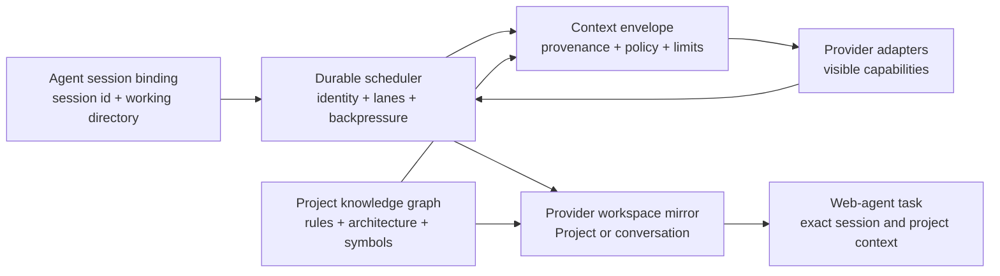

# Tokenless Roadmaps

Status: active product direction | Last reviewed: 2026-07-25

This directory contains long-horizon product and engineering roadmaps. It is separate from `plans/`, which contains bounded implementation plans for individual pieces of work.

Roadmaps describe intended outcomes, sequencing, evidence, and acceptance criteria. They are not release promises, fixed dates, or compatibility guarantees. A capability becomes supported only after the implementation and real-boundary verification required by the relevant roadmap are complete.

## Roadmap Set

| Roadmap | Outcome | Current priority |
| --- | --- | --- |
| [Provider Expansion and Parity](provider-expansion.md) | Add high-value Chinese AI web providers and keep all supported providers aligned on a reliable provider-neutral baseline. | P0 |
| [Context Delivery and Workspace Alignment](context-delivery-and-workspace-alignment.md) | Carry authorized task, repository, instruction, and file context into the exact provider Project or conversation, including a new chat. | P0 |
| [Concurrency and Session Scheduling](concurrency-and-session-scheduling.md) | Persist every invocation through the Rust daemon and schedule exact project, workspace, conversation, profile, and page lanes safely under concurrent load. | P0 |
| [Agent Session Integrations](agent-session-integrations.md) | Bind Tokenless jobs to exact local agent sessions and working directories, with Codex as the first deep integration. | P1 |
| [Project Knowledge Graph and Provider Mirroring](project-knowledge-graph-and-provider-mirroring.md) | Build a local project graph and maintain an approved, provider-ready project context mirror for web-based coding agents. | P1 |

Priority describes product importance, not a promise that all work proceeds serially.

## How the Roadmaps Fit Together

The shared contracts should be built before provider-specific shortcuts:

1. Define stable provider capability, context-envelope, agent-session, and mirror-manifest contracts.
2. Make the Rust daemon the durable authority for idempotency, admission, scheduling lanes, conversation identity, and recovery.
3. Expand provider coverage using the same visible-session and evidence requirements as the existing adapters.
4. Add exact session binding, beginning with Codex lifecycle hooks and explicit invocation metadata.
5. Produce a local project graph and synchronize bounded, reviewable context artifacts into the bound provider workspace.

## Shared Product Principles

- **Visible provider boundary:** operate provider websites through visible controls and visible postconditions. Do not depend on private provider APIs.
- **Evidence before availability:** selectors or menu presence are not success. A capability is supported only when a real visible-session sequence proves the final outcome.
- **Fail closed:** ambiguous identity, navigation, attachment state, workspace selection, or context delivery must return an explicit unavailable or unknown result.
- **Exact identity over names:** use provider/profile/resource identifiers and agent/session/worktree identity. Human-readable project and chat names are metadata, not primary keys.
- **Daemon-owned concurrency:** every invocation is durably admitted, deduplicated, scheduled, leased, checkpointed, and completed through the Rust daemon.
- **Conversation single-writer:** one conversation accepts at most one mutating job at a time; unrelated conversations may run concurrently only within explicit profile and provider limits.
- **Local-first and consent-based:** indexing, session binding, and staging happen locally. Upload only the bounded artifacts a user or authorized agent has approved.
- **Provenance-preserving context:** every instruction and source must retain its origin, scope, freshness, and sharing policy.
- **No hidden-prompt extraction:** Tokenless may carry instructions explicitly supplied or exported by the caller. It must not scrape concealed platform, developer, or provider prompts.
- **Real-boundary testing:** provider and agent integrations require focused integration or browser E2E evidence through the built CLI, daemon, filesystem, lifecycle hook, and real visible provider session.
- **Honest degradation:** when a provider cannot represent a system instruction, Project, graph artifact, or other semantic layer natively, report the fallback instead of claiming parity.

## Roadmap Maintenance

Each roadmap should be updated when:

- a phase is implemented or intentionally parked;
- a capability contract changes;
- live provider evidence changes a priority or invalidates an assumption;
- a new privacy, policy, or provider constraint is discovered; or
- implementation work reveals that an acceptance criterion is incomplete.

Implementation issues and PRs should link to the relevant roadmap and identify the phase and acceptance criterion they advance.
