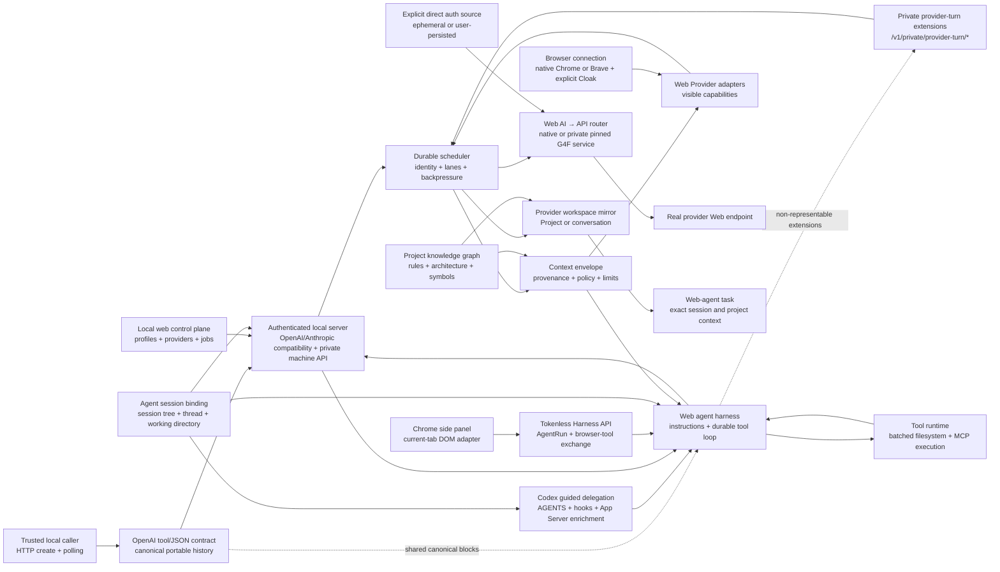

# Tokenless Roadmaps

Status: active product direction | Last reviewed: 2026-08-19

This directory contains long-horizon product and engineering roadmaps. It is separate from `plans/`, which contains bounded implementation plans for individual pieces of work.

Roadmaps describe intended outcomes, sequencing, evidence, and acceptance criteria. They are not release promises, fixed dates, or compatibility guarantees. A capability becomes supported only after the implementation and real-boundary verification required by the relevant roadmap are complete.

## Two Parallel P0 Product Lines

[OpenAI Tool Calling, Structured Output, and Portable Provider Context](P0-openai-tool-calling-structured-output-and-portable-context.md) is the highest-priority shared compatibility contract across both product lines. It owns the universal OpenAI-compatible tool/JSON boundary and portable model history; it does not merge the Web Agent Harness with provider execution.

| Product line | Owning roadmaps | Outcome |
| --- | --- | --- |
| **Web Provider / visible-browser automation** | [Real Provider Browser E2E and Native Projects](P0-real-provider-browser-e2e-and-native-projects.md) and [Provider Expansion and Parity](P0-provider-expansion.md) | Operate verified capabilities on real provider websites in the user-selected visible browser. |
| **Web AI → API / direct provider protocol** | [Web AI → API: Provider Direct Protocol](P0-direct-provider-protocol.md) | Expose real provider Web protocols through the existing authenticated local API and OpenAI-compatible proxy, using gpt4free's provider surface as the parity baseline without claiming completed parity. |

The two lines are peers. Visible-browser support does not imply direct-protocol support, and a direct capability is exposed to the API only after its own real-endpoint proof.

## Lifecycle and Directory Structure

The roadmap's directory is the source of truth for its lifecycle:

```text
docs/roadmaps/
├── README.md             # Index and lifecycle rules
├── P[0-3]-*.md           # Active roadmaps
├── backlog/
│   ├── README.md         # Backlog index
│   └── P[0-3]-*.md       # Accepted but intentionally inactive roadmaps
└── archived/
    ├── README.md         # Archive index
    └── P[0-3]-*.md       # Completed, superseded, cancelled, or retired roadmaps
```

There is intentionally no `active/` directory. Every root-level Markdown file other than this index is active. An active roadmap can still have an internal delivery status such as `proposed`; lifecycle placement describes whether the direction is currently active, while the document status describes its delivery maturity.

Move a roadmap to:

- [`backlog/`](backlog/README.md) when the direction is accepted but intentionally not being pursued;
- [`archived/`](archived/README.md) when it is completed, superseded, cancelled, or no longer planned; or
- this directory's root when it becomes active.

Every roadmap filename must begin with its product priority (`P0-`, `P1-`, `P2-`, or `P3-`), and that prefix must match the priority declared in the document. A priority change therefore requires a rename. Every addition, rename, move, priority change, or lifecycle change must update this index, all repository links, and the roadmap's lifecycle or disposition note. A superseded roadmap must link to its replacement. Archived roadmaps retain their historical content.

## Active Roadmaps

| Roadmap | Outcome | Current priority |
| --- | --- | --- |
| [Downloaded Image Assets](P0-downloaded-image-assets.md) | Download verified image bytes from real provider outcomes into task-, conversation-, job-, and time-scoped local assets, beginning with Arena and expanding only through provider-specific real E2E closure. | P0 |
| [OpenAI Tool Calling, Structured Output, and Portable Provider Context](P0-openai-tool-calling-structured-output-and-portable-context.md) | Guarantee modern OpenAI tool calls and structured JSON across native and prompt-emulated providers, verify the universal API with the real local DSH and frozen SWE-rebench tasks, ground the design in current provider endpoint contracts, and support explicit auto routing without losing tool-call context. | P0 — highest active delivery priority |
| [Real Provider Browser E2E and Native Projects](P0-real-provider-browser-e2e-and-native-projects.md) | Advance the Web Provider line by proving every advertised visible capability against real provider websites and adding real Claude and Grok native Project creation, reuse, and continuation. | P0 |
| [Provider Expansion and Parity](P0-provider-expansion.md) | Advance the Web Provider line with high-value AI websites and an evidence-backed visible capability catalog and routing matrix. | P0 |
| [Web AI → API: Provider Direct Protocol](P0-direct-provider-protocol.md) | Advance the Web AI → API line through the existing authenticated local API: install one pinned private GPT4Free service for broad direct-provider coverage, retain native adapters behind `providerBackend`, and internalize provider implementations through real A/B evidence. | P0 |
| [G4F Direct Provider Catalog](P0-g4f-direct-provider-catalog.md) | Consolidate the pinned G4F working inventory into 42 vendor-level Tokenless providers, reuse existing identities, and expose honest browser/direct modes in the local dashboard. | P0 |
| [FeatureBench Agent Runtime Evaluation](P0-featurebench-agent-runtime-evaluation.md) | Run Tokenless as a FeatureBench scaffold across the pinned 200-task full split, using real provider turns, container tools, patches, and the official evaluator. | P0 |
| [Context Delivery and Workspace Alignment](P0-context-delivery-and-workspace-alignment.md) | Carry authorized task, repository, instruction, and file context into the exact provider Project or conversation, including a new chat. | P0 |
| [Web Agent Harness](P0-web-agent-harness.md) | Own Agent adapters and context persistence, then build a ChatGPT-first file-based web Harness with a compiled System Prompt Bundle, Skill registry, validated model output, complete action batches, consolidated user input, rooted filesystem work, and resumable MCP tool execution. | P0 |
| [Tokenless Harness Browser Extension](P0-tokenless-harness-browser-extension.md) | Expose the Tokenless Harness API to a least-privilege Chrome side panel and close a real Web Provider tool loop that observes any scriptable ordinary page and fills a user-approved textual input in the user's real browser. | P0 |
| [Codex Guided Delegation and Session Binding](P0-codex-guided-delegation-and-session-binding.md) | Keep Codex's normal model provider and user launch flow while adding RTK-style guidance, native hooks for exact chat/turn/tool-call identity, bounded App Server enrichment, and provider conversation continuity. | P0 |
| [Concurrency and Session Scheduling](P0-concurrency-and-session-scheduling.md) | Persist every invocation through the local daemon and schedule exact project, workspace, conversation, profile, and page lanes safely under concurrent load. | P0 |
| [Local Web Control Plane](P0-local-web-control-plane.md) | Provide a secure localhost console for setup handoff, browser identities, provider configuration, capabilities, jobs, diagnostics, and user recovery. | P0 |
| [OpenAI-compatible API Convergence](P1-openai-compatible-api-convergence.md) | Converge the losslessly representable CLI and first-party Harness model/media paths on the OpenAI-compatible API while retaining only necessary Tokenless behavior under `/v1/private/*`. | P1 |
| [Agent Session Integrations](P1-agent-session-integrations.md) | Expose current Web Provider and later Harness operations through a caller-facing local MCP interface, then bind jobs to exact Agent projects, threads, and turns with Codex as the first exact identity integration. | P1 |
| [Project Knowledge Graph and Provider Mirroring](P1-project-knowledge-graph-and-provider-mirroring.md) | Build a local project graph and maintain an approved, provider-ready project context mirror for web-based coding agents. | P1 |
| [Optional Output Savings Measurement](P1-optional-output-savings-measurement.md) | Attribute versioned estimates of visible assistant output to durable jobs through a default-on, opt-out, lazily downloaded, low-duty-cycle local tokenizer. | P1 |
| [Token Savings Real-Project Test Matrix](P1-token-savings-evidence-across-adoption-paths.md) | Run one reviewed real-project prompt across all enabled providers and three adoption paths, then extend the same evidence into Harness context, System Prompt, Skill, Bash, MCP, and multi-turn behavior. | P1 |

The highest-priority shared compatibility contract is listed first, followed by the two product-line owners. Priority describes product importance, not a promise that all work proceeds serially.

## Backlog and Archive

- [Backlog](backlog/README.md): no roadmap is currently backlogged.
- [Archive](archived/README.md): Product Localization, Runtime Package Boundary Refactor, Arena Full Capability Integration, Browser Connection Mode Capability Evaluation, and Provider Architecture and Registry were completed; Web AI Interaction Protocol was superseded by OpenAI-compatible API Convergence; the browser runtime/profile compatibility matrix and its Windows acceptance plan were superseded by native Chrome/Brave CDP connection; the Daemon Fastify HTTP API direction was cancelled.

## How the Roadmaps Fit Together

The completed [Runtime Package Boundary Refactor](archived/P0-runtime-package-boundary-refactor.md) separated CLI, server, Dashboard, Harness, shared runtime primitives, and documentation-only API contracts, then closed the remaining CLI in-process execution paths behind authenticated HTTP while preserving fail-before-side-effect behavior. The active [OpenAI-compatible API Convergence](P1-openai-compatible-api-convergence.md) owns the later execution change: CLI and Harness use OpenAI-compatible model/media Interfaces wherever lossless, Anthropic compatibility stays parallel, and Tokenless-only bearer machine behavior lives under `/v1/private/*`.



The two product lines can proceed in parallel; their first tangible slices are:

1. For the shared compatibility contract, compare current OpenAI, Anthropic, Gemini, DeepSeek, and open-source vLLM endpoint semantics; complete one real local DSH tool loop and repository-grounding run through the packaged Tokenless daemon; then prove the finished contract on a frozen three-task SWE-rebench interoperability cohort before continuing through structured JSON and portable-context phases.
2. For Web Provider, keep visible-browser automation on the real provider evidence path and expand only verified capabilities.
3. For Web AI → API, install and manage one pinned private GPT4Free HTTP service, define explicit auth contexts and lifetimes, route direct providers through `native | g4f`, and expose verified capabilities through the existing authenticated local API while retaining native implementations for A/B and gradual internalization.

Shared substrate and later product work follow:

1. Use the completed typed provider registry, `BaseProvider` execution skeleton, and provider-owned capability classes documented in the archived [Provider Architecture and Registry](archived/P0-provider-architecture-and-registry.md) roadmap.
2. Connect the user-selected native Chrome or Brave browser through its browser-managed CDP endpoint; keep Cloak as an explicit Anti-Detect path.
3. Establish the real-provider browser E2E evidence plane and close Claude and Grok native Project identity before depending on those capabilities for broader context delivery.
4. Define stable provider capability, context-envelope, agent-session, and mirror-manifest contracts.
5. Add the authenticated local web control plane over shared application services without exposing the daemon bearer token to browser JavaScript.
6. Keep the daemon's small built-in HTTP server and make polling the explicit asynchronous caller and UI contract.
7. Make the local daemon the durable authority for idempotency, admission, scheduling lanes, conversation identity, and recovery.
8. Use OpenAI-compatible chat, Responses, and images as the default Harness model/media interface; retain only current, non-representable waiting, attachment, identity, and lifecycle extensions under `/v1/private/provider-turn/*`.
9. Build the ChatGPT-first web agent harness as one independently buildable deep module exposed through package, authenticated daemon HTTP, and CLI adapters; require existing `conversation.chat` plus `file.upload`, compile and upload one System Prompt Bundle containing the global Skill registry and event protocol, accept upstream Skill preselections and batched web-model `skillLoads`, deliver individual `SKILL.md` revisions on a best-effort basis, and add durable checkpoints, strict output validation, complete action batches, consolidated user interactions, rooted filesystem operations, resumable MCP tool execution, aggregate results, and finite loop limits; defer repository extraction until the interface is stable.
10. Expose the Tokenless Harness API to a least-privilege Chrome side panel and current-tab DOM adapter, then require a user-owned real-browser acceptance run before claiming the generic textual-input loop works.
11. Expand provider coverage using the same mode-specific real-session and evidence requirements as the existing providers; agent-harness eligibility closes independently from normal QA support.
12. Add Codex guided delegation through a reversible inline `AGENTS.md` policy and native lifecycle hooks; bind exact project, thread, turn, and tool-call identity in normally launched Codex sessions, and use bounded App Server reads only to enrich session-tree and lineage while leaving ordinary Codex model traffic unchanged.
13. Produce a local project graph and synchronize bounded, reviewable context artifacts into the bound provider workspace.

## Shared Product Principles

- **Explicit provider execution modes:** keep visible-browser automation and direct provider web-protocol access as separate, user-selected modes. Direct mode may locally use only the selected provider and explicitly selected auth source; a user may explicitly import/save HAR, cookies, or tokens with `user-persisted` lifetime, while all other sources remain ephemeral. Neither mode exposes credentials to callers, web models, the control-plane frontend, stdout/stderr, jobs, checkpoints, logs, or telemetry.
- **Harness-owned agency:** provider integrations supply verified model turns; Tokenless owns instruction precedence, tool authorization, execution, durable looping, and termination.
- **Registry-driven Skill selection:** upstream Agent preselections are a fast path, while the uploaded System Prompt Bundle exposes every valid global Skill's bounded metadata so the web model can request additional Skills by name on any turn.
- **Hard bootstrap, soft Skill bodies:** every Harness route requires `conversation.chat` and `file.upload`, and the System Prompt Bundle must arrive before the first task Prompt; individual `SKILL.md` resolution or upload failures are recorded and omitted without terminating the bootstrapped chat.
- **Web-turn efficiency:** upload the System Prompt Bundle and initial preselections in one first attachment action, then batch-upload every later requested Skill before the next Prompt; require each non-final model response to contain all currently needed Skills, knowable actions, and missing inputs; return one aggregate batch result; spend another provider turn only when new instructions or prior results reveal a genuinely new dependency.
- **Role-based MCP separation:** the caller MCP interface and web-model-driven MCP tool execution use separate sessions, credentials, tools, and approval decisions; caller authority never transfers implicitly.
- **Evidence before availability:** selectors or menu presence are not success. A capability is supported only when a real visible-session sequence proves the final outcome.
- **Fail closed for required inputs:** ambiguous identity, navigation, required attachment state, workspace selection, or required context delivery returns an explicit unavailable or unknown result; explicitly best-effort Skill delivery is instead recorded and skipped.
- **Exact identity over names:** use provider/profile/resource identifiers and agent/session/worktree identity. Human-readable project and chat names are metadata, not primary keys.
- **Hierarchy-preserving Agent delegation:** an Agent project maps to one exact provider workspace binding when it first delegates, each Agent thread maps to its own provider conversation, delegated runs retain their originating Agent turn, and forks or subagents preserve explicit lineage without sharing conversations implicitly.
- **Daemon-owned concurrency:** every invocation is durably admitted, deduplicated, scheduled, leased, checkpointed, and completed through the local daemon.
- **Conversation single-writer:** one conversation accepts at most one mutating job at a time; unrelated conversations may run concurrently only within explicit profile and provider limits.
- **Local-first and consent-based:** indexing, session binding, and staging happen locally. Upload only the bounded artifacts a user or authorized agent has approved.
- **Provenance-preserving context:** every instruction and source must retain its origin, scope, freshness, and sharing policy.
- **No hidden-prompt extraction:** Tokenless may carry instructions explicitly supplied or exported by the caller. It must not scrape concealed platform, developer, or provider prompts.
- **Real-boundary testing:** provider and Agent integrations require focused integration or E2E evidence through the built CLI, daemon, filesystem, supported Agent control surface, and the real provider boundary used by the selected execution mode.
- **Honest degradation:** when a provider cannot represent a system instruction, Project, graph artifact, or other semantic layer natively, report the fallback instead of claiming parity.

## Roadmap Maintenance

Each roadmap should be updated when:

- a phase is implemented or intentionally parked;
- a capability contract changes;
- live provider evidence changes a priority or invalidates an assumption;
- a new privacy, policy, or provider constraint is discovered; or
- implementation work reveals that an acceptance criterion is incomplete.

Implementation issues and PRs should link to the relevant roadmap and identify the phase and acceptance criterion they advance.
