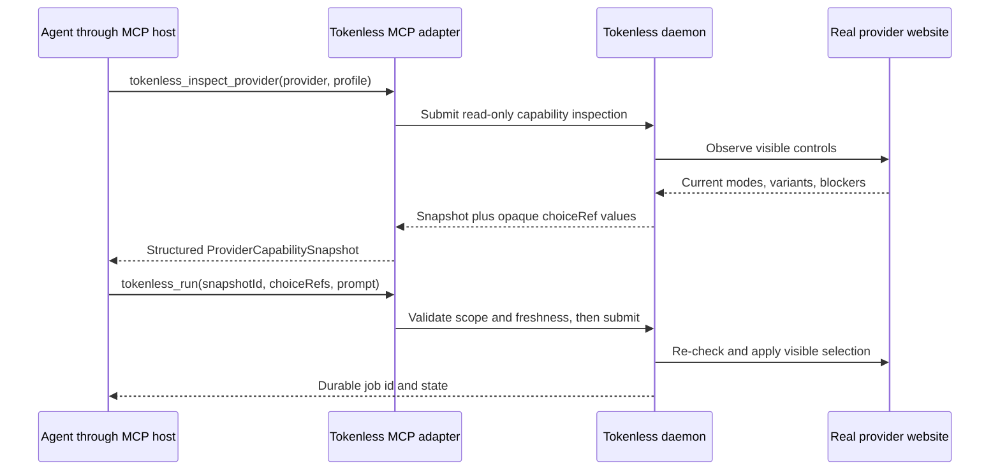

# Agent Session Integrations

Status: proposed | Priority: P1 | First integration: local MCP, then Codex

Depends on: stable local job identity, typed provider capabilities, and the Context Envelope contract

## Outcome

Tokenless binds work to the exact conversation and filesystem scope of the local agent that requested it. Provider routing no longer guesses a project from names or the process's incidental current directory.

The product surface is an agent-neutral integration protocol with a local MCP server as its primary explicit agent tool surface. A Codex plugin is the first deep lifecycle integration, not a Codex-only architecture.

## Why MCP, Not a Generic `--mode` Flag

A provider-neutral `--mode` flag would unify spelling without unifying meaning. Qwen composer modes, provider reasoning controls, research variants, image creation surfaces, and future provider-specific controls do not share one stable semantic type. A raw string flag would still let an agent pass a valid Qwen label to the wrong provider, use a disabled account-tier option, or reuse a stale label after the provider DOM changes.

The CLI remains the human, scripting, diagnostics, and recovery surface. MCP becomes the preferred agent surface because it provides:

- typed tool inputs instead of shell quoting and flag routing;
- structured results and error recovery instructions;
- explicit read-only discovery before provider mutation;
- durable job identifiers for polling, resume, and cancellation; and
- a place to enforce provider, profile, capability, and freshness constraints before browser actions start.

MCP does not make provider-specific semantics generic. It exposes those semantics through one generic discovery and selection protocol while retaining namespaced capability identifiers such as `qwen.mode`.

## Provider Capability Snapshot Contract

Introduce a versioned `ProviderCapabilitySnapshot` returned by read-only inspection:

| Field | Purpose |
| --- | --- |
| `snapshotId` | Opaque server-minted handle for one observed provider/profile capability state |
| `provider` and `profileId` | Exact scope; a reference cannot be replayed against another provider or profile |
| `revision` | Monotonic or content-derived capability revision used for stale-state detection |
| `observedAt` and `expiresAt` | Freshness evidence |
| `capabilities` | Availability, visible proof, reason, and stability for common and provider-specific capabilities |
| `choices` | Hierarchical enabled, disabled, selected, and descriptive visible choices |
| `blockers` | Auth, CAPTCHA, plan limit, consent, or other state preventing safe use |

Every selectable node returns an opaque `choiceRef`. A child choice carries its hierarchy, so Qwen Deep Research Advanced is represented as one validated selection path rather than unrelated `mode` and `modeVariant` strings. Human-readable labels remain presentation data and visible evidence, not durable identifiers.

An execution request that includes provider controls supplies `snapshotId` and one or more `choiceRef` values. Before job admission, Tokenless must verify that:

- the snapshot belongs to the requested provider and managed profile;
- each reference belongs to that snapshot and capability;
- the choice was enabled when observed;
- mutually exclusive choices are not combined;
- the snapshot is still fresh enough for mutation; and
- the current visible control still matches before applying the choice.

Stale, unknown, disabled, cross-provider, or cross-profile references fail closed with a structured instruction to inspect again. Tokenless never guesses the closest label.

## Minimal MCP Tool Surface

The first MCP version should expose a small stable tool list instead of one tool per provider or per visible mode:

| Tool | Mutation | Purpose |
| --- | --- | --- |
| `tokenless_inspect_provider` | No | Resolve the provider/profile, inspect auth and blockers, and return a `ProviderCapabilitySnapshot` with valid `choiceRef` values |
| `tokenless_run` | Yes | Submit a prompt with optional files, workspace intent, and snapshot-bound provider selections |
| `tokenless_get_job` | No | Read durable state, structured visible-action evidence, response text, and repair instructions |
| `tokenless_resume_job` | Yes | Resume the same waiting job after user-resolvable auth, CAPTCHA, consent, or confirmation |
| `tokenless_cancel_job` | Yes | Cancel one exact durable job |

Do not expose a generic arbitrary `provider-action` MCP tool in v1. It would reproduce the CLI's low-level action vocabulary without making common agent workflows safer. Add narrowly scoped advanced tools later only when an agent workflow cannot be represented by inspect, run, state, resume, and cancel.

The MCP server is a thin trusted local adapter over the same daemon job and provider capability contracts. It does not own another browser, attach through CDP, automate login, or receive provider credentials. The daemon remains the only Playwright actor.

Keep the MCP tool schemas stable across account state. Runtime choices belong in inspection results, not in a connection-specific tool list or a dynamically rewritten enum. Tool-list change notifications are reserved for actual product tool additions or removals. This avoids depending on every MCP host refreshing dynamic schemas correctly and remains compatible with stateless transports.

Tool results use structured output schemas and also provide concise text fallbacks for compatible hosts. Tool annotations identify read-only and mutating operations, but are hints rather than authorization; user approval policy remains the MCP host's responsibility.

The adapter should call internal typed APIs or the authenticated daemon contract directly, not spawn CLI subprocesses and parse their output. Package the first `stdio` server with the existing CLI distribution rather than creating a new package namespace.

Official MCP references:

- [MCP tools, input schemas, structured output, annotations, and errors](https://modelcontextprotocol.io/specification/2025-11-25/server/tools)
- [MCP transports](https://modelcontextprotocol.io/specification/2025-11-25/basic/transports)

## MCP Trust Boundary

- Start with local `stdio` transport launched by the MCP host. Consider authenticated loopback transport only after a concrete multi-process need exists.
- Never return the daemon bearer token, browser profile paths, cookies, storage, raw DOM, or unrelated account data to the model.
- Resolve file inputs against declared MCP roots or explicit absolute paths and apply the existing regular-file, size, count, staging, and provenance rules.
- Bind calls to explicit agent session metadata when the host supplies it. Missing binding may reduce routing features but must not silently guess another session.
- Treat tool descriptions, annotations, and client-provided metadata as untrusted inputs at the daemon boundary.
- Preserve existing manual-user handoff for sign-in, CAPTCHA, MFA, plan upgrade, consent, and confirmation.

## Stable Agent Session Binding

Introduce a versioned `AgentSessionBinding`:

| Field | Purpose |
| --- | --- |
| `agentKind` | Identifies the producer, initially `codex` |
| `sessionId` | Stable conversation or thread identity supplied by the agent |
| `turnId` | Optional turn identity for request/result correlation |
| `cwd` | Exact working directory reported by the agent |
| `projectRoot` | Canonical project root resolved from `cwd` |
| `worktreeId` | Canonical realpath plus repository/worktree identity |
| `repository` | Optional VCS remote identity with credentials removed |
| `branch` and `head` | Optional source-state evidence, not project identity |
| `transcriptRef` | Optional local reference with explicit access policy |
| `startedAt` and `observedAt` | Freshness and lifecycle evidence |
| `producerVersion` | Adapter and schema compatibility |

The durable lookup key is `agentKind + sessionId`. Project, worktree, and provider-workspace bindings are associated records and can change over a session's lifetime.

## Why Codex First

Current Codex lifecycle hooks provide the fields needed for exact first-party binding:

- `session_id`;
- `cwd`;
- an optional `transcript_path`;
- lifecycle events such as `SessionStart`, `UserPromptSubmit`, `Stop`, and `SessionEnd`; and
- plugin-local writable data through `PLUGIN_DATA`.

Codex also defines `CODEX_HOME` as its state root, with `~/.codex` as the default. Directly scanning that directory is not the primary integration path. Hook metadata is narrower, more explicit, and better aligned with the active conversation.

The transcript path is a convenience reference, but its format is not a stable hook interface. Transcript reading must therefore be optional, consented, version-detected, and replaceable.

Official references:

- [Codex hooks](https://learn.chatgpt.com/docs/hooks)
- [Codex configuration and state locations](https://learn.chatgpt.com/docs/config-file/config-advanced#config-and-state-locations)
- [Codex plugins](https://developers.openai.com/plugins)

## Codex Integration Shape

The installable Codex plugin should bundle:

- a Tokenless routing skill for explicit user or agent invocation;
- trusted lifecycle hooks that register and refresh session binding;
- configuration for the local Tokenless MCP server;
- schemas for context export and Tokenless result import; and
- clear permission, privacy, and uninstall behavior.

The primary flow is:

1. `SessionStart` sends `session_id`, `cwd`, and adapter version to the local Tokenless control plane.
2. Tokenless canonicalizes the working directory, resolves the project root and worktree, and persists the binding.
3. An explicit Tokenless invocation includes the same session id and optional turn id.
4. Tokenless resolves the provider workspace from the exact session/project binding.
5. The web result returns to the requesting session with job id, context revision, provider conversation identity, and artifacts.
6. `SessionEnd` marks the binding inactive without deleting retained user-approved history.

Hooks register identity; they do not submit prompts or upload files implicitly.

## Delivery Phases

### Phase 0: Agent and Capability Selection Protocol

- Define `AgentSessionBinding`, `ProviderCapabilitySnapshot`, `choiceRef`, lifecycle events, capability negotiation, and schema versioning.
- Separate agent identity, filesystem identity, provider workspace identity, and task identity.
- Define collision, resume, fork, worktree-change, and stale-session behavior.
- Define snapshot expiry, stale-choice, cross-provider, cross-profile, disabled-choice, and mutually exclusive selection behavior.
- Add local inspect and revoke commands.

Exit: a test client can register two concurrent sessions without identity collisions and cannot apply a capability choice outside the snapshot that produced it.

### Phase 1: Local MCP Server

- Add a local `stdio` MCP entry point backed by the packaged Tokenless daemon and existing durable jobs.
- Expose only inspect, run, get-job, resume-job, and cancel-job.
- Publish strict input and structured output schemas generated from or checked against the internal contracts.
- Map provider-specific controls into snapshot-bound choice references without flattening them into a generic mode enum.
- Return typed blockers and retry or repair instructions.
- Add MCP protocol conformance and real daemon-bound integration coverage without provider simulations.

Exit: an MCP client can discover Qwen Deep Research Advanced, submit it by reference, poll the durable result, and receives a pre-mutation error for stale or cross-provider references.

### Phase 2: Explicit Codex Binding

- Add a Tokenless command that accepts Codex `session_id` and `cwd`.
- Resolve realpath, repository root, worktree, branch, and current revision.
- Persist the binding in the local daemon.
- Route jobs by exact binding and expose the resolved identity in state output without leaking raw private paths.

Exit: two Codex sessions in different worktrees or directories resolve to different bindings even when project names are identical.

### Phase 3: Codex Plugin and Lifecycle Hooks

- Package the routing skill and minimal hook definitions as a plugin.
- Configure the local MCP server as the explicit Tokenless tool surface.
- Register on `SessionStart` and refresh only on meaningful lifecycle changes.
- Require the user to review and trust plugin hooks.
- Keep prompt submission explicit and observable.

Exit: starting or resuming a Codex session creates or refreshes the exact binding with no project-name guess.

### Phase 4: Authorized Context Export

- Add an explicit action that exports the current goal, user prompt, plan, relevant repository guidance, and selected files into a Context Envelope.
- Treat `transcript_path` as optional and unstable.
- When transcript import is enabled, use versioned readers, bounded selection, and a preview or manifest before sharing.
- Never import authentication state, hidden prompts, private reasoning, or unrelated sessions.

Exit: the user can inspect what session context will be sent, and Tokenless works correctly when no transcript is available.

### Phase 5: Additional Agent Adapters

- Publish the protocol and adapter conformance suite.
- Add other mainstream coding agents through their stable lifecycle, extension, or invocation surfaces.
- Keep product-specific logic in adapters while preserving shared identity and context contracts.

Exit: a second agent can complete the same exact-binding and context-handoff workflow without Codex-specific fields leaking into core contracts.

## Acceptance Criteria

- Session matching uses an agent-supplied stable id, never chat title or project display name.
- Provider-specific choices are namespaced capabilities selected through snapshot-bound references, not generic mode strings.
- MCP mutation tools reject missing, stale, disabled, cross-provider, and cross-profile choice references before browser mutation.
- MCP tool schemas and structured outputs are versioned and validated against the internal daemon contracts.
- The first MCP release has no arbitrary low-level provider-action escape hatch.
- Working directory and project root are canonicalized and checked for changes.
- Worktrees and concurrent sessions are distinct.
- Session resume preserves identity; session fork creates a distinct identity with explicit lineage when available.
- A missing or stale binding fails with a repair instruction instead of falling back to name guessing.
- Hook registration is local, bounded, reviewable, and idempotent.
- Transcript access is off by default and the core workflow does not depend on its file format.
- Plugin removal or binding revocation stops future integration without deleting unrelated Tokenless state.
- Integration tests exercise the built CLI/daemon and a real Codex hook payload or supported Codex process boundary; no fake agent implementation is treated as product proof.

## Risks and Responses

| Risk | Response |
| --- | --- |
| Codex internal storage format changes | Prefer stable hook fields; isolate optional transcript readers by detected version |
| Session id is accidentally exposed to providers | Keep it local and use a separate opaque provider-facing correlation id |
| Hooks become surprising background automation | Limit hooks to identity registration and require explicit task submission |
| Same repository has multiple worktrees or subdirectory sessions | Bind canonical `cwd`, project root, and worktree identity separately |
| Agent lacks lifecycle hooks | Use explicit invocation metadata and report reduced lifecycle capability |
| Plugin surface changes | Keep the agent-neutral local protocol independently usable |
| MCP host caches tools or ignores list-change notifications | Keep the v1 tool list stable and return runtime capability choices as inspected data |
| Agent invents or edits a provider option label | Accept only opaque snapshot-bound choice references for controlled selections |
| Provider choices change after inspection | Enforce expiry and re-check visible state before mutation |
| Tool annotations are treated as authorization | Enforce authorization and mutation policy inside Tokenless; annotations remain hints |

## Non-Goals

- Parsing all files under `CODEX_HOME` as a stable public database
- Reading Codex authentication material, logs, or unrelated sessions
- Uploading a Codex transcript by default
- Making provider project names the source of identity
- Requiring every supported agent to install the same plugin format
- Flattening provider-specific controls into one universal mode taxonomy
- Generating one MCP tool for every provider mode or visible menu item
- Exposing the daemon bearer token or browser debugging access to the MCP client
