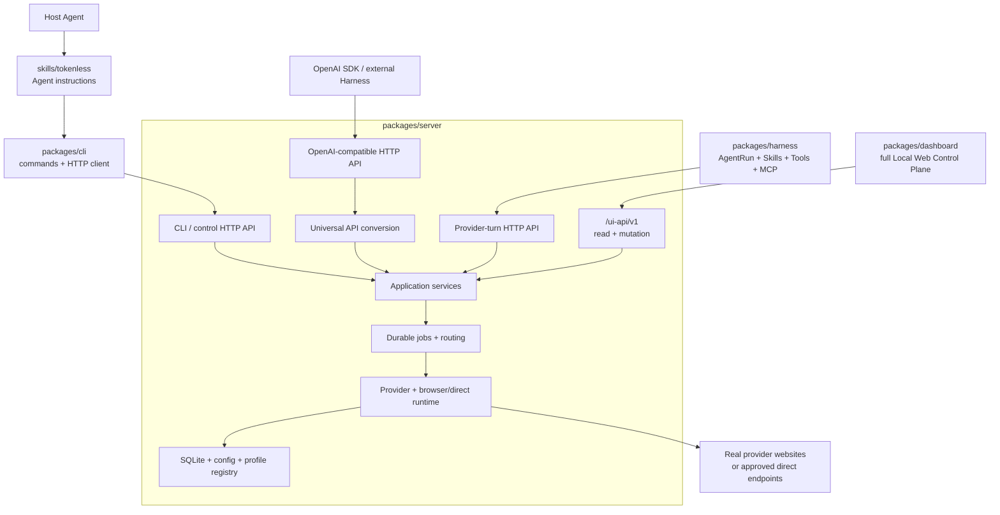

# Runtime Package 边界重构

Status: completed 2026-08-18 | Priority: P0

Disposition: completed after the package boundaries, dependency direction, packaging, documentation, and zero-regression gates were implemented and verified.

Related: [Tokenless Architecture](../../architecture.zh-CN.md)、[Web Agent Harness](../P0-web-agent-harness.md)、[Web AI Interaction Protocol](../P0-web-ai-interaction-protocol.md)、[OpenAI Tool Calling、Structured Output 与可移植 Provider Context](../P0-openai-tool-calling-structured-output-and-portable-context.md)、[Local Web Control Plane](../P0-local-web-control-plane.md)

Depends on: 当前 built CLI、authenticated daemon HTTP API、完整 `/ui-api/v1` control-plane contract、Web Agent Harness local-HTTP client、现有 npm 打包流程与真实边界测试

## Outcome

在不改变任何现有功能、外部 contract、持久化格式或用户行为的前提下，把当前集中在 `packages/cli/` 内的 CLI、server、Dashboard、provider runtime 与 browser runtime 拆到明确的 workspace 边界。

完成后：

- `packages/server/` 是 Tokenless 执行核心，拥有 HTTP、application services、durable jobs、provider routing、provider adapters、browser runtime 与 persistence；
- `packages/cli/` 是 daemon bootstrap、HTTP client、命令解析、本地化与结果展示层，正常产品命令不再直接执行 provider、Playwright 或 Harness 逻辑；
- `packages/dashboard/` 保留当前 Local Web Control Plane 的全部 read、mutation、setup、profile、provider、job、runtime、diagnostics 与 recovery 能力，通过现有 `/ui-api/v1` HTTP boundary 工作；
- `packages/harness/` 独立拥有 AgentRun、prompt、Skill runtime、Tool Registry、MCP、approval 与 agent loop，通过 HTTP 调用 server；
- `packages/protocol/` 只保留语言中立 contract 的 TypeScript binding、schema validation 与薄 HTTP client；
- 顶层 `skills/` 继续分发给 Host Agent，指导 Agent 调用本地 `tokenless` CLI，不承载产品 runtime；
- 已发布的 `tokenless` npm package、`tokenless` binary、CLI contract、HTTP contract、Dashboard 行为、Harness 行为与 provider 行为全部保持不变。

本 roadmap 是结构与依赖方向重构，不是产品功能 roadmap。任何顺手增加、删除、重命名或收缩用户能力的改动都不属于本计划。

## Hard Constraint：零功能变化

重构前后必须保持以下外部可观察行为：

| Surface | 必须保持的 contract |
| --- | --- |
| npm distribution | 相同 package 名、binary、安装方式、打包内容能力与 supported runtime |
| CLI | 相同 commands、flags、defaults、exit codes、stdout/stderr discipline、JSON shapes、English 与简体中文输出 |
| Daemon lifecycle | 相同 discovery、ready proof、authentication、start/stop、same-home coordination 与 persisted origin 行为 |
| Machine HTTP API | 相同 paths、methods、authentication、status codes、request/response schemas、stream framing 与 stable errors |
| Local Web Control Plane | 相同页面、setup、profile/config/provider/job/runtime/output-savings mutations、polling、session、CSRF、Host/Origin policy、redaction 与双语 UI |
| Harness | 相同 AgentRun、turn、Skill、tool、approval、MCP、resume/cancel 与 final-output behavior |
| Persistence | 相同 Tokenless home、config、profile registry、SQLite schema、job state、provider mapping 与 stored resource semantics |
| Provider runtime | 相同 routing、capability checks、browser profile ownership、Playwright/CDP flow、direct mode 与 visible provider results |
| Security/privacy | 相同 bearer、UI session、credential isolation、profile preservation、Keychain policy、redaction 与 no-secret-output guarantees |

文件路径、workspace 名称、内部 import path 和构建中间目录允许变化。已经公开的 package export、CLI、HTTP、filesystem 或持久化 contract 不允许变化；测试当前使用的 private deep import 不因测试存在而自动成为兼容 contract。

## Target Product Architecture

HTTP 是所有跨产品面的执行边界。CLI、Dashboard、Harness 与 external SDK 使用不同的 HTTP surface，但共享 server application services 和 provider runtime；它们不是四套业务实现。



### HTTP surfaces

| Surface | Primary callers | Ownership |
| --- | --- | --- |
| OpenAI-compatible `/v1/*` | OpenAI SDK、external Harness、compatible local callers | `server/http` + `server/universal-api` |
| Provider-turn `/v1/web-ai/*` | Tokenless Web Agent Harness | `server/http` + shared application services |
| Authenticated control/jobs API | CLI 与 trusted local callers | `server/http` + application services |
| `/ui-api/v1/*` | Bundled Dashboard | `server/http` + application services；完整保留 read 与 mutation |

Dashboard 不是只读 status page。它继续是当前完整 Local Web Control Plane，只是 frontend source 与 server implementation 分离。

## Target Repository Shape

```text
skills/
  tokenless/
  tokenless-install/

packages/
  server/
    src/
      http/
      universal-api/
      application/
      jobs/
      providers/
      browser/
      persistence/
      output-savings/
      entry.mts
  cli/
    src/
      commands/
      http/
      bootstrap/
      i18n/
      output/
      tokenless.mts
  dashboard/
    src/
    package.json
  harness/
    src/
      agent-context/
      run/
      skill-runtime/
      tools/
      mcp/
      approvals/
      http/
  protocol/
    src/
    schemas/
    spec/
    examples/

api/
docs/
test/
scripts/
assets/
```

目录表达 ownership，不要求把每个目录发布为独立 npm package。V1 继续由现有 `tokenless` package 交付 CLI、server、Dashboard 及需要的 private runtime artifacts；任何新外部 package、scope 或 namespace 都不在本 roadmap 范围内。

## Package Responsibilities

### `skills/`

- 保留 `tokenless` 与 `tokenless-install` 的 distributable Agent instructions。
- Host Agent 按 Skill 调用 `tokenless` CLI；Skill 不 import JavaScript runtime，也不拥有 daemon、provider 或 agent loop。
- `skills/` 与 Harness 的 `skill-runtime/` 是两个不同概念：前者是产品分发入口，后者是 Harness 对用户 Skill 的 discovery、selection 与 delivery 实现。

### `packages/cli/`

- 负责 argument parsing、commands、daemon discovery/bootstrap、bearer/origin resolution、HTTP requests、wait/poll、localization 与 output formatting。
- CLI 可以定位并启动 packaged server executable；server ready 后，产品操作通过 HTTP 完成。
- CLI command code 不 import provider adapters、Playwright runner、job store、Harness loop 或 server application implementation。
- 为保持当前 npm contract，package build 可以 bundle server 与 Dashboard artifacts，并通过稳定 public entry re-export 已有公开 API；这些 packaging edges 不允许成为 CLI command 的 in-process execution path。

### `packages/server/`

- 负责所有 HTTP routes、authentication、OpenAI/Anthropic conversion、application services、durable jobs、routing、providers、browser/CDP、direct runtime、persistence 与 output-savings processing。
- `universal-api/` 只转换和验证 caller-owned model/tool contracts，不执行 external Harness tools。
- `application/` 是 CLI control API、Dashboard API、provider-turn API 与 Universal API 共用的 use-case boundary。
- Server 不 import CLI commands、Dashboard components、Harness Tool Registry、MCP runtime 或 distributable Skills。

### `packages/dashboard/`

- 保留当前 Svelte Local Web Control Plane 的全部用户能力。
- 通过 `/ui-api/v1` 完成 snapshot、config、profile、provider readiness/actions、selection、jobs、runtime、output savings 与 diagnostics 行为。
- 不 import server application services、SQLite、profile registry、provider adapters 或 CLI implementation；server 只 serve 构建后的静态 artifact。
- 保持现有 UI session、CSRF、same-origin、Host validation、CSP、redaction、polling、accessibility 与双语行为。

### `packages/harness/`

- 负责 AgentRun、prompt、Skill runtime、tool authorization/execution、MCP、approval、intervention、continuation 与 final output。
- 通过 provider-turn HTTP client 调用 server；不得 import server、provider、browser、profile 或 daemon persistence internals。
- Harness-owned tools 只在 Harness 内执行；Universal API 不获取该 authority。

### `packages/protocol/`

- 由当前 `packages/web-ai-interaction-protocol/` 演进而来。
- 只包含 specification、schemas、types、validation、examples 与薄 HTTP client。
- 不拥有 storage、daemon lifecycle、provider adapter、browser、Harness policy 或 retry/recovery runtime。

## Dependency Rules

允许的主依赖方向：

```text
skills -> CLI command surface
CLI -> HTTP contracts/client -> server HTTP
Dashboard -> UI HTTP contract -> server HTTP
Harness -> protocol/client -> server HTTP
External callers -> OpenAI-compatible HTTP -> server HTTP
server HTTP -> application -> jobs/providers/browser/persistence
```

禁止：

- CLI command 直接调用 `server/application`、job store、provider 或 Playwright；
- Dashboard import server、CLI、provider 或 persistence source；
- Harness import server、CLI、provider、Playwright、profile 或 daemon storage；
- Server import Harness tools、MCP、approval policy、CLI command 或 Dashboard component；
- Provider adapter import HTTP route handler；
- 为了通过重构而复制一份 config、job、provider 或 validation implementation。

## Current-to-Target Migration Map

迁移只改变位置与 import direction。每一行完成后，相应外部 contract 与测试必须保持相同。

| Current location | Target location | Notes |
| --- | --- | --- |
| `packages/cli/src/daemon/server.ts`、`daemon-entry.mts`、`lifecycle.ts` | `packages/server/src/http/`、`entry.mts`；CLI 保留 bootstrap client | Daemon executable 仍由 CLI package 交付与启动 |
| `packages/cli/src/daemon/api-proxy.ts`、`openai-tool-protocol.ts`、`image-generation.ts` | `packages/server/src/universal-api/` + `http/` | OpenAI/Responses/Image paths 与 wire behavior 不变 |
| `packages/cli/src/daemon/web-ai-interaction-v0.ts` | `packages/server/src/http/web-ai/` | Harness 仍通过相同 local HTTP protocol 调用 |
| `packages/cli/src/daemon/ui-server.ts`、`ui-session.ts` | `packages/server/src/http/ui/` | `/ui/` 与 `/ui-api/v1` security/behavior 不变 |
| `packages/cli/src/application/` | `packages/server/src/application/` | 继续由 CLI、UI、API 的 HTTP handlers 共享，不复制 service |
| `packages/cli/src/daemon/job-store.ts` | `packages/server/src/jobs/` + `persistence/` | SQLite schema 与 durable state 不变 |
| `packages/cli/src/job-store.ts` | `packages/server/src/persistence/config/`；CLI 通过 control API 访问运行期行为 | 保留 config/profile 文件格式与 public exports |
| `packages/cli/src/providers/` | `packages/server/src/providers/` | Registry、capabilities、visible/direct adapters 整体迁移 |
| `packages/cli/src/playwright/` | `packages/server/src/browser/` | CDP、profiles、provider-session、runner 与 contracts 整体迁移 |
| `packages/cli/src/browser-runtime/` | `packages/server/src/browser/runtime/` | Runtime selection、catalog、install 与 validation 保持行为 |
| `packages/cli/src/g4f/` | `packages/server/src/providers/direct/g4f/` | Private G4F service 管理仍在 server provider boundary 内 |
| `packages/cli/src/output-savings/` | `packages/server/src/output-savings/` | CLI 只提交 control request 与显示结果 |
| `packages/cli/src/daemon/ui/` | `packages/dashboard/src/` | 所有页面与 mutations 原样保留；构建产物仍 bundled |
| `packages/cli/src/daemon-client.ts` | `packages/cli/src/http/` | 成为 CLI 的主要 runtime dependency |
| `packages/cli/src/tokenless.mts` 与 presentation/i18n | `packages/cli/src/commands/`、`output/`、`i18n/` | Commands、flags 与 output contract 不变 |
| `packages/cli/src/setup-workflow.ts`、`runtime.ts`、`maintenance.ts` | CLI `bootstrap/` + server control endpoints | 先区分 process bootstrap 与运行期 use case；不一次重写 setup |
| `packages/cli/src/featurebench/cli.ts` | `packages/cli/src/commands/featurebench/` | CLI adapter 保留；server-owned execution 通过 HTTP |
| `packages/web-agent-harness/` | `packages/harness/` | 目录与 package internal name 调整不改变 Harness contract |
| `packages/web-ai-interaction-protocol/` | `packages/protocol/` | 保持 schemas、spec、examples 与 local HTTP semantics |
| `skills/` | unchanged | 已经位于正确的产品边界 |
| `api/` | unchanged | 继续是 checked-in OpenAPI contract source of truth |

遇到一个文件同时包含 CLI presentation、process bootstrap 和 server use case 时，先按当前调用路径拆出最小 seam，再移动；不得借迁移进行通用 framework、plugin system 或新 abstraction 设计。

## E2E Preservation Strategy

### Principle

不按移动文件数增加测试。先用现有真实边界测试固定行为，只在“当前用户能力没有真实边界证明”时新增 E2E。

禁止为本 roadmap 新增 unit test、mock、fake provider、provider DOM fixture、synthetic HTTP response、source/doc regex test 或内部 import-path snapshot。

### Baseline inventory

| Boundary | Existing primary evidence |
| --- | --- |
| npm pack/install、binary 与 CLI contract | `test/package-contract.test.mjs` |
| Daemon discovery、ready/auth、start/stop | `test/daemon-lifecycle.test.mjs` |
| OpenAI/Responses/Image local HTTP | `test/api-proxy-local-http.integration.test.mjs` |
| Daemon jobs、persistence 与 embedded runtime | `test/ts-daemon-conformance.test.mjs` |
| UI API session、CSRF、Host/Origin、mutations | `test/local-web-control-plane.test.mjs` |
| Full Svelte control-plane browser flow | `test/local-web-ui.e2e.mjs` |
| Harness local HTTP lifecycle | `test/web-agent-harness-local-http.integration.test.mjs` |
| Harness CLI lifecycle | `test/web-agent-harness-cli.integration.test.mjs` |
| Real provider CLI → job → Dashboard | `test/live-web-ui-provider.e2e.mjs` |
| Real visible/direct provider behavior | Explicitly gated live-provider E2E suites and capability matrices |

### Coverage matrix before movement

在第一次源码移动前，将以下现有 surface 映射到至少一条真实边界 case：

1. `COMMANDS.md` 与 built CLI help 中每个保留 command family；
2. `api/tokenless-daemon-api.openapi.json` 中每个保留 route family；
3. `api/tokenless-ui-api.openapi.json` 中每个 Dashboard read/mutation family；
4. Dashboard 的 setup、profiles、providers/routing、capabilities、jobs、system/diagnostics 与 output-savings 用户路径；
5. Harness `start/read/resume/cancel`、Skill、tool、approval 与 HTTP provider-turn 路径；
6. package install、daemon bootstrap、browser/profile preservation 与 real provider submission。

如果已有 case 在真实边界证明该行为，记录并复用，不再增加重复 case。如果没有，新增最小 happy-path E2E；只有当前 reproduced failure 或明确安全 contract 才增加 failure-path case。

### Tests to strengthen only where needed

- 增加一个 packed-install E2E：`npm pack`、临时安装、运行 `tokenless`、启动 packaged server、通过 HTTP 完成一个 observable local result。
- 让 Harness black-box E2E 从 packaged daemon executable 启动 server，再通过 HTTP 交互；不依赖 `packages/cli/dist/src/daemon/server.js` private path。
- 让 CLI/server boundary 的代表性 E2E 证明 CLI product command 在 daemon ready 后只通过 HTTP 完成，不要求对 source import 做 regex 检查。
- 对照 UI OpenAPI 和可见操作清单，只补现有 `local-web-ui.e2e.mjs` 未覆盖的 mutation family。
- 最终运行真实 provider 的 CLI/API/Dashboard 贯通路径；不为每个文件移动重复跑完整 provider matrix。

### Baseline and final gates

重构开始前保存命令、版本、配置 profile 与 pass/fail 结果，不保存 provider DOM、截图、credential 或 response content。

```text
npm run check
TOKENLESS_LOCAL_WEB_UI_E2E_GATE=configured-persistent-visible-browser npm run test:e2e:web
npm run test:e2e:web-provider
```

每个迁移 phase 至少运行 `npm run check` 与受影响的 focused real-boundary suite。最终 acceptance 运行 packed-install、完整 local Web UI、Harness HTTP、API proxy、daemon lifecycle，以及所有受影响的 explicitly gated real-provider suites。真实 provider gate 失败时必须修复或明确保留未完成状态，不能用 fixture 替代。

## Delivery Phases

### Phase 0：冻结行为与架构 contract

- [x] 更新 `docs/architecture.md` 与 `docs/architecture.zh-CN.md`，把本 roadmap 的 package/HTTP dependency direction 写入 architecture source of truth。
- [x] 建立 CLI、daemon OpenAPI、UI OpenAPI、Dashboard actions、Harness lifecycle 与 package distribution 的行为覆盖矩阵。
- [x] 运行并记录重构前 baseline；任何已有失败先分类，不能把它混入结构重构。
- [x] 确认 public package exports、persistent files 与 current config/profile/SQLite formats。

Exit: 每个必须保留的 external surface 都有明确 owner、现有 evidence 或已命名的 E2E gap。

### Phase 1：独立 Dashboard workspace

- [x] 将 `packages/cli/src/daemon/ui/` 移到 `packages/dashboard/`。
- [x] 保持 `/ui/` 静态路径、`/ui-api/v1` calls、所有 read/mutation、assets、i18n、accessibility 与 responsive behavior。
- [x] 调整 build 只复制 Dashboard artifact，不让 server import frontend source。
- [x] 运行 UI API、full browser UI 与 representative real-provider Dashboard E2E。

Exit: Dashboard source 独立，功能、HTTP 与 packaged artifact 行为不变。

### Phase 2：建立 server package

- [x] 先移动 daemon entry、HTTP handlers、application services、jobs 与 persistence。
- [x] 再移动 providers、Playwright/browser runtime、direct/G4F 与 output savings。
- [x] 保持同一 daemon executable、ready/auth、ports、home、SQLite、profile 与 browser behavior。
- [x] 清除 server 对 CLI commands、presentation 与 Dashboard source 的 imports。
- [x] 运行 daemon、API proxy、UI API、provider routing、browser runtime 与 package install gates。

Exit: server 可以从 packaged entry 独立启动并拥有全部执行逻辑；CLI 尚可保留临时 public facade，但不复制实现。

### Phase 3：收窄 CLI 为 HTTP adapter

- [x] 将 CLI commands 分为 process bootstrap 与 HTTP-backed product commands。
- [x] Daemon ready 后，config/profile/provider/job/runtime/Harness-facing command 通过现有 authenticated HTTP contract 执行。
- [x] 保留 exact commands、flags、output、exit codes、localization 与 setup UX。
- [x] 保留 npm `tokenless` package 与 binary；build 继续 bundle required private artifacts。
- [x] 删除 CLI 中已经迁移到 server 的重复 application/provider/browser implementation。

Exit: CLI command path 不再拥有 provider、Playwright、job store 或 Harness loop；所有 CLI E2E 保持通过。

### Phase 4：收紧 Harness 与 protocol 边界

- [x] 将 `packages/web-agent-harness/` 移为 `packages/harness/`。
- [x] 将 `packages/web-ai-interaction-protocol/` 移为 `packages/protocol/`。
- [x] Harness runtime 只通过 protocol HTTP client 调用 packaged server。
- [x] 测试 setup 不再要求 Harness import private daemon/server implementation。
- [x] 保持 Harness schemas、state、Skill、MCP、approval、resume/cancel 与 package distribution behavior。

Exit: Harness 与 server 的唯一 runtime crossing 是 HTTP；protocol 仍然是无 runtime ownership 的 contract package。

### Phase 5：删除过渡路径并完成真实边界验收

- [x] 删除不再使用的旧目录、duplicate exports 与 temporary import bridges。
- [x] 更新 README、双语 docs、OpenAPI location references、test helpers 与 package build paths。
- [x] 运行最终 local、packed-install、browser UI、Harness HTTP 与 affected live-provider gates。
- [x] 对比重构前行为矩阵，确认没有 command、route、UI action、persistence 或 provider capability 丢失。
- [x] 完成后将本 roadmap 移入 `docs/roadmaps/archived/` 并同步所有索引与链接。

Exit: target repository shape 成立，禁止依赖不存在，全部零回归 acceptance criteria 通过。

## Acceptance Criteria

- [x] `packages/server/`、`packages/cli/`、`packages/dashboard/`、`packages/harness/` 与 `packages/protocol/` ownership 与 target shape 一致。
- [x] CLI、Dashboard、Harness 与 external SDK 都通过明确 HTTP surface 进入 server；没有第二套业务实现。
- [x] Dashboard 当前所有 read 与 mutation 能力完整保留。
- [x] CLI 当前全部 command family、JSON/human output、English/简体中文与 exit behavior 完整保留。
- [x] Daemon、OpenAI-compatible API、provider-turn API、control API 与 UI API contract 完整保留。
- [x] Config、profile、SQLite、jobs、provider mappings 与 browser profile 可由重构后的 packaged product 原样读取和继续使用。
- [x] `tokenless` npm package 与 binary 仍可 clean pack/install/run，且不要求用户安装新的外部 Tokenless package。
- [x] Harness 不 import server/provider/browser/persistence internals，CLI product commands 不直接执行这些实现，Dashboard 不 import backend source。
- [x] 现有真实边界 suite 保持通过；只为覆盖矩阵中的真实缺口新增 E2E。
- [x] 没有新增 unit test、mock provider、provider fixture、synthetic provider response、source regex 或 import snapshot test。
- [x] Applicable real-provider browser/direct gates 使用配置的 persistent profile 和真实 provider boundary 通过。
- [x] `docs/architecture.md`、`docs/architecture.zh-CN.md`、roadmap index、README links 与最终目录保持一致。

## Completion Evidence

完成于 2026-08-18。实现保持单一 `tokenless` distribution，不增加公开 package、transport、unit test、mock、fake 或 provider fixture。

| Gate | Result |
| --- | --- |
| Pre-move baseline | `npm run check`：157/157 |
| Final static and local boundary gate | `npm run check`：OpenAPI validated；TypeScript clean；Svelte 0 errors/0 warnings；157/157 |
| Packed distribution | `test/package-contract.test.mjs`：23/23，包括 pack、offline install、binary、server、Dashboard、Harness 与 protocol artifacts |
| Dashboard browser boundary | `TOKENLESS_LOCAL_WEB_UI_E2E_GATE=configured-persistent-visible-browser npm run test:e2e:web`：1/1 |
| Real provider → CLI → daemon/job → Dashboard | `npm run test:e2e:web-provider`：configured persistent profile 上的 representative ChatGPT case 1/1 |
| Dependency audit | Harness 与 Dashboard 无 server source import；server 无 Harness runtime import；旧 CLI/server implementation directories 无残留 source reference |

真实 provider gate 在迁移后的 standalone server artifact 中发现 `/ui/mark.png` 未被复制；修复 build ownership 后，同一 gate 无 console、HTTP、job 或 provider failure。Image generation 继续由 `server/universal-api` 拥有，现有 Chat Completions、Responses 与 Images local HTTP cases全部保留。

## Non-Goals

- 新增、删除、重命名或收缩 CLI、UI、HTTP、Harness 或 provider 功能；
- 把 Dashboard 改成只读页面；
- 改变 OpenAPI、CLI output、持久化 schema、profile lifecycle 或 provider behavior；
- 发布新的 npm package、scope、registry namespace、remote service 或 hosted control plane；
- 引入 framework、DI container、plugin system、event bus、queue、RPC、WebSocket 或新 transport；
- 为历史目录保留 private deep-import compatibility；
- 借结构重构重写 provider adapters、Harness loop、Dashboard design 或 setup workflow；
- 通过 unit test、mock、fixture 或 snapshot 替代真实边界验证。

## Risks and Responses

| Risk | Response |
| --- | --- |
| 大量 import 移动掩盖行为变化 | 每 phase 只移动一个 ownership boundary，并运行同一组外部行为测试 |
| 测试依赖 private deep import，阻止目录变化 | 保留行为 assertion，把启动方式迁到 packaged binary/daemon HTTP boundary；不把 private path 升级为 public contract |
| Dashboard 被误当成只读 UI | 以 UI OpenAPI 与 visible action matrix 固定全部 mutation family |
| CLI 为方便继续调用 server internals | 只允许 process bootstrap/package facade edge；产品 use case 通过 HTTP |
| Workspace 拆分改变 npm 交付 | 保持单一 `tokenless` distribution，先 bundle private workspaces，不引入新发布物 |
| 中间 phase 出现两份实现 | 迁移一个 owner 后立即切换 caller 并删除旧实现，不长期 dual-read/dual-write |
| Real provider gate 较慢或有成本 | 每 phase 跑 focused local/HTTP/browser gate；最终与受影响 release gate 跑真实 provider，不用 fixture 替代 |

## Completion Definition

本 roadmap 只有在目标 package 边界落地、全部禁止依赖清除、外部行为矩阵无缺口、packaged product 与 applicable real-provider E2E 通过后才能归档。

“代码已经移动”不是完成；“功能看起来还在”也不是完成。完成证据必须来自 built CLI、packaged server、真实 HTTP、真实 Dashboard browser flow、Harness HTTP flow、persistent filesystem/SQLite boundary 与受影响的真实 provider boundary。
