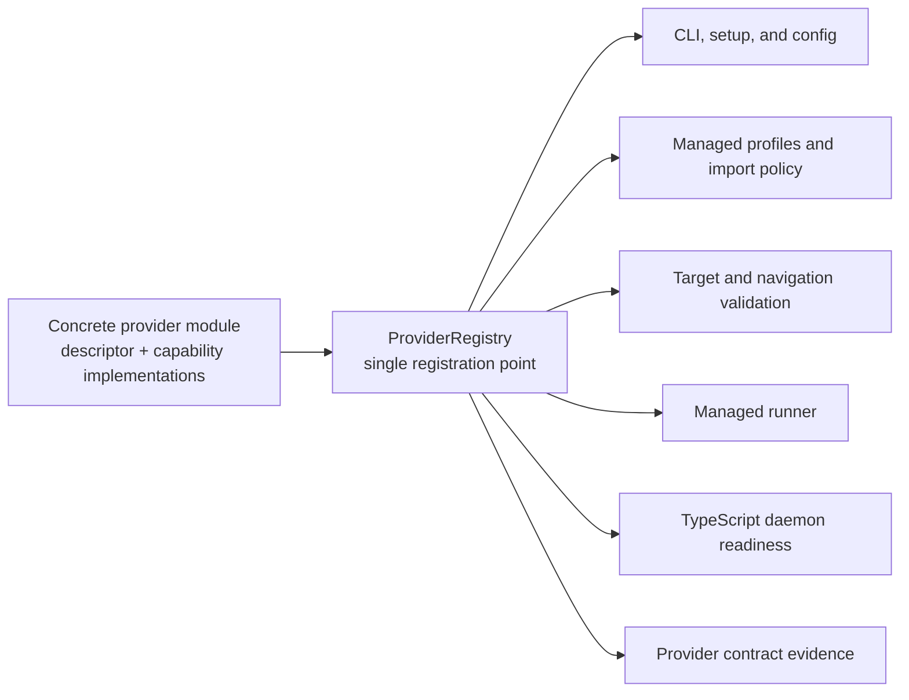
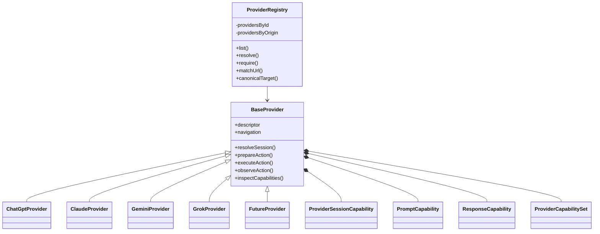

# Provider Architecture and Registry

Status: proposed | Priority: P0

Depends on: completion of the TypeScript daemon consolidation, managed Playwright, provider action contracts, managed profiles, fixture provenance, and the existing four-provider behavior baseline

Enables: [Provider Expansion and Parity](provider-expansion.md), [Context Delivery and Workspace Alignment](context-delivery-and-workspace-alignment.md), and [Project Knowledge Graph and Provider Mirroring](project-knowledge-graph-and-provider-mirroring.md)

## Outcome

Tokenless has one explicit TypeScript registration point for every visible web provider and one clean object-oriented provider seam. Every provider is represented by a concrete `BaseProvider` subclass. The base class owns the provider execution skeleton and mandatory conversation workflow, while provider-specific and optional behavior is supplied by capability classes.

Adding a provider normally changes only:

- one provider implementation module;
- one explicit registry entry;
- provenance-bound provider evidence;
- focused real-browser integration coverage;
- user-facing documentation; and
- a changeset when the addition is release-worthy.

Adding a provider must not require editing shared browser-runtime logic, duplicating provider allowlists, or adding provider-ID conditionals to common modules.

The decisive acceptance question is:

> Apart from the new provider subclass, its single registry entry, real evidence, browser E2E coverage, documentation, and release metadata, did adding the provider require any shared production-logic change?

The answer must be no before this architecture is considered complete.

## Scope

This roadmap is the detailed architecture and implementation plan for the provider seam. It does not itself commit Tokenless to shipping any candidate provider or advanced capability. Provider selection and release sequencing remain in [Provider Expansion and Parity](provider-expansion.md).

This work covers:

- the provider object model;
- one provider registry;
- provider navigation and identity policy;
- typed provider actions;
- mandatory session, prompt, and response behavior;
- optional model, effort, attachment, workspace, and image capabilities;
- runner interaction with provider objects;
- provider-owned recovery state;
- TypeScript daemon provider negotiation;
- removal of provider knowledge from deleted runtime paths; and
- real-boundary verification.

This work does not cover:

- hidden provider endpoints;
- model APIs;
- runtime-loaded third-party provider plugins;
- filesystem auto-discovery of provider code;
- invented provider DOM;
- mock provider pages;
- automatic publication of a new provider; or
- guaranteeing that every provider exposes every optional capability.

## Design Principles

### One registration point, not one giant configuration file

The source of truth is an explicit TypeScript registry of concrete provider objects. Each provider owns its descriptor, selectors, account interpretation, visible interaction strategies, and capability implementations.

The registry is not a large JSON file containing every possible selector or behavior flag. A large data-only provider table would become a shallow module with optional-field growth and shared conditional logic.

### Inheritance for the workflow, composition for capabilities

Every provider extends `BaseProvider`. The base class defines the stable execution skeleton and mandatory conversation workflow.

Optional or varying behavior is composed through capability classes:

- `ProviderSessionCapability`;
- `PromptCapability`;
- `ResponseCapability`;
- `ChoiceCapability`;
- `AttachmentCapability`;
- `WorkspaceCapability`;
- `ImageGenerationCapability`; and
- `DiagnosticsCapability`.

This preserves a common object-oriented framework without forcing providers to implement unsupported methods.

### No provider-ID conditionals in shared implementation

Shared implementation must not branch on concrete provider IDs:

```ts
if (provider.id === 'grok') {
  // Provider-specific behavior does not belong here.
}
```

Grok entitlement interpretation belongs in `GrokEntitlementAccountInspector`. Gemini account interpretation belongs in `GoogleAriaAccountInspector`. A future Qwen editor strategy belongs in the Qwen provider module.

Only behavior proven to be provider-neutral belongs in the base class or shared capability implementation.

### The runner owns durable orchestration

The runner owns:

- job claims and leases;
- checkpoints;
- cancellation;
- timeouts;
- browser visibility;
- user handoff;
- action replay policy;
- recovery; and
- durable job completion.

Providers own:

- visible page meaning;
- provider navigation classification;
- session observation;
- composer interaction;
- submission controls;
- response progress and completion;
- provider-specific capabilities; and
- visible success proof.

The runner must not read provider selectors or infer provider page semantics.

### Visible evidence remains authoritative

Selectors identify candidates; they do not prove success. Every mutating capability must return a visible postcondition:

- prompt text is visible after input;
- the attachment is visibly accepted rather than merely selected;
- the exact model or effort choice is visibly selected;
- the exact workspace identity is visibly resolved;
- a generated image is visibly present; and
- a response is visibly new and no longer busy.

Ambiguity produces `unknown`, `unavailable`, handoff, or a fail-closed error.

### Deleted runtimes receive no new provider architecture

The provider registry is TypeScript-only. Deleted runtimes must not receive a generated registry, new provider allowlists, or new capability logic. New provider support becomes generally available only through the authoritative TypeScript daemon.

## Target Module Shape





## Proposed Source Layout

```text
packages/cli/src/providers/
├── contracts.ts
├── action-catalog.ts
├── base-provider.ts
├── provider-registry.ts
├── provider-navigation.ts
├── capability-set.ts
│
├── capabilities/
│   ├── session.ts
│   ├── prompt.ts
│   ├── response.ts
│   ├── choices.ts
│   ├── attachments.ts
│   ├── workspace.ts
│   ├── image-generation.ts
│   └── diagnostics.ts
│
├── dom/
│   ├── dom-locators.ts
│   ├── dom-evidence.ts
│   └── dom-provider-tools.ts
│
├── chatgpt-provider.ts
├── claude-provider.ts
├── gemini-provider.ts
├── grok-provider.ts
└── index.ts
```

Files should remain deep enough to hide meaningful behavior. Do not split every selector strategy or one-method helper into a separate shallow module.

## Provider Descriptor

The descriptor contains stable provider identity and policy. It does not expose the provider's complete DOM implementation.

```ts
export type ProviderStage =
  | 'experimental'
  | 'supported'
  | 'disabled'

export type ProviderDescriptor<TId extends string> = Readonly<{
  id: TId
  label: string
  stage: ProviderStage
  setupOrder: number

  navigation: {
    homeUrl: string
    origins: readonly string[]
    trustedSignInOrigins: readonly {
      origin: string
      pathPrefixes?: readonly string[]
    }[]
  }

  profileImport: {
    cookieDomains: readonly string[]
  }
}>
```

The descriptor becomes the only production source for:

- provider ID;
- label;
- support stage;
- setup order;
- canonical home URL;
- approved origins;
- trusted sign-in origins; and
- profile-import cookie domains.

Provider selectors, account-tier interpretation, prompt strategies, and response semantics remain private to the provider's capability implementations.

## Provider Navigation Policy

`ProviderNavigationPolicy` is an immutable value object constructed from the descriptor.

```ts
export class ProviderNavigationPolicy {
  constructor(
    definition: ProviderDescriptor<string>['navigation'],
  )

  homeTarget(): CanonicalProviderTarget

  canonicalTarget(
    value?: unknown,
  ): CanonicalProviderTarget

  classify(
    value: unknown,
  ): ProviderNavigationClassification

  assertCurrentPageAllowed(
    value: unknown,
  ): CanonicalProviderTarget
}
```

Classification is explicit:

```ts
export type ProviderNavigationClassification =
  | {
      kind: 'approved'
      target: CanonicalProviderTarget
    }
  | {
      kind: 'trusted_sign_in'
      origin: string
    }
  | {
      kind: 'rejected'
      reason: 'invalid_url' | 'unsupported_provider_navigation'
    }
```

The policy enforces:

- HTTPS;
- no username or password;
- no unexpected port;
- bounded input length;
- canonical paths;
- approved provider origins;
- explicit trusted sign-in origins; and
- provider-origin pairing.

Runtime, job validation, checkpoint recovery, conversation continuation, and browser visibility switching must all call the same policy.

## Typed Provider Actions

The wire envelope and validated internal action are different types.

```ts
export type VisibleActionEnvelope = {
  protocol: string
  requestId: string
  provider: string
  action: string
  payload: unknown
}
```

Validation converts the envelope into a discriminated union:

```ts
export type ProviderActionRequest =
  | {
      action: 'prompt.input'
      payload: { text: string }
    }
  | {
      action: 'prompt.clear'
      payload: Record<never, never>
    }
  | {
      action: 'prompt.submit'
      payload: Record<never, never>
    }
  | {
      action: 'response.read'
      payload: Record<never, never>
    }
  | {
      action: 'file.upload'
      payload: { attachments: readonly AttachmentInput[] }
    }
  | {
      action: 'workspace.ensure'
      payload: WorkspaceEnsureRequest
    }
```

Capability implementations never receive unvalidated `Record<string, unknown>` payloads.

## Action Catalog

The existing gated, mutating, and reconstructable action sets become one typed catalog.

```ts
export type ActionMutation =
  | 'read'
  | 'reconstructable'
  | 'non_replayable'

export type ActionCompletion =
  | 'immediate'
  | 'provider_response'
  | 'long_running'

export type ProviderActionDefinition = Readonly<{
  action: VisibleAction
  gated: boolean
  mutation: ActionMutation
  completion: ActionCompletion
  requiredCapability: ProviderCapabilityId
}>
```

Example:

```ts
export const ACTION_CATALOG = {
  'auth.status': {
    action: 'auth.status',
    gated: false,
    mutation: 'read',
    completion: 'immediate',
    requiredCapability: 'session.inspect',
  },

  'prompt.input': {
    action: 'prompt.input',
    gated: true,
    mutation: 'reconstructable',
    completion: 'immediate',
    requiredCapability: 'conversation.core',
  },

  'prompt.submit': {
    action: 'prompt.submit',
    gated: true,
    mutation: 'non_replayable',
    completion: 'provider_response',
    requiredCapability: 'conversation.core',
  },

  'file.upload': {
    action: 'file.upload',
    gated: true,
    mutation: 'reconstructable',
    completion: 'immediate',
    requiredCapability: 'attachment.file',
  },
} satisfies Record<VisibleAction, ProviderActionDefinition>
```

The runner uses this catalog for gating, checkpoint safety, replay policy, and completion behavior. Adding a provider never changes the action catalog. Adding a genuinely new provider-neutral action changes it once.

## Base Provider

### External interface

The external interface remains intentionally small:

```ts
export abstract class BaseProvider<TId extends string> {
  readonly descriptor: ProviderDescriptor<TId>
  readonly navigation: ProviderNavigationPolicy

  public get id(): TId

  public resolveSession(
    context: ProviderExecutionContext,
    options: ProviderSessionOptions,
  ): Promise<ProviderSessionResolution>

  public prepareAction(
    context: ProviderExecutionContext,
    request: ProviderActionRequest,
  ): Promise<ProviderActionPreparation | null>

  public executeAction(
    context: ProviderExecutionContext,
    request: ProviderActionRequest,
    preparation?: ProviderActionPreparation,
  ): Promise<ProviderActionResult>

  public observeAction(
    context: ProviderExecutionContext,
    request: ProviderActionRequest,
    preparation: ProviderActionPreparation | null,
  ): Promise<ProviderActionObservation>

  public inspectCapabilities(
    context: ProviderExecutionContext,
  ): Promise<CapabilityInspectResult>
}
```

The runner depends on this interface rather than concrete providers, selectors, or account strategies.

### Construction

```ts
export type BaseProviderOptions<TId extends string> = {
  descriptor: ProviderDescriptor<TId>
  session: ProviderSessionCapability
  prompt: PromptCapability
  response: ResponseCapability
  optionalCapabilities?: readonly ProviderActionCapability[]
}
```

```ts
export abstract class BaseProvider<TId extends string> {
  readonly descriptor: ProviderDescriptor<TId>
  readonly navigation: ProviderNavigationPolicy

  private readonly sessionCapability: ProviderSessionCapability
  private readonly promptCapability: PromptCapability
  private readonly responseCapability: ResponseCapability
  private readonly capabilitySet: ProviderCapabilitySet

  protected constructor(options: BaseProviderOptions<TId>) {
    this.descriptor = options.descriptor
    this.navigation = new ProviderNavigationPolicy(
      options.descriptor.navigation,
    )
    this.sessionCapability = options.session
    this.promptCapability = options.prompt
    this.responseCapability = options.response
    this.capabilitySet = ProviderCapabilitySet.create(
      options.optionalCapabilities ?? [],
    )
  }
}
```

Construction validates:

- provider ID format;
- home URL ownership;
- unique capability IDs;
- unique action handlers;
- mandatory capabilities;
- descriptor/provider identity agreement;
- support-stage requirements; and
- complete advertised capability state.

### Shared dispatch

`BaseProvider` owns provider-neutral action dispatch:

```ts
public async executeAction(
  context: ProviderExecutionContext,
  request: ProviderActionRequest,
  preparation?: ProviderActionPreparation,
): Promise<ProviderActionResult> {
  context.throwIfAborted()
  this.navigation.assertCurrentPageAllowed(context.page.url())

  switch (request.action) {
    case 'auth.status':
      return await this.sessionCapability.inspectAccount(context)

    case 'prompt.input':
      return await this.promptCapability.input(
        context,
        request.payload.text,
      )

    case 'prompt.clear':
      return await this.promptCapability.clear(context)

    case 'prompt.submit':
      return await this.promptCapability.submit(context)

    case 'response.read':
      return await this.responseCapability.read(context)

    default:
      return await this.capabilitySet.execute(context, request)
  }
}
```

The dispatch may branch on provider-neutral action identity. It must never branch on concrete provider identity.

## Mandatory Capabilities

### Provider session capability

`ProviderSessionCapability` owns visible authentication, account, blocker, guest, and composer semantics.

```ts
export abstract class ProviderSessionCapability {
  abstract observe(
    context: ProviderExecutionContext,
  ): Promise<ProviderSessionObservation>

  abstract inspectAccount(
    context: ProviderExecutionContext,
  ): Promise<AuthStatusResult>

  abstract continueAsGuest(
    context: ProviderExecutionContext,
  ): Promise<boolean>

  abstract isComposerReady(
    context: ProviderExecutionContext,
  ): Promise<boolean>

  async resolve(
    context: ProviderExecutionContext,
    options: ProviderSessionOptions,
  ): Promise<ProviderSessionResolution> {
    // Shared observation, decision, bounded wait, and guest-continuation flow.
  }
}
```

The default DOM implementation composes explicit strategies:

```ts
export class DomSessionCapability
  extends ProviderSessionCapability {
  constructor(options: {
    accessPolicy: ProviderAccessPolicy
    composerLocators: DomLocatorPlan
    loginLocators: DomLocatorPlan
    accountLocators: DomLocatorPlan
    blockerDetector: ProviderBlockerDetector
    accountInspector: ProviderAccountInspector
    guestContinuation?: GuestContinuationStrategy
  })
}
```

Account implementations include:

- `MenuTextAccountInspector`;
- `GoogleAriaAccountInspector`; and
- `GrokEntitlementAccountInspector`.

This replaces string strategy switches such as `planStrategy === 'grok-entitlements'`.

### Prompt capability

```ts
export abstract class PromptCapability {
  abstract isReady(
    context: ProviderExecutionContext,
  ): Promise<boolean>

  abstract input(
    context: ProviderExecutionContext,
    text: string,
  ): Promise<PromptInputResult>

  abstract clear(
    context: ProviderExecutionContext,
  ): Promise<PromptClearResult>

  abstract submit(
    context: ProviderExecutionContext,
  ): Promise<PromptSubmitResult>
}
```

The default DOM implementation:

```ts
export class DomPromptCapability
  extends PromptCapability {
  constructor(options: {
    composer: DomLocatorPlan
    submit: DomLocatorPlan
    inputStrategy?: PromptInputStrategy
    timeoutMs?: number
  })
}
```

Default input behavior:

1. Find a visible composer.
2. Attempt Playwright `fill()`.
3. Verify visible DOM value or text.
4. Re-resolve controls replaced during hydration.
5. Use real keyboard selection and typing as a fallback.
6. Verify the final visible value.
7. Return a stable proof or a structured error.

A provider with a special editor supplies its own `PromptInputStrategy`.

### Response capability

Response completion semantics move out of the runner.

```ts
export type ProviderResponseCursor = {
  schema: string
  value: JsonValue
}

export type ResponseObservation =
  | {
      state: 'pending'
      visibleProof: string
    }
  | {
      state: 'ready'
      visibleProof: string
    }
  | {
      state: 'blocked'
      blockers: readonly VisibleBlocker[]
    }
```

```ts
export abstract class ResponseCapability {
  abstract captureCursor(
    context: ProviderExecutionContext,
  ): Promise<ProviderResponseCursor>

  abstract validateCursor(
    value: unknown,
  ): ProviderResponseCursor

  abstract observe(
    context: ProviderExecutionContext,
    cursor: ProviderResponseCursor,
  ): Promise<ResponseObservation>

  abstract read(
    context: ProviderExecutionContext,
  ): Promise<ResponseReadResult>
}
```

`DomResponseCapability` accepts:

- answer locator plans;
- busy indicator locator plans;
- response text readers;
- citation readers; and
- completion strategies.

The runner no longer reads `answerSelectors` or `busySelectors`.

## Optional Capability Interface

```ts
export abstract class ProviderActionCapability {
  abstract readonly id: ProviderCapabilityId
  abstract readonly actions: readonly VisibleAction[]

  abstract inspect(
    context: ProviderExecutionContext,
  ): Promise<ProviderCapabilityInspection>

  abstract execute(
    context: ProviderExecutionContext,
    request: ProviderActionRequest,
  ): Promise<ProviderActionResult>
}
```

```ts
export class ProviderCapabilitySet {
  private readonly byId:
    Map<ProviderCapabilityId, ProviderActionCapability>

  private readonly byAction:
    Map<VisibleAction, ProviderActionCapability>

  static create(
    capabilities: readonly ProviderActionCapability[],
  ): ProviderCapabilitySet

  inspectAll(
    context: ProviderExecutionContext,
  ): Promise<CapabilityInspectResult>

  execute(
    context: ProviderExecutionContext,
    request: ProviderActionRequest,
  ): Promise<ProviderActionResult>
}
```

The capability set enforces:

- unique capability IDs;
- unique action ownership;
- agreement with the action catalog;
- standardized unsupported results;
- explicit `available`, `unavailable`, or `unknown`; and
- no raw error for an absent optional capability.

## Model and Effort Choices

Model and effort selection share one reusable class:

```ts
export class DomChoiceCapability
  extends ProviderActionCapability {
  constructor(options: {
    capabilityId:
      | 'model.selection'
      | 'effort.selection'
    inspectAction: VisibleAction
    selectAction: VisibleAction
    trigger: DomLocatorPlan
    choiceReader: ChoiceReader
    choiceSelector: ChoiceSelectionStrategy
  })
}
```

The default reader extracts:

- exact visible label;
- selected state;
- enabled state; and
- optional visible description.

Provider-specific visual entitlement semantics use provider-owned readers, such as `GrokChoiceReader`.

## Attachments, Files, and Input Images

Files and input images share integrity, path, selection, and acceptance behavior. They differ by intent and sometimes by visible route.

```ts
export type AttachmentIntent =
  | 'context_file'
  | 'image_input'

export type AttachmentUploadRequest = {
  intent: AttachmentIntent
  attachments: readonly AttachmentInput[]
}
```

```ts
export abstract class AttachmentCapability
  extends ProviderActionCapability {
  abstract inspect(
    context: ProviderExecutionContext,
    intent: AttachmentIntent,
  ): Promise<ProviderCapabilityInspection>

  abstract upload(
    context: ProviderExecutionContext,
    request: AttachmentUploadRequest,
  ): Promise<FileUploadResult>
}
```

`DomAttachmentCapability` owns:

- safe staged-path resolution;
- root containment;
- regular-file verification;
- name, size, media type, and hash checks;
- visible upload triggers;
- visible local-upload menu choices;
- file chooser operation;
- generated file inputs where justified;
- visible filename, chip, preview, or equivalent acceptance proof;
- `selected` versus `accepted`; and
- cancellation.

If a provider has separate file and image routes, it supplies two route strategies to the same capability rather than duplicating shared safety behavior.

## Workspace and Project Operations

Provider-neutral callers request outcomes rather than provider UI steps.

```ts
export abstract class WorkspaceCapability
  extends ProviderActionCapability {
  abstract inspect(
    context: ProviderExecutionContext,
  ): Promise<ProviderCapabilityInspection>

  abstract ensure(
    context: ProviderExecutionContext,
    request: WorkspaceEnsureRequest,
  ): Promise<WorkspaceEnsureResult>

  abstract updateInstructions(
    context: ProviderExecutionContext,
    request: WorkspaceInstructionRequest,
  ): Promise<WorkspaceInstructionResult>
}
```

`ensure()` hides:

- opening the provider's Project or workspace surface;
- listing or searching resources;
- resolving exact identity;
- handling ambiguous duplicate names;
- creating a resource;
- selecting or opening it;
- validating the final provider resource;
- capturing canonical identity or URL; and
- reporting conversation fallback honestly.

Implementations may include:

- `ConversationWorkspaceCapability`;
- `ChatGptWorkspaceCapability`;
- `ClaudeWorkspaceCapability`;
- `GeminiWorkspaceCapability`; and
- `UnsupportedNativeWorkspaceCapability`.

Do not expose `clickCreateProjectButton()` or other UI steps as shared interfaces.

## Image Generation

Image generation is a separate long-running capability rather than an alias for ordinary prompt response.

```ts
export type ImageGenerationRequest = {
  prompt: string
  inputImages: readonly AttachmentInput[]
  options: {
    count?: number
    aspectRatio?: string
    mode?: string
  }
}

export type ImageGenerationCursor = {
  schema: string
  value: JsonValue
}
```

```ts
export abstract class ImageGenerationCapability
  extends ProviderActionCapability {
  abstract inspect(
    context: ProviderExecutionContext,
  ): Promise<ProviderCapabilityInspection>

  abstract prepare(
    context: ProviderExecutionContext,
    request: ImageGenerationRequest,
  ): Promise<ImageGenerationCursor>

  abstract start(
    context: ProviderExecutionContext,
    request: ImageGenerationRequest,
  ): Promise<ImageGenerationStartResult>

  abstract observe(
    context: ProviderExecutionContext,
    cursor: ImageGenerationCursor,
  ): Promise<ImageGenerationObservation>

  abstract read(
    context: ProviderExecutionContext,
    cursor: ImageGenerationCursor,
  ): Promise<ImageGenerationResult>
}
```

The first supported implementation must:

- operate visible controls;
- prove a visibly new image result;
- preserve input-image acceptance evidence;
- distinguish pending, blocked, unavailable, and complete;
- avoid private generation endpoints;
- use visible download controls when download is supported; and
- return bounded artifact metadata without leaking browser credentials or hidden URLs.

## Concrete Providers

Concrete providers inherit `BaseProvider` and compose capabilities.

### ChatGPT

```ts
export class ChatGptProvider
  extends BaseProvider<'chatgpt'> {
  constructor() {
    super({
      descriptor: CHATGPT_DESCRIPTOR,

      session: new DomSessionCapability({
        accessPolicy: chatGptAccessPolicy,
        composerLocators: chatGptComposerLocators,
        loginLocators: chatGptLoginLocators,
        accountLocators: chatGptAccountLocators,
        accountInspector: new MenuTextAccountInspector({
          freePlans: ['Free'],
          paidPlans: [
            'Go',
            'Plus',
            'Pro',
            'Team',
            'Business',
            'Enterprise',
          ],
        }),
        blockerDetector: new DomBlockerDetector(
          chatGptBlockerLocators,
        ),
      }),

      prompt: new DomPromptCapability({
        composer: chatGptComposerLocators,
        submit: chatGptSubmitLocators,
      }),

      response: new DomResponseCapability({
        answers: chatGptAnswerLocators,
        busyIndicators: chatGptBusyLocators,
      }),

      optionalCapabilities: [
        new DomChoiceCapability(chatGptModelOptions),
        new DomChoiceCapability(chatGptEffortOptions),
        new DomAttachmentCapability(chatGptAttachmentOptions),
        new ConversationWorkspaceCapability(),
      ],
    })
  }
}
```

### Claude

Claude validates the sign-in-required policy and provider-specific Project behavior while reusing common DOM prompt and response implementations.

### Gemini

Gemini supplies `GoogleAriaAccountInspector` instead of adding a Google-specific branch to shared session code.

### Grok

Grok supplies:

- `GrokEntitlementAccountInspector`;
- `GrokChoiceReader`; and
- any Grok-specific visible locator strategies.

No Grok-specific branch remains in shared account, choice, session, or runner implementation.

### Future providers

A future Qwen, Kimi, Zhipu Qingyan, DeepSeek, Doubao, or Yuanbao provider follows the same construction pattern.

If a candidate requires changing `BaseProvider` or shared runner logic to implement a provider-specific behavior, the behavior remains in the candidate's capability implementation instead.

If multiple providers reveal a genuinely shared concept, evolve the shared interface in a separate architecture change with full existing-provider regression evidence.

## Provider Registry

The single registration point is explicit:

```ts
export const providerInstances = [
  new ChatGptProvider(),
  new ClaudeProvider(),
  new GeminiProvider(),
  new GrokProvider(),
] as const

export type ProviderId =
  typeof providerInstances[number]['id']

export const providerRegistry =
  ProviderRegistry.create(providerInstances)
```

The registry interface:

```ts
export class ProviderRegistry<
  TProviders extends readonly BaseProvider<string>[],
> {
  static create<
    TProviders extends readonly BaseProvider<string>[],
  >(
    providers: TProviders,
  ): ProviderRegistry<TProviders>

  list(options?: {
    stages?: readonly ProviderStage[]
  }): readonly ProviderDescriptor<string>[]

  resolve(
    value: unknown,
  ): BaseProvider<string> | null

  require(
    value: unknown,
  ): BaseProvider<string>

  matchUrl(
    value: unknown,
  ): BaseProvider<string> | null

  canonicalTarget(
    providerId: string,
    value?: unknown,
  ): CanonicalProviderTarget
}
```

Construction validates:

- unique provider IDs;
- origin ownership conflicts;
- home URL ownership;
- descriptor/provider ID agreement;
- stage and baseline consistency;
- deterministic setup order; and
- complete provider capability declarations.

Filesystem auto-discovery is intentionally rejected. Explicit registration is deterministic, reviewable, package-safe, and type-safe.

## Runner Interaction

The runner resolves one concrete provider:

```ts
const provider =
  providerRegistry.require(request.provider)
```

Existing direct selector work:

```ts
countVisibleAnswers(page, provider.answerSelectors)
hasVisibleBusyIndicator(page, provider.busySelectors)
anyVisibleComposer(page, provider.composerSelectors)
resolveProviderSession(page, provider)
```

becomes provider-interface work:

```ts
provider.prepareAction(context, action)
provider.observeAction(context, action, preparation)
provider.resolveSession(context, options)
```

The target execution sequence is:

1. Resolve the provider from the registry.
2. Canonicalize and validate the target through provider navigation policy.
3. Read gating, mutation, replay, and completion semantics from the action catalog.
4. Resolve the visible provider session when the action is gated.
5. Capture read-only preparation state.
6. Persist the started checkpoint.
7. Execute the action.
8. Observe provider completion when required.
9. Let the runner handle cancellation, timeout, browser visibility switching, and user handoff.
10. Persist the completed checkpoint.
11. Return the normalized result.

## Checkpoint and Recovery State

### Initial migration

The first object-oriented migration preserves the existing checkpoint shape and externally observable behavior. A response baseline remains numeric where compatibility requires it, but it is produced and interpreted by `ResponseCapability`.

### General provider action preparation

After behavior parity, version the runner checkpoint to support:

```ts
export type ProviderActionPreparation = {
  provider: ProviderId
  action: VisibleAction
  schema: string
  value: JsonValue
}
```

This supports:

- response cursors;
- image generation cursors;
- long-running provider operations;
- workspace mutation verification; and
- future provider-specific continuation state.

Preparation state must be:

- JSON serializable;
- bounded in bytes;
- versioned by schema;
- free of raw DOM;
- free of credentials and cookies;
- validated by the owning provider during recovery; and
- rejected fail-closed when it cannot be trusted.

Non-replayable actions retain strict ambiguity protection. A crash during an uncertain submission never causes automatic duplicate submission.

## TypeScript Daemon Authority

Implementation assumes the TypeScript daemon is the authoritative executor.

Rules:

- do not add provider logic under deleted daemon/runtime paths;
- do not generate cross-runtime provider catalogs;
- do not add new providers to deleted runtime allowlists;
- do not make new provider support depend on platform-specific runtime packages;
- keep new providers experimental until the TypeScript daemon path has real-boundary proof; and
- remove remaining stale provider membership from deleted runtime paths.

The TypeScript daemon and embedded browser runtime consume the same registry instance. Readiness reports the same provider set the executor can actually run:

```json
{
  "supported_providers": [
    "chatgpt",
    "claude",
    "gemini",
    "grok"
  ]
}
```

Client behavior:

- submit normally when the target provider is advertised;
- safely reconcile or restart an owned stale daemon when the provider is not advertised;
- treat a legacy daemon without provider negotiation as supporting only the explicitly documented legacy set; and
- never infer provider support solely from job/action protocol overlap.

## Protocol Evolution

The structural refactor preserves existing visible action v1/v2 request and response behavior.

Before the first new provider ships:

1. Preserve existing v1/v2 artifacts unchanged.
2. Introduce a new request protocol whose provider ID is a bounded extensible string.
3. Keep request fields closed and typed.
4. Validate generic HTTPS safety in the machine-readable schema.
5. Validate provider membership and provider-origin pairing through the runtime registry.
6. Negotiate supported providers through daemon readiness.
7. Require the new protocol for newly added providers.
8. Retain existing-provider compatibility for supported older protocols.

This prevents every future provider addition from mutating an immutable provider enum and host matrix.

## Delivery Plan

### Phase 0: Complete the in-flight daemon refactor

- Land the TypeScript daemon consolidation on `dev`.
- Make the TypeScript daemon the authoritative execution path.
- Remove or freeze overlapping deleted-runtime work.
- Record the observable four-provider baseline.
- Record current CLI JSON behavior and daemon conformance.
- Begin provider architecture work only from a clean, integrated state.

Exit: the provider architecture branch does not compete with active daemon lifecycle changes.

### Phase 1: Introduce typed contracts and the action catalog

- Add `providers/contracts.ts`.
- Separate external wire envelopes from validated internal action unions.
- Add `providers/action-catalog.ts`.
- Replace runner-local gated, mutating, and reconstructable sets with catalog metadata.
- Preserve all existing action names, payloads, results, and replay behavior.

Exit: every action has one exhaustive lifecycle definition and no provider behavior has changed.

### Phase 2: Introduce descriptor, navigation policy, and registry

- Add `ProviderDescriptor`.
- Add `ProviderNavigationPolicy`.
- Add `ProviderRegistry`.
- Move provider identity, label, stage, setup order, home URL, approved origins, trusted sign-in origins, and cookie domains into provider descriptors.
- Migrate CLI provider normalization to registry lookup.
- Migrate runtime wake URLs and URL validation.
- Migrate profile provider validation and import policy.
- Keep the existing provider module as a temporary compatibility re-export only.
- Do not edit deleted-runtime provider allowlists.

Exit: TypeScript production code has one provider registration list.

### Phase 3: Introduce `BaseProvider` and mandatory capabilities

- Add `BaseProvider`.
- Add `ProviderCapabilitySet`.
- Extract shared DOM locator and evidence behavior.
- Add session, prompt, and response capability classes.
- Move session observation, account inspection, blockers, guest continuation, prompt input, prompt clear, prompt submit, response observation, response reading, and citations behind the provider seam.
- Replace runner selector access with provider methods.
- Preserve checkpoint and wire behavior.

Exit: a `BaseProvider` instance can perform the complete baseline conversation workflow and the runner reads no provider selectors.

### Phase 4: Convert the existing providers

Convert in this order:

1. ChatGPT as the reference implementation.
2. Claude to prove sign-in-required policy.
3. Gemini to prove custom account inspection.
4. Grok to prove custom entitlement and choice behavior.

For each provider:

- create the concrete subclass;
- compose mandatory capabilities;
- run provenance-bound browser coverage;
- run built CLI and daemon integration;
- replace its registry entry; and
- delete the superseded implementation rather than retaining permanent parallel paths.

Exit: all four providers are `BaseProvider` subclasses and shared modules contain no provider-ID conditionals.

### Phase 5: Extract optional capabilities

Extract in this order:

1. model choices;
2. effort choices;
3. file and input-image attachments;
4. conversation workspace fallback;
5. diagnostics and sanitized snapshots.

Move corresponding behavior out of the monolithic DOM adapter. Standardize capability inspection and unavailable outcomes.

Exit: the existing provider DOM adapter is deleted or reduced to a temporary re-export with no implementation ownership.

### Phase 6: Generalize checkpoint preparation

- Move response cursor creation and interpretation fully into `ResponseCapability`.
- Add provider-owned action preparation state.
- Version the runner checkpoint.
- Validate provider preparation state on recovery.
- Generalize completion observation for response, image, and future long-running actions.
- Preserve strict non-replayable action safety.

Exit: the runner orchestrates lifecycle without understanding provider DOM completion semantics.

### Phase 7: Add workspace and image contracts

Keep these user-visible changes separate from the structural refactor.

Workspace:

- exact native identity;
- ensure;
- select/open as internal steps;
- instruction update;
- visible final postcondition; and
- explicit conversation fallback.

Images:

- input-image acceptance;
- generation preparation;
- visible start;
- completion observation;
- visible result collection; and
- visible download where proven.

Exit: each advertised advanced capability has real visible-session proof and a changeset.

### Phase 8: Add TypeScript daemon provider negotiation

- Return `supported_providers` from readiness using the runtime registry.
- Verify provider support before job submission.
- safely reconcile owned stale daemons;
- remove remaining deleted-runtime provider knowledge;
- introduce the extensible provider request protocol; and
- prove cross-version behavior.

Exit: an old daemon cannot silently accept a provider it cannot execute.

### Phase 9: Prove the seam with the first new provider

Implement the highest-ranked candidate from the provider expansion roadmap.

Expected production changes:

- the provider subclass;
- one registry line; and
- no shared provider execution logic.

Expected non-production changes:

- real evidence;
- focused browser E2E;
- documentation;
- capability matrix; and
- changeset.

Exit: a new provider closes the baseline through the built CLI without modifying `BaseProvider`, the runner, runtime allowlists, profile allowlists, or shared capability semantics.

### Phase 10: Remove compatibility shims

- Delete old provider config exports.
- Delete old adapter registry exports.
- Delete duplicated URL helpers.
- Delete provider-specific strategy strings.
- Delete stale test helper provider tables where runtime metadata can be consumed safely.
- Update architecture documentation.
- Keep explicit test expectations where they represent evidence rather than production registration logic.

Exit: there is one provider seam, one registry, and no shadow source of truth.

## Migration Map

| Current responsibility | Target owner |
| --- | --- |
| Provider IDs and labels | Concrete provider descriptors |
| Home URLs and approved hosts | `ProviderNavigationPolicy` |
| Trusted sign-in navigation | `ProviderNavigationPolicy` |
| Setup ordering | Provider descriptor |
| Profile cookie domains | Provider descriptor |
| Action gating and replay sets | `ACTION_CATALOG` |
| Session observation and decisions | `ProviderSessionCapability` |
| Account plan strategy strings | Account inspector classes |
| Composer input and clear | `PromptCapability` |
| Submit control | `PromptCapability` |
| Answer count and busy state | `ResponseCapability` |
| Response text and citations | `ResponseCapability` |
| Model and effort choices | `DomChoiceCapability` |
| Grok disabled-choice semantics | `GrokChoiceReader` |
| File and image input | `AttachmentCapability` |
| Workspace fallback/native behavior | `WorkspaceCapability` |
| Image generation | `ImageGenerationCapability` |
| Provider dispatch | `ProviderRegistry` and `BaseProvider` |
| Supported provider readiness | TypeScript daemon from registry |

## Verification Strategy

Repository testing rules apply throughout:

- no unit tests;
- no mocked visible sessions;
- no fake pages, locators, browser contexts, runners, or daemons;
- no invented provider DOM;
- no source-string tests that assert implementation shape; and
- no hidden provider APIs.

### Structural phases

Run:

```text
npm run lint
npm test
npm run test:ts-daemon-conformance
```

Verify through:

- the built CLI process;
- the real TypeScript daemon;
- the real filesystem;
- a real local Chromium session; and
- provenance-bound captured provider DOM where allowed.

### Provider baseline contract

Every provider must prove:

- approved target navigation;
- trusted sign-in navigation classification;
- signed-out state;
- authenticated account evidence;
- guest policy;
- stable composer readiness;
- visible prompt input;
- visible prompt clear;
- visible submit control;
- visibly new response completion;
- normalized response text and citations;
- challenge and terminal blockers;
- timeout and cancellation behavior; and
- same-scope conversation continuation.

### Optional capability coverage

Where advertised:

- model inspection and exact selection;
- effort inspection and exact selection;
- visible file acceptance;
- visible input-image acceptance;
- exact workspace identity;
- native workspace creation or explicit fallback;
- workspace instruction update;
- image generation start;
- image generation completion; and
- visible image result collection.

### Live compatibility matrix

A provider moves from `experimental` to `supported` only after gated real-session coverage proves the baseline in appropriate account states.

The full existing-provider matrix runs before:

- removing the old provider path;
- changing a shared capability interface;
- changing checkpoint semantics;
- changing provider navigation rules; or
- promoting a new provider.

## Release and Documentation

Pure structural phases do not need a changeset when externally observable behavior is unchanged.

Add a changeset for:

- a new provider;
- a new visible action;
- a newly available provider capability;
- changed CLI output;
- changed fallback semantics; or
- changed compatibility requirements.

Keep paired user-facing documentation aligned:

- `README.md` and `README.zh-CN.md`;
- `COMMANDS.md` and `COMMANDS.zh-CN.md`; and
- package-level user documentation where applicable.

Internal architecture and roadmap documentation may remain English.

## Acceptance Criteria

- Every provider is a concrete `BaseProvider` subclass.
- `BaseProvider` defines the mandatory provider execution skeleton.
- Session, prompt, and response are mandatory capabilities.
- Model, effort, attachment, workspace, image, and diagnostic behavior are capability classes.
- The runner depends only on the provider seam and action lifecycle metadata.
- The runner reads no provider selectors.
- Shared code contains no concrete provider-ID conditionals.
- TypeScript production code has one explicit provider registration list.
- Provider identity, origin, setup order, profile policy, and support stage come from the registry.
- Provider navigation validation is reused by CLI, jobs, runner, checkpoints, and continuation.
- Grok-specific behavior exists only in Grok-owned implementations.
- Unsupported capabilities return explicit machine-readable states.
- Existing provider wire behavior remains compatible through structural migration.
- Existing providers pass the same real-boundary baseline after every shared change.
- TypeScript daemon readiness reports providers from the same registry used for execution.
- Deleted runtime paths contain no new provider architecture.
- A first new provider closes the baseline without changing shared production logic.

## Risks and Responses

| Risk | Response |
| --- | --- |
| `BaseProvider` becomes a god class | Keep the external interface small and compose optional capability classes |
| Capability interfaces become speculative | Add shared capability semantics only with multi-provider visible evidence |
| Provider-specific behavior leaks into shared code | Use provider-owned strategies and reject concrete provider-ID conditionals |
| Registry becomes a giant selector table | Store implementation inside provider modules, not the descriptor |
| Runner still understands provider DOM | Move readiness, response cursor, and completion observation behind the provider seam |
| Structural refactor changes behavior | Migrate in phases, preserve wire contracts, and run real-boundary coverage after every provider conversion |
| New provider mutates immutable schemas | Use an extensible provider request protocol plus runtime registry validation |
| Old daemon appears compatible but lacks a provider | Negotiate `supported_providers` from the authoritative TypeScript registry |
| Deleted-runtime transition creates duplicate sources of truth | Freeze deleted-runtime provider knowledge and do not create cross-runtime registry generation |
| Advanced capability claims parity without proof | Keep capability states explicit and require visible final postconditions |

## Non-Goals

- A base class with abstract methods for every possible future provider feature
- Requiring every provider to implement unsupported Project or image operations
- Automatic provider fallback after failure
- Provider selection based only on model popularity
- Filesystem scanning for provider classes
- Runtime installation of untrusted provider code
- Shared conditional logic keyed by provider ID
- Hidden API access
- Mock-based visible-provider verification
- Changing all provider protocols and advanced capabilities in one structural pull request

